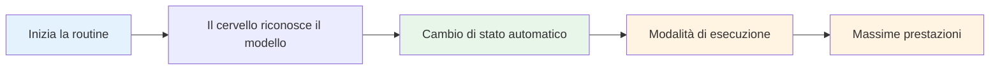

# Costruisci la tua routine pre-scatto

La tua routine pre-tiro è uno degli strumenti più potenti nel tuo gioco mentale. È una sequenza coerente di azioni che ti prepara per ogni lancio e innesca il tuo stato di prestazione migliore.

::: suggerimento La grande idea
**La tua routine è la tua porta d'accesso alla zona.** Una routine pre-tiro coerente segnala al tuo cervello: "È ora di eseguire". Con la ripetizione, diventa un trigger automatico per le massime prestazioni.
:::

## Perché le routine funzionano

### La coerenza crea fiducia
Quando fai la stessa cosa ogni volta, rimuovi le variabili. Il tuo corpo sa cosa sta succedendo. Ciò crea un senso di controllo e familiarità, anche in situazioni non familiari.

### Stati di attivazione delle routine
Con la ripetizione, la tua routine diventa collegata al tuo stato di prestazione. L'avvio della routine avvia automaticamente il passaggio mentale alla modalità di esecuzione.

### Le routine bloccano le distrazioni
Una routine dà alla tua mente qualcosa su cui concentrarsi. Non c'è spazio per preoccuparsi della colonna sonora, del pubblico o di cosa potrebbe accadere.

### Le routine gestiscono l'eccitazione
Una routine ben progettata aiuta a regolare il tuo livello di energia, calmandoti se sei troppo amplificato e concentrandoti se sei piatto.

## Elementi di una routine efficace

### Fase 1: Valutazione (fuori dal cerchio)

Prima di intervenire, raccogli informazioni:
- Leggere il terreno (pendii, ostacoli, superficie)
- Valutare la situazione (punteggio, posizioni delle bocce)
- Scegli il tuo obiettivo e il punto di atterraggio
- Decidi il tipo di lancio (punto, tiro, pallonetto, rotolamento)

**Qui è dove avviene il pensiero.** Prenditi il ​​tuo tempo qui.

### Fase 2: Transizione (Entrare nel Cerchio)

Il passaggio dal pensare al fare:
- Azione fisica (entrare in cerchio in modo coerente)
- Segnale mentale (una parola o una frase che segnala la "modalità di esecuzione")
- Respiro (un respiro consapevole per centrarti)

**Questo è l'interruttore.** L'analisi si ferma qui.

### Fase 3: Preparazione (Nel Cerchio)

Prepara il tuo corpo:
- Posizione coerente (uguale ogni volta)
- Controllo della presa (sentire la boccia)
- Allineamento al bersaglio
- Trigger fisico (un piccolo movimento che è tuo)

### Fase 4: Visualizzazione (breve)

Guarda il lancio prima di farlo:
- Immagina il percorso della palla (2-3 secondi al massimo)
- Senti il ​​lancio riuscito
- Connettiti visivamente con il tuo target

### Fase 5: esecuzione

Effettua il tiro:
- Focus esterno (solo target)
- Fidati del tuo corpo
- Rilascia senza esitazione
- Seguire in modo naturale

## Costruisci la tua routine personale

### Passaggio 1: osserva ciò che già fai

Probabilmente hai già una certa routine. Avviso:
- Cosa fai prima dei buoni tiri?
- Cosa ti sembra naturale?
- Cosa ti aiuta a concentrarti?

### Passaggio 2: progetta la tua routine

Crea una sequenza che includa:
- [ ] Fase di valutazione
- [ ] Momento di transizione evidente
- [ ] Configurazione fisica coerente
- [ ] Breve visualizzazione
- [ ] Trigger di esecuzione

### Passaggio 3: scriverlo

Sii specifico. Esempio:

1. **Valutazione:** Leggi il terreno, scegli il punto di atterraggio
2. **Transizione:** entra in cerchio prima con il piede sinistro, dì "fiducia"
3. **Setup:** Piedi alla larghezza delle spalle, controllo della presa, allineamento delle spalle
4. **Visualizza:** vedi il percorso, senti il ​​rilascio
5. **Esegui:** Occhi sul bersaglio, lancia

### Passo 4: Pratica religiosamente

Usa la tua routine su OGNI lancio in pratica:
- Tiri facili
- Lanci difficili
- Quando sei stanco
- Quando sei fresco

La routine deve diventare automatica.

### Passaggio 5: perfezionare nel tempo

La tua routine si evolverà. Nota cosa funziona e aggiusta. Ma non cambiarlo durante la competizione, solo tra un evento e l'altro.

## Tempistica di routine

La tua routine dovrebbe richiedere una quantità costante di tempo:
- Troppo veloce: stai correndo e non sei adeguatamente preparato
- Troppo lento: stai pensando troppo, perdendo il flusso
- Giusto: abbastanza tempo per prepararsi, non così tanto da pensare troppo

**Tempi tipici:**
- Valutazione: 5-10 secondi
- Transizione + configurazione: 3-5 secondi
- Visualizzazione + Esecuzione: 3-5 secondi
- **Totale: 10-20 secondi**

## Errori comuni di routine

|  | Errore | Problema | Soluzione |  |
|---------|---------|----------|
|  | Saltare in pratica | La routine non è automatica | Usalo ogni singolo lancio |  |
|  | Troppo complicato | Difficile da ricordare sotto pressione | Semplificare all'essenziale |  |
|  | Pensare durante l'esecuzione | Interrompe le prestazioni automatiche | Punto di transizione chiaro |  |
|  | Tempistica incoerente | Crea incertezza | Esercitati con un ritmo costante |  |
|  | Cambio a metà gara | Introduce il dubbio | Resta fedele a ciò che sai |  |

## Risoluzione dei problemi di routine

**Se sei di fretta:**
- Aggiungi un respiro durante la transizione
- Rallenta i movimenti di setup
- Pausa prima della visualizzazione

**Se stai pensando troppo:**
- Accorcia la routine
- Usa un segnale di transizione più forte
- Concentrati maggiormente sull'esterno

**Se sei incoerente:**
- Riprenditi tu stesso per controllare
- Esercitati nella routine senza lanciare
- Ottieni feedback da un partner

## Routine di esempio

### Routine semplice
1. Scegli l'obiettivo
2. Entra, respira
3. Afferrare, allineare
4. Guardalo, lancialo

### Routine dettagliata
1. Leggi il terreno, scegli il punto di atterraggio
2. Entra per primo con il piede sinistro
3. Di' "liscio" internamente
4. Un respiro, le spalle cadono
5. Regolazione dei piedi, controllo della presa
6. Allineare le spalle al bersaglio
7. Visualizza il percorso (2 secondi)
8. Gli occhi si fissano sul bersaglio
9. Lancia

## Chiave da asporto

> La tua routine è la tua ancora. Nel caos, è la tua costante.

Costruiscilo attentamente. Praticatelo sempre. Fidati completamente.

