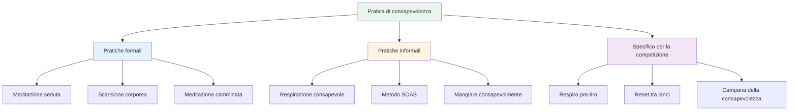

# Tecniche di consapevolezza
<AdBanner />

Ecco alcune tecniche pratiche che puoi utilizzare per sviluppare la consapevolezza. Inizia con una o due e procedi da lì.

::: tip La grande idea
**La consapevolezza è un&#39;abilità, non un talento.** Come puntare o sparare, migliora con la pratica. Inizia in piccolo, sii costante e i benefici si accumuleranno nel tempo.
:::

## Pratiche formali

Si tratta di sessioni di consapevolezza dedicate, ovvero di tempo dedicato specificamente alla pratica.

### Meditazione seduta

Il fondamento della pratica della consapevolezza.

**Come fare:**
1. Siediti comodamente (su una sedia o sul pavimento)
2. Chiudi gli occhi o addolcisci lo sguardo
3. Concentrati sul tuo respiro: la sensazione dell&#39;aria che entra ed esce
4. Quando sorgono i pensieri, notateli senza giudizio
5. Riporta delicatamente l&#39;attenzione sul respiro
6. Inizia con 5 minuti, aumenta fino a 15-20

**Suggerimenti:**
- I pensieri arriveranno, è normale
- Ogni volta che ti accorgi di aver vagato e torni, stai sviluppando l&#39;abilità
- Non giudicarti per aver vagato
- La coerenza è più importante della durata

### Scansione corporea

Sviluppa la consapevolezza delle sensazioni fisiche.

**Come fare:**
1. Sdraiati o siediti comodamente
2. Inizia dai tuoi piedi: nota qualsiasi sensazione
3. Spostare lentamente l&#39;attenzione verso l&#39;alto: caviglie, polpacci, ginocchia...
4. Nota senza cercare di cambiare nulla
5. Se senti tensione, respira in quella zona
6. Continua fino alla sommità della tua testa
7. Ci vogliono 10-20 minuti

**Per la pétanque:** Ti aiuta a notare la tensione prima che influisca sul tiro.

### Meditazione camminata

Mindfulness in movimento: un&#39;ottima preparazione per la pista.

**Come fare:**
1. Cammina lentamente e deliberatamente
2. Senti ogni parte del passo: solleva, muovi, posiziona
3. Nota le sensazioni nei tuoi piedi e nelle tue gambe
4. Quando la tua mente vaga, torna alle sensazioni fisiche
5. 5-10 minuti sono sufficienti

## Pratiche informali

<AdInArticle />

Integrano la consapevolezza nelle attività quotidiane.

### Respirazione consapevole

La tecnica più semplice, disponibile in qualsiasi momento.

**La pratica:**
- Fai 3 respiri lenti e deliberati
- Concentrati completamente sulla sensazione
- Usalo come pulsante di reset durante il giorno

**Quando utilizzarlo:**
- Prima di entrare nel cerchio
- Quando noti che lo stress sta aumentando
- Tra una partita e l&#39;altra
- Qualsiasi momento di transizione

### Il metodo SOAS

Il tuo strumento per affrontare i momenti difficili.

| Fare un passo | Azione | Esempio |
|------|--------|---------|
| **Fermare | Fermati, non reagire | Non alzare le mani dopo un errore |
| **Osservare | Nota cosa sta succedendo | &quot;Mi sento frustrato. Ho la mascella stretta.&quot; |
| **Accettare | Riconoscere senza combattere | &quot;Ecco come mi sento adesso.&quot; |
| **Scontrino | Lascia andare, vai avanti | Allenta la tensione, torna al presente |

**Mettilo in pratica nella vita quotidiana** così diventerà automatico in gara.

### Mangiare consapevolmente

Una pratica sorprendentemente potente.

**Come fare:**
- Consuma un pasto senza distrazioni (niente telefono, niente TV)
- Nota i colori, gli odori, le consistenze
- Masticare lentamente, assaporare appieno
- Nota quando sei soddisfatto

**Perché è importante:** Sviluppa la capacità generale di prestare attenzione.

### Consapevolezza sensoriale

Interagire pienamente con l&#39;ambiente circostante.

**La tecnica 5-4-3-2-1:**
- Nota 5 cose che puoi vedere
- Nota 4 cose che puoi sentire
- Nota 3 cose che puoi sentire
- Nota 2 cose che puoi annusare
- Nota una cosa che puoi assaggiare

**Usa questo:** quando la tua mente è in fermento prima di una partita importante.

## Tecniche specifiche per la competizione

### Il respiro prima dello sparo

Integra la respirazione nella tua routine:

1. Prima di entrare nel cerchio, fai un respiro consapevole
2. Senti i tuoi piedi per terra
3. Lascia cadere le spalle durante l&#39;espirazione
4. Quindi inizia la tua routine

### Reset tra lanci

Cosa fare durante l&#39;attesa:

- Nota dove va la tua attenzione
- Se si tratta di punteggio/risultato, riconoscere e tornare al presente
- Concentrati su qualcosa di neutro (il tuo respiro, la sensazione di una boccia)
- Rimani fisicamente rilassato

### La &quot;Campana della consapevolezza&quot;

Utilizza dei trigger per ricordarti di essere presente:

- Ogni volta che raccogli una boccia
- Quando senti il cric che viene lanciato
- Quando entri nel cerchio
- Quando finisce una partita

Ogni innesco = un respiro consapevole.

## Costruire la tua pratica

### Settimana 1-2: Fondazione
- 5 minuti di meditazione seduta al giorno
- 3 respiri consapevoli prima di ogni pasto
- Esercitatevi con SOAS una volta quando qualcosa di piccolo va storto

### Settimana 3-4: Espansione
- Aumenta la meditazione a 10 minuti
- Aggiungi la scansione del corpo due volte a settimana
- Utilizzare i campanelli di consapevolezza nella pratica

### Settimana 5+: Integrazione
- Pratica quotidiana di 15-20 minuti
- Piena integrazione nella routine pre-tiro
- SOAS diventa risposta automatica agli errori

## Sfide comuni

| Sfida | Soluzione |
|-----------|----------|
| &quot;Non riesco a smettere di pensare&quot; | Non dovresti. Notalo e basta e torna indietro. |
| &quot;Non ho tempo&quot; | Inizia con 3 minuti. Tutti hanno 3 minuti. |
| &quot;Mi addormento&quot; | Prova a stare seduto invece che sdraiato, oppure fai pratica nelle prime ore del giorno. |
| &quot;Sembra inutile&quot; | I vantaggi derivano dalla costanza. Fidati del processo. |
| &quot;Mi dimentico di esercitarmi&quot; | Imposta un promemoria giornaliero. Collegalo a un&#39;abitudine esistente. |

## Conclusione chiave

> La consapevolezza è un&#39;abilità. Come ogni abilità, migliora con la pratica.

Inizia in piccolo. Sii costante. I benefici si accumulano nel tempo.

<AdBanner />
