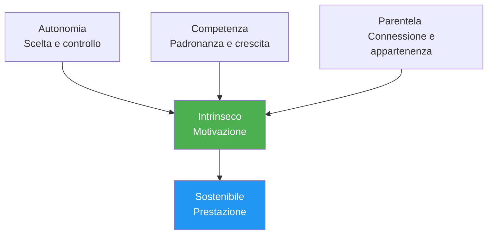

# Psicologia della motivazione

Capire PERCHÉ sei motivato, non solo che lo sei, ti aiuta a sviluppare una motivazione sostenibile che non dipende dai risultati.

---

## Motivazione intrinseca vs. motivazione estrinseca

### Motivazione estrinseca

Motivazione guidata da ricompense o pressioni esterne:

| Fonte | Esempio |
|--------|---------|
| **Trofei/medaglie** | &quot;Voglio vincere il campionato&quot; |
| **Classifiche** | &quot;Voglio essere tra i primi 10 nella mia regione&quot; |
| **Riconoscimento** | &quot;Voglio che gli altri mi vedano come un bravo giocatore&quot; |
| **Evitare le critiche** | &quot;Non voglio deludere la mia squadra&quot; |
| **Finanziario** | &quot;Voglio vincere un premio in denaro&quot; |

**Caratteristiche:**
- Può fornire una forte motivazione iniziale
- Spesso diminuisce nel tempo
- Dipende da fattori al di fuori del tuo controllo
- Può compromettere il godimento

### Motivazione intrinseca

Motivazione derivante dall&#39;attività stessa:

| Fonte | Esempio |
|--------|---------|
| **Padronanza** | &quot;Adoro la sensazione di migliorare&quot; |
| **Fluire** | &quot;Il tempo scompare quando gioco&quot; |
| **Sfida** | &quot;Mi piace mettermi alla prova contro i problemi&quot; |
| **Espressione** | &quot;La boccia mi permette di esprimere chi sono&quot; |
| **Gioia** | &quot;Adoro semplicemente giocare a questo gioco&quot; |

**Caratteristiche:**
- Più sostenibile nel tempo
- Indipendente dai risultati
- Connesso a una soddisfazione più profonda
- Migliora le prestazioni in modo naturale

::: tip La ricerca
Gli studi dimostrano costantemente che la **motivazione intrinseca porta a prestazioni migliori, maggiore perseveranza e maggiore benessere** rispetto alla sola motivazione estrinseca.
:::

---

## Teoria dell&#39;autodeterminazione (SDT)

Sviluppato da Deci e Ryan, l&#39;SDT identifica tre bisogni psicologici fondamentali che guidano la motivazione intrinseca:

### 1. Autonomia

**Il bisogno di sentirsi in controllo delle proprie scelte**

| Supporta l&#39;autonomia | Mina l&#39;autonomia |
|-------------------|---------------------|
| Scegliere il focus del tuo allenamento | Ricevere esattamente le istruzioni su cosa fare |
| Stabilire i propri obiettivi | Pressione esterna per eseguire |
| Decidere come praticare | partecipazione forzata |
| Avere voce in capitolo nelle decisioni del team | Controllo degli allenatori/compagni di squadra |

**Per la boccia:**
- Scegli su quali aspetti lavorare
- Imposta il tuo percorso di sviluppo
- Prendi tu stesso le decisioni tattiche
- Gestisci il tuo programma di allenamento

### 2. Competenza

**La necessità di sentirsi efficaci e capaci**

| Supporta la competenza | Competenza compromessa |
|---------------------|----------------------|
| Sfide appropriate | Compiti troppo facili o troppo difficili |
| Feedback chiaro sui progressi | Nessun feedback o solo negativo |
| Miglioramento visibile | Stagnazione senza spiegazione |
| Competizione adeguata alle abilità | Sovra-abbinamento costante |

**Per la boccia:**
- Tieni traccia delle tue metriche di miglioramento
- Cercare livelli di competizione adeguati
- Festeggia le piccole vittorie
- Ottieni feedback specifici (non solo risultati)

### 3. Relazione

**Il bisogno di connessione con gli altri**

| Supporta la correlazione | Minaccia la parentela |
|----------------------|------------------------|
| Relazioni di squadra positive | Isolamento |
| Obiettivi condivisi con i compagni di squadra | Focus puramente individuale |
| Appartenenza alla comunità | Esclusione o conflitto |
| Mentoring (dare/ricevere) | Relazioni esclusivamente competitive |

**Per la boccia:**
- Costruisci connessioni di squadra genuine
- Trova partner di allenamento
- Partecipa alle attività della comunità del club
- Condividi la conoscenza con gli altri

---

## La formula SDT

```
Autonomy + Competence + Relatedness = Intrinsic Motivation
```

Quando tutti e tre i bisogni sono soddisfatti, la motivazione intrinseca prospera naturalmente.



---

## Spettro dei tipi di motivazione

La SDT descrive la motivazione su uno spettro che va da esterna a interna:

| Tipo | Descrizione | Esempio | Qualità |
|------|-------------|---------|---------|
| **Demotivazione** | Nessuna motivazione | &quot;Perché preoccuparsi?&quot; | ❌ |
| **Esterno** | Per ricompense/evitare punizioni | &quot;Prenderò un trofeo&quot; | ⭐ |
| **Introiettato** | Pressione interna, senso di colpa | &quot;Dovrei esercitarmi&quot; | ⭐⭐ |
| **Identificato** | Risultato apprezzato | &quot;Questo mi aiuta a migliorare&quot; | ⭐⭐⭐ |
| **Integrato** | Allineato con i valori | &quot;Questo è ciò che sono&quot; | ⭐⭐⭐⭐ |
| **Intrinseco** | Puro divertimento | &quot;Adoro questo&quot; | ⭐⭐⭐⭐⭐ |

**Obiettivo:** Spostare la tua motivazione verso l&#39;estremità intrinseca dello spettro.

---

## Autovalutazione: il tuo profilo motivazionale

Valuta ciascuna affermazione (1 = Per niente, 5 = Completamente):

**Indicatori estrinseci:**
| Dichiarazione | Punto |
|-----------|-------|
| Gioco principalmente per vincere tornei | /5 |
| Il riconoscimento da parte degli altri è molto importante per me | /5 |
| Perderei interesse senza successo competitivo | /5 |
| **Totale estrinseco** | /15 |

**Indicatori intrinseci:**
| Dichiarazione | Punto |
|-----------|-------|
| Giocherei anche se non ci fossero le competizioni | /5 |
| La sensazione di miglioramento mi entusiasma | /5 |
| Perdo la cognizione del tempo quando gioco | /5 |
| **Totale intrinseco** | /15 |

**Interpretazione:**
- Totale intrinseco più elevato = motivazione più sostenibile
- L&#39;equilibrio è buono, ma assicurati che intrinseco ≥ estrinseco
- Se estrinseco &gt;&gt; intrinseco, riconnettiti con il tuo amore per il gioco

---

## Spostarsi verso la motivazione intrinseca

### Riconnettiti con la gioia

- **Ricorda perché hai iniziato** — Cosa ti ha attratto inizialmente?
- **Gioca senza puntate** — Occasionali sessioni &quot;solo per divertimento&quot;
- **Apprezza i momenti** — Nota quando ti stai divertendo con il gioco

### Concentrati sulla padronanza

- **Definisci obiettivi di apprendimento** non solo obiettivi di risultato
- **Celebra il miglioramento** indipendentemente dai risultati
- **Accetta le sfide** come opportunità di crescita

### Costruire l&#39;autonomia

- **Fai le tue scelte** riguardo all&#39;allenamento
- **Prenditi cura del tuo percorso di sviluppo**
- **Resistere alla pressione esterna** per allenarsi in determinati modi

### Coltivare la connessione

- **Investire nelle relazioni** oltre la competizione
- **Condividere la conoscenza** con i giocatori in via di sviluppo
- **Trova la tua comunità** all&#39;interno dello sport

---

## Contenuti correlati

- [Definizione degli obiettivi](/it/educazione/motivazione/) — Definire obiettivi efficaci
- [Mantenere la motivazione](/it/educazione/motivazione/mantenere) — Sostenibilità a lungo termine
- [La Zona](/it/educazione/gioco-mentale/la-zona/) — Motivazione intrinseca e flusso
- [Dinamiche di squadra](/it/istruzione/dinamiche-di-squadra/) — Correlazione nel contesto di squadra

