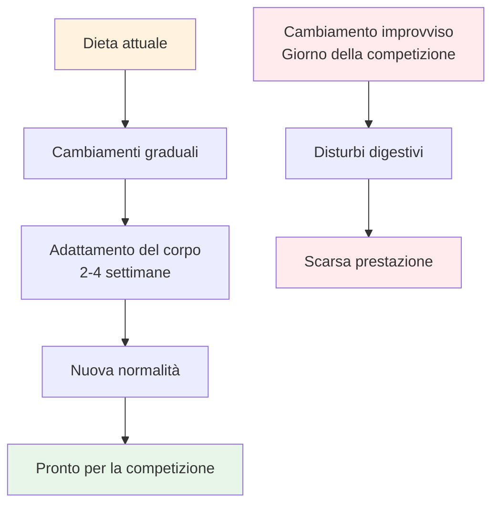

# Nutrizione per prestazioni di precisione
<AdBanner />


La boccia è uno sport di precisione, non di resistenza. Le tue esigenze nutrizionali sono diverse da quelle di un maratoneta o di un calciatore. Ciò che conta di più è la **stabilità del carburante per il cervello**: mantenere la mente attiva e le mani ferme durante una lunga giornata di gara.

::: tip La grande idea
**Your brain is your most important tool in pétanque. Feed it stable fuel, not roller coaster energy.** Focus on protein, healthy fats, and staying hydrated. Avoid sugar spikes.
:::



```mermaid
graph LR
    A[Zucchero/Carboidrati semplici] --> B[picco di zucchero nel sangue]
    B --> C[rilascio di insulina]
    C --> D[Crollo della glicemia]
    D --> E[Risposta all&#39;adrenalina]
    E --> F[Tremori e ansia]

    G[Proteine e grassi sani] --> H[Glicemia stabile]
    H --> I[Energia costante]
    I --> J[Messa a fuoco nitida]
    J --> K[Mani ferme]

    style A fill:#ffebee
    style F fill:#ffebee
    style G fill:#e8f5e9
    style K fill:#e8f5e9
```

## La sfida dell&#39;atleta di precisione

A differenza degli sport ad alta intensità, la pétanque non richiede grandi riserve di glicogeno o un rapido reintegro energetico. Ciò che richiede è:

- **Glicemia stabile: senza picchi o crolli**
- **Chiarezza mentale costante: concentrazione che dura tutto il giorno**
- **Mani ferme - niente tremori o scosse**
- **Nervi calmi - bassa risposta all&#39;ansia e allo stress**

La tua strategia nutrizionale dovrebbe essere ottimizzata in base a questi fattori e non in base alla produzione di energia pura.

## Il problema con lo zucchero e i carboidrati semplici

Molti atleti optano per diete ricche di carboidrati. Per i giocatori di pétanque, questo può effettivamente compromettere le prestazioni.

### Le montagne russe della glicemia

Quando mangi zucchero o carboidrati semplici:
1. La glicemia aumenta rapidamente
2. L&#39;insulina viene rilasciata per abbassarla
3. Crollo della glicemia (ipoglicemia)
4. Il tuo corpo rilascia adrenalina per compensare
5. Avverti tremori, ansia e scarsa concentrazione

**This is the opposite of what you need for precision.**

### Sintomi di instabilità della glicemia

| Sintomo | Impatto sulle prestazioni |
|---------|----------------------|
| Mani tremanti | Rilascio incoerente |
| Difficoltà di concentrazione | Scarsa capacità decisionale |
| Irritabilità | Conflitto di squadra, scarsa compostezza |
| Stanchezza dopo i pasti | Crollo pomeridiano |
| Ansia | Sensibilità alla pressione |
| Nebbia cerebrale | Pensiero tattico lento |

## Un approccio migliore: energia stabile

L&#39;obiettivo è fornire al cervello un carburante costante, senza le montagne russe.

### Principi chiave

1. **Dai priorità alle proteine e ai grassi sani** - Forniscono energia lenta e costante
2. **Scegli carboidrati complessi invece di quelli semplici** - Se mangi carboidrati, scegli quelli che si digeriscono lentamente
3. **Evitare i picchi di zucchero** - Soprattutto prima e durante la competizione
4. **Mantieniti idratato** - La disidratazione influisce significativamente sulla concentrazione
5. **Mangia regolarmente** - Non lasciarti prendere dalla fame

### Alimenti che aiutano

| Tipo di cibo | Esempi | Perché funziona |
|-----------|----------|--------------|
| Proteina | Uova, noci, formaggio, carne | Digestione lenta, energia stabile |
| Grassi sani | Avocado, olio d&#39;oliva, noci | Carburante di lunga durata |
| Carboidrati complessi | Verdure, legumi | La fibra rallenta l&#39;assorbimento |
| Frutta a basso contenuto di zucchero | Bacche, mele | Nutrienti senza spike |

### Cibi da limitare

| Tipo di cibo | Esempi | Perché è problematico |
|-----------|----------|---------------------|
| Zucchero | Caramelle, bibite, pasticcini | Picco e crollo rapidi |
| Pane/pasta bianca | Panini, piatti di pasta | Conversione rapida in zucchero |
| Succo di frutta | Succo d&#39;arancia, frullati | Zucchero concentrato |
| Bevande energetiche | La maggior parte dei marchi commerciali | Crollo di zucchero + caffeina |

## Nutrizione per il giorno della gara

### Prima della competizione

**2-3 hours before:**
- Pasto equilibrato con proteine, grassi e verdure
- Evitare i carboidrati pesanti che potrebbero causare sonnolenza
- Esempio: Uova con verdure o insalata con pollo

**1 hour before:**
- Spuntino leggero se necessario
- Noci, formaggio o una piccola porzione di proteine
- Evita tutto ciò che è zuccherato

### Durante la competizione

**Between games:**
- Acqua (la più importante)
- Piccoli spuntini proteici (noci, formaggio, carne)
- Evitare snack e bevande zuccherate

**Signs you need to eat:**
- Difficoltà di concentrazione
- Irritabilità
- Mi sento tremante
- Mal di testa

### Dopo la competizione

- Rifornisciti con un pasto equilibrato
- Reidratarsi completamente
- Non &quot;premiarti&quot; con lo zucchero: influenzerà la tua guarigione

## Idratazione

La disidratazione influisce sulle funzioni cognitive prima ancora di avvertire la sete.

### Linee guida

- **Inizia idratato: bevi acqua durante il giorno prima della gara**
- **Durante il gioco - Sorseggia acqua regolarmente, non aspettare di avere sete**
- **Evitare l&#39;eccesso di caffeina: è un diuretico**
- **Fai attenzione ai segnali: mal di testa, urine scure, stanchezza**

### Quanto?

Una regola generale: cerca di ottenere un&#39;urina di colore giallo chiaro. Se è scura, hai bisogno di più acqua.

## L&#39;opzione a basso contenuto di carboidrati

Alcuni atleti di precisione adottano diete a basso contenuto di carboidrati o chetogeniche. La teoria:

**Potential benefits:**
- Glicemia molto stabile (nessun picco possibile)
- Chiarezza mentale costante
- Riduzione dell&#39;ansia e dei tremori
- Nessun crollo energetico pomeridiano

**Considerations:**
- Richiede un periodo di adattamento (1-2 settimane)
- Non adatto a tutti
- Richiede pianificazione e impegno
- Consultare prima un medico

<AdInArticle />

Si tratta di una strategia avanzata, non necessaria per tutti, ma che vale la pena prendere in considerazione se la stabilità della glicemia rappresenta un problema significativo per te.

## Cibo come pratica: allenare il corpo

::: warning Concetto critico
**Mat är inte bara bränsle - det är något du övar med.** Just like you practice your throw, you must practice your nutrition to get your body comfortable with competition-day eating.
:::

### Perché la pratica alimentare è importante

Il tuo sistema digestivo è allenabile. Ciò che mangi regolarmente diventa ciò che il tuo corpo si aspetta e gestisce meglio. Se mangi solo proteine e verdure nei giorni di gara, il tuo corpo non si adatterà.

**The problem:**
- Mangiare cibi non familiari il giorno della gara può causare disturbi digestivi
- Il tuo corpo ha bisogno di tempo per adattarsi alle nuove abitudini alimentari
- Stress + cibo sconosciuto = potenziali problemi di stomaco
- L&#39;ansia da prestazione è già abbastanza grave senza aggiungere l&#39;ansia digestiva

**The solution:**
- Metti in pratica la tua alimentazione da competizione durante l&#39;allenamento
- Rendi i tuoi cibi preferiti per il giorno della gara parte della tua routine quotidiana
- Allena il tuo corpo ad abituarsi ad alimenti con energia stabile

### Il processo di adattamento



Quando cambi la tua dieta:
1. **Settimana 1-2:** Il tuo corpo si adatta ai nuovi alimenti, potrebbe sentirsi diverso
2. **Settimana 3-4:** Avviene l&#39;adattamento, i nuovi alimenti sembrano normali
3. **Settimana 5+:** Il tuo corpo è a suo agio ed efficiente con questi alimenti

**This is why you can't just "eat healthy" on competition day and expect optimal results.**

### Come praticare la tua nutrizione

#### 1. Inizia durante l&#39;allenamento

**Practice your competition-day eating during training sessions:**
- Mangia lo stesso pasto pre-allenamento che mangeresti prima di una gara
- Porta gli stessi snack che porteresti a un torneo
- Nota come risponde il tuo corpo
- Adatta in base a ciò che funziona

**Example training day:**
```
2-3 hours before: Eggs with vegetables (same as competition)
During training: Water + nuts (same as competition)
After training: Balanced meal with protein
```

#### 2. Rendila la tua normalità

**Don't have a "competition diet" and a "regular diet"** - this creates two problems:
- Il tuo corpo non si adatta mai completamente a nessuno dei due
- Il cibo da competizione sembra insolito e stressante

**Instead:**
- Fai in modo che gli alimenti a energia stabile diventino la tua norma quotidiana
- Il tuo corpo diventa efficiente nell&#39;utilizzare proteine e grassi
- Il giorno della gara sembra normale, non diverso
- Nessuna sorpresa digestiva

#### 3. Testare e perfezionare

**Use training to experiment:**

| Test | Cosa notare | Regolare |
|------|----------------|--------|
| Orario dei pasti prima dell&#39;allenamento | Livelli di energia, concentrazione | Trova la tua finestra ottimale |
| Diverse fonti proteiche | Digestione, conforto | Identifica cosa funziona meglio |
| Tipi di snack | Energia sostenuta | Trova i tuoi snack preferiti |
| Quantità di idratazione | Concentrazione, pause bagno | Assunzione di equilibrio |

**Keep a simple log:**
- Cosa hai mangiato e quando
- Come ti sei sentito durante l&#39;allenamento
- Livelli di energia e concentrazione
- Eventuali problemi digestivi

#### 4. Costruisci comfort e sicurezza

**The psychological benefit:**

Quando hai messo in pratica la tua alimentazione centinaia di volte durante l&#39;allenamento:
- Sai esattamente come risponderà il tuo corpo
- Nessuna ansia per le scelte alimentari
- Una cosa in meno di cui preoccuparsi il giorno della gara
- Fiducia nella tua preparazione

**This is the same principle as practicing your throw** - repetition builds comfort and reliability.

### Sfide comuni di adattamento

::: details Passaggio da una dieta ricca di carboidrati a una dieta a energia stabile

**Challenge:** You're used to bread, pasta, and sugary snacks

**Adaptation period:** 2-4 weeks

**What to expect:**
- Settimana 1: Potrebbe sembrare diverso, desiderio di cibi vecchi
- Settimana 2: L&#39;energia si stabilizza, le voglie si riducono
- Settimana 3-4: Nuova normalità, corpo efficiente con grassi/proteine

**How to practice:**
- Inizia con un pasto alla volta
- Sostituisci prima i carboidrati semplici con carboidrati complessi
- Aumentare gradualmente le proteine e i grassi sani
- Esercitati prima durante l&#39;allenamento a basso rischio
:::

::: details Trovare gli alimenti che funzionano per te

**Challenge:** Not everyone digests the same foods well

**What to test:**
- Diverse fonti proteiche (uova vs. carne vs. noci)
- Orario dei pasti (2 ore prima vs. 3 ore prima)
- Porzioni (troppo = pigrizia, troppo poco = fame)
- Alimenti specifici che causano disagio

**Practice approach:**
- Prova una variabile alla volta
- Fornire a ciascun test 2-3 sessioni di allenamento
- Nota cosa ti fa sentire meglio
- Crea il tuo &quot;menu di gara&quot; personale
:::

::: details Come gestire gli ambienti alimentari dei tornei

**Challenge:** Tournaments often have limited food options

**Practice solution:**
- Porta sempre con te i tuoi spuntini (mettilo in pratica)
- Individuare i luoghi in anticipo, quando possibile
- Avere opzioni di backup che sai funzionare
- Esercitati a mangiare in ambienti diversi

**Mental preparation:**
- Non fare affidamento sul cibo del locale
- Considera il cibo come parte della tua attrezzatura
- Imballalo come imballi le tue palle
:::

### Il piano di pratica nutrizionale di 30 giorni

**Goal:** Make stable-energy eating your comfortable normal

**Week 1-2: Foundation**
- Sostituisci un pasto al giorno con un&#39;alimentazione in stile competizione
- Praticare l&#39;alimentazione pre-allenamento
- Inizia a portare degli spuntini all&#39;allenamento
- Nota come risponde il tuo corpo

**Week 3-4: Expansion**
- Prepara due pasti al giorno a base di energia stabile
- Praticare un&#39;alimentazione completa nei giorni di gara nei giorni di allenamento
- Affina le tue scelte di snack
- Crea la tua lista di cibi preferiti

**Week 5+: Mastery**
- Mangiare a energia stabile è la tua nuova normalità
- Il corpo è completamente adattato
- Il giorno della gara sembra una routine
- Fiducia nella tua alimentazione

### Il tuo kit alimentare per la competizione

**Practice packing this for every training session:**

**Pre-competition (2-3 hours before):**
- [ ] Fonte proteica (uova, carne o noci)
- [ ] Verdure o insalata
- [ ] Grassi sani (avocado, olio d&#39;oliva, formaggio)

**During competition:**
- [ ] Bottiglia d&#39;acqua (ricaricabile)
- [ ] Frutta secca mista (piccole porzioni)
- [ ] Uova sode (se riesci a tenerle al fresco)
- [ ] Cubetti di formaggio o formaggio filante
- [ ] Carne secca o essiccata
- [ ] Snack di riserva

**The more you practice with this kit, the more automatic it becomes.**

## Consigli pratici

### Snack facili da competizione
- Frutta secca mista (non salata)
- Uova sode
- cubetti di formaggio
- Carne secca di manzo o tacchino
- Verdure con hummus
- Olive

### Cosa evitare
- Snack da distributori automatici
- Bevande sportive zuccherate
- Pasticceria e prodotti da forno
- Barrette di cioccolato e caramelle
- La maggior parte delle barrette &quot;energetiche&quot; (controllare il contenuto di zucchero)

## Conclusione chiave

> Il cervello è lo strumento più importante nella pétanque. Offritegli un carburante stabile, non un&#39;energia da montagne russe. E allenate la vostra alimentazione proprio come vi allenate per il lancio: la ripetizione crea comfort e affidabilità.

Concentratevi su proteine, grassi sani e sull&#39;idratazione. Evitate i picchi di zucchero. **La cosa più importante: fate in modo che l&#39;alimentazione del giorno della gara diventi la vostra alimentazione quotidiana.** Il vostro corpo ha bisogno di allenamento per dare il massimo.

**Remember:** You wouldn't show up to a tournament with a throwing technique you've never practiced. Don't show up with a nutrition strategy you've never practiced either.

<AdBanner />
