# Nutrizione per prestazioni di precisione

La boccia è uno sport di precisione, non di resistenza. Le tue esigenze nutrizionali sono diverse da quelle di un maratoneta o di un calciatore. Ciò che conta di più è la **stabilità del carburante per il cervello**: mantenere la mente attiva e le mani ferme durante una lunga giornata di gara.

::: tip La grande idea
**Il tuo cervello è lo strumento più importante nel gioco delle bocce. Forniscigli carburante stabile, non energia da montagne russe.** Concentrati su proteine, grassi sani e sull&#39;idratazione. Evita i picchi di zucchero.
:::

```mermaid
graph LR
    A[Zucchero/Carboidrati semplici] --> B[picco di zucchero nel sangue]
    B --> C[rilascio di insulina]
    C --> D[Crollo della glicemia]
    D --> E[Risposta all&#39;adrenalina]
    E --> F[Tremori e ansia]

    G[Proteine e grassi sani] --> H[Glicemia stabile]
    H --> I[Energia costante]
    I --> J[Messa a fuoco nitida]
    J --> K[Mani ferme]

    style A fill:#ffebee
    style F fill:#ffebee
    style G fill:#e8f5e9
    style K fill:#e8f5e9
```

## La sfida dell&#39;atleta di precisione

A differenza degli sport ad alta intensità, la pétanque non richiede grandi riserve di glicogeno o un rapido reintegro energetico. Ciò che richiede è:

- **Glicemia stabile** - senza picchi o crolli
- **Chiarezza mentale costante** - concentrazione che dura tutto il giorno
- **Mani ferme** - niente tremori o scosse
- **Calma i nervi** - bassa risposta all&#39;ansia e allo stress

La tua strategia nutrizionale dovrebbe essere ottimizzata in base a questi fattori e non in base alla produzione di energia pura.

## Il problema con lo zucchero e i carboidrati semplici

Molti atleti optano per diete ricche di carboidrati. Per i giocatori di pétanque, questo può effettivamente compromettere le prestazioni.

### Le montagne russe della glicemia

Quando mangi zucchero o carboidrati semplici:
1. La glicemia aumenta rapidamente
2. L&#39;insulina viene rilasciata per abbassarlo
3. Crollo della glicemia (ipoglicemia)
4. Il tuo corpo rilascia adrenalina per compensare
5. Si avvertono tremori, ansia e scarsa concentrazione

**Questo è l&#39;opposto di ciò di cui hai bisogno per la precisione.**

### Sintomi di instabilità della glicemia

| Sintomo | Impatto sulle prestazioni |
|---------|----------------------|
| Mani tremanti | Rilascio incoerente |
| Difficoltà di concentrazione | Scarsa capacità decisionale |
| Irritabilità | Conflitto di squadra, scarsa compostezza |
| Stanchezza dopo i pasti | Crollo pomeridiano |
| Ansia | Sensibilità alla pressione |
| Nebbia cerebrale | Pensiero tattico lento |

## Un approccio migliore: energia stabile

L&#39;obiettivo è fornire al cervello un carburante costante, senza le montagne russe.

### Principi chiave

1. **Dai priorità alle proteine e ai grassi sani** - Forniscono energia lenta e costante
2. **Scegli carboidrati complessi invece di quelli semplici** - Se mangi carboidrati, scegli quelli che si digeriscono lentamente
3. **Evitare i picchi di zucchero** - Soprattutto prima e durante la competizione
4. **Mantieniti idratato** - La disidratazione influisce significativamente sulla concentrazione
5. **Mangia regolarmente** - Non lasciarti prendere dalla fame

### Alimenti che aiutano

| Tipo di cibo | Esempi | Perché funziona |
|-----------|----------|--------------|
| Proteina | Uova, noci, formaggio, carne | Digestione lenta, energia stabile |
| Grassi sani | Avocado, olio d&#39;oliva, noci | Carburante di lunga durata |
| Carboidrati complessi | Verdure, legumi | La fibra rallenta l&#39;assorbimento |
| Frutta a basso contenuto di zucchero | Bacche, mele | Nutrienti senza spike |

### Cibi da limitare

| Tipo di cibo | Esempi | Perché è problematico |
|-----------|----------|---------------------|
| Zucchero | Caramelle, bibite, pasticcini | Picco e crollo rapidi |
| Pane/pasta bianca | Panini, piatti di pasta | Conversione rapida in zucchero |
| Succo di frutta | Succo d&#39;arancia, frullati | Zucchero concentrato |
| Bevande energetiche | La maggior parte dei marchi commerciali | Crollo di zucchero + caffeina |

## Nutrizione per il giorno della gara

### Prima della competizione

**2-3 ore prima:**
- Pasto equilibrato con proteine, grassi e verdure
- Evitare i carboidrati pesanti che potrebbero causare sonnolenza
- Esempio: Uova con verdure o insalata con pollo

**1 ora prima:**
- Spuntino leggero se necessario
- Noci, formaggio o una piccola porzione di proteine
- Evita tutto ciò che è zuccherato

### Durante la competizione

**Tra le partite:**
- Acqua (la più importante)
- Piccoli spuntini proteici (noci, formaggio, carne)
- Evitare snack e bevande zuccherate

**Segnali che indicano che devi mangiare:**
- Difficoltà di concentrazione
- Irritabilità
- Mi sento tremante
- Mal di testa

### Dopo la competizione

- Rifornisciti con un pasto equilibrato
- Reidratarsi completamente
- Non &quot;premiarti&quot; con lo zucchero: influenzerà la tua guarigione

## Idratazione

La disidratazione influisce sulle funzioni cognitive prima ancora di avvertire la sete.

### Linee guida

- **Inizia idratato** - Bevi acqua durante il giorno prima della gara
- **Durante il gioco** - Sorseggia acqua regolarmente, non aspettare di avere sete
- **Evitare l&#39;eccesso di caffeina** - È un diuretico
- **Fai attenzione ai segnali** - Mal di testa, urine scure, stanchezza

### Quanto?

Una regola generale: cerca di ottenere un&#39;urina di colore giallo chiaro. Se è scura, hai bisogno di più acqua.

## L&#39;opzione a basso contenuto di carboidrati

Alcuni atleti di precisione adottano diete a basso contenuto di carboidrati o chetogeniche. La teoria:

**Potenziali benefici:**
- Glicemia molto stabile (nessun picco possibile)
- Chiarezza mentale costante
- Riduzione dell&#39;ansia e dei tremori
- Nessun crollo energetico pomeridiano

**Considerazioni:**
- Richiede un periodo di adattamento (1-2 settimane)
- Non adatto a tutti
- Richiede pianificazione e impegno
- Consultare prima un medico

Si tratta di una strategia avanzata, non necessaria per tutti, ma che vale la pena prendere in considerazione se la stabilità della glicemia rappresenta un problema significativo per te.

## Consigli pratici

### Snack facili da competizione
- Frutta secca mista (non salata)
- Uova sode
- cubetti di formaggio
- Carne secca di manzo o tacchino
- Verdure con hummus
- Olive

### Cosa evitare
- Snack da distributori automatici
- Bevande sportive zuccherate
- Pasticceria e prodotti da forno
- Barrette di cioccolato e caramelle
- La maggior parte delle barrette &quot;energetiche&quot; (controllare il contenuto di zucchero)

## Conclusione chiave

> Il cervello è lo strumento più importante nel gioco delle bocce. Dategli carburante stabile, non energia da montagne russe.

Concentratevi su proteine, grassi sani e sull&#39;idratazione. Evitate i picchi di zucchero. La vostra concentrazione, la vostra compostezza e la vostra fermezza vi ringrazieranno.

