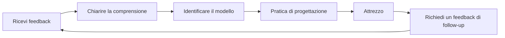

# Ottenere e utilizzare il feedback

Il feedback è uno degli strumenti più potenti per lo sviluppo, ma anche uno dei meno utilizzati. Questa pagina ti insegna come cercare attivamente feedback, riceverlo in modo costruttivo e trasformarlo in miglioramenti concreti.

---

## Perché resistiamo al feedback

Prima di imparare a chiedere feedback, è importante capire perché è difficile:

### Protezione dell&#39;ego

Il tuo cervello considera le critiche alle tue prestazioni come una minaccia alla tua identità. Questo innesca risposte difensive:
- Ignorare il feedback
- Trovare le ragioni per cui la persona sbaglia
- Evitare situazioni simili in futuro

### Bias di conferma

Cerchiamo naturalmente informazioni che confermino ciò in cui già crediamo. Se pensi di essere un buon indicatore, noterai i tuoi punti vincenti e spiegherai quelli sbagliati.

### Il cambiamento di mentalità verso la crescita

::: tip Riformulare il feedback
**Mentalità fissa:** &quot;Le critiche significano che sono imperfetto&quot;
**Mentalità di crescita:** &quot;Il feedback è un&#39;informazione che mi aiuta a migliorare&quot;

La differenza non è la positività, ma l&#39;accuratezza. Il feedback è dato, non giudizio.
:::

---

## Fonti di feedback oggettivo

### 1. Dati quantitativi

I numeri non mentono né attenuano la verità:

| Metrico | Cosa rivela |
|--------|-----------------|
| **Precisione di puntamento %** | Base tecnica e tendenze |
| **Precisione nel primo e nel secondo tempo** | Effetti di fatica/pressione |
| **Percentuale di successo al tiro** | Per distanza, tipo di bersaglio, situazione di partita |
| **Percentuale di Carreau** | Efficacia nell&#39;assunzione del rischio |

### 2. Compagni di squadra

I tuoi compagni di squadra ti vedono in gara, quando la tua percezione di te stesso è meno accurata:

**Cosa chiedere:**
- &quot;Come ti sembro quando siamo indietro?&quot;
- &quot;Cosa noti del mio approccio nelle partite ravvicinate?&quot;
- &quot;Cosa potrei fare per essere un compagno di squadra migliore?&quot;

### 3. Avversari

Le conversazioni post-partita con avversari fidati possono essere rivelatrici:

**Cosa chiedere:**
- &quot;Cosa stavi cercando di sfruttare nel mio gioco?&quot;
- &quot;C&#39;è stato qualcosa che ti ha sorpreso nel modo in cui ho giocato?&quot;

### 4. Allenatori/Giocatori esperti

Le competenze esterne forniscono una prospettiva che non potresti generare da solo:

**Cosa chiedere:**
- &quot;Qual è il divario più grande tra il mio potenziale e le mie prestazioni attuali?&quot;
- &quot;Quale schema vedi nei miei errori?&quot;
- &quot;Quali sarebbero le priorità per te se fossi il mio allenatore?&quot;

### 5. Analisi video

Lo specchio più obiettivo disponibile. Vedi [Analisi Video](/it/educazione/consapevolezza-di-sé/video) per protocolli dettagliati.

---

## Come chiedere feedback in modo efficace

### Il quadro SEEK

**S - Specifico**
Non chiedere: &quot;Come ho giocato?&quot;
Chiedi: &quot;Com&#39;è stata la mia precisione di puntamento nel terzo lato quando eravamo indietro?&quot;

**E - Esempi**
Chiedi: &quot;Puoi farmi un esempio specifico?&quot;
Ciò impone un feedback concreto anziché generalizzazioni.

**E - Esplorativo**
Avvicinatevi con curiosità, non con atteggiamento difensivo.
&quot;Sto cercando di capire i miei punti ciechi. Cosa potrebbe sfuggirmi?&quot;

**K - Gentile (con te stesso)**
Ricorda: chiedere feedback è un atto di coraggio. Stai lavorando sodo.

### Il tempismo è importante

| Quando | Ideale per | Evitare |
|------|----------|-------|
| **Subito dopo** | Osservazioni tecniche specifiche | Elaborazione emotiva |
| **Il giorno dopo** | Prospettiva equilibrata, modelli | Se i dettagli sono sbiaditi |
| **Recensione video** | Analisi oggettiva | Se ritarda l&#39;azione troppo a lungo |

---

## Ricevere feedback senza mettersi sulla difensiva

Quando arriva un feedback, il tuo cervello vorrà difendersi. Ecco come ignorarlo:

### La regola dei 3 secondi

Quando ricevi un feedback, **aspetta 3 secondi prima di rispondere**. Questo dà al tuo cervello razionale il tempo di attivarsi prima che quello emotivo reagisca.

### La tecnica &quot;Dimmi di più&quot;

Invece di difenderti, dì: &quot;Dimmi di più a riguardo&quot;.

Questo:
- Acquista tempo di elaborazione
- Dimostra che apprezzi l&#39;input
- Spesso rivela l&#39;intuizione fondamentale

### Separare la ricezione dalla valutazione

**Passaggio 1:** Ricevi (semplicemente ascolta)
**Passaggio 2:** Chiarire (assicurarsi di aver capito)
**Passaggio 3:** Ringrazia (riconosci il dono)
**Passaggio 4:** Valutare (in seguito, decidere privatamente su cosa agire)

Non è necessario accettare immediatamente il feedback. Basta accoglierlo con apertura.

---

## Il protocollo di risposta al feedback

Utilizza questo quando ricevi feedback:

1. **&quot;Grazie per avermelo detto.&quot;**
   - Apprezzamento genuino, anche se il feedback brucia

2. **&quot;Puoi farmi un esempio specifico?&quot;**
   - Passa dal generale all&#39;attuabile

3. **&quot;Cosa mi suggeriresti di provare?&quot;**
   - Invita alla collaborazione nel miglioramento

4. **&quot;Ci penserò.&quot;**
   - Impegno onesto senza accordo immediato

---

## Trasformare il feedback in azione

Un feedback senza azione non è altro che una conversazione scomoda.

### Il processo di feedback-azione

### Modello di azione

Per ogni feedback utile:

| Elemento | La tua risposta |
|---------|---------------|
| **Il feedback** | (Ciò che è stato detto) |
| **Il modello** | (Quale problema ricorrente rivela questo?) |
| **L&#39;azione** | (Quale cosa specifica metterai in pratica?) |
| **La misura** | (Come saprai se sei migliorato?) |
| **La cronologia** | (Quando rivaluterete la situazione?) |

---

## Creare una cultura del feedback

### Con la tua squadra

- **Normalizzalo:** Il feedback regolare diventa previsto, non eccezionale
- **Strada a doppio senso:** Fornisci un feedback per riceverlo comodamente
- **Accordi sui tempi:** &quot;Facciamo il punto dopo le partite&quot; vs. critiche non richieste
- **Concentrati sui dettagli:** &quot;Ho notato X&quot; è meglio di &quot;Tu fai sempre Y&quot;

### Con te stesso

- **Autovalutazione settimanale:** Tempo dedicato per valutare la tua settimana
- **Riflessione scritta:** La scrittura crea chiarezza
- **Monitoraggio dei pattern:** Cerca temi ricorrenti in più fonti

---

## Il giocatore resistente al feedback

Se ti riconosci in una di queste situazioni, dai priorità a questo lavoro:

::: warning Segnali di resistenza al feedback
- Puoi sempre spiegare perché il feedback non è valido
- Cerchi feedback solo da persone che sono d&#39;accordo con te
- Ti senti attaccato quando ricevi input costruttivi
- Eviti le persone che mettono in discussione la tua percezione di te stesso
- Razionalizzi i risultati scadenti come fattori esterni
:::

Per rompere questi schemi è necessario uno sforzo consapevole, ma il risultato è un miglioramento accelerato.

---

## Contenuti correlati

- [Il vantaggio dell&#39;autoconsapevolezza](/it/educazione/autoconsapevolezza/) — Perché la conoscenza di sé è importante
- [Analisi video](/it/educazione/autoconsapevolezza/video) — Auto-osservazione oggettiva
- [Dinamiche di squadra](/it/education/team-dynamics/) — Comunicazione con i compagni di squadra
- [Forza mentale](/it/educazione/gioco-mentale/forza-mentale/) — Gestire verità difficili

