# Il vantaggio dell&#39;autoconsapevolezza

::: tip La meta-abilità che moltiplica tutto
**Peso: 400 punti** — I giocatori con una percezione di sé accurata migliorano 2-3 volte più velocemente perché allenano ciò su cui c&#39;è effettivamente bisogno di lavorare.
:::

## Perché questo è il tuo moltiplicatore nascosto

> &quot;Non puoi migliorare ciò che non vedi.&quot;

La maggior parte dei giocatori trascorre ore ad allenarsi, ma **stanno allenando le cose giuste?** La consapevolezza di sé è la meta-abilità che garantisce che il tempo dedicato all&#39;allenamento sia effettivamente efficace.

### L&#39;effetto moltiplicatore del miglioramento

```mermaid
flowchart TD
    A[Consapevolezza di sé] --> B[Autovalutazione accurata]
    A --> C[Riconoscimento dell&#39;angolo cieco]
    A --> D[Ricezione del feedback]

    B --> E[Allena ciò che ha effettivamente bisogno di lavoro]
    C --> E
    D --> E

    E --> F[Miglioramento 2-3 volte più veloce]

    style A fill:#FF9800,color:#fff
    style F fill:#4CAF50,color:#fff
```



Senza consapevolezza di sé, potresti:
- Metti in pratica ciò in cui sei già bravo (ti fa sentire bene, crescita limitata)
- Non notare i difetti tecnici che non puoi vedere
- Attribuire erroneamente le perdite a fattori esterni
- Resisti al feedback che potrebbe aiutarti

Con la consapevolezza di sé, tu:
- Identificare con precisione le debolezze effettive
- Accetta e integra feedback utili
- Capire come la pressione influisce sul tuo gioco specifico
- Conosci i tuoi modelli in diverse condizioni

---

## Il paradosso dell&#39;autoconsapevolezza

::: danger La scomoda verità
La ricerca dimostra costantemente che chi ha bisogno di maggiore consapevolezza di sé in genere crede di avere un&#39;eccellente conoscenza di sé. Chi ha un&#39;elevata consapevolezza di sé si mette costantemente in discussione e cerca stimoli esterni.

**Quale sei?**
:::

Questo è chiamato **effetto Dunning-Kruger** applicato all&#39;autopercezione. La stessa mancanza di consapevolezza che ti trattiene ti impedisce anche di vedere che ti manca consapevolezza.

### La soluzione: specchietti esterni

Poiché non possiamo fidarci completamente della nostra percezione interna, abbiamo bisogno di specchi esterni:

| Specchio | Cosa rivela |
|--------|-----------------|
| **Analisi video** | Realtà tecnica vs. ciò che pensi di fare |
| **Dati sulle prestazioni** | Modelli che potresti non notare |
| **Feedback dei compagni di squadra** | Come vieni percepito sotto pressione |
| **Osservazione dell&#39;allenatore** | Occhio esperto sul tuo gioco |

---

## La finestra Johari per i giocatori di bocce

La finestra di Johari è un modello psicologico che mappa ciò che tu e gli altri sapete del vostro gioco:

```
                    Known to Self    Unknown to Self
                   ┌────────────────┬────────────────┐
 Known to Others   │     OPEN       │     BLIND      │
                   │  Arena         │  Spot          │
                   │                │                │
                   │ Your conscious │ What others    │
                   │ skills and     │ see but you    │
                   │ tendencies     │ don't          │
                   ├────────────────┼────────────────┤
 Unknown to Others │    HIDDEN      │   UNKNOWN      │
                   │    Facade      │   Potential    │
                   │                │                │
                   │ What you know  │ Undiscovered   │
                   │ but don't      │ capabilities   │
                   │ share          │                │
                   └────────────────┴────────────────┘
```

### Il tuo obiettivo: espandere l&#39;area &quot;aperta&quot;

**1. Riduci i tuoi punti ciechi**
- Cerca l&#39;analisi video
- Richiedi un feedback specifico
- Fai attenzione ai modelli nei risultati

**2. Condividi di più (Riduci i contenuti nascosti)**
- Di&#39; ai compagni di squadra quando sei in difficoltà
- Discuti apertamente il tuo approccio
- Chiedi aiuto quando necessario

**3. Scopri il tuo potenziale sconosciuto**
- Prova nuovi approcci
- Esperimento in formazione
- Spingi fuori dalla zona di comfort

---

## Consapevolezza di sé vs. autocritica

::: warning Distinzione critica
L&#39;autoconsapevolezza è un&#39;**osservazione neutrale** della realtà.
L&#39;autocritica è un **giudizio negativo** su se stessi.

NON sono la stessa cosa.
:::

| Consapevolezza di sé | Autocritica |
|----------------|----------------|
| &quot;Ho saltato tre quadri oggi&quot; | &quot;Sono pessimo nei carreaux&quot; |
| &quot;Mi irrigidisco nelle partite combattute&quot; | &quot;Sobbalzo sempre sotto pressione&quot; |
| &quot;Quando sono stanco, il mio puntamento è meno preciso&quot; | &quot;Non riesco a gestire tornei lunghi&quot; |
| &quot;Comunicare meno quando perdo&quot; | &quot;Sono un pessimo compagno di squadra quando sono stressato&quot; |

**La differenza è importante perché:**
- La consapevolezza di sé porta a un miglioramento mirato
- L&#39;autocritica porta alla vergogna e all&#39;evitamento
- L&#39;autoconsapevolezza è fattuale e specifica
- L&#39;autocritica è emotiva e generalizzata

---

## I tre livelli di autoconsapevolezza

### Livello 1: Autoconsapevolezza tecnica
*&quot;Come mi sto comportando realmente?&quot;*

- Precisione in diverse condizioni
- Modelli di esecuzione tecnica
- Effetti dello stato fisico sulle prestazioni

### Livello 2: Autoconsapevolezza psicologica
*&quot;Come posso rispondere mentalmente ed emotivamente?&quot;*

- Risposte allo stress e fattori scatenanti
- Fluttuazioni di fiducia
- Modelli di messa a fuoco e distrattori

### Livello 3: Autoconsapevolezza sociale
*&quot;Come influisco sugli altri e come mi vedono?&quot;*

- Modelli di comunicazione di squadra
- Momenti (o lacune) di leadership
- Come le tue emozioni influenzano i compagni di squadra

---

## Autovalutazione: la tua attuale consapevolezza di te stesso

Valutati onestamente (1 = Mai, 5 = Sempre):

| Domanda | Punto |
|----------|-------|
| Posso prevedere con precisione le mie prestazioni in diverse situazioni | /5 |
| So quali condizioni mi fanno ottenere prestazioni inferiori alle aspettative | /5 |
| Capisco come mi percepiscono i compagni di squadra quando sono sotto pressione | /5 |
| Accolgo e integro il feedback critico | /5 |
| La mia autovalutazione corrisponde alla valutazione del mio allenatore/compagni di squadra | /5 |
| Posso analizzare oggettivamente la mia prestazione senza reazioni emotive | /5 |
| Noto i cambiamenti del mio stato mentale durante la competizione | /5 |

**Punteggio:**
- **28-35:** Elevata consapevolezza di sé (ma resta umile: continua a chiedere suggerimenti)
- **21-27:** Moderata consapevolezza di sé (buona base su cui costruire)
- **14-20:** Lacuna di autoconsapevolezza (questo modulo è fondamentale per te)
- **Inferiore a 14:** Punti ciechi significativi (dare priorità a questo lavoro)

---

## In questo modulo

### [Ottenere e utilizzare il feedback](/it/educazione/consapevolezza di sé/feedback)
- Fonti di feedback oggettivo
- Come chiedere feedback in modo efficace
- Ricevere feedback senza mettersi sulla difensiva
- Trasformare il feedback in azione

### [Analisi video per l&#39;auto-scoperta](/it/educazione/auto-consapevolezza/video)
- Cosa registrare e quando
- Cosa cercare nel tuo filmato
- Confronto tra l&#39;autopercezione e la realtà video
- Protocolli di analisi video

---

## Vittoria rapida: le tre domande

Dopo la tua prossima sessione di allenamento o partita, chiediti:

1. **Cosa penso di aver fatto bene?** (Sii specifico)
2. **Cosa direbbe un osservatore obiettivo?** (Separare la percezione dalla realtà)
3. **Qual è una cosa che evito di guardare?** (Trova il punto cieco)

Scrivi le tue risposte. Confrontale nel tempo. Emergeranno degli schemi ricorrenti.

---

## Fattori correlati

- [Gioco mentale](/it/educazione/gioco-mentale/) — La consapevolezza di sé supporta l&#39;allenamento mentale
- [Dinamiche di squadra](/it/education/team-dynamics/) — Comprendi come ti percepiscono gli altri
- [Motivazione](/it/educazione/motivazione/) — Conosci i tuoi veri driver
- [Tecnica](/it/educazione/tecnica/) — L&#39;analisi video rivela la verità tecnica

