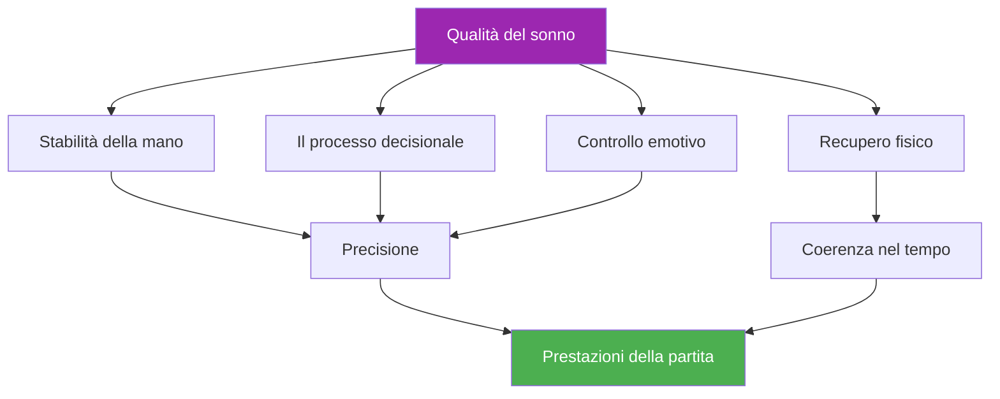

# Sonno e recupero

::: tip Un fattore critico di prestazione
**Peso: 400 punti** — Il sonno è il fattore più sottovalutato negli sport di precisione. Le mani, le decisioni e le emozioni dipendono tutte da un riposo di qualità.
:::

## Il vantaggio nascosto delle prestazioni

> &quot;Spesso vince il giocatore che ha dormito meglio.&quot;

Nella pétanque, a differenza degli sport di resistenza in cui gli atleti a volte riescono a &quot;superare&quot; la fatica, **la precisione non è negoziabile**. La capacità di piazzare una boccia a pochi centimetri dal cochonnet dipende da sistemi estremamente sensibili alla privazione del sonno:

- Controllo motorio fine
- Prendere decisioni sotto pressione
- Regolazione emotiva
- Consolidamento della memoria

Questo modulo svela perché il sonno potrebbe rappresentare il tuo più grande vantaggio competitivo non sfruttato.

---

## Come il sonno influisce sul tuo gioco

### Stabilità della mano e controllo motorio

La ricerca dimostra che il controllo motorio fine si riduce del **10-15% per ogni ora di sonno accumulato**. Per i giocatori di pétanque, questo si manifesta come:

- **Aumento dei micro-tremori** — Impercettibili all&#39;utente, ma che influenzano la coerenza del rilascio
- **Ridotta propriocezione** — Minore consapevolezza della pressione della presa e della posizione del braccio
- **Correzione degli errori più lenta** — Il tuo corpo non può effettuare le micro-regolazioni che producono precisione

::: warning Perché il puntamento è il primo a soffrire
Puntare richiede il miglior controllo motorio di qualsiasi tiro. Spesso è la prima abilità a peggiorare quando si dorme poco, anche quando ci si &quot;sente bene&quot;.
:::

### Decisioni e tattiche

La corteccia prefrontale, responsabile della pianificazione, della valutazione del rischio e del pensiero strategico, è estremamente sensibile alla perdita di sonno:

- **La valutazione del rischio diventa compromessa** — Puoi tentare tiri con percentuali inferiori
- **La flessibilità tattica diminuisce** — Più difficile adattarsi a metà partita
- **Il fenomeno della &quot;decisione delle 2 del mattino&quot;** — Le scelte che sembrano ragionevoli quando si è stanchi, col senno di poi, diventano discutibili

### Regolazione emotiva

La privazione del sonno provoca **iperattività nell&#39;amigdala**, il centro emozionale del cervello:

- La pressione è più intensa
- La frustrazione dopo gli errori è amplificata
- La ripresa dalle battute d&#39;arresto richiede più tempo
- Le dinamiche di squadra possono risentire di temperamenti tesi

### Consolidamento della memoria

La memoria motoria si consolida durante il sonno, in particolare durante le fasi di sonno profondo:

- **Esercitazione senza dormire = ritenzione limitata**
- **&quot;Dormirci sopra&quot; funziona davvero** per i cambiamenti di tecnica
- La formula: **Pratica di qualità + Sonno di qualità = Abilità permanente**

---

## La connessione tra sonno e prestazioni

---

## La realtà del debito di sonno

### Cos&#39;è il debito di sonno?

Il debito di sonno è **cumulativo**. Perdere un&#39;ora di sonno non influisce solo sulla giornata, ma si accumula:

| Giorni | Ore corte | Debito totale | Impatto sulle prestazioni |
|------|-------------|------------|-------------------|
| 1 | -1 ora | 1 ora | Minimo |
| 3 | -1 ora/giorno | 3 ore | Notevole |
| 7 | -1 ora/giorno | 7 ore | Significativo |
| 14 | -1 ora/giorno | 14 ore | Acuto |

::: danger Il mito del fine settimana
**Non puoi &quot;recuperare&quot; completamente** nei fine settimana. Anche se dormire di più aiuta, non cancella i debiti accumulati. La costanza è più importante di lunghe dormite occasionali.
:::

### Quanto ti serve?

Il detto &quot;8 ore per tutti&quot; è un mito. Le esigenze individuali variano:

- **La maggior parte degli adulti:** 7-9 ore
- **Alcuni funzionano bene per:** 6-7 ore
- **Alcuni richiedono:** 9+ ore

**Trovare il TUO fabbisogno di sonno ottimale:**
1. Durante una vacanza (senza sveglia), concediti un sonno naturale per 5-7 giorni
2. Dopo la fase iniziale di &quot;recupero&quot;, nota per quanto tempo dormi
3. Questo è probabilmente vicino al tuo bisogno biologico

---

## La scienza in breve

### Fasi del sonno importanti

| Palcoscenico | Funzione | Rilevanza della boccia |
|-------|----------|-------------------|
| **Sonno profondo (N3)** | Recupero fisico, ormone della crescita | Recupero muscolare, ripristino dell&#39;energia |
| **Fase REM** | Elaborazione emotiva, consolidamento della memoria | Mantenimento delle capacità motorie, resilienza emotiva |
| **Sonno leggero (N1-N2)** | Transizione, manutenzione | Supporta l&#39;architettura complessiva |

### Risultati chiave della ricerca

1. **Studio di Stanford sul basket** — I giocatori che hanno prolungato il sonno a 10 ore hanno migliorato la precisione dei tiri liberi del 9% (Mah et al., 2011)
2. **Precisione del servizio nel tennis** — La restrizione del sonno ha ridotto la precisione del servizio del 53% (Reyner &amp; Horne, 2013)
3. **Meta-analisi del tempo di reazione** — Anche una sola notte di sonno scarso rallenta il tempo di reazione del 300% (Lim &amp; Dinges, 2010)

---

## Autovalutazione: la tua realtà del sonno

Valuta te stesso onestamente (1-5):

| Domanda | Punto |
|----------|-------|
| Dormo la stessa quantità di tempo quasi tutte le notti | /5 |
| Mi addormento entro 15-20 minuti | /5 |
| Mi sveglio raramente durante la notte | /5 |
| Mi sveglio sentendomi rinfrescato | /5 |
| Mantengo l&#39;energia per tutto il giorno | /5 |

**Punteggio:**
- **20-25:** Ottime abitudini del sonno
- **15-19:** Buono, ma c&#39;è margine di miglioramento
- **10-14:** È probabile che il sonno influisca sulle tue prestazioni
- **Inferiore a 10:** Il miglioramento del sonno dovrebbe essere una priorità

---

## In questo modulo

### [Protocolli del sonno per la competizione](/it/educazione/sonno/competizione)
- La settimana prima della competizione
- Gestione dei viaggi e dei fusi orari
- Protocolli per il pisolino veloce
- Strategie di emergenza &quot;Non riuscivo a dormire&quot;

### [Igiene del sonno per gli atleti](/it/educazione/sonno/abitudini)
- I 10 principi fondamentali del sonno
- Modelli di routine serale
- La sfida del sonno di 30 giorni
- Risoluzione dei problemi comuni

---

## Vittoria rapida: stasera

Se non fai altro, apporta queste due modifiche stasera:

1. **Imposta un orario di sveglia costante** — Stessa ora di domani e di oggi, entro 30 minuti
2. **Niente schermi 30 minuti prima di andare a letto** — Leggi, fai stretching o preparati per il giorno dopo

Questi due cambiamenti da soli possono migliorare la qualità del sonno nel giro di pochi giorni.

---

## Fattori correlati

Il sonno è collegato a tutto il resto delle tue prestazioni:

- [Gestione della tensione](/it/educazione/tensione/) — Le tecniche di rilassamento e di PMR favoriscono il sonno
- [Nutrizione](/it/educazione/nutrizione/) — Gli orari dei pasti e la glicemia influenzano la qualità del sonno
- [Gioco mentale](/it/educazione/gioco-mentale/) — Il sonno supporta la funzione cognitiva e il controllo emotivo
- [Consapevolezza di sé](/it/educazione/consapevolezza di sé/) — Riconoscere quando la stanchezza sta influenzando il tuo gioco

