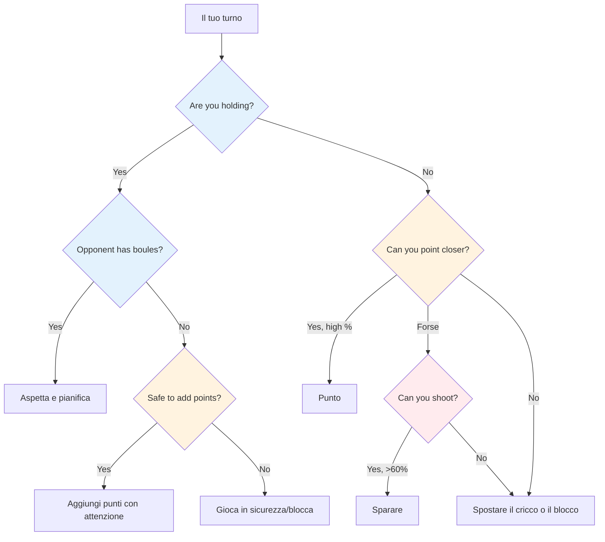

# Pensiero tattico nella boccia
<AdBanner />


A livello d&#39;élite, l&#39;abilità tecnica è un requisito fondamentale. Ciò che distingue i vincitori dagli altri è l&#39;intelligenza tattica: sapere quale tiro tentare e quando. I giocatori migliori leggono la partita con diverse mosse di anticipo e sfruttano ogni vantaggio.

::: tip Il principio fondamentale
**A livello d&#39;élite, la differenza raramente è la tecnica, ma la capacità decisionale.** Vince la squadra che commette meno errori tattici.
:::

## Quadro decisionale rapido



## La mentalità tattica

### Pensa in termini di probabilità

Ogni lancio ha una probabilità di successo. Una buona tattica significa scegliere lanci in cui:
- La probabilità di successo è sufficientemente alta
- La ricompensa giustifica il rischio
- Il fallimento non fa troppo male

**Esempio di decisione:**
- Tiro difficile: 40% di successo, guadagna 3 punti
- Punto sicuro: 80% di successo, guadagna 1 punto

Qual è la scelta migliore? Dipende dal punteggio, dalla situazione e dalla tua sicurezza.

### Considera tutte le opzioni

Prima di ogni lancio, considera:
1. **Punto:** Posiziona una boccia vicino al jack
2. **Tiro:** Rimuovi la boccia di un avversario
3. **Blocco:** Posiziona una boccia per ostacolare
4. **Spostare il cric:** Colpire intenzionalmente il cric
5. **Sacrificio:** Accettare una brutta posizione da impostare in seguito

Non affidarti alla scelta ovvia. Valuta le alternative.

### Leggi la situazione

Fattori da considerare:
- Punteggio attuale (chi è in vantaggio, di quanto)
- Bocce rimanenti (tue e loro)
- Posizione sul terreno
- Tendenze opposte
- I punti di forza del tuo team

## Principi tattici fondamentali

::: tip I 6 principi tattici
1. **Controlla il Jack** - La posizione è potenza
2. **Strategia di distanza e superficie** - Adattarsi alle condizioni
3. **Detta lo stile di gioco** - Forza i tuoi punti di forza
4. **Gestisci il rischio rispetto alla ricompensa** - Adatta il rischio alla situazione
5. **Usa le bocce con saggezza** - A volte concedi 1 per evitarne 3
6. **Pensa al futuro** - Visualizza le prossime 2-3 mosse
:::

### Principio 1: Controllare il Jack

La squadra che controlla la posizione del cricco ha un vantaggio significativo.

**Modi per controllare:**
- Vinci il diritto di lanciare il jack
- Spostare il cric su un terreno favorevole
- Proteggere il cric da eventuali spostamenti

**Strategia di posizionamento del jack:**
- Jack corto: favorisce il tiro, è più facile colpire i bersagli a distanza ravvicinata
- Jack lungo: favorisce la puntatura, il tiro diventa più difficile
- Ostacoli vicini: crea sfide per gli avversari

**Sfrutta le debolezze dell&#39;avversario:**
- Osserva la loro tecnica di puntamento: usano sempre lo stesso arco o stile?
- Se non riescono ad adattarsi (ad esempio, solo rotolare, solo lanciare), posizionare il jack per forzare lanci scomodi
- Posizionare il cric a distanze o posizioni che ne espongano i limiti
- Sfrutta una debolezza solo se non la condividi: considera prima i punti di forza del tuo team

### Principio 2: Strategia di distanza e superficie

L&#39;equilibrio ottimale tra puntamento e tiro dipende fortemente dalla distanza e dal terreno:

::: info Strategia della distanza
**Corto (6-7 m):** Favorisce il tiro: è più facile colpire a distanza ravvicinata
**Media (7-9 m):** La superficie è ciò che conta di più
- Superficie liscia → spara di più
- Superficie ruvida → punta di più

**Lungo (9-11 m):** Puntamento favorevole: la precisione del tiro diminuisce significativamente
:::

```mermaid
graph LR
    A[Distanza] --> B[6-7m Corto]
    A --> C[7-9m Medio]
    A --> D[9-11 m di lunghezza]

    B --> E[Spara di più]
    C --> F{Surface?}
    D --> G[Punta di più]

<AdInArticle />

    F -->|Smooth| H[Spara di più]
    F -->|Rough| I[Punta di più]

    style E fill:#ffcdd2
    style H fill:#ffcdd2
    style I fill:#c8e6c9
    style G fill:#c8e6c9
```

**La tua percentuale di tiri personale:**
- Se spari con una percentuale di successo del 75%+, spara più spesso
- Valutare la possibilità di tirare per ridurre i punti dell&#39;avversario (anche se non si è in vantaggio)
- Tirare per ridurre il punteggio delle bocce dell&#39;avversario (da 3 a 1) è un prezioso metodo per controllare i danni

**Sparare come strategia a lungo termine:**
- Se spari con tutte le tue bocce, considera il tuo tasso di successo cumulativo
- Calcola: quando colpisci tutti i tiri, guadagni molti più punti
- Anche sbagliare qualche tiro può ridurre i punti dell&#39;avversario
- Esempio: Manca 1-2 colpi ma rimuovi comunque le minacce, quindi ottieni un grande guadagno quando colpisci tutti
- Questo è un rischio calcolato: accetta alcune estremità perse per ottenere vittorie più grandi quando funziona

### Principio 3: Dettare lo stile di gioco

A livello d&#39;élite, la maggior parte dei giocatori sa sia puntare che tirare bene. La chiave è forzare il gioco nello stile più forte della propria squadra.

**Se la tua squadra ha tiratori forti:**
- Spara il più possibile - usa il tuo vantaggio
- Non sprecare la tua forza puntando quando puoi dominare sparando
- Controlla il gioco rimuovendo le minacce prima che si accumulino
- Il jack corto-medio mantiene efficace lo sparo

**Contro tiratori altrettanto forti:**
- Impedisci loro di diventare bersagli facili sparando per primi
- Giocare a lunga distanza per ridurre la percentuale di tiro di tutti
- La squadra che tira per prima spesso controlla la fine

**Se gli avversari ti superano nei tiri:**
- Gioca a lungo jack in modo coerente: anche i tiratori d&#39;élite calano la percentuale a 10m+
- Forza una battaglia di puntamento in cui puoi competere
- Fateli sparare da angoli difficili o attraverso ostacoli

### Principio 4: Gestire il rischio rispetto alla ricompensa

| Situazione | Tolleranza al rischio |
|-----------|---------------|
| Avanti comodamente | Basso - proteggi il tuo vantaggio |
| Chiudi il gioco | Medio - rischi calcolati |
| Significativamente indietro | Alto - bisogna correre dei rischi |
| Fine finale | Dipende dalla differenza di punteggio |

### Principio 5: Usa le tue bocce con saggezza

La gestione delle bocce distingue i giocatori d&#39;élite:
- Quando l&#39;avversario finisce le bocce, bisogna decidere attentamente: aggiungere punti o giocare sul sicuro?
- Quando sei in svantaggio, calcola se puoi realisticamente riprendere il punto
- A volte concedere 1 punto è meglio che sprecare bocce e concederne 3
- Tieni sempre traccia delle bocce rimanenti, tue e loro.

### Principio 6: Pensa a più mosse in anticipo

Pensiero d&#39;élite:
- Prima di lanciare, visualizza le prossime 2-3 bocce di entrambe le squadre
- Qual è la risposta migliore del tuo avversario se hai successo? E se fallisci?
- In che modo questo lancio prepara il tuo prossimo?
- Considera lo scenario finale dalla posizione attuale

## Situazioni tattiche comuni

### Stai tenendo la palla e l&#39;avversario ha ancora delle bocce

Devi aspettare: è il loro turno di lanciare. Usa questo tempo per:
- Analizza cosa è probabile che facciano
- Pianifica la tua risposta ai loro possibili lanci
- Rimani concentrato e pronto

### Stai tenendo e l&#39;avversario è senza bocce

Ora puoi giocare le bocce rimanenti. **Opzioni:**
- Aggiungi altri punti se puoi farlo in sicurezza
- Blocco per proteggere dal movimento del martinetto
- Gioca in sicurezza: non rischiare di trasformare una vittoria di 2 punti in una sconfitta

**Decisione chiave:** Vale la pena rischiare di aggiungere punti aprendo potenzialmente il gioco?

### Non stai trattenendo

Devi lanciare. **Opzioni:**
- Punta più vicino della loro migliore boccia
- Tirano la loro boccia migliore
- Sposta il jack sulle tue bocce
- Blocca per limitare il loro punteggio (se non puoi prendere il punto)

**Fattori decisionali:** La tua percentuale di tiri, il numero di bocce rimanenti (entrambe le squadre), il punteggio attuale

### Situazioni dell&#39;ultima boccia

Quando hai l&#39;ultima palla:
- Massima pressione ma anche massimo controllo
- Prenditi il tuo tempo: valuta tutte le opzioni
- Considera: puntare, sparare o spostare il cricco?
- Eseguire con pieno impegno

Quando l&#39;avversario ha l&#39;ultima boccia:
- Hai fatto quello che potevi: accetta il risultato
- Se possibile, crea una situazione in cui non ci sia una risposta facile per loro
- Più minacce sono meglio di una

## Leggere i tuoi avversari

A livello d&#39;élite, lo scouting è importante. Conosci i tuoi avversari prima di giocare.

### Intelligence pre-partita
- Qual è il loro stile di gioco preferito (squadra che spara contro squadra che punta)?
- Chi è il loro tiratore più forte? Il Pointer?
- Quali distanze preferiscono?
- Come si comportano sotto pressione nelle finali?

### Osservazione in partita
- Tieni traccia dei loro tassi di successo durante la partita
- Nota se qualcuno sta avendo una giornata no
- Identifica chi gestisce bene la pressione e chi no
- Regola il posizionamento del jack in base a ciò che osservi

### Sfrutta ciò che trovi
- Quando possibile, puntare ai giocatori più deboli
- Costringere il loro tiratore debole a sparare, o il loro puntatore debole a puntare
- Se qualcuno è in difficoltà, continua a fargli pressione

## In questa sezione

- **[Decisioni basate sulla probabilità](/it/educazione/tattiche/probabilità)** - Usare la matematica per fare scelte migliori

## Riepilogo: Tutte le regole tattiche

::: tip Regola n. 1: la regola della probabilità
**Scegli i lanci in cui la probabilità di successo giustifica il rischio.**
Considera: tasso di successo, ricompensa in caso di successo, costo in caso di fallimento
:::

::: tip Regola n. 2: la regola del controllo del jack
**La squadra che controlla la posizione del jack è avvantaggiata.**
Usa il posizionamento del jack per sfruttare i punti deboli dell&#39;avversario e favorire i tuoi punti di forza
:::

::: tip Regola n. 3: la regola della distanza
**La distanza corta favorisce il tiro, la distanza lunga favorisce la mira.**
Distanza media: la qualità della superficie determina l&#39;equilibrio
:::

::: tip Regola n. 4: la regola dello stile
**Imponi al gioco lo stile più forte della tua squadra.**
Se siete tiratori forti, tirate di più. Non sprecate il vostro vantaggio.
:::

::: tip Regola n. 5: La regola della gestione delle bocce
**A volte è meglio concedere 1 punto che rischiarne 3.**
Sappi quando tagliare le perdite e salvare le bocce per la prossima manche
:::

::: tip Regola n. 6: La regola del pensare in anticipo
**Visualizza le prossime 2-3 mosse di entrambe le squadre.**
Qual è la loro risposta migliore? Come si preannuncia il tuo prossimo lancio?
:::

::: tip Regola n. 7: La regola dello scouting
**Conosci i tuoi avversari prima di giocare.**
Tieni traccia delle loro preferenze, dei tassi di successo e delle risposte alla pressione
:::

## Conclusione chiave

> A livello d&#39;élite, la differenza raramente è la tecnica, ma la capacità decisionale. Vince la squadra che commette meno errori tattici.

Leggi il gioco. Conosci i tuoi punti di forza. Sfrutta i loro punti deboli. Agisci con sicurezza.

<AdBanner />
