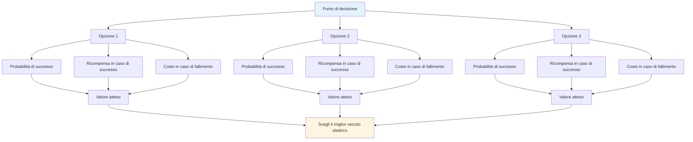

# Processo decisionale basato sulla probabilità

Il pensiero tattico d&#39;élite sfrutta la probabilità per prendere decisioni migliori. Invece di tirare a indovinare o seguire l&#39;istinto, si valutano sistematicamente le proprie opzioni.

::: tip La grande idea
**Pensa in termini di probabilità, non di certezze.** La decisione migliore non è sempre la più aggressiva o la più sicura: è quella che ti offre il miglior valore atteso in molte situazioni simili.
:::

## Il quadro di base

Ogni lancio ha tre componenti:

| Componente | Domanda | Esempio |
|-----------|----------|---------|
| **Probabilità di successo** | Quanto è probabile che io riesca a farlo? | Tasso di successo del 70% a questa distanza |
| **Ricompensa in caso di successo** | Cosa ci guadagno? | Vinci il punto, guadagna posizione |
| **Costo in caso di insuccesso** | Cosa perdo? | Dai un punto facile all&#39;avversario |

::: info La Formula
**Valore atteso = (Probabilità × Ricompensa) - ((1 - Probabilità) × Costo)**

Le buone decisioni massimizzano il valore atteso nel tempo.
:::

## Pensare in termini di probabilità

Quando si decide tra le opzioni, considerare:
- Qual è il mio tasso di successo realistico per ciascuna opzione?
- Cosa ci guadagno se funziona?
- Qual è il costo se fallisce?
- In che modo la situazione del gioco influenza la mia scelta?

L&#39;opzione migliore non è sempre la più aggressiva o la più sicura: è quella che offre il risultato migliore in molte situazioni simili.

## Conosci i tuoi numeri

Per utilizzare il pensiero probabilistico, è necessario conoscere i tassi di successo effettivi:

| Tipo di lancio | Distanza | Il tuo tasso di successo |
|------------|----------|-------------------|
| Punto (vicino) | 6-7 mesi | ___% |
| Punto (medio) | 8-9 mesi | ___% |
| Punto (lungo) | 10m+ | ___% |
| Spara (da vicino) | 6-7 mesi | ___% |
| Spara (media) | 8-9 mesi | ___% |
| Spara (lungo) | 10m+ | ___% |

Tieni traccia di questi risultati nella pratica. Sii onesto: la maggior parte dei giocatori sopravvaluta le proprie percentuali di successo.

## Adattamento alle condizioni

Le tariffe base variano in base a:

| Fattore | Effetto sul tasso di successo |
|--------|----------------------|
| Terreno sconosciuto | -10 a -20% |
| Situazione di pressione | -5 a -15% |
| Fatica | -5 a -10% |
| Fiducia (alta) | +5 a +10% |
| Successo recente | +5% |
| fallimento recente | -5 a -10% |

Siate realistici riguardo a questi adattamenti.

## Il principio del vantaggio di Boule

Quando hai più bocce rimanenti del tuo avversario:

**Priorità 1: proteggere il punto**
- Per prima cosa, assicurati di avere almeno un punto
- Non essere avido prima di aver assicurato le basi

**Priorità 2: Massimizzare i punti con un rischio calcolato**
- Una volta che sei in possesso, valuta se puoi aggiungere altri punti
- Ogni lancio aggiuntivo è una decisione rischio/ricompensa
- Non trasformare una vittoria sicura di 2 punti in una sconfitta esagerando

**Meno bocce rimanenti:** Devi far sì che ogni tiro conti. Le giocate sicure potrebbero non essere sufficienti: prendi in considerazione opzioni con ricompense più elevate per recuperare alla fine.

## Il principio &quot;Une Boule Devant&quot;.

Una boccia posta davanti al pallino (tra il pallino e l&#39;avversario) è estremamente preziosa:
- Blocca le linee di puntamento diretto
- Costringe gli avversari a girare intorno o sopra
- Può deviare le bocce in arrivo
- È una &quot;moneta&quot; che vale la pena proteggere

**Implicazione tattica:** A volte è meglio piazzare una boccia bloccante piuttosto che cercare di avvicinarsi il più possibile.

## Tolleranza al rischio per stato del gioco

### Con limite di tempo

Quando si gioca con un limite di tempo, la differenza di punteggio è importante:

| Situazione del punteggio | Approccio al rischio |
|-----------------|---------------|
| In vantaggio di 4+ | Molto conservativo: proteggere il vantaggio, far scorrere il tempo |
| In vantaggio per 1-3 | Conservatore - non regalare punti |
| Legato | Bilanciato - rischi calcolati |
| Dietro di 1-3 | Aggressivo - bisogno di guadagnare terreno |
| Dietro di 4+ | Molto aggressivo - bisogna correre dei rischi, il tempo stringe |

### Senza limiti di tempo

Quando non c&#39;è pressione di tempo:
- Mantieni il tuo piano di gioco: non cambiare strategia solo in base al punteggio
- Il punteggio oscillerà: fidati del tuo approccio
- Prendi in considerazione di cambiare il tuo piano di gioco solo se è chiaro che non funziona contro questo avversario
- I cambiamenti dovuti al panico quando si è indietro spesso peggiorano le cose

### Modifiche di fine partita

**Se vincere questa estremità significa vincere la partita:**
- Sii più conservatore
- Non rischiare di regalare più punti
- Un singolo punto potrebbe essere sufficiente

**Se si perde questa estremità si perde la partita:**
- Prendi rischi più grandi
- Bisogno di segnare più punti
- Il gioco sicuro non ti salverà

## Errori comuni di probabilità

### 1. Eccessiva sicurezza
&quot;Posso fare quel tiro&quot;, ma riesci a farlo 7 volte su 10? Sii onesto.

### 2. Ignorare i tassi di base
La tua percentuale di tiro non cambia perché il momento è importante.

### 3. Fallacia dei costi irrecuperabili
&quot;Ho già sbagliato due volte, dovrei continuare a tirare&quot; - ogni tiro è indipendente.

### 4. Distorsione del risultato
Un tiro rischioso che ha funzionato era comunque rischioso. Una giocata sicura che ha fallito era comunque corretta.

### 5. Ignorare le opzioni dell&#39;avversario
Considera cosa faranno dopo il tuo lancio, che abbia successo o meno.

## Applicazione pratica

### Prima di ogni lancio

1. **Identifica le opzioni** (punta, spara, blocca, ecc.)
2. **Stima la probabilità di successo** per ogni
3. **Considera i risultati** (successo e fallimento)
4. **Fattore sullo stato del gioco** (punteggio, bocce rimanenti)
5. **Scegli** l&#39;opzione con il miglior valore atteso
6. **Impegno completo** - nessuna incertezza durante l&#39;esecuzione

### Costruire l&#39;intuizione

Col tempo, il pensiero probabilistico diventa intuitivo:
- Tieni traccia dei tuoi risultati onestamente
- Rivedere le decisioni dopo le partite
- Nota i modelli nei tuoi tassi di successo
- Adatta il tuo modello mentale

## Conclusione chiave

> Le buone decisioni non sempre portano a buoni risultati. Ma col tempo, le buone decisioni portano a risultati migliori.

Pensa in termini di probabilità. Conosci i tuoi numeri. Fai la mossa intelligente, non quella ottimistica.

