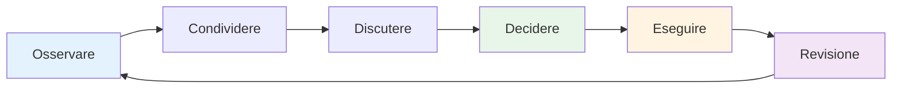

# Comunicazione di squadra
<AdBanner />

Una comunicazione efficace è ciò che trasforma un gruppo di individui in una squadra. Nel gioco delle bocce, dove la strategia cambia costantemente e la pressione è alta, il modo in cui si comunica può determinare il risultato.

::: tip La grande idea
**La comunicazione è ciò che trasforma gli individui in una squadra.** Una comunicazione chiara, specifica e di supporto sotto pressione distingue i buoni team da quelli eccellenti.
:::

## Il ciclo della comunicazione

Una buona comunicazione di squadra segue un ciclo:

| Fare un passo | Azione | Esempio |
|------|--------|---------|
| **Osservare** | Nota cosa sta succedendo | Terreno, posizioni, avversari |
| **Condividere** | Racconta ai compagni di squadra cosa vedi | &quot;Il terreno pende lì&quot; |
| **Discutere** | Scambio di prospettive | &quot;Devo bloccare o andare a segno?&quot; |
| **Decidere** | Concordare l&#39;approccio | &quot;Proviamo il lob alto&quot; |
| **Eseguire** | Fallo con impegno | Concentrazione completa sul lancio |
| **Revisione** | Impara dai risultati | &quot;Ha funzionato bene&quot; oppure &quot;La prossima volta...&quot; |

## Quando comunicare

### Prima di ogni fine
- Valutare insieme il terreno
- Discutere l&#39;approccio generale
- Chiarire chi lancia e quando
- Imposta il tono (calmo, concentrato)

### Durante la fine
- Condividi le osservazioni (&quot;Il terreno è rimasto lì in pendenza&quot;)
- Coordinare la strategia (&quot;Devo provare a bloccare o andare al punto?&quot;)
- Offri supporto (&quot;Prenditi il tuo tempo, ce la puoi fare&quot;)
- Adattare i piani in base ai cambiamenti della situazione

### Tra le estremità
- Breve debriefing (cosa ha funzionato e cosa no)
- Ripristina mentalmente
- Preparati per la prossima fine
- Rimani connesso come una squadra

### Dopo la partita
- Debriefing completo (quando appropriato)
- Riconosci i contributi
- Identificare gli apprendimenti
- Mantenere la relazione

## Come comunicare

### Sii chiaro e specifico

**Vago:** &quot;Cerca di avvicinarti&quot;
**Chiaro:** &quot;Mira al lato sinistro del cric, a circa 20 cm di distanza&quot;

**Vago:** &quot;Bel tentativo&quot;
**Clear:** &quot;Buon peso, solo un po&#39; a sinistra della linea&quot;

### Sii costruttivo

Concentratevi sulle soluzioni, non sui problemi:

**Incentrato sul problema:** &quot;Continui a sbagliare direzione a destra&quot;
**Incentrato sulla soluzione:** &quot;Forse potresti provare a mirare un po&#39; più a sinistra per compensare?&quot;

### Sii di supporto

Il tono è importante tanto quanto le parole:
- Mantieni la calma, anche quando sei frustrato
- Usa un linguaggio del corpo incoraggiante
- Riconoscere lo sforzo, non solo i risultati
- Costruisci, non demolire

### Ascoltare attivamente

La comunicazione è bidirezionale:
- Prestare la massima attenzione quando parlano i compagni di squadra
- Fai domande di chiarimento
- Riconosci ciò che hai sentito
- Non interrompere o ignorare

<AdInArticle />

## Sfide di comunicazione

### Disaccordo sulla strategia

**Approccio scadente:**
- Insisti sulla tua strada
- Mettiti sulla difensiva
- Cedere con risentimento
- Discutere durante il gioco

**Approccio migliore:**
1. Condividi chiaramente la tua prospettiva
2. Ascoltate attentamente i loro
3. Discutere brevemente i pro e i contro
4. Decidere insieme (o delegare al leader designato)
5. Impegnarsi pienamente nella decisione
6. Recensione dopo la partita

### Dopo l&#39;errore di un compagno di squadra

**Di cosa hanno bisogno:**
- Riconoscimento rapido
- Permesso di andare avanti
- La sicurezza che ti fidi ancora di loro
- Concentrati sul prossimo lancio

**Cosa dire:**
- &quot;Nessun problema, il prossimo&quot;
- &quot;Brutta sorpresa, ora tocca a te&quot;
- &quot;Siamo ancora dentro&quot;
- *A volte basta un cenno o una pacca*

**Cosa NON dire:**
- Niente (il silenzio sembra un giudizio)
- &quot;Va bene&quot; (può sembrare sprezzante)
- Tutto ciò che è andato storto (non ora)
- Frustrazione visibile (il linguaggio del corpo conta)

### Quando commetti un errore

**Cosa fare:**
- Breve riconoscimento (&quot;Colpa mia&quot;)
- Non scusarti troppo
- Non cercare scuse
- Ripristina e concentrati sul prossimo lancio
- Fidati dei tuoi compagni di squadra per farti supportare

### Tensione nella squadra

Se durante una partita la tensione aumenta:
1. Riconosci che sta accadendo
2. Fai un respiro prima di rispondere
3. Concentrati sul gioco, non sul conflitto
4. Affrontalo correttamente dopo la partita
5. Non lasciare che influenzi il tuo gioco

## Comunicazione non verbale

Gran parte della comunicazione di squadra è non verbale:

### Segnali positivi
- Contatto visivo
- Annuendo
- Pollice su
- Postura rilassata
- Muovendosi verso i compagni di squadra
- Sorridere (quando appropriato)

### Segnali negativi (da evitare)
- Occhi al cielo
- voltarsi
- braccia incrociate
- Sospirando
- Scuotendo la testa
- Linguaggio del corpo teso

**Ricorda:** I tuoi compagni di squadra vedono tutto. Il tuo linguaggio del corpo influenza la loro sicurezza e le loro prestazioni.

## Costruire abitudini comunicative

### Praticare la comunicazione

Non aspettare che sia la concorrenza a comunicare:
- Praticare discussioni strategiche durante la formazione
- Fornitevi feedback regolarmente
- Sviluppa il linguaggio del tuo team
- Costruisci conforto con una conversazione onesta

### Sviluppare segnali di squadra

Alcuni team sviluppano delle abbreviazioni:
- Segnali manuali per la strategia
- Parole in codice per le situazioni
- Frasi rapide con significato condiviso

### Check-in regolari

Fuori dai giochi:
- Come stiamo lavorando insieme?
- Cosa sta andando bene?
- Cosa potrebbe esserci di meglio?
- Ci sono problemi da risolvere?

## Il ruolo del capitano

Se il tuo team ha un leader designato:

**Responsabilità del capitano:**
- Decisione finale quando la squadra non è d&#39;accordo
- Dare il tono e l&#39;energia
- Gestire le dinamiche di squadra
- Mantenere la concentrazione durante la pressione

**Tutti gli altri:**
- Condividi la tua prospettiva
- Sostieni la decisione una volta presa
- Aiuta a mantenere l&#39;energia del team
- Assumiti la responsabilità del tuo ruolo

## Conclusione chiave

> I grandi team parlano tra loro, non l&#39;uno dell&#39;altro. Comunicano con onestà, rispetto e un impegno condiviso per il successo.

Esercitati a comunicare come ti eserciti a lanciare. È un&#39;abilità che migliora con l&#39;attenzione.

<AdBanner />
