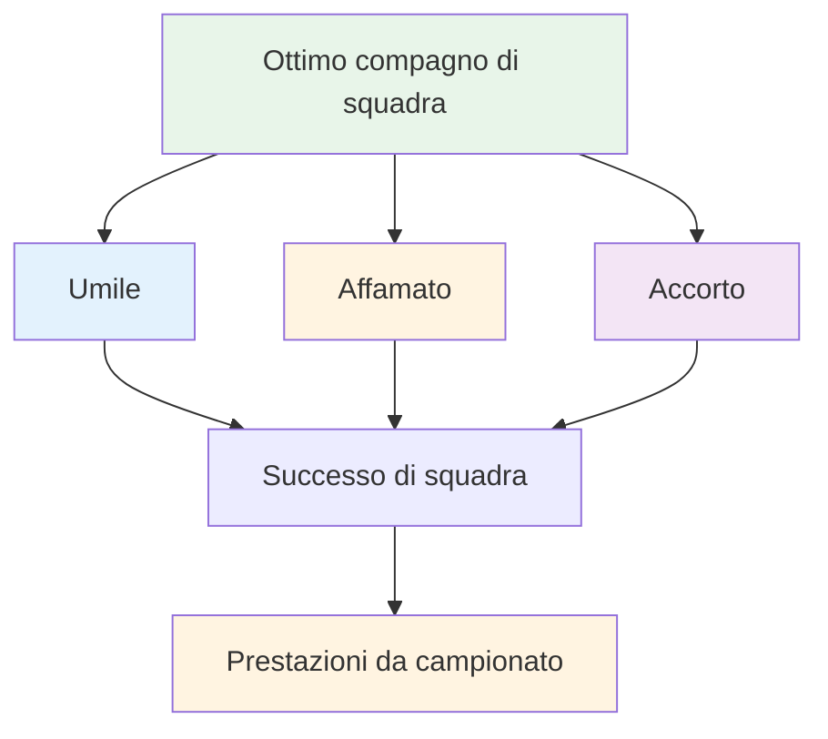

# Essere un grande giocatore di squadra

La boccia si gioca spesso a squadre: in doppio (doublettes) o in triplo (triplettes). Le abilità individuali contano, ma le dinamiche di squadra possono fare la differenza. Le squadre migliori non sono sempre quelle più abili: sono quelle che lavorano meglio insieme.

::: tip La grande idea
**I team migliori non sono sempre quelli più abili: sono quelli che lavorano meglio insieme.** Essere umili, affamati ed emotivamente intelligenti ti rende un ottimo compagno di squadra.
:::

## Cosa rende un compagno di squadra eccezionale?

La ricerca e l&#39;esperienza evidenziano tre qualità fondamentali:

### 1. Umile
- Dà priorità al successo della squadra rispetto alla gloria personale
- Riconosce i contributi degli altri
- Ammette gli errori senza scuse
- Aperto al feedback e all&#39;apprendimento
- Non deve essere la star

### 2. Affamato
- Auto-motivato e determinato
- Fa il lavoro senza che gli venga chiesto
- Sempre alla ricerca di migliorare
- Porta energia alla squadra
- Non si affida al talento

### 3. Intelligente (emotivamente)
- Legge bene le situazioni e le persone
- Sa quando parlare e quando ascoltare
- Gestisce le proprie emozioni
- Supporta i compagni di squadra in modo appropriato
- Gestisce i conflitti in modo costruttivo

## Le basi del successo di squadra

### Obiettivi e visione condivisi

Le squadre forti hanno:
- Obiettivi chiari e concordati
- Obiettivi individuali allineati con gli obiettivi di squadra
- Comprensione condivisa di cosa significhi il successo
- Impegno per la missione collettiva

**Domande da discutere con il tuo team:**
- Cosa stiamo cercando di realizzare insieme?
- Come si manifesta il successo per noi?
- In che modo i nostri obiettivi individuali supportano il team?

### Comunicazione efficace

La comunicazione è la linfa vitale delle prestazioni di squadra.

**Buona comunicazione di squadra:**
- Aperto e onesto
- Rispettoso, anche nel disaccordo
- Chiaro e specifico
- Bidirezionale (parlare E ascoltare)
- Tempestivo (informazioni giuste al momento giusto)

**Durante le partite:**
- Discutere la strategia prima di ogni fine
- Condividi osservazioni sul terreno, sugli avversari
- Coordinare chi lancia quando
- Sostenetevi a vicenda dopo i lanci (buoni o cattivi)

### Fiducia e rispetto

Senza fiducia, i team si disgregano sotto pressione.

**Creare fiducia:**
- Sii affidabile (fai quello che dici)
- Sii competente (fai bene il tuo lavoro)
- Sii onesto (anche quando è difficile)
- Mostrare vulnerabilità (ammettere le difficoltà)
- Supportare gli altri in modo coerente

**Mostrare rispetto:**
- Valorizzare il contributo di ogni persona
- Ascolta diverse prospettive
- Riconoscere lo sforzo, non solo i risultati
- Considerare importante il ruolo di tutti

### Ruoli chiari

Tutti dovrebbero capire:
- Le loro responsabilità principali
- Come contribuiscono alla squadra
- Ciò per cui gli altri contano su di loro
- Quando fare un passo avanti e quando fare un passo indietro

**In triplette:**
| Ruolo | Focus primario | Qualità chiave |
|------|--------------|---------------|
| Puntatore | Posizionare le bocce vicino al jack | Precisione, coerenza |
| Mezzo | Adattarsi alla situazione | Versatilità, gioco di lettura |
| Tiratore | Rimuovi le bocce dell&#39;avversario | Precisione sotto pressione |

I ruoli possono essere flessibili, ma la chiarezza aiuta.

## Dinamiche di squadra durante la competizione

### Prima della partita
- Arrivare insieme, riscaldarsi insieme
- Discutere la strategia generale
- Imposta il tono (positivo, concentrato)
- Controlla come si sente ognuno

### Durante il gioco
- Comunicare tra le estremità
- Rimani positivo indipendentemente dal punteggio
- Sostenersi a vicenda dopo gli errori
- Festeggiamo insieme i successi (brevemente)
- Concentrati sul processo, non sul risultato

### Dopo gli errori
Cosa NON fare:
- Mostrare visibilmente la frustrazione
- Criticare o incolpare
- Ritirarsi o tacere
- Soffermati su ciò che è successo

Cosa fare:
- Riconoscimento rapido (&quot;nessun problema&quot;)
- Sposta l&#39;attenzione sul lancio successivo
- Mantenere un linguaggio del corpo positivo
- Fidati del tuo compagno di squadra per riprendersi

### Dopo la partita
- Fare un debriefing insieme (cosa ha funzionato, cosa no)
- Riconoscere i contributi individuali
- Discutere i miglioramenti per la prossima volta
- Mantenere le relazioni indipendentemente dal risultato

## Modelli di comunicazione

### Feedback costruttivo
**Povero:** &quot;Continui a sbagliare quei tiri&quot;
**Meglio:** &quot;Ho notato che i tiri vanno verso sinistra: vuoi provare a modificare la tua posizione?&quot;

### Risposta di supporto agli errori
**Scarso:** *Silenzio o frustrazione visibile*
**Meglio:** &quot;Difficile. Hai già la prossima.&quot;

### Discussione strategica
**Povero:** &quot;Spara e basta&quot;
**Meglio:** &quot;Cosa ne pensi: puntare per bloccare o provare a tirare? Vedo pro e contro in entrambi i casi.&quot;

## Costruire una cultura di squadra

I grandi team sviluppano in modo condiviso:
- **Valori:** Ciò che rappresentiamo
- **Norme:** Come ci comportiamo
- **Lingua:** Come comunichiamo
- **Rituali:** Cosa facciamo insieme

**Esempi:**
- Stringetevi sempre la mano prima e dopo
- Frasi di incoraggiamento specifiche
- Routine pre-partita insieme
- Pasto o bevanda dopo la partita

## In questa sezione

- **[Comunicazione di squadra](/it/education/team-player/communication)** - Guida dettagliata per comunicare in modo efficace

## Conclusione chiave

> La forza della tua squadra è data solo dalla sua relazione più debole, non dal suo giocatore più debole.

Investi nei tuoi compagni di squadra. Costruisci fiducia. Comunica bene. Vinci insieme.

