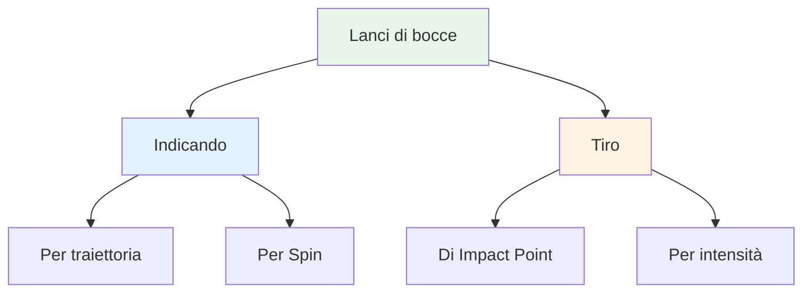
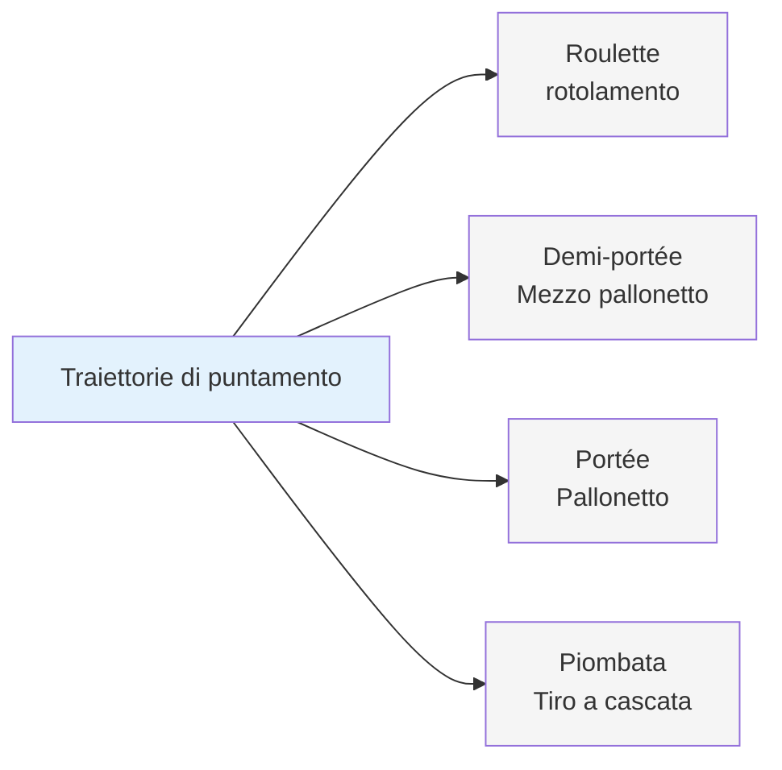
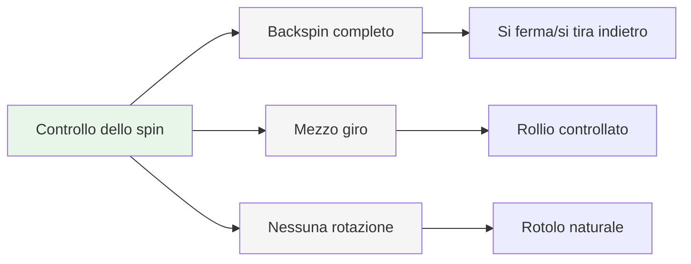
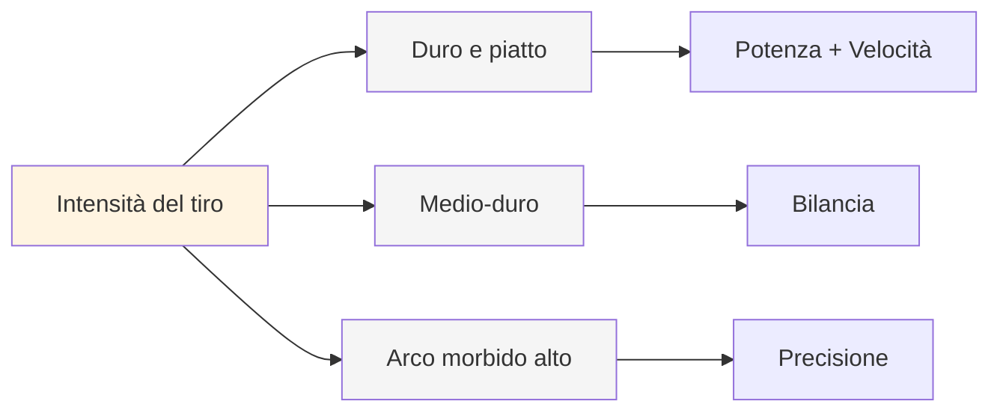
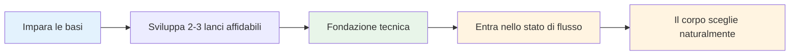

# Palette di lanci

## Il repertorio tecnico completo

Questa è una panoramica dei lanci disponibili nella pétanque. Non è necessario padroneggiarli tutti, ma sapere quali esistono aiuta a comprendere appieno la portata del gioco.

::: tip Il quadro generale
**Conoscere l&#39;intera tavolozza ti aiuta a fare scelte consapevoli su cosa sviluppare.** Non devi padroneggiare tutto: concentrati su ciò che funziona per il tuo gioco.
:::

## Tecniche di puntamento

### Per traiettoria

| Gettare | termine francese | Traiettoria | Quando usare |
|-------|-------------|------------|-------------|
| **Rotolamento** | Roulette | Basso, rotola per la maggior parte del percorso | Terreno liscio, breve distanza |
| **Mezzo pallonetto** | Demi-portée | Medio, atterra a metà strada | Il più comune, versatile |
| **Pallonetto** | Portée | Alto, atterra vicino al bersaglio | Ostacoli, terreno accidentato |
| **Tiro a cascata** | Piombata | Molto alto, scende verticalmente | Spazi ristretti, posizionamento di precisione |

### Per Spin

| Tipo di rotazione | Effetto sull&#39;atterraggio | Quando usare |
|-----------|-------------------|-------------|
| **Gioco completo (backspin)** | Si ferma o tira indietro all&#39;atterraggio | Bisogna fermarsi velocemente, evitare di passare oltre |
| **Mezzo giro** | Backspin moderato, rollio controllato | Il più versatile, prevedibile |
| **Nessuna rotazione** | Rotolamento neutro e naturale all&#39;atterraggio | Lascia che sia il terreno a dettare il rollio |

## Tecniche di tiro

### Di Impact Point

```mermaid
graph TD
    A[Metodi di ripresa] --> B[Al ferro <br/> Pallini di ferro]
    A --> C[Avanti <br/> Davanti]
    A --> D[Saltare in padella <br/> Tiro in sospensione]

    B --> E[Colpo diretto]
    C --> F[Atterrare prima dell&#39;obiettivo]
    D --> G[Rimbalzare sul bersaglio]

    style A fill:#fff4e1
    style B fill:#f5f5f5
    style C fill:#f5f5f5
    style D fill:#f5f5f5
```

| Tecnica | termine francese | Punto di impatto | Caratteristiche |
|-----------|-------------|--------------|-----------------|
| **Colpo di ferro** | Al ferro | Colpo diretto sulla boccia | Contatto pulito più comune |
| **Davanti** | Avanti | Atterraggio appena prima del bersaglio | Più sicuro, richiede meno precisione |
| **Tiro in sospensione** | Saltare in padella | Rimbalzare nel bersaglio | Avanzato, per ostacoli |

### Per intensità

| Intensità | Traiettoria | Quando usare |
|-----------|------------|-------------|
| **Tiro duro e piatto** | Diretto, potente, piatto | Linea libera, serve distanza al colpo |
| **Mediamente dura** | Potenza e controllo bilanciati | Il più versatile |
| **Morbido con arco alto** | Tiro a pallonetto, cade dall&#39;alto | Ostacoli, spazi ristretti |

## La tavolozza completa

::: details Riferimento rapido: tutti i lanci
**Indicando:**
- Roulette (rotolamento)
- Demi-portée (mezzo pallonetto)
- Portée (pallone)
- Plombée (tiro a cascata)
- Rotazione completa / Mezza rotazione / Nessuna rotazione

**Tiro:**
- Au fer (pallino di ferro)
- Devant (davanti)
- Sautée (tiro in sospensione)
- Arco rigido piatto / medio / morbido alto
:::

## Percorso di padronanza

::: tip Ricordare
**L&#39;obiettivo non è padroneggiare tutto.** L&#39;obiettivo è avere una base tecnica sufficiente per poter entrare nella zona e lasciare che il corpo scelga naturalmente il lancio giusto.

Concentrarsi su:
1. **2-3 tecniche di puntamento** su cui puoi contare
2. **1-2 metodi di ripresa** che funzionano per te
3. **Esecuzione coerente** sotto pressione
4. **Gioco mentale** per accedere allo stato di flusso
:::

::: info Prossimi passi
Una volta acquisita una tecnica solida, la vera crescita deriva da:
- **[The Zone](/it/education/mental-game/the-zone/)** - Accedere agli stati di flusso in modo coerente
- **[Metodi di allenamento](/it/educazione/tecnica/allenamento/)** - Come esercitarsi in modo efficace
- **[Forza mentale](/it/educazione/gioco-mentale/forza-mentale/)** - Rendimento sotto pressione
:::

