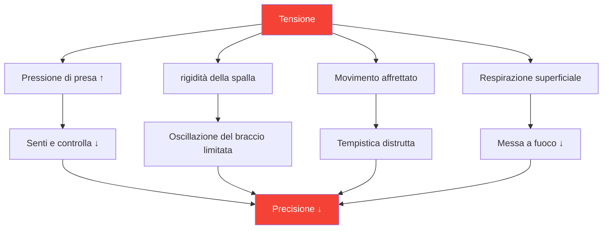

# Capire la tensione negli sport di precisione

::: tip La tensione è il nemico della precisione
**Peso: 300 punti** — Non puoi essere teso e preciso allo stesso tempo. Imparare a gestire la tensione è essenziale per prestazioni costanti.
:::

## Il paradosso della precisione

> &quot;Più ti impegni, peggiori saranno i risultati.&quot;

Non si tratta di debolezza, ma di fisica e fisiologia. La pétanque richiede movimenti rilassati e fluidi. La tensione distrugge le qualità che producono lanci precisi.

### Come la tensione distrugge la precisione



---

## Tensione fisica vs. mentale

La tensione esiste in due forme connesse:

### Tensione fisica

Tensione muscolare che influisce direttamente sul lancio:

| Zona | Effetto sul lancio |
|------|-----------------|
| **Presa** | Perdita di sensibilità, rilascio incoerente |
| **Avambraccio** | Movimento limitato del polso |
| **Spalla** | Oscillazione del braccio accorciata e irregolare |
| **Collo** | Posizione della testa limitata, visione |
| **Mascella** | Collegato alla tensione generale del corpo |
| **Nucleo** | Problemi di equilibrio e trasferimento del peso |

### Tensione mentale

Stress psicologico che crea sintomi fisici:

- Pensieri che corrono
- Preoccuparsi dei risultati
- Paura del fallimento
- Consapevolezza della pressione
- Errori passati che si ripetono

::: warning Il ciclo di tensione
Tensione mentale → Tensione fisica → Scarsa prestazione → Maggiore tensione mentale

Per un gioco coerente è essenziale interrompere questo circolo vizioso.
:::

---

## La legge Yerkes-Dodson

La relazione tra eccitazione (livello di attivazione) e prestazione segue una curva a U rovesciata:

```
Performance
    ↑
    │         ★ Optimal Zone
    │        /\
    │       /  \
    │      /    \
    │     /      \
    │    /        \
    │   /          \
    └──┴────────────┴──→ Arousal
     Low           High

   "Flat"   "Alert"   "Tense"
   Unfocused Relaxed  Anxious
```

### Troppo basso (sottoeccitato)
- Piatto, sfocato
- Errori di distrazione
- Mancanza di intensità
- Andare avanti per inerzia

### Troppo alto (eccessiva eccitazione)
- Teso, affrettato
- Troppi pensieri
- Presa stretta, movimento limitato
- Non riesco a riprendermi dagli errori

### Zona ottimale
- Vigile ma rilassato
- Concentrato ma fluido
- Intensità appropriata
- Recupero rapido

---

## Trovare la TUA zona ottimale

Ogni giocatore ha un diverso livello di eccitazione ottimale:

### Il processo di autovalutazione

1. **Ricorda le tue migliori performance**
   - Come ti sentivi fisicamente?
   - Qual era il tuo livello di energia?
   - Come valuteresti la tua eccitazione (da 1 a 10)?

2. **Ricorda le tue peggiori performance**
   - Eri troppo piatto o troppo teso?
   - Quali sintomi fisici hai notato?
   - Cosa ha innescato lo stato subottimale?

3. **Identifica il tuo schema**
   - Tendi a essere troppo eccitato o troppo poco eccitato?
   - Quali situazioni innescano il tuo schema?
   - Cosa ti aiuta a tornare alla situazione ottimale?

### Profili comuni dei giocatori

| Profilo | Tendenza | Situazioni di rischio | Strategia |
|---------|----------|-----------------|----------|
| **Il preoccupato** | Eccitazione eccessiva | Puntate alte, partite serrate | Tecniche di rilassamento |
| **Il Flat-liner** | Sottoeccitazione | Round iniziali a bassa posta in gioco | Tecniche di attivazione |
| **Il reattore** | Variabile | Dopo gli errori, lo slancio cambia | Regolazione emotiva |
| **L&#39;inseguitore** | Eccitazione eccessiva quando si è dietro | Rimonte, pressione del tempo | Tecniche di accettazione |

---

## Riconoscere i segnali di tensione

### Segnali di avvertimento fisici

Impara a notare questi fattori prima che influiscano sul tuo lancio:

| Segnale | Posizione | Azione |
|--------|----------|--------|
| **Presa stretta** | Mano | Ammorbidire prima di ogni lancio |
| **Spalle alzate** | parte superiore della schiena | Lascia cadere e rotola |
| **Mascella serrata** | Viso | Aprire leggermente la bocca |
| **Respiro superficiale** | Petto | Respiro profondo della pancia |
| **Movimento affrettato** | Tutto il corpo | Rallenta deliberatamente |
| **Agitazione irrequieta** | Generale | Mettiti a terra |

### Segnali di allarme mentali

- Pensieri che corrono
- Aumento del dialogo interiore negativo
- Concentrati sul risultato, non sul processo
- Consapevolezza della posta in gioco/punteggio
- Pensare agli errori del passato

---

## Autoverifica delle prestazioni di tensione

Utilizza questa rapida valutazione tra un lancio e l&#39;altro o durante le pause:

**Scansione fisica (5 secondi):**
1. Impugnatura → Morbida?
2. Spalle → Giù?
3. Mascella → Non serrata?
4. Respirazione → Lenta e profonda?

**Scansione mentale (5 secondi):**
1. Pensieri → Focalizzati sul presente?
2. Energia → Autonomia ottimale?
3. Azione successiva → Cancellare?

::: tip Rendila un&#39;abitudine
I giocatori migliori lo fanno automaticamente. Puoi allenarti a fare lo stesso attraverso la ripetizione.
:::

---

## In questo modulo

### [Tecniche di rilascio della tensione](/it/educazione/tensione/tecniche)
- Rilassamento muscolare progressivo (PMR)
- Tecniche di rilascio rapido per la competizione
- Protocolli di respirazione
- Ripristino della tensione pre-lancio

### [Gestire la tensione in competizione](/it/educazione/tensione/competizione)
- Preparazione pre-partita
- Protocolli durante la partita
- Recupero d&#39;urgenza &quot;troppo teso&quot;
- Recupero post-errore

---

## Vittoria rapida: il reset in 10 secondi

Prima del lancio successivo, usa questo rapido protocollo:

1. **Spalle** — Abbassale consapevolmente
2. **Presa** — Alleggeriscila del 20%
3. **Mascella** — Allenta la presa, stacca la lingua dal palato
4. **Respiro** — Un&#39;espirazione lenta e completa

Ci vogliono 10 secondi e puoi migliorare immediatamente il tuo lancio successivo.

---

## Fattori correlati

- [Forza mentale](/it/educazione/gioco-mentale/forza-mentale/) — Gestire la pressione
- [Sonno e recupero](/it/educazione/sonno/) — Il riposo riduce la tensione basale
- [Mindfulness](/it/educazione/gioco-mentale/mindfulness/) — Consapevolezza del momento presente
- [La Zona](/it/educazione/gioco-mentale/la-zona/) — Stato di prestazione ottimale

