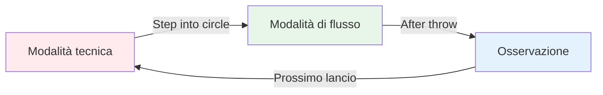
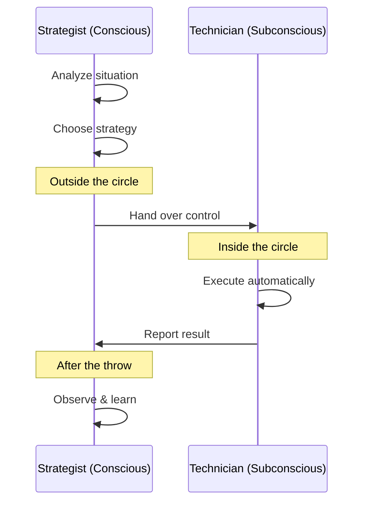

# La zona: comprendere lo stato di flusso
<AdBanner />

Hai mai giocato una partita in cui tutto è andato a posto? In cui non hai pensato alla tecnica e ogni boccia è atterrata esattamente dove volevi? Questa è &quot;la zona&quot; - e imparare ad accedervi con costanza è ciò che distingue i giocatori d&#39;élite dagli altri.

::: tip La grande idea
**Lo stato di flusso è quando il tuo cervello analitico si calma e i tuoi istinti addestrati prendono il sopravvento.** Non puoi pensare per entrare nella zona: devi lasciarti andare.
:::

## Cos&#39;è la Zona?

La zona, chiamata anche &quot;stato di flusso&quot;, è uno stato mentale in cui ci si immerge completamente in ciò che si sta facendo. Il tempo sembra rallentare. I movimenti sembrano naturali. Non si pensa alla tecnica, si *agisce* e basta.

Gli scienziati chiamano questo stato **ipofrontalità transitoria**. In parole povere, la parte analitica del cervello (la corteccia prefrontale) si placa, lasciando che gli istinti allenati prendano il sopravvento.

### Le due modalità cerebrali

**Modalità tecnica (pianificazione):**
- Analizzare la situazione
- Scegli la tua strategia
- Decidi quale lancio fare

**Modalità di flusso (esecuzione):**
- Fidati del tuo allenamento
- Concentrati solo sul bersaglio
- Lascia che il tuo corpo esegua automaticamente

**Osservazione (Apprendimento):**
- Nota il risultato senza giudizio
- Impara da ciò che è successo
- Ripristina per il prossimo lancio

## Il paradosso della boccia

Ecco la sfida: la pétanque ti dà molto tempo per pensare tra un lancio e l&#39;altro. A differenza degli sport veloci in cui si reagisce all&#39;istante, hai il tempo di raggiungere il cerchio, valutare la situazione e preparare il lancio.

Questo &quot;tempo per pensare&quot; è allo stesso tempo un dono e una maledizione:
- **Regalo:** Puoi pianificare strategie e prendere decisioni intelligenti
- **Maledizione:** Puoi pensare troppo e interferire con la tua capacità naturale

Il giocatore d&#39;élite impara a usare questo tempo saggiamente: riflettendo durante la pianificazione, poi &quot;staccandosi&quot; durante l&#39;esecuzione.

## Due modalità di gioco

Il tuo cervello funziona in due modalità diverse:

| Caratteristica | Modalità tecnica | Modalità di flusso |
|---------|---------------|-----------|
| **Quando usare** | Formazione, apprendimento di nuove competenze | Concorrenza, esecuzione |
| **Attività cerebrale** | Pensiero altamente analitico | Silenzioso, automatico |
| **Messa a fuoco** | Interno (meccanica del corpo) | Esterno (bersaglio) |
| **Sensazione** | Impegnativo, consapevole | Senza sforzo, naturale |

<AdInArticle />

L&#39;abilità fondamentale è imparare a **passare** da una modalità all&#39;altra al momento giusto.

## Il momento dello &quot;scambio&quot;

::: warning La regola dello scambio
**Prima del cerchio:** Analizza, elabora una strategia, decidi quale lancio fare
**Nel cerchio:** Lascia andare l&#39;analisi, fidati del tuo allenamento, concentrati solo sull&#39;obiettivo
**Dopo il lancio:** Osserva il risultato senza giudizio
:::

La transizione avviene quando si entra nel cerchio. Questa è l&#39;abilità più importante nella pétanque d&#39;élite.

Pensatela in questo modo: la vostra mente cosciente è lo **stratega** che elabora il piano, e la vostra mente subconscia è il **tecnico** che lo esegue. Lo stratega deve fare un passo indietro e lasciare che il tecnico lavori.

## Perché pensare troppo uccide le prestazioni

Quando monitori consapevolmente i tuoi movimenti durante l&#39;esecuzione, interrompi i processi automatici che hai addestrato. Questo si chiama &quot;soffocamento&quot; e capita a tutti.

::: danger Segnali che stai pensando troppo
- ❌ Pensare alla posizione del braccio a metà lancio
- ❌ Preoccuparsi del risultato prima di rilasciare
- ❌ Sentirsi tesi o meccanici
- ❌ Mettere in dubbio se stessi nel cerchio
:::

::: tip La soluzione
La soluzione non è pensare *meno*, ma pensare alle **cose giuste** al **momento giusto**.

✅ **Pensiero corretto:** &quot;Vedo chiaramente l&#39;obiettivo&quot;
❌ **Pensiero sbagliato:** &quot;Tenere il gomito dritto&quot;
:::

## In questa sezione

Scopri come padroneggiare la zona:

- **[Allenamento tecnico vs. flusso](/it/education/the-zone/tecnico-vs-flusso)** - Capire quando concentrarsi sulla tecnica e quando lasciar perdere
- **[Entrare nella zona](/it/educazione/la-zona/entrare-nella-zona)** - Tecniche pratiche per accedere allo stato di flusso

## Riepilogo: Le regole della zona

::: tip Regola n. 1: la regola dello scambio
**Analizza prima del cerchio, esegui nel cerchio, osserva dopo.**
La tua mente cosciente pianifica, il tuo subconscio esegue.
:::

::: tip Regola n. 2: la regola dell&#39;inversione
**Con l&#39;aumentare delle competenze, l&#39;allenamento mentale diventa più importante di quello tecnico.**
Principianti: 90% tecnico / 10% mentale
Esperti: 20% tecnici / 80% mentali
:::

::: tip Regola n. 3: La regola della fiducia
**Non puoi pensare per ottenere un&#39;esecuzione perfetta.**
Fidati del tuo allenamento. Concentrati sul bersaglio, non sulla tecnica.
:::

## Conclusione chiave

> Non esistono tecniche che producano sempre una boccia perfetta. Ma esiste uno stato mentale in cui le bocce perfette diventano naturali.

La tua tecnica è la base. La zona è il luogo in cui quella base diventa arte.

<AdBanner />
