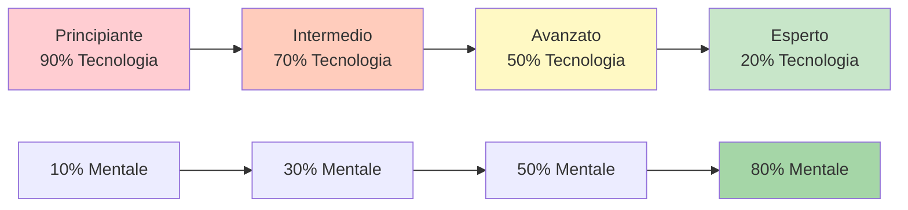

# Formazione tecnica vs. formazione di flusso

Comprendere la differenza tra allenamento tecnico e allenamento di flusso è essenziale per lo sviluppo di atleti d&#39;élite. Entrambi sono necessari, ma servono a scopi diversi e richiedono approcci diversi.

::: tip Il principio fondamentale
**Non puoi addestrare un principiante come un esperto** (mancano i percorsi neurali) e **non puoi addestrare un esperto come un principiante** (un volume tecnico elevato porta a pensare troppo).
:::

## Due tipi di formazione

::: info Formazione tecnica (apprendimento esplicito)
**Focus:** Meccanica e forma
**Attenzione:** Movimenti corporei consapevoli
**Metodo:** Scomposizione delle competenze, pratica ripetitiva
**Ideale per:** Imparare nuove competenze, correggere cattive abitudini, costruire le basi

**Esempio:** Esercitati sul punto di rilascio 50 volte con l&#39;analisi video
:::

::: info Formazione sul flusso (apprendimento implicito)
**Focus:** Risultati, non meccanica
**Attenzione:** Lasciare che il subconscio prenda il sopravvento
**Metodo:** Pratica varia, simile a un gioco, visualizzazione
**Ideale per:** Preparazione alle competizioni, sviluppo della fiducia, prestazioni ottimali

**Esempio:** Giocare partite di allenamento con pressione, concentrandosi solo sugli obiettivi
:::

## Il modello di inversione dinamica

Il corretto rapporto di allenamento è inversamente proporzionale alla competenza tecnica. Man mano che si padroneggia la tecnica, l&#39;allenamento mentale diventa più importante, non meno.

### 1. Principiante (fase cognitiva)
- Pensi consapevolmente a *cosa* fare
- I movimenti risultano goffi e richiedono sforzo
- Il cervello è completamente saturo di meccanica
- **Rapporto:** 90% Tecnico / 10% Mentale
- **Focus mentale:** Divertimento, focus esterno (guardare l&#39;obiettivo), non visualizzazione complessa

### 2. Intermedio (Fase associativa)
- Si affina l&#39;abilità con un pensiero meno consapevole
- I movimenti diventano più fluidi, gli errori diminuiscono
- Inizi a riconoscere i tuoi errori
- **Rapporto:** 70% Tecnico / 30% Mentale
- **Focus mentale:** Sviluppo della routine pre-performance (PPR)

### 3. Avanzato (Soglia di autonomia)
- L&#39;abilità è in gran parte automatizzata
- La tua immagine di te stesso spesso è inferiore alle tue capacità fisiche
- La formazione si concentra sulla simulazione della pressione
- **Rapporto:** 50% Tecnico / 50% Mentale
- **Focus mentale:** Visualizzazione, immagine di sé, controllo dell&#39;ansia

### 4. Esperto (Fase Autonoma)
- Le competenze tecniche sono completamente subconsce
- L&#39;attenzione cosciente alla meccanica compromette le prestazioni
- Il volume di manutenzione è tutto ciò di cui hai bisogno tecnicamente
- **Rapporto:** 20% Tecnico / 80% Mentale
- **Focus mentale:** Stato di flusso, strategia, calmare la mente

## La tabella di progressione

| Livello | Tecnologia: Mentale | Obiettivo primario |
|-------|---------------|-------------------|
| Principiante | 90:10 | Costruisci la macchina |
| Intermedio | 70:30 | Stabilizzare l&#39;abilità |
| Avanzato | 50:50 | Fidati della macchina |
| Esperto | 20:80 | Libertà di esecuzione |

## La trappola dell&#39;esperto

Per i giocatori avanzati ed esperti, tornare a concentrarsi su aspetti tecnici elevati è pericoloso.

**Il problema:** Quando si automatizza un&#39;abilità ma la si monitora consapevolmente durante la gara, si attiva la mente conscia e si ignora quella subconscia. Questo provoca ansia da prestazione e &quot;soffocamento&quot;.

**La scienza:** Il volume richiesto per mantenere un&#39;abilità è significativamente inferiore (spesso da 1/3 a 1/9) rispetto al volume richiesto per svilupparla. Gli esperti necessitano di un lavoro tecnico minimo per mantenere il loro tocco.

**Esempio d&#39;élite:** Campioni come Philippe Quintais e Dylan Rocher si concentrano molto sugli scenari tattici e sui momenti critici piuttosto che sugli esercizi meccanici.

Segnali che indicano che stai pensando troppo alla tecnica:
- Paralisi da analisi
- Prestazioni incoerenti nonostante una buona tecnica
- Risultati peggiori nella competizione che nella pratica
- Sentirsi &quot;meccanici&quot; invece che fluidi

## Metodi di allenamento a confronto

| Aspetto | Formazione tecnica | Formazione sul flusso |
|--------|-------------------|---------------|
| **Tipo di pratica** | Bloccato (stessa abilità ripetutamente) | Casuale (abilità varie) |
| **Feedback** | Immediato, dettagliato | Ritardato, focalizzato sul risultato |
| **Ambiente** | Controllato, prevedibile | Variabile, simile a un gioco |
| **Stato mentale** | Analitico, consapevole | Intuitivo, automatico |
| **Miglior momento** | Fuori stagione, sviluppo delle abilità | Pre-gara, manutenzione |

## Pratica bloccata vs casuale

**Pratica bloccata:** Ripeti lo stesso lancio 20 volte
- Ti fa sentire produttivo (vedi un rapido miglioramento)
- Buono per l&#39;apprendimento iniziale
- Scarso per la conservazione a lungo termine

**Esercitazione casuale:** Varia la distanza, il bersaglio e il tipo di lancio
- Sembra più difficile (più errori)
- Meglio per il trasferimento della concorrenza
- Sviluppa adattabilità e capacità decisionale

## Linee guida pratiche

### Per sessioni tecniche
1. Concentrati su UN aspetto alla volta
2. Utilizzare l&#39;analisi video
3. Ricevi feedback da un allenatore o da un compagno di allenamento
4. Accetta che all&#39;inizio ti sentirai a disagio
5. Mantenere le sessioni più brevi (qualità piuttosto che quantità)

### Per sessioni di flusso
1. Crea una pressione simile a quella di un gioco
2. Concentrati sul bersaglio, non sul tuo corpo
3. Utilizza la tua routine pre-tiro in modo coerente
4. Non analizzare durante la sessione
5. Fidati del tuo allenamento

## La sfida dell&#39;integrazione

La vera abilità sta nel sapere quando utilizzare ciascuna modalità:

**Durante una partita di competizione:**
- Pensiero tecnico: MAI durante l&#39;esecuzione
- Modalità di flusso: SEMPRE durante il lancio

**Durante la pratica:**
- Sessioni tecniche: programmate, focus specifico
- Sessioni di flusso: simulazione di gioco, pratica di pressione

## Esempio di saldo settimanale

| Giorno | Tipo di sessione | Messa a fuoco |
|-----|-------------|-------|
| Lunedi | Tecnico | Precisione di puntamento |
| Martedì | Tecnico | Precisione di tiro |
| Mercoledì | Fluire | Allenamento mentale, visualizzazione |
| Giovedì | Misto | Scenari di gioco con focus sul flusso |
| Venerdì | Tecnico | Area di debolezza |
| Sabato | Fluire | Match play, simulazione di competizione |
| Domenica | Riposo | Recupero, riflessione |

## Riepilogo: Regole di equilibrio dell&#39;allenamento

::: tip Regola n. 1: adattare l&#39;allenamento al livello
**Principianti (90/10):** Costruisci la macchina - concentrati sulla tecnica
**Intermedio (70/30):** Stabilizza l&#39;abilità - aggiungi lavoro mentale
**Avanzato (50/50):** Fidati della macchina: bilancia entrambi
**Esperto (20/80):** Libertà di esecuzione - principalmente mentale
:::

::: tip Regola n. 2: pratica bloccata vs. casuale
**Pratica bloccata** (stesso lancio ripetuto): buona per l&#39;apprendimento iniziale, scarsa per la memorizzazione
**Pratica casuale** (lanci vari): più difficile in pratica, migliore in gara
:::

::: tip Regola n. 3: La trappola dell&#39;esperto
**Per gli esperti:** Un volume tecnico elevato provoca pensieri eccessivi e soffocamento
**Soluzione:** Minima manutenzione tecnica, massimo allenamento mentale
:::

## Conclusione chiave

> Non è possibile addestrare un principiante come un esperto (non possiede i percorsi neurali per il lavoro mentale) e non è possibile addestrare un esperto come un principiante (un volume tecnico elevato provoca esaurimento e pensieri eccessivi).

Il passaggio dalla tecnica al flusso richiede un&#39;inversione strategica. Adatta il tuo allenamento al tuo stadio di sviluppo.

