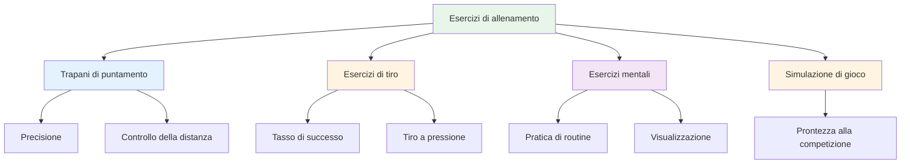

# Esercizi di allenamento

Ecco alcuni esercizi collaudati e utilizzati dai giocatori d&#39;élite. Ogni esercizio ha uno scopo specifico: scegli in base a ciò che vuoi sviluppare.

::: tip La grande idea
**Ogni esercizio ha uno scopo specifico.** Non lanciare bocce a caso: scegli esercizi che puntino sui tuoi punti deboli e che supportino i tuoi obiettivi. Monitora i tuoi progressi per vedere i miglioramenti.
:::

## Trapani di puntamento

### Il vicolo
**Scopo:** Isolare l&#39;angolo di rilascio e la coerenza della linea

**Impostare:**
- Posizionare due marcatori a 30-40 cm di distanza, a circa 1 metro dal cerchio
- Il bersaglio è a 7-9 metri di distanza

**Trapano:**
- Lanciare attraverso il &quot;vicolo&quot; (tra i marcatori)
- Ogni lancio che colpisce un marcatore è &quot;morto&quot;
- Concentrarsi su un punto di rilascio coerente

**Progressione:**
- Restringi il vicolo man mano che migliori
- Variare la distanza del bersaglio
- Aggiungi una zona di atterraggio specifica

### Zone di precisione
**Scopo:** Sviluppare la precisione in aree specifiche

**Impostare:**
- Segna le zone attorno a un bersaglio (ad esempio, cerchi a 20 cm, 40 cm, 60 cm)
- Oppure utilizzare i marcatori naturali sul terreno

**Punteggio:**
- All&#39;interno di 20 cm: 3 punti
- All&#39;interno di 40 cm: 2 punti
- All&#39;interno di 60 cm: 1 punto
- Esterno: 0 punti

**Trapano:**
- Lancia 10 bocce e tieni traccia del tuo punteggio
- Obiettivo: Miglioramento costante nel corso delle sessioni

### Variazione della distanza
**Scopo:** Sviluppare il controllo della profondità

**Impostare:**
- Posizionare i bersagli a 6 m, 7 m, 8 m, 9 m, 10 m

**Trapano:**
- Lancia a ogni distanza in ordine casuale
- Il partner chiama la distanza
- Concentrati sulla regolazione del peso, non sulla tecnica

**Variazione:**
- Aggiungi chiamate &quot;brevi&quot; e &quot;lunghe&quot; dopo aver rilasciato
- È necessario regolare a metà volo (sviluppa la sensibilità)

## Esercizi di tiro

### La scala di tiro
**Scopo:** Aumentare la precisione sotto pressione progressiva

**Impostare:**
- Posizionare una boccia bersaglio a 6 metri
- Segna le distanze a 7m, 8m, 9m, 10m

**Trapano:**
- Inizia a 6 metri
- Colpire = spostarsi indietro di un metro
- Manca = avanza di un metro (o ricomincia)
- Obiettivo: raggiungere i 10 metri

**Varianti:**
- Versione rigorosa: qualsiasi errore torna a 6m
- Versione cronometrata: Quanto lontano puoi arrivare in 10 minuti?
- Versione di squadra: alternarsi con il partner

### La barriera (Blox)
**Scopo:** Forzare il tiro ad arco alto

**Impostare:**
- Posiziona una barriera (un bastone, una corda o un ostacolo) tra te e il bersaglio
- La barriera dovrebbe essere abbastanza alta da richiedere un lancio

**Trapano:**
- Bisogna superare la barriera per colpire il bersaglio
- Ogni lancio che colpisce la barriera è &quot;morto&quot;
- Sviluppa un punto di rilascio elevato

**Perché è importante:**
- La competizione spesso richiede di sparare oltre gli ostacoli
- Aumenta la versatilità nelle tue riprese

### Percorso a ostacoli
**Scopo:** Sviluppare riprese da diverse angolazioni

**Impostare:**
- Posizionare la boccia bersaglio al centro
- Aggiungi ostacoli (altre bocce, segnalini) attorno ad esso

**Trapano:**
- Spara da diverse posizioni attorno al cerchio
- Bisogna trovare l&#39;angolazione che funziona
- Sviluppa la lettura delle linee di tiro

## Esercizi di allenamento mentale

### Ripetizione di routine
**Scopo:** Rendi automatica la tua routine pre-tiro

**Trapano:**
- Pratica la tua routine completa senza lanciare
- Eseguire ogni passaggio con attenzione
- Fai 10-20 ripetizioni
- Poi aggiungi il lancio

**Messa a fuoco:**
- Tempi coerenti
- Chiara transizione dal pensiero all&#39;esecuzione
- La stessa routine ogni volta

### Punti di pressione
**Scopo:** Esercitarsi a esibirsi sotto pressione

**Impostare:**
- Crea uno scenario &quot;da non perdere&quot;
- Stabilisci le conseguenze per la mancanza

**Esempi:**
- &quot;Fai 3 di fila o ricomincia&quot;
- &quot;Manca e fai 10 flessioni&quot;
- &quot;Annuncia il tuo bersaglio prima di lanciare&quot;

**Chiave:**
- La pressione dovrebbe essere reale
- Esercita la tua risposta mentale alla pressione
- Utilizza la tua routine esattamente come in gara

### Pratica di recupero
**Scopo:** Creare l&#39;abitudine di un rapido reset mentale

**Trapano:**
- Lanciare intenzionalmente una boccia sbagliata
- Praticare immediatamente SOAS (Stop, Observe, Accept, Slip)
- Lancia la prossima boccia con il massimo impegno

**Messa a fuoco:**
- Non soffermarti sulla mancanza
- Ripristinare completamente prima del lancio successivo
- Mantenere un linguaggio del corpo positivo

## Esercizi di simulazione di gioco

### La delizia di Millieu
**Scopo:** Rompere il blocco del ritmo, sviluppare la versatilità

**Trapano:**
- Alternare tra puntamento e tiro a ogni lancio
- Non sono ammessi due lanci consecutivi dello stesso tipo
- Sviluppa la capacità di cambiare modalità

### Scenario di gioco
**Scopo:** Esercitare il processo decisionale tattico

**Impostare:**
- Impostare situazioni di gioco realistiche
- Assegnare punteggi e conteggi delle bocce

**Esempi:**
- &quot;Sei sotto 10-8, l&#39;avversario ha 2 punti, tu hai 2 bocce&quot;
- &quot;Pareggio 6-6, tu hai l&#39;ultima boccia, loro hanno 1 punto&quot;

**Trapano:**
- Decidi cosa fare
- Eseguire con pieno impegno
- Rivedere la decisione in seguito

### Gioco di abbinamento con regole
**Scopo:** Simulazione di competizione

**Varianti:**
- Gioca fino a 13 (partita completa)
- Gioca fino a 7 (più breve, più partite)
- &quot;Punti di pressione&quot; - certe estremità valgono il doppio
- &quot;Morte improvvisa&quot; - il primo a perdere una partita perde la partita

## Monitoraggio delle esercitazioni

Tieni un registro per ogni esercitazione:

| Data | Trapano | Punteggio/Risultato | Note |
|------|-------|--------------|-------|
| | | | |

**Monitoraggio nel tempo:**
- Stai migliorando?
- Quali esercizi sono più utili?
- Dove hai difficoltà?

## Creare una sessione di esercizi

### Riscaldamento (10 min)
- Lanci facili per sciogliere
- Nessuna pressione, senti e basta

### Focus tecnico (20-30 min)
- Uno o due esercizi mirati ad abilità specifiche
- Pratica bloccata per nuove competenze
- Pratica casuale per competenze consolidate

### Simulazione di pressione/gioco (20-30 min)
- Aggiungi conseguenze
- Crea scenari realistici
- Praticare le abilità mentali

### Defaticamento (10 min)
- Lanci facili
- Rifletti sulla sessione
- Prendi nota di cosa dovrai lavorare dopo

## Conclusione chiave

> I trapani sono strumenti. Scegli lo strumento giusto per ciò che devi costruire.

Non limitarti a lanciare bocce. Allenati con uno scopo.

