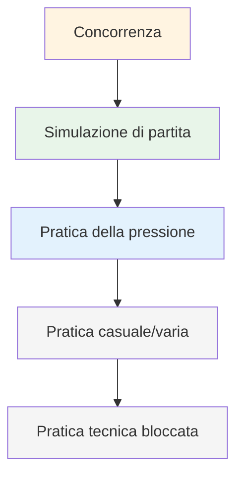

# Metodi di allenamento

Quando la tua tecnica è solida, cosa ti alleni? È qui che molti giocatori raggiungono il punto di stallo: continuano ad allenare la tecnica quando la vera crescita è altrove.

::: tip La grande idea
**La maggior parte dei giocatori raggiunge un punto morto perché continua ad allenare la tecnica quando la vera crescita è altrove.** I giocatori d&#39;élite allenano l&#39;adattabilità, la capacità decisionale e la forza mentale, non solo la meccanica.
:::

```mermaid
graph TD
    A[Evoluzione dell&#39;allenamento] --> B[Principiante: Esercizi tecnici]
    B --> C[Intermedio: pratica casuale]
    C --> D[Avanzato: Simulazione della pressione]
    D --> E[Elite: Allenamento mentale]

    style A fill:#e3f2fd
    style B fill:#f5f5f5
    style C fill:#fff4e1
    style D fill:#e8f5e9
    style E fill:#fff4e1
```

## Oltre la ripetizione tecnica

La maggior parte dei giocatori si allena ripetendo i lanci. Questo è importante per i principianti, ma i giocatori più esperti hanno bisogno di più:

| Tipo di formazione | Cosa sviluppa | Quando usare |
|--------------|------------------|-------------|
| Esercitazioni tecniche | Meccanica, forma | Imparare nuove competenze, risolvere i problemi |
| Pratica casuale | Adattabilità, capacità decisionale | Preparazione alla competizione |
| Simulazione della pressione | Forza mentale | Prima di eventi importanti |
| Allenamento mentale | Concentrazione, recupero, fiducia | In corso, spesso trascurato |

## La piramide di allenamento

::: warning Errore comune
**La maggior parte dei giocatori trascorre troppo tempo ai livelli più bassi.** I giocatori d&#39;élite lavorano a tutti i livelli della piramide, concentrandosi sui livelli più alti man mano che avanzano.
:::

## Pratica bloccata vs. casuale

### Pratica bloccata
Ripeti lo stesso lancio più volte:
- 20 punti da 7 metri
- 20 colpi allo stesso bersaglio
- Stessa distanza, stesso lancio

**Ideale per:** Apprendimento iniziale, rafforzamento della fiducia in se stessi, riscaldamento
**Limitazione:** Non si adatta bene alla competizione

### Pratica casuale
Varia tutto:
- Diverse distanze per ogni lancio
- Puntamento e tiro alternati
- Cambiare costantemente gli obiettivi

**Ideale per:** Preparazione alla competizione, sviluppo dell&#39;adattabilità
**Sensazioni:** Più difficile, più errori, meno &quot;produttivo&quot;
**Realtà:** Migliore fidelizzazione e trasferimento a lungo termine

### La ricerca

Gli studi dimostrano costantemente che:
- La pratica bloccata è più piacevole (miglioramento rapido visibile)
- La pratica casuale produce migliori prestazioni competitive
- La &quot;lotta&quot; della pratica casuale è dove avviene l&#39;apprendimento

## Simulazione della pressione

Non puoi gestire la pressione della competizione se non la provi mai durante l&#39;allenamento.

### Creare pressione nella pratica

**Conseguenze:**
- Flessioni per gli errori
- Il perdente compra il caffè
- I punti contano per qualcosa

**Scenari:**
- Situazioni &quot;da non perdere&quot;
- Sotto 12-10, bisogna segnare
- Ultima boccia della partita

**Pubblico:**
- Esercitati osservando le persone
- Registrati su video
- Annuncia cosa stai cercando di fare

**Fatica:**
- Esercitati quando sei stanco
- Fine della lunga sessione
- Dopo l&#39;esercizio fisico

### La scala di tiro

Un classico esercizio di pressione:
1. Inizia a 6 metri
2. Colpire il bersaglio = spostarsi indietro di un metro
3. Manca = avanza di un metro (o ricomincia)
4. Obiettivo: raggiungere i 10 metri

Ciò crea una pressione naturale man mano che si procede.

## Sessioni di allenamento mentale

Dedica del tempo specificamente alle abilità mentali:

### Sessione di visualizzazione (15-20 min)
1. Trova un posto tranquillo
2. Chiudi gli occhi
3. Visualizzati durante una competizione
4. Guarda i lanci riusciti in dettaglio
5. Senti la sicurezza e il flusso
6. Esercitati a gestire i momenti di pressione

### Esercizi di routine pre-tiro
- Esercitati nella tua routine senza lanciare
- Concentrati sulle transizioni mentali
- Costruisci l&#39;abitudine di una preparazione costante

### Pratica di recupero
- Commettere intenzionalmente errori nella pratica
- Esercitati nella risposta SOAS
- Costruisci l&#39;abitudine di un rapido reset mentale

## Strutturare la tua settimana di allenamento

### Esempio: Amateur serio (6 ore/settimana)

| Giorno | Durata | Messa a fuoco |
|-----|----------|-------|
| Lunedi | 1,5 ore | Tecnico: Esercizi di puntatura |
| Mercoledì | 1,5 ore | Tecnico: Esercitazioni di tiro |
| Venerdì | 1 ora | Mentale: Visualizzazione, pratica di routine |
| Sabato | 2 ore | Gioco di corrispondenza con elementi di pressione |

### Esempio: Giocatore competitivo (10 ore/settimana)

| Giorno | Durata | Messa a fuoco |
|-----|----------|-------|
| Lunedi | 2 ore | Tecnico: Puntamento (bloccato → casuale) |
| Martedì | 1 ora | Allenamento mentale + visualizzazione |
| Mercoledì | 2 ore | Tecnico: Tiro (bloccato → casuale) |
| Giovedì | 1 ora | Recensione video + lavoro mentale |
| Venerdì | 2 ore | Simulazione della pressione, scenari di gioco |
| Sabato | 2 ore | Competizione o partita |

## Principi di formazione

### 1. Qualità prima della quantità
- 30 minuti di concentrazione sono meglio di 2 ore di ripetizioni senza senso
- Fermati quando la concentrazione cala
- Meglio finire presto che praticare cattive abitudini

### 2. Pratica deliberata
- Avere un obiettivo specifico per ogni sessione
- Lavora al limite delle tue capacità
- Ricevi feedback (video, partner, risultati)
- Adattati in base a ciò che impari

### 3. Il recupero è importante
- I giorni di riposo fanno parte dell&#39;allenamento
- Il sonno influisce significativamente sulle prestazioni
- La stanchezza mentale è reale: rispettala

### 4. Tieni traccia di tutto
- Tieni un registro degli allenamenti
- Nota cosa funziona e cosa no
- Rivedere regolarmente
- Adatta il tuo piano in base ai dati

## In questa sezione

- **[Esercizi di allenamento](/it/istruzione/allenamento/esercizi)** - Esercizi specifici per diverse abilità

## Conclusione chiave

> Il modo in cui ti alleni determina le tue prestazioni. Allenati come se volessi giocare.

Varia il tuo allenamento. Includi lavoro mentale. Crea pressione. Tieni traccia dei tuoi progressi.

