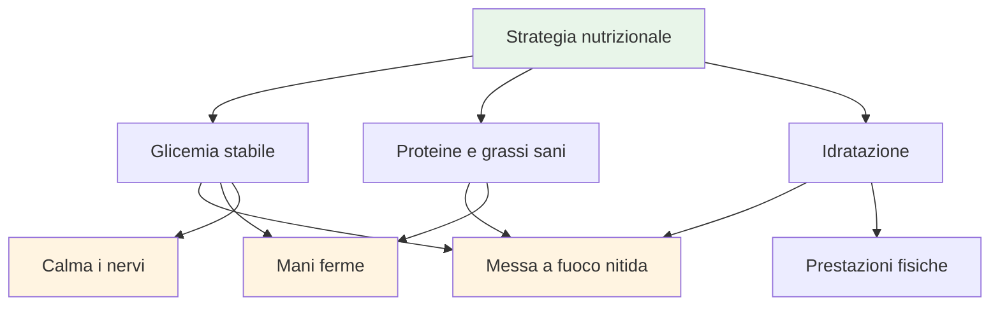
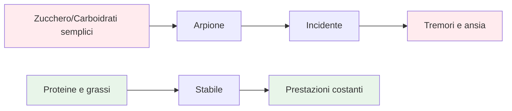

# Cibo e nutrizione

## Prestazioni di precisione

La boccia è uno sport di precisione. Il tuo cervello è lo strumento più importante: alimentalo con carburante stabile, non con energia da montagne russe.

::: tip Il principio fondamentale
**Glicemia stabile = Concentrazione nitida + Mani ferme**

Evita i picchi di zucchero. Dai priorità a proteine e grassi sani. Mantieniti idratato.
:::

## Principi chiave

### La glicemia stabile è tutto

::: warning Impatto del crollo della glicemia
Zuccheri e carboidrati semplici causano picchi e crolli della glicemia, che hanno un impatto diretto su:
- ❌ Concentrazione mentale e chiarezza
- ❌ Mani ferme (tremori dovuti a cali di zucchero nel sangue)
- ❌ Qualità del processo decisionale
- ❌ Stabilità emotiva e compostezza
:::

### Dare priorità alle proteine e ai grassi sani

::: tip I migliori alimenti per la precisione
Grassi e proteine forniscono energia a lungo termine senza crolli:
- ✅ Noci, avocado, olio d&#39;oliva, uova, formaggio
- ✅ Digestione lenta = energia costante per tutto il giorno
- ✅ Nessun calo pomeridiano durante i tornei lunghi
:::

### Evita la trappola dello zucchero

::: danger Cibi da evitare
Prestare particolare attenzione a:
- ❌ Barrette e bevande &quot;energetiche&quot; (spesso ricche di zucchero)
- ❌ Succhi di frutta e frullati (zucchero concentrato)
- ❌ Pane bianco, pasticcini, snack dai distributori automatici
:::

## Guida rapida per il giorno della gara

| Tempistica | Cosa mangiare | Perché |
|--------|-------------|-----|
| **2-3 ore prima** | Pasto equilibrato: proteine, grassi, verdure | Energia stabile senza sonnolenza |
| **Durante la competizione** | Acqua + piccoli snack proteici (noci, formaggio, carne secca) | Mantenere la concentrazione e le mani ferme |
| **Evitare tutto il giorno** | Snack e bevande zuccherate | Prevenire incidenti e scosse |

::: tip Snack veloci da competizione
**Porta questi:**
- Frutta secca mista (non salata)
- Uova sode
- cubetti di formaggio
- Carne secca di manzo o tacchino
- Verdure con hummus

**Lasciateli a casa:**
- Caramelle e cioccolato
- Bevande energetiche
- Pasticceria
- Succo di frutta
:::

## La scienza

```mermaid
graph TD
    A[Mangia zucchero] --> B[picchi di zucchero nel sangue]
    B --> C[Insulina rilasciata]
    C --> D[Crolli della glicemia]
    D --> E[Risposta all&#39;adrenalina]
    E --> F[Tremori]
    E --> G[Ansia]
    E --> H[scarsa concentrazione]

    style A fill:#ffebee
    style F fill:#ffebee
    style G fill:#ffebee
    style H fill:#ffebee
```

::: info Perché questo è importante per la boccia
A differenza degli sport di resistenza, la bocce richiede:
- **Precisione** - Mani ferme, senza tremori
- **Chiarezza mentale** - Capacità di prendere decisioni rapide per tutto il giorno
- **Calma i nervi** - Bassa ansia sotto pressione

L&#39;energia a base di zucchero agisce contro tutti questi fattori.
:::

## Saperne di più

Per strategie nutrizionali dettagliate, protocolli per i giorni di gara e la scienza alla base dell&#39;energia stabile:

::: tip Guida nutrizionale completa
→ **[Nutrizione per prestazioni di precisione](./education/nutrition/)** - Guida completa nella nostra sezione Formazione

Include:
- Pianificazione dettagliata dei pasti
- Protocolli del giorno della gara
- L&#39;opzione a basso contenuto di carboidrati per gli atleti di precisione
- Strategie di idratazione
- Cibi che aiutano vs. cibi che fanno male
:::

