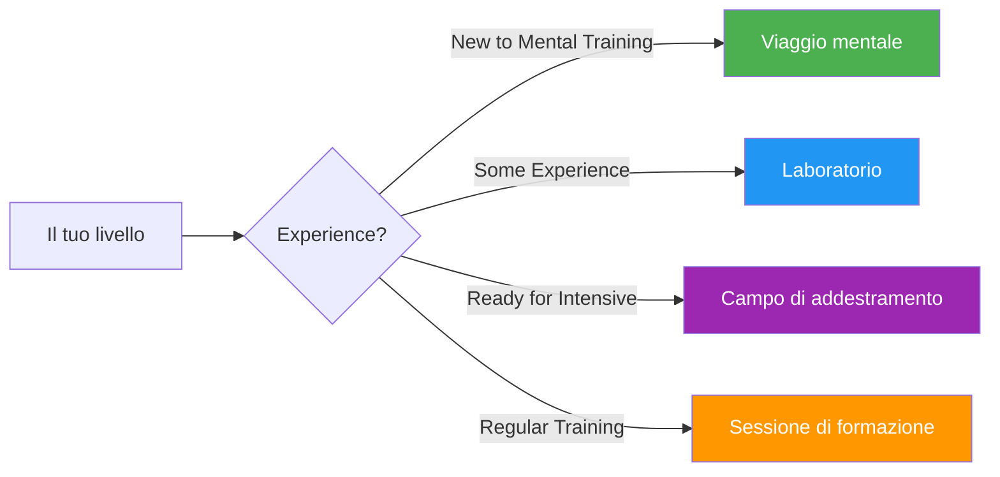

# Guide e strumenti

Risorse pratiche per giocatori, allenatori e club per implementare programmi strutturati di allenamento mentale.

## Scegli il tuo formato

## Formati guida

### 🌱 [Viaggio mentale](/it/guide/viaggio-mentale/)
**Per principianti** — Introduzione di 2-3 ore

Perfetto per i giocatori alle prime armi con l&#39;allenamento mentale. Un&#39;introduzione graduale ai concetti fondamentali con esercizi pratici.

- Durata: 2-3 ore
- Dimensione del gruppo: 4-12 giocatori
- Materiali: forniti
- [Visualizza guida →](/it/guide/viaggio-mentale/)

---

### 🎯 [Workshop](/it/guide/workshop/)
**Per livello intermedio** — approfondimento di 3-4 ore

Formato di workshop strutturato per club e squadre che desiderano approfondire l&#39;allenamento mentale.

- Durata: 3-4 ore
- Dimensione del gruppo: 6-8 giocatori
- Include: guida del coordinatore + materiali scaricabili
- [Visualizza guida →](/it/guide/workshop/)

---

### 🏕️ [Campo di addestramento](/it/guide/campo-di-addestramento/)
**Per team impegnati** — Weekend intensivo

Programma completo per un weekend che unisce teoria, pratica e competizione. Ideale per le squadre che si preparano per tornei importanti.

- Durata: 2-3 giorni
- Dimensione del gruppo: 10-20 giocatori
- Include: programma completo + materiali organizzativi
- [Visualizza guida →](/it/guide/campo-di-addestramento/)

---

### 🔄 [Sessione di formazione](/it/guide/sessione-di-formazione/)
**Per la pratica regolare** — Sessioni strutturate da 2-4 ore

Quadro per sessioni di allenamento regolari che integrano le competenze mentali con la pratica tecnica.

- Durata: 2-4 ore
- Dimensione del gruppo: 4 giocatori (una squadra)
- Focus: Simulazione di competizione con riflessione
- [Visualizza guida →](/it/guide/sessione-di-formazione/)

---

## Modelli e strumenti

Modelli scaricabili per supportare il tuo sviluppo:

### 📋 [Modello obiettivo](/it/guide/templates/goal-template)
Foglio di lavoro strutturato per definire e monitorare i tuoi obiettivi di pétanque utilizzando il framework SMART.

### 📓 [Modello di diario](/it/guide/templates/diary-template)
Modello di diario di allenamento e gara per monitorare progressi, approfondimenti e aree di miglioramento.

---

## Quale formato è più adatto a te?

| Formato | Ideale per | Impegno di tempo | Profondità |
|--------|----------|-----------------|-------|
| **Viaggio mentale** | Prima introduzione | 2-3 ore | ⭐ |
| **Laboratorio** | Giorni di allenamento del club | 3-4 ore | ⭐⭐ |
| **Campo di addestramento** | Preparazione della squadra | Fine settimana | ⭐⭐⭐ |
| **Sessione di formazione** | Sviluppo continuo | Regolare 2-4 ore | ⭐⭐ |

::: tip Per allenatori e dirigenti di club
Ogni guida include materiali sia per i partecipanti che per i facilitatori/organizzatori. Consultate la sezione &quot;Per i coordinatori&quot; con PDF scaricabili e slide di presentazione.
:::

## Risorse correlate

- [🎯 Valutazione](/it/valutazione/) — Valuta i tuoi 8 fattori e trova le priorità
- [📚 Education Hub](/it/education/) — Approfondimento sugli 8 fattori di performance
- [📝 Articoli](/it/articoli/) — Ricerche e approfondimenti

