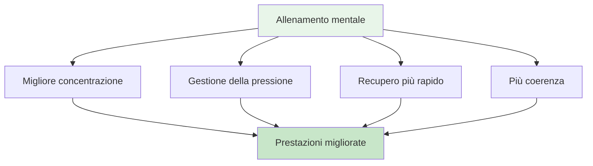

# Viaggio mentale per principianti

## Benvenuti al tuo viaggio nel gioco mentale

Che tu sia un giocatore che desidera migliorare il proprio gioco mentale o un allenatore che vuole introdurre l&#39;allenamento mentale nella propria squadra, questa guida ti aiuterà a muovere i primi passi nel mondo della psicologia sportiva per la pétanque.

::: tip Per chi è questo?
- **Giocatori** che vogliono comprendere il gioco mentale
- **Allenatori** che introducono l&#39;allenamento mentale alle loro squadre
- **Club** che organizzano workshop di giochi mentali
- **Qualcuno** è curioso della psicologia della pétanque
:::

## Accesso rapido

| Risorsa | Scopo | Accesso |
|----------|---------|--------|
| **Iniziare** | Introduzione ai concetti dei giochi mentali | [Leggi sotto](#perché-l&#39;allenamento-mentale-è-importante) |
| **Guida alla sessione** | Guida completa al workshop di 2-3 ore per facilitatori | [Visualizza guida](/it/guide/viaggio-mentale/guida-alla-sessione) |
| **Materiali** | Guide, diapositive e fogli di lavoro per i partecipanti | [Visualizza materiali](/it/guide/viaggio-mentale/materiali) |
| **Guide correlate** | Formati avanzati | [Workshop](/it/guides/workshop/) • [Campo di addestramento](/it/guides/training-camp/) |

## Perché l&#39;allenamento mentale è importante

A qualsiasi livello di pétanque, la mente influenza la prestazione. Ma la maggior parte dei giocatori si concentra per il 90% sulla tecnica e solo per il 10% sulle capacità mentali. Questa guida ti aiuta a iniziare a bilanciare questa equazione.

## Cosa imparerai

### Per i giocatori

**Concetti fondamentali:**
1. **The Zone** - Comprendere gli stati di flusso e come accedervi
2. **Il critico interiore** - Riconoscere e gestire il dialogo interiore negativo
3. **Risposta alla pressione** - Perché giochi in modo diverso in competizione
4. **The Switch** - Passare dal pensare all&#39;agire

**Abilità pratiche:**
- Semplice routine pre-tiro
- Tecnica di reset a 3 respiri
- Protocollo di recupero degli errori
- Punti di riferimento per la competizione

### Per allenatori/guide

**Come facilitare:**
1. Creare sicurezza psicologica
2. Condurre discussioni di gruppo
3. Collegare la teoria alla pratica
4. Gestire diverse personalità

**Struttura della sessione:**
- Formato del workshop da 2-3 ore
- Spunti di discussione ed esercizi
- Materiali scaricabili
- Attività di follow-up

## Iniziare

### Opzione 1: Autoapprendimento (per i giocatori)

**Settimana 1: Comprensione delle basi**
1. Leggi il modulo [La Zona](/it/educazione/gioco-mentale/la-zona/)
2. Prova la tecnica del reset a 3 respiri
3. Nota quando sei in &quot;modalità tecnica&quot; rispetto a &quot;modalità flusso&quot;

**Settimana 2: Creare consapevolezza**
1. Leggi il modulo [Forza mentale](/it/education/mental-game/mental-strength/)
2. Identifica i tuoi modelli di critica interiore
3. Praticare l&#39;osservazione neutrale dopo gli errori

**Settimana 3: Creazione della struttura**
1. Leggi il modulo [Mindfulness](/it/educazione/gioco-mentale/mindfulness/)
2. Inizia una pratica quotidiana di 5 minuti
3. Sviluppa una semplice routine pre-tiro

**Settimana 4: Integrazione**
1. Utilizza la tua routine nella pratica
2. Tieni traccia delle prestazioni mentali in [Modello di diario](/it/guide/templates/diary-template)
3. Stabilisci obiettivi di gioco mentale utilizzando [Modello di obiettivo](/it/guides/templates/goal-template)

### Opzione 2: Workshop di gruppo (per coach)

**Condurre una sessione di 2-3 ore:**

Utilizza la nostra completa [Guida alle sessioni](/it/guide/mental-journey/session-guide) che include:
- Struttura completa della sessione
- Spunti di discussione
- Esercizi di gruppo
- Materiali scaricabili

**Cosa ti servirà:**
- 6-12 partecipanti
- Stanza tranquilla con posti a sedere in cerchio
- Lavagna bianca o lavagna a fogli mobili
- Schermo o proiettore per la condivisione dei materiali
- 2-3 ore di tempo ininterrotto

## I tre pilastri dell&#39;allenamento mentale

### 1. Consapevolezza
**Cos&#39;è:** Notare i tuoi pensieri, sentimenti e schemi

**Perché è importante:** Non puoi cambiare ciò che non noti

**Come sviluppare:**
- Pratica quotidiana di consapevolezza (5-10 minuti)
- Riflessione post-partita
- Tenere un diario di allenamento

### 2. Accettazione
**Cos&#39;è:** Permettere pensieri e sentimenti senza giudizio

**Perché è importante:** Combattere la tua esperienza interiore crea tensione

**Come sviluppare:**
- Pratica di osservazione neutrale
- Coach interiore vs lavoro di critico interiore
- Lasciar andare il perfezionismo

### 3. Azione
**Cos&#39;è:** Scegliere risposte utili nonostante i pensieri difficili

**Perché è importante:** L&#39;allenamento mentale consiste nel dare il massimo nonostante il nervosismo

**Come sviluppare:**
- Routine pre-tiro
- Ripristina i protocolli
- Simulazione della pressione in allenamento

## Domande frequenti

### &quot;Non sono abbastanza bravo da preoccuparmi dell&#39;allenamento mentale&quot;
L&#39;allenamento mentale è utile a tutti i livelli. Anzi, iniziare presto aiuta a costruire abitudini migliori. Non serve essere un campione per trarre beneficio dalla comprensione della propria mente.

### &quot;Non è forse questo semplicemente &#39;pensare positivo&#39;?&quot;
No. L&#39;allenamento mentale consiste nel dare il massimo nonostante i pensieri negativi, non nell&#39;eliminarli. Si tratta di abilità pratiche, non di pensiero positivo.

### &quot;Quanto tempo ci vuole per vedere i risultati?&quot;
Alcune tecniche (come il reset dei 3 respiri) funzionano immediatamente. Cambiamenti più profondi (come stati di flusso costanti) richiedono 2-3 mesi di pratica.

### &quot;Ho bisogno di uno psicologo sportivo?&quot;
Non necessariamente. Questa guida fornisce strumenti pratici che puoi utilizzare immediatamente. L&#39;aiuto di un professionista è prezioso per problemi più complessi, ma la maggior parte dei giocatori può iniziare da sola.

### &quot;Questo mi aiuterà nella tecnica?&quot;
L&#39;allenamento mentale non sostituisce la pratica tecnica. Ma ti aiuta ad accedere alla tua tecnica in modo costante, soprattutto sotto pressione.

## Risorse disponibili

### Per i giocatori
- [Moduli didattici](/it/education/) - 8 guide complete
- [Modello di obiettivo](/it/guide/templates/goal-template) - Struttura il tuo sviluppo
- [Modello di diario](/it/guide/templates/diary-template) - Tieni traccia dei tuoi progressi
- [Casi di studio](/it/articoli/casi-di-studio) - Esempi reali

### Per allenatori/guide
- [Guida alla sessione](/it/guide/mental-journey/session-guide) - Workshop completo di 2-3 ore
- [Materiali per facilitatori](/it/guide/mental-journey/materials) - Guide e slide digitali
- [Guida al workshop](/it/guides/workshop/) - Formato avanzato 3-4 ore
- [Guida al campo di addestramento](/it/guides/training-camp/) - Programma del fine settimana

## Prossimi passi

### Per i singoli giocatori
1. **Inizia con la consapevolezza** - Leggi [The Zone](/it/educazione/gioco-mentale/the-zone/)
2. **Prova una tecnica** - Usa il reset a 3 respiri questa settimana
3. **Tieni traccia della tua esperienza** - Nota quali cambiamenti
4. **Costruisci gradualmente** - Aggiungi una nuova abilità a settimana

### Per allenatori/gruppi
1. **Rivedere la Guida alla sessione** - Comprendere la struttura
2. **Scarica materiali** - Ottieni dispense e diapositive
3. **Pianifica una sessione** - Blocco di 2-3 ore
4. **Preparati** - Leggi le note del facilitatore
5. **Esegui il workshop** - Segui la guida

## Supporto

**Domande su come iniziare?**
- E-mail: [patrik.wiik@gmail.com](mailto:patrik.wiik@gmail.com)
- Esaminare [Casi di studio](/it/articoli/casi-di-studio) per esempi
- Partecipa alle discussioni nel tuo club

---

::: tip Pronti per iniziare?
**Giocatori:** Inizia con il modulo [The Zone](/it/education/mental-game/the-zone/)

**Allenatori:** Vai alla [Guida alla sessione](/it/guide/mental-journey/session-guide)

**Scarica i materiali:** Visita [Materiali per facilitatori](/it/guide/mental-journey/materials)
:::

