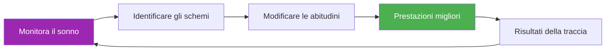

# Modello per il monitoraggio del sonno

> &quot;Spesso vince il giocatore che ha dormito meglio.&quot;

Monitora i tuoi ritmi del sonno e mettili in relazione con le tue prestazioni per ottimizzare il recupero.

::: tip Perché monitorare il sonno?
**Il sonno è lo strumento di recupero numero uno.** Gli atleti d&#39;élite che monitorano costantemente il proprio sonno riferiscono di avere più energia, tempi di reazione più rapidi e una migliore capacità decisionale sotto pressione.
:::

---

## Inserimento giornaliero rapido

### Copia questo per ogni giorno

---

**Data:** ________

| **Ora di andare a letto:** ________ | **Ora di sveglia:** ________ |
**Dose totale di sonno:** ________ ore

**Qualità del sonno (1-10):** _____

**Fattori che influenzano il sonno:**
- [ ] Caffeina dopo le 14:00
- [ ] Alcol
- [ ] Tempo trascorso davanti allo schermo prima di andare a letto
- [ ] Stress/preoccupazione
- [ ] Disturbi da rumore/luce
- [ ] Problemi di temperatura
- [ ] Pasto tardivo
- [ ] Altro: ________

**Energia mattutina (1-10):** _____

**Note:**

---

## Riepilogo settimanale del sonno

### Copia questo ogni settimana

---

**Settimana del:** ________

| Giorno | Ora di andare a letto | Veglia | Ore | Qualità | Energia | Note |
|-----|---------|------|-------|---------|--------|-------|
| lun | /10 | /10 |
| Martedì | /10 | /10 |
| Mercoledì | /10 | /10 |
| Giovedì | /10 | /10 |
| Ven | /10 | /10 |
| Sab | /10 | /10 |
| Sole | /10 | /10 |

| **Media settimanale:** _____ ore | Qualità: _____/10 | Energia: _____/10 |

**La notte migliore:** ________ Perché? ________

**La notte peggiore:** ________ Perché? ________

**Schema rilevato:**

---

## Protocollo del sonno pre-gara

### 3 giorni prima della gara

| Notte | Orario di andare a letto | Attuale | Ore | Qualità | Note |
|-------|----------------|--------|-------|---------|-------|
| -3 giorni |
| -2 giorni |
| -1 giorno |

**Energia del giorno della gara (1-10):** _____

**Correlazione delle prestazioni:**
- Il sonno ha influenzato il mio gioco? Sì / No / Forse
- Come?

---

## Lista di controllo per l&#39;ambiente in cui si dorme

Valuta l&#39;ambiente in cui dormi:

| Fattore | Punteggio (1-10) | È necessario un miglioramento? |
|--------|--------------|---------------------|
| **Oscurità** |
| **Temperatura** (16-19 °C ideale) |
| **Livello di rumore** |
| **Comfort del materasso** |
| **Supporto per cuscino** |
| **Qualità dell&#39;aria** |
| **Telefono fuori dalla stanza** |

---

## Abitudini igieniche del sonno

Tieni traccia delle abitudini che stai seguendo:

### Routine serale (2 ore prima di andare a letto)

- [ ] Niente caffeina dopo le 14:00
- [ ] Niente alcol (o limitarsi a 1 drink, 3+ ore prima di andare a letto)
- [ ] Cena leggera, non troppo tardi
- [ ] Luci soffuse in casa
- [ ] Nessun esercizio intenso
- [ ] Coprifuoco davanti allo schermo (1 ora prima di andare a letto)
- [ ] Attività di rilassamento (lettura, stretching, respirazione)

### Regole della camera da letto

- [ ] Temperatura ambiente 16-19 °C
- [ ] Oscurità totale (o maschera per dormire)
- [ ] Telefono in modalità silenziosa, con lo schermo rivolto verso il basso (o fuori dalla stanza).
- [ ] Orario di coricamento costante (±30 min)
- [ ] Il letto serve solo per dormire (non per lavorare o navigare su internet).

**Abitudini seguite questa settimana:** _____/12

---

## Correlazione tra sonno e prestazioni

Monitora la situazione per 4 settimane per individuare eventuali schemi ricorrenti:

| Settimana | Sonno medio | Qualità media | Prestazioni di allenamento | Risultato della competizione |
|------|-----------|-------------|---------------------|-------------------|
| 1 | ore | /10 | /10 |
| 2 | ore | /10 | /10 |
| 3 | ore | /10 | /10 |
| 4 | ore | /10 | /10 |

**Correlazione scoperta:**

---

## Protocollo per il sonno in viaggio

Per le gare in trasferta:

**Prima del viaggio:**
- [ ] Regolare l&#39;ora di andare a letto 30 minuti prima/dopo in base al fuso orario
- [ ] Porta con te tutto l&#39;essenziale per dormire (maschera, tappi per le orecchie, cuscino)
- [ ] Prenota una camera silenziosa (lontana dall&#39;ascensore e dalla strada).

**A destinazione:**
- [ ] Impostare immediatamente la temperatura ambiente
- [ ] Bloccare le fonti luminose
- [ ] Mantenere la routine della buonanotte a casa
- [ ] Evitate i sonnellini di durata superiore a 20 minuti dopo il viaggio.

**Note per il prossimo viaggio:**

---

---

## Vittoria rapida: inizia stasera

::: info La sfida dei 3 giorni
Monitora il tuo sonno per soli 3 giorni. Probabilmente scoprirai uno schema che non sapevi esistesse.
:::

1. **Stasera** — Prendi nota dell&#39;orario in cui vai a letto e di eventuali fattori
2. **Domani mattina** — Valuta subito la qualità e l&#39;energia
3. **Ripetere per 3 giorni** — Cercare degli schemi

---

## Risorse correlate

- [Educazione al sonno e al recupero](/it/education/sleep/) — La scienza dietro il sonno
- [Lista di controllo per la competizione](/it/guide/templates/pre-competition-checklist) — Guida completa alla preparazione
- [Diario di allenamento](/en/guides/templates/diary-template) — Tieni traccia di tutti gli aspetti dell&#39;allenamento

