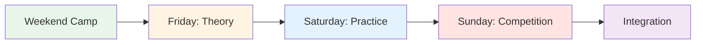
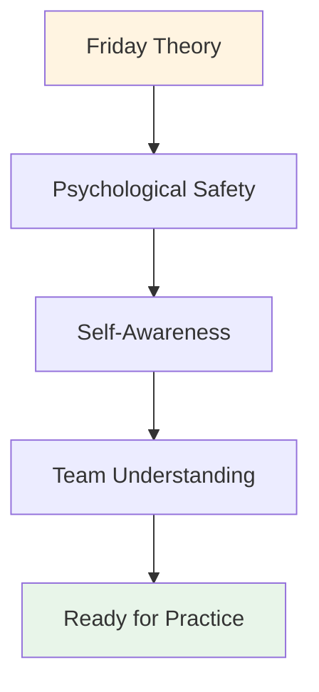

# Training Camp: Weekend Mental Game Intensive

## Overview

A comprehensive weekend training camp (Friday-Sunday) for 10-20 players that combines mental game theory, on-piste practice, and competitive application. This intensive format creates transformational learning through integration of all three elements.

::: tip Two Sections in This Guide
- **[For Participants](#for-participants)** - What players will experience during the weekend
- **[For Organizers](#for-organizers)** - How to plan and run the training camp
:::

::: tip The Training Camp Philosophy
**Theory without practice is just information. Practice without theory is just repetition. Competition without reflection is just playing.** This weekend integrates all three for transformational learning.
:::

## Quick Access

| Section | Purpose | Access |
|---------|---------|--------|
| **For Participants** | Weekend schedule and what to bring | [View Section](#for-participants) |
| **For Organizers** | Complete planning and facilitation guide | [View Section](#for-organizers) |
| **Daily Schedules** | Detailed timing and activities | [Friday](#friday-evening-mental-game-foundation-3-4-hours) • [Saturday](#saturday-practice-application-full-day) • [Sunday](#sunday-competition-integration-full-day) |
| **Related Guides** | Other training formats | [Mental Journey](/it/guides/mental-journey/) • [Workshop](/it/guides/workshop/) |

---

## For Participants

### What to Expect

This is an intensive weekend that will challenge you mentally, physically, and emotionally. You'll learn mental game concepts, practice them on the piste, and apply them in competition - all while building deep connections with fellow players.

**Weekend Structure:**

### Daily Breakdown

#### Friday Evening: Mental Game Foundation (3-4 hours)
**What:** Theory session on mental game concepts
**Where:** Indoor meeting room
**Format:** Circle discussion and exercises

**You'll Learn:**
- The Zone and flow states
- Inner Critic vs Inner Coach
- Pressure response patterns
- Pre-shot routine fundamentals

**Activities:**
- Check-in and ground rules
- The Iceberg of Pétanque
- User Manual creation
- Fear in a Hat exercise

#### Saturday: Practice & Application (Full Day)
**Morning (3 hours):** Structured practice with mental focus
**Afternoon (3 hours):** Pressure simulation drills
**Evening (2 hours):** Reflection and integration

**You'll Practice:**
- Pre-shot routines in real throws
- Reset techniques after mistakes
- Focus anchors under pressure
- Team communication protocols

**Format:**
- Small group drills (3-4 players)
- Video analysis of mental patterns
- Pressure scenarios
- Evening debrief session

#### Sunday: Competition & Integration (Full Day)
**Morning (3 hours):** Tournament play
**Afternoon (2 hours):** Final rounds
**Evening (1 hour):** Closing reflection

**You'll Apply:**
- All mental tools in competition
- Team protocols under pressure
- Mistake recovery in real time
- Post-game reflection process

### What to Bring

**Required:**
- Your boules and equipment
- Comfortable clothing for all weather
- Notebook and pen
- Open mind and willingness to share
- Water bottle

**Optional:**
- Training diary
- Questions about specific mental challenges
- Examples of pressure situations you face

**Not Needed:**
- Technical coaching requests (this is mental game focused)
- Ego or need to prove yourself
- Judgment of others

### Ground Rules for the Weekend

::: tip The Container
All participants agree to:
1. **Confidentiality** - What's shared stays here
2. **Respect** - Honor others' vulnerability
3. **Participation** - Engage fully in all activities
4. **Growth Mindset** - Embrace discomfort as learning
5. **Support** - Help teammates apply concepts
:::

### What You'll Leave With

**Knowledge:**
- Deep understanding of your mental patterns
- Practical tools for pressure management
- Team protocols for competition
- Personalized pre-shot routine

**Skills:**
- Ability to access flow states
- Mistake recovery techniques
- Inner Coach reframing
- Focus anchors

**Connection:**
- Deeper bonds with teammates
- Shared language for mental game
- Support network for continued growth

**Materials:**
- Completed worksheets and exercises
- Video analysis of your mental patterns
- Action plan for next 30 days
- Access to all education modules

### Typical Schedule

**Friday:**
- 18:00 - Arrival and check-in
- 19:00 - Dinner
- 20:00 - Opening session (theory)
- 23:00 - Free time / rest

**Saturday:**
- 08:00 - Breakfast
- 09:00 - Morning practice session
- 12:00 - Lunch
- 13:30 - Afternoon practice session
- 17:00 - Break
- 18:00 - Dinner
- 19:30 - Evening reflection session
- 21:00 - Free time / rest

**Sunday:**
- 08:00 - Breakfast
- 09:00 - Tournament begins
- 12:00 - Lunch
- 13:00 - Final rounds
- 15:00 - Awards and recognition
- 16:00 - Closing circle
- 17:00 - Departure

---

## For Organizers

### Planning Overview

This section provides everything you need to organize and run a successful weekend training camp for 10-20 players.

### Pre-Camp Planning (6-8 Weeks Before)

### Group Size & Structure

**Optimal:** 10-20 players
- **Small camp (10-12):** More intimate, deeper sharing
- **Large camp (16-20):** More diverse perspectives, requires sub-groups

**Team Structure:**
- Divide into teams of 3-4 for practice and competition
- Mix skill levels and playing styles
- Rotate teams throughout weekend

### Staffing Requirements

| Role | Responsibilities | Quantity |
|------|------------------|----------|
| **Mental Performance Coordinator** | Facilitate theory sessions, group dynamics | 1 |
| **Technical Coach** | Oversee practice, provide feedback | 1-2 |
| **Competition Director** | Run tournament, manage logistics | 1 |
| **Support Staff** | Meals, setup, admin | 1-2 |

### Location Requirements

::: info Facility Needs
**Piste:**
- Multiple terrains (minimum 3-4 pistes)
- Different surfaces if possible (gravel, sand, hard)
- Lighting for evening play

**Indoor Space:**
- Room for 20 people in circle (theory sessions)
- Separate from piste
- Whiteboard/projector
- Comfortable seating

**Accommodation:**
- On-site or nearby (walking distance)
- Shared rooms encourage bonding
- Quiet space for reflection

**Catering:**
- Nutrition-focused meals (see [Food Guide](./food))
- Avoid sugar crashes
- Hydration stations
:::

### Materials Checklist

::: details Complete Materials List
**Theory Sessions:**
- [ ] Chairs for circle (no tables)
- [ ] Boules and cochonnet for center
- [ ] Flip charts and markers
- [ ] Sticky notes
- [ ] Worksheets (User Manual, Inner Critic, etc.)
- [ ] Paper and pens
- [ ] Projector (for website content)

**Practice Sessions:**
- [ ] Measuring tape
- [ ] Cones/markers for drills
- [ ] Video camera/tripod
- [ ] Clipboard and paper (tracking)
- [ ] Whistle

**Competition:**
- [ ] Score sheets
- [ ] Tournament bracket
- [ ] Prizes/recognition
- [ ] First aid kit

**Logistics:**
- [ ] Name tags
- [ ] Participant list with contacts
- [ ] Emergency contact info
- [ ] Water bottles
- [ ] Sunscreen
- [ ] Tissues (for emotional work!)
:::

## Weekend Schedule

### Friday Evening (3 hours)

**18:00-18:30 - Arrival & Welcome**
- Check-in
- Room assignments
- Overview of weekend

**18:30-19:30 - Dinner**
- Nutrition-focused meal
- Informal introductions

**19:30-22:30 - Theory Session: Foundation**

Use the [Workshop guide](./workshop) for detailed facilitation:

1. **Ground Rules (15 min)** - Establish psychological safety
2. **Check-In Matrix (20 min)** - Assess group energy
3. **The Iceberg (30 min)** - Explore inner thoughts
4. **User Manual (45 min)** - Build team understanding
5. **Fear in a Hat (45 min)** - Break isolation
6. **Check-Out (15 min)** - Close the loop

**22:30 - Free Time**
- Informal socializing
- Rest and reflection

### Saturday (Full Day - Theory + Practice)

**08:00-09:00 - Breakfast & Mindfulness**
- Quiet breakfast
- Optional 15-minute guided meditation
- Set intentions for the day

**09:00-10:30 - Theory Session: Connecting Content to Experience**

Choose 3-4 topics from the Academy website and explore the inner game:

**Example Topics:**

1. **[Nutrition](./education/nutrition/)** (20 min)
   - "How does your food choice change under pressure?"
   - "Do you eat what your body needs or what your anxiety wants?"
   - Practice: Plan competition-day nutrition

2. **[Mental Strength](./education/mental-game/mental-strength/)** (25 min)
   - "What's your relationship with failure?"
   - "How do you talk to yourself after a miss?"
   - Activity: Reframe Inner Critic to Inner Coach

3. **[Mindfulness](./education/mental-game/mindfulness/)** (25 min)
   - "Where does your mind go during the pause before throwing?"
   - "What pulls you out of the present moment?"
   - Practice: 5-minute body scan

4. **[Tactics](./education/technique/tactics/)** (20 min)
   - "Is your shot choice based on strategy or fear?"
   - "When do you play it safe vs. take risks?"
   - Discuss: Risk profiles in the group

**10:30-10:45 - Break**

**10:45-12:30 - On-Piste Integration: Drills with Mental Focus**

**Drill 1: Call Your Shot (30 min)**

From the [Workshop guide](./workshop) - practice owning intention and doubt:

1. Announce the target: "I am shooting the iron"
2. State confidence: "I am a 7 out of 10"
3. Name the inner thought: "My inner voice is worrying about backspin"
4. Execute the shot
5. Reflect: "What happened? What did you learn?"

**Drill 2: Cognitive Interference (30 min)**

Test if technique has become automatic:
- Coordinator asks complex questions while player shoots
- "Name 5 capital cities" or "Count backwards from 100 by 7s"
- Success = technique is implicit, not consciously processed

**Drill 3: User Manual Practice (30 min)**

Apply the User Manuals from Friday:
- Play in teams of 3
- After each shot, teammates respond according to User Manual
- "Marc needs silence after a miss" - team honors that
- Debrief: "How did it feel to be understood?"

**12:30-14:00 - Lunch & Rest**
- Nutrition-focused meal
- Quiet time for reflection
- Optional: Individual check-ins with coordinator

**14:00-17:00 - Practice Session: Terrain Adaptation**

**Goal:** Build adaptability and mental flexibility

**Setup:**
- Rotate through 3-4 different terrains/pistes
- 45 minutes per terrain
- Focus on mental adaptation, not just technical

**Rotation Structure:**

| Terrain | Mental Focus | Practice |
|---------|--------------|----------|
| **Terrain 1: Soft/Sand** | Acceptance of uncertainty | "The donnée - accept what is" |
| **Terrain 2: Hard/Gravel** | Precision under pressure | "Trust your technique" |
| **Terrain 3: Uneven** | Emotional regulation | "Stay calm when it's unfair" |
| **Terrain 4: Competition** | Flow state access | "Find the zone" |

**Facilitation:**
- Technical coach provides feedback on technique
- MPC asks: "What's happening in your mind right now?"
- Players journal between rotations

**17:00-18:00 - Break & Reflection**
- Individual journaling
- "What did you learn about yourself today?"
- "What's one thing you'll do differently tomorrow?"

**18:00-19:00 - Dinner**

**19:00-21:00 - Evening Theory: Deep Vulnerability**

**Activity 1: Reframing the Inner Critic (45 min)**

See [Workshop guide](./workshop) for full protocol:
1. Identify the exact Critic phrase
2. Reframe as Inner Coach
3. Partner practice

**Activity 2: Competition Preparation (45 min)**

Tomorrow is competition day. Prepare mentally:

1. **Visualization (15 min)**
   - Close eyes
   - Imagine perfect shot
   - Feel the confidence
   - Notice the calm

2. **Team Protocols (20 min)**
   - Create signals for support
   - "I need a reset" = touch boules
   - "I need encouragement" = fist bump
   - "I need space" = step back

3. **Set Intentions (10 min)**
   - "Tomorrow, I will focus on..."
   - "My goal is not to win, but to..."
   - "I will practice..."

**Check-Out (30 min)**
- Share one fear about tomorrow
- Share one intention
- Group support

**21:00 - Free Time**
- Early to bed (competition tomorrow!)
- Quiet reflection

### Sunday (Competition Day)

**08:00-09:00 - Breakfast & Mental Preparation**
- Light breakfast (see [Nutrition guide](./education/nutrition/))
- 15-minute mindfulness practice
- Team huddles

**09:00-09:30 - Competition Briefing**

**Format:** Round-robin tournament
- Teams of 3
- Play to 13 points
- Everyone plays everyone
- Focus on PROCESS, not outcome

**The Twist: Mental Performance Scoring**

::: tip Dual Scoring System
**Traditional:** Points won
**Mental Performance:** Scored by MPC

Mental Performance Points (0-5 per game):
- Used User Manual tools
- Supported teammates effectively
- Managed inner critic
- Stayed present (not dwelling on past shots)
- Demonstrated psychological safety

**Winner:** Best combined score (traditional + mental)
:::

**09:30-13:00 - Morning Competition**
- Round-robin games
- MPC observes and scores
- Technical coach provides brief feedback between games
- Hydration and snack breaks

**13:00-14:00 - Lunch**
- Nutrition-focused
- Informal reflection
- Rest

**14:00-17:00 - Afternoon Competition**
- Continue round-robin
- Semi-finals and finals
- Increasing pressure
- Apply morning learnings

**17:00-17:30 - Awards & Recognition**

**Categories:**
- Traditional winner
- Mental performance winner
- Most improved
- Best teammate
- Courage award (most vulnerable)

**17:30-19:00 - Final Reflection Session**

**Critical:** This is where learning is cemented.

**Structure:**

**1. Individual Reflection (15 min)**
Write in journal:
- What did you learn about yourself this weekend?
- What surprised you?
- What will you do differently?
- What are you taking home?

**2. Small Group Sharing (30 min)**
Groups of 4-5:
- Share key insights
- What resonated most?
- What was hardest?
- What was most valuable?

**3. Full Group Integration (30 min)**
Circle up:
- Each person shares ONE key takeaway
- MPC validates and connects themes
- Discuss: "How will you apply this?"

**4. Commitments (15 min)**
- Each person states one commitment
- "In my next competition, I will..."
- Group witnesses and supports

**5. Closing (15 min)**
- Thank participants for courage
- Remind of confidentiality
- Exchange contacts
- Plan follow-up (optional online session)

**19:00 - Dinner & Departure**

## Facilitation Tips

### Balancing Theory and Practice

::: warning Don't Overload Theory
**The mistake:** Too much talking, not enough doing

**The balance:**
- Theory creates awareness
- Practice builds skill
- Competition tests integration
- Reflection cements learning

**Rule of thumb:** 30% theory, 40% practice, 20% competition, 10% reflection
:::

### Managing Group Dynamics

**The Competitive Alpha:**
- Wants to win at all costs
- Resists vulnerability
- **Strategy:** Channel competitiveness into mental performance scoring

**The Quiet Observer:**
- Takes it all in, doesn't share
- **Strategy:** Create low-stakes entry points, validate observation as participation

**The Skeptic:**
- "This touchy-feely stuff doesn't work"
- **Strategy:** Verbal Aikido - align and pivot (see [Workshop guide](./workshop))

**The Over-Sharer:**
- Dominates discussion
- **Strategy:** "Thank you, let's hear from others"

### Handling Emotional Moments

**Someone cries during Fear in a Hat:**
- ✅ Normalize: "Tears are courage, not weakness"
- ✅ Offer tissue, don't rush
- ✅ Ask: "What do you need right now?"
- ❌ Don't: "It's okay, don't cry"

**Conflict between players:**
- ✅ Pause and address
- ✅ "What's happening right now?"
- ✅ Use as learning moment
- ❌ Don't: Ignore or minimize

**Someone shuts down:**
- ✅ Check in privately during break
- ✅ "I noticed you went quiet. What's up?"
- ✅ Offer options: participate differently, take a break
- ❌ Don't: Call out publicly

## Post-Camp Follow-Up

### Immediate (24-48 hours)

**Send to all participants:**
- Thank you message
- Key takeaways summary
- Photos from weekend
- Contact list (with permission)
- Link to resources on website

**Individual check-ins:**
- Text anyone who shared heavily
- "How are you feeling about the weekend?"
- Address any vulnerability hangover

### Short-term (2 weeks)

**Optional online session (60-90 min):**
- How have you applied learnings?
- What's working? What's challenging?
- Peer support and problem-solving
- Reinforce commitments

### Long-term (1-3 months)

**Survey participants:**
- What's different in your game?
- What tools are you still using?
- What would make the next camp better?
- Would you recommend to others?

**Track impact:**
- Competition results
- Self-reported confidence
- Team dynamics
- Continued engagement

## Adapting for Different Group Sizes

### Small Camp (10-12 players)

**Advantages:**
- Deeper sharing
- More individual attention
- Stronger bonds

**Adjustments:**
- Single group for all theory
- More time per person in activities
- Intimate competition format

### Large Camp (16-20 players)

**Advantages:**
- Diverse perspectives
- More competition variety
- Economies of scale

**Adjustments:**
- Split into 2 groups for some theory sessions
- Need 2 MPC/facilitators
- Larger tournament bracket
- More structured rotations

## Budget Considerations

### Revenue

| Item | Price per Person | 20 People | 10 People |
|------|------------------|-----------|-----------|
| **Registration** | €150-250 | €3,000-5,000 | €1,500-2,500 |

### Expenses

| Category | Cost | Notes |
|----------|------|-------|
| **Facility rental** | €500-1,000 | Weekend rate |
| **Accommodation** | €40-60/person/night | Shared rooms |
| **Meals** | €30-40/person/day | 6 meals |
| **Staff** | €500-1,000 | MPC + coaches |
| **Materials** | €100-200 | Worksheets, supplies |
| **Prizes** | €100-200 | Recognition items |

**Total per person:** €120-180
**Margin:** €30-70/person (or break-even for community building)

## Success Metrics

### Immediate Indicators

- [ ] Psychological safety score (1-10 average >7)
- [ ] Participation rate (>80% actively sharing)
- [ ] Completion rate (>90% stay full weekend)
- [ ] Satisfaction score (1-10 average >8)

### Long-term Indicators

- [ ] Behavior change (using tools in competition)
- [ ] Performance improvement (self-reported)
- [ ] Community building (staying in touch)
- [ ] Referrals (recommending to others)

## Common Mistakes to Avoid

::: danger Pitfalls
**1. Too much content**
- Trying to cover everything
- **Fix:** Focus on depth, not breadth

**2. Skipping reflection**
- Rushing to next activity
- **Fix:** Build in processing time

**3. Ignoring resistance**
- Pushing through skepticism
- **Fix:** Address it directly with Verbal Aikido

**4. Technical coaching during theory**
- Mixing roles
- **Fix:** Clear boundaries between MPC and technical coach

**5. No follow-up**
- Weekend ends, learning stops
- **Fix:** Plan post-camp touchpoints
:::

## Resources

### From This Site

- [Workshop Guide](./workshop) - Detailed facilitation protocols
- [Training Session Guide](./training-session) - For ongoing practice
- [Nutrition](./education/nutrition/) - Competition-day protocols
- [Mental Strength](./education/mental-game/mental-strength/) - Inner game concepts
- [Mindfulness](./education/mental-game/mindfulness/) - Presence techniques
- [Tactics](./education/technique/tactics/) - Strategic thinking

### Recommended Reading

- *The Inner Game of Tennis* by Timothy Gallwey
- *Mindset* by Carol Dweck
- *The Fearless Organization* by Amy Edmondson

