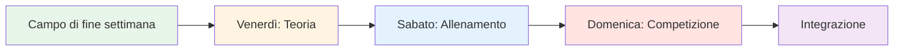
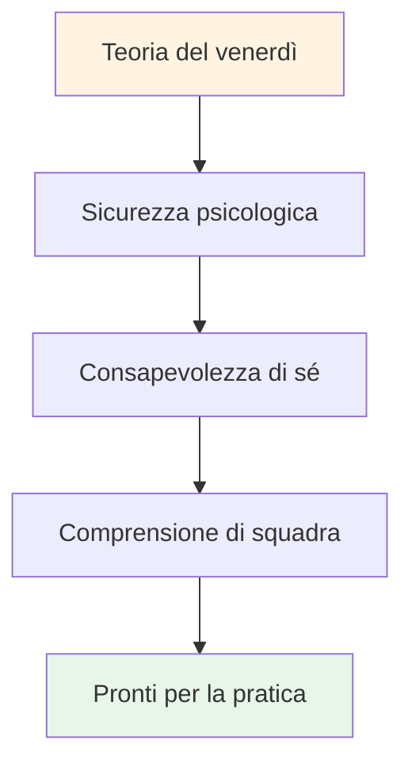

# Campo di addestramento: intensivo di gioco mentale nel fine settimana

## Panoramica

Un training camp completo di un weekend (venerdì-domenica) per 10-20 giocatori che combina teoria dei giochi mentali, pratica in pista e pratica competitiva. Questo format intensivo crea un apprendimento trasformativo attraverso l&#39;integrazione di tutti e tre gli elementi.

::: tip Due sezioni in questa guida
- **[Per i partecipanti](#for-participants)** - Cosa vivranno i giocatori durante il fine settimana
- **[Per gli organizzatori](#for-organizers)** - Come pianificare e gestire il ritiro di allenamento
:::

::: tip La filosofia del campo di addestramento
**La teoria senza pratica è solo informazione. La pratica senza teoria è solo ripetizione. La competizione senza riflessione è solo gioco.** Questo fine settimana integra tutte e tre le cose per un apprendimento trasformativo.
:::

## Accesso rapido

| Sezione | Scopo | Accesso |
|---------|---------|--------|
| **Per i partecipanti** | Programma del fine settimana e cosa portare | [Visualizza sezione](#for-participants) |
| **Per gli organizzatori** | Guida completa alla pianificazione e alla facilitazione | [Visualizza sezione](#for-organizers) |
| **Programmi giornalieri** | Tempistiche e attività dettagliate | [Venerdì](#venerdì-sera-fondazione-gioco-mentale-3-4-ore) • [Sabato](#sabato-pratica-applicazione-giornata-intera) • [Domenica](#domenica-competizione-integrazione-giornata-intera) |
| **Guide correlate** | Altri formati di formazione | [Viaggio mentale](/it/guides/mental-journey/) • [Workshop](/it/guides/workshop/) |

---

## Per i partecipanti

### Cosa aspettarsi

Questo è un weekend intenso che ti metterà alla prova mentalmente, fisicamente ed emotivamente. Imparerai i concetti del mental game, li metterai in pratica in pista e li applicherai in gara, il tutto costruendo profondi legami con gli altri giocatori.

**Struttura del fine settimana:**

### Ripartizione giornaliera

#### Venerdì sera: Fondamenti del Mental Game (3-4 ore)
**Cosa:** Sessione teorica sui concetti del gioco mentale
**Dove:** Sala riunioni interna
**Formato:** Discussione in cerchio ed esercizi

**Imparerai:**
- La zona e gli stati di flusso
- Critico interiore vs. Coach interiore
- Modelli di risposta alla pressione
- Fondamenti della routine pre-tiro

**Attività:**
- Check-in e regole di base
- L&#39;iceberg della bocce
- Creazione del manuale utente
- Esercizio della paura nel cappello

#### Sabato: pratica e applicazione (giornata intera)
**Mattina (3 ore):** Pratica strutturata con concentrazione mentale
**Pomeriggio (3 ore):** Esercitazioni di simulazione della pressione
**Sera (2 ore):** Riflessione e integrazione

**Ti eserciterai:**
- Routine pre-tiro nei lanci reali
- Tecniche di reset dopo gli errori
- Ancore di messa a fuoco sotto pressione
- Protocolli di comunicazione di squadra

**Formato:**
- Esercizi in piccoli gruppi (3-4 giocatori)
- Analisi video dei modelli mentali
- Scenari di pressione
- Sessione di debriefing serale

#### Domenica: Competizione e Integrazione (Giornata Intera)
**Mattina (3 ore):** Torneo di gioco
**Pomeriggio (2 ore):** Round finali
**Sera (1 ora):** Riflessione conclusiva

**Ti candiderai:**
- Tutti gli strumenti mentali in competizione
- Protocolli di squadra sotto pressione
- Recupero degli errori in tempo reale
- Processo di riflessione post-partita

### Cosa portare

**Necessario:**
- Le tue bocce e la tua attrezzatura
- Abbigliamento comodo per tutte le stagioni
- Quaderno e penna
- Mente aperta e disponibilità a condividere
- Bottiglia d&#39;acqua

**Opzionale:**
- Diario di allenamento
- Domande su specifiche sfide mentali
- Esempi di situazioni di pressione che affronti

**Non necessario:**
- Richieste di coaching tecnico (incentrato sul gioco mentale)
- Ego o bisogno di dimostrare il proprio valore
- Giudizio degli altri

### Regole di base per il fine settimana

::: tip Il contenitore
Tutti i partecipanti accettano di:
1. **Riservatezza** - Ciò che viene condiviso resta qui
2. **Rispetto** - Onora la vulnerabilità degli altri
3. **Partecipazione** - Partecipare pienamente a tutte le attività
4. **Mentalità di crescita** - Accetta il disagio come apprendimento
5. **Supporto** - Aiuta i compagni di squadra ad applicare i concetti
:::

### Cosa ti lascerà

**Conoscenza:**
- Profonda comprensione dei tuoi schemi mentali
- Strumenti pratici per la gestione della pressione
- Protocolli di squadra per la competizione
- Routine pre-tiro personalizzata

**Competenze:**
- Capacità di accedere agli stati di flusso
- Tecniche di recupero degli errori
- Riformulazione del Coach Interiore
- Ancore di messa a fuoco

**Connessione:**
- Legami più profondi con i compagni di squadra
- Linguaggio condiviso per il gioco mentale
- Rete di supporto per una crescita continua

**Materiali:**
- Schede di lavoro ed esercizi completati
- Analisi video dei tuoi schemi mentali
- Piano d&#39;azione per i prossimi 30 giorni
- Accesso a tutti i moduli didattici

### Programma tipico

**Venerdì:**
- 18:00 - Arrivo e check-in
- 19:00 - Cena
- 20:00 - Sessione di apertura (teoria)
- 23:00 - Tempo libero / riposo

**Sabato:**
- 08:00 - Colazione
- 09:00 - Sessione di pratica mattutina
- 12:00 - Pranzo
- 13:30 - Sessione di pratica pomeridiana
- 17:00 - Pausa
- 18:00 - Cena
- 19:30 - Sessione di riflessione serale
- 21:00 - Tempo libero / riposo

**Domenica:**
- 08:00 - Colazione
- 09:00 - Inizio del torneo
- 12:00 - Pranzo
- 13:00 - Round finali
- 15:00 - Premi e riconoscimenti
- 16:00 - Chiusura del cerchio
- 17:00 - Partenza

---

## Per gli organizzatori

### Panoramica della pianificazione

Questa sezione fornisce tutto il necessario per organizzare e gestire con successo un ritiro di allenamento di fine settimana per 10-20 giocatori.

### Pianificazione pre-campo (6-8 settimane prima)

### Dimensione e struttura del gruppo

**Ottimale:** 10-20 giocatori
- **Piccolo campo (10-12):** Condivisione più intima e profonda
- **Campo grande (16-20):** Prospettive più diversificate, richiede sottogruppi

**Struttura del team:**
- Dividetevi in squadre da 3-4 persone per la pratica e la competizione
- Combina livelli di abilità e stili di gioco
- Ruotare le squadre durante il fine settimana

### Requisiti di personale

| Ruolo | Responsabilità | Quantità |
|------|------------------|----------|
| **Coordinatore delle prestazioni mentali** | Facilitare sessioni teoriche, dinamiche di gruppo | 1 |
| **Allenatore tecnico** | Supervisionare la pratica, fornire feedback | 1-2 |
| **Direttore della competizione** | Organizzare tornei, gestire la logistica | 1 |
| **Personale di supporto** | Pasti, allestimento, amministrazione | 1-2 |

### Requisiti di posizione

::: info Esigenze della struttura
**Pista:**
- Terreni multipli (minimo 3-4 piste)
- Superfici diverse se possibile (ghiaia, sabbia, duro)
- Illuminazione per il gioco serale

**Spazio interno:**
- Sala per 20 persone in cerchio (sessioni teoriche)
- Separato dalla pista
- Lavagna/proiettore
- Seduta comoda

**Alloggio:**
- In loco o nelle vicinanze (raggiungibile a piedi)
- Le stanze condivise favoriscono il legame
- Spazio tranquillo per la riflessione

**Ristorazione:**
- Pasti incentrati sulla nutrizione (vedi [Guida alimentare](./food))
- Evitare crolli di zucchero
- Stazioni di idratazione
:::

### Lista di controllo dei materiali

::: details Elenco completo dei materiali
**Sessioni teoriche:**
- [ ] Sedie per il cerchio (no tavoli)
- [ ] Bocce e cochonnet per il centro
- [ ] Lavagne a fogli mobili e pennarelli
- [ ] Post-it
- [ ] Schede di lavoro (Manuale utente, Critico interiore, ecc.)
- [ ] Carta e penne
- [ ] Proiettore (per i contenuti del sito web)

**Sessioni di pratica:**
- [ ] Nastro di misurazione
- [ ] Coni/marcatori per trapani
- [ ] Videocamera/treppiede
- [ ] Appunti e carta (monitoraggio)
- [ ] Fischio

**Concorrenza:**
- [ ] Fogli dei punteggi
- [ ] Staffa del torneo
- [ ] Premi/riconoscimenti
- [ ] Kit di pronto soccorso

**Logistica:**
- [ ] Etichette con il nome
- [ ] Elenco dei partecipanti con contatti
- [ ] Informazioni di contatto di emergenza
- [ ] bottiglie d&#39;acqua
- [ ] Protezione solare
- [ ] Fazzoletti (per il lavoro emotivo!)
:::

## Programma del fine settimana

### Venerdì sera (3 ore)

**18:00-18:30 - Arrivo e benvenuto**
- Registrazione
- Assegnazione delle stanze
- Panoramica del fine settimana

**18:30-19:30 - Cena**
- Pasto incentrato sulla nutrizione
- Presentazioni informali

**19:30-22:30 - Sessione teorica: Fondamenti**

Utilizzare la [Guida al workshop](./workshop) per una facilitazione dettagliata:

1. **Regole di base (15 min)** - Stabilire la sicurezza psicologica
2. **Matrice di check-in (20 min)** - Valuta l&#39;energia del gruppo
3. **L&#39;Iceberg (30 min)** - Esplora i pensieri interiori
4. **Manuale utente (45 min)** - Sviluppare la comprensione del team
5. **La paura nel cappello (45 min)** - Rompere l&#39;isolamento
6. **Check-Out (15 min)** - Chiudi il cerchio

**22:30 - Tempo libero**
- socializzazione informale
- Riposo e riflessione

### Sabato (Giornata intera - Teoria + Pratica)

**08:00-09:00 - Colazione e Mindfulness**
- Colazione tranquilla
- Meditazione guidata facoltativa di 15 minuti
- Stabilisci le intenzioni per la giornata

**09:00-10:30 - Sessione teorica: Collegare il contenuto all&#39;esperienza**

Scegli 3-4 argomenti dal sito web dell&#39;Accademia ed esplora il gioco interiore:

**Esempi di argomenti:**

1. **[Nutrizione](./educazione/nutrizione/)** (20 min)
   - &quot;Come cambiano le tue scelte alimentari sotto pressione?&quot;
   - &quot;Mangi ciò di cui il tuo corpo ha bisogno o ciò che vuole la tua ansia?&quot;
   - Pratica: pianificare l&#39;alimentazione per il giorno della gara

2. **[Forza mentale](./education/mental-game/mental-strength/)** (25 min)
   - &quot;Qual è il tuo rapporto con il fallimento?&quot;
   - &quot;Come ti parli dopo un errore?&quot;
   - Attività: Trasformare il critico interiore in coach interiore

3. **[Mindfulness](./education/mental-game/mindfulness/)** (25 min)
   - &quot;Dove va la tua mente durante la pausa prima del lancio?&quot;
   - &quot;Cosa ti distoglie dal momento presente?&quot;
   - Esercizio: scansione corporea di 5 minuti

4. **[Tattiche](./educazione/tecnica/tattiche/)** (20 min)
   - &quot;La tua scelta di tiro è basata sulla strategia o sulla paura?&quot;
   - &quot;Quando è meglio andare sul sicuro o correre rischi?&quot;
   - Discussione: Profili di rischio nel gruppo

**10:30-10:45 - Pausa**

**10:45-12:30 - Integrazione in pista: esercizi con concentrazione mentale**

**Esercizio 1: Decidi il tuo tiro (30 min)**

Dalla [Guida al workshop](./workshop) - esercitatevi a riconoscere l&#39;intenzione e il dubbio:

1. Annuncia il bersaglio: &quot;Sto sparando al ferro&quot;
2. Fiducia dello Stato: &quot;Sono un 7 su 10&quot;
3. Indica il pensiero interiore: &quot;La mia voce interiore è preoccupata per il backspin&quot;
4. Eseguire il tiro
5. Rifletti: &quot;Cosa è successo? Cosa hai imparato?&quot;

**Esercitazione 2: Interferenza cognitiva (30 min)**

Verifica se la tecnica è diventata automatica:
- Il coordinatore pone domande complesse mentre il giocatore spara
- &quot;Nomina 5 capitali&quot; o &quot;Conta all&#39;indietro partendo da 100, divisi in 7&quot;
- Successo = la tecnica è implicita, non elaborata consapevolmente

**Esercitazione 3: pratica del manuale utente (30 min)**

Applicare i Manuali d&#39;uso da venerdì:
- Gioca in squadre da 3
- Dopo ogni tiro, i compagni di squadra rispondono secondo il Manuale dell&#39;utente
- &quot;Marc ha bisogno di silenzio dopo un errore&quot; - la squadra lo onora
- Debriefing: &quot;Come ti sei sentito ad essere capito?&quot;

**12:30-14:00 - Pranzo e riposo**
- Pasto incentrato sulla nutrizione
- Momento di silenzio per la riflessione
- Facoltativo: check-in individuali con il coordinatore

**14:00-17:00 - Sessione pratica: Adattamento al terreno**

**Obiettivo:** Sviluppare adattabilità e flessibilità mentale

**Impostare:**
- Ruota attraverso 3-4 diversi terreni/piste
- 45 minuti per terreno
- Concentrarsi sull&#39;adattamento mentale, non solo tecnico

**Struttura di rotazione:**

| Terreno | Concentrazione mentale | Pratica |
|---------|--------------|----------|
| **Terreno 1: Morbido/Sabbia** | Accettazione dell&#39;incertezza | &quot;Il dato - accetta ciò che è&quot; |
| **Terreno 2: Duro/Ghiaia** | Precisione sotto pressione | &quot;Fidati della tua tecnica&quot; |
| **Terreno 3: Irregolare** | Regolazione emotiva | &quot;Mantieni la calma quando è ingiusto&quot; |
| **Terreno 4: Competizione** | Accesso allo stato del flusso | &quot;Trova la zona&quot; |

**Facilitazione:**
- L&#39;allenatore tecnico fornisce feedback sulla tecnica
- MPC chiede: &quot;Cosa sta succedendo nella tua mente in questo momento?&quot;
- Diario dei giocatori tra le rotazioni

**17:00-18:00 - Pausa e riflessione**
- Diario individuale
- &quot;Cosa hai imparato su te stesso oggi?&quot;
- &quot;Cosa farai diversamente domani?&quot;

**18:00-19:00 - Cena**

**19:00-21:00 - Teoria serale: Vulnerabilità profonda**

**Attività 1: Riformulare il critico interiore (45 min)**

Per il protocollo completo, consultare [Guida al workshop](./workshop):
1. Identifica la frase esatta del critico
2. Riformulare come Coach Interiore
3. Studio associato

**Attività 2: Preparazione alla gara (45 min)**

Domani è il giorno della gara. Preparatevi mentalmente:

1. **Visualizzazione (15 min)**
   - Chiudi gli occhi
   - Immagina lo scatto perfetto
   - Senti la fiducia
   - Nota la calma

2. **Protocolli di squadra (20 min)**
   - Creare segnali di supporto
   - &quot;Ho bisogno di un reset&quot; = tocco bocce
   - &quot;Ho bisogno di incoraggiamento&quot; = pugno chiuso
   - &quot;Ho bisogno di spazio&quot; = fai un passo indietro

3. **Definisci le intenzioni (10 min)**
   - &quot;Domani mi concentrerò su...&quot;
   - &quot;Il mio obiettivo non è vincere, ma...&quot;
   - &quot;Mi eserciterò...&quot;

**Check-Out (30 min)**
- Condividi una paura per il domani
- Condividi un&#39;intenzione
- Supporto di gruppo

**21:00 - Tempo libero**
- A letto presto (domani c&#39;è la gara!)
- Riflessione silenziosa

### Domenica (giorno della gara)

**08:00-09:00 - Colazione e preparazione mentale**
- Colazione leggera (vedi [Guida nutrizionale](./education/nutrition/))
- Pratica di consapevolezza di 15 minuti
- Riunioni di squadra

**09:00-09:30 - Briefing sulla gara**

**Formato:** Torneo all&#39;italiana
- Squadre da 3
- Gioca fino a 13 punti
- Tutti giocano con tutti
- Concentrati sul PROCESSO, non sul risultato

**Il colpo di scena: punteggio delle prestazioni mentali**

::: tip Sistema di punteggio doppio
**Tradizionale:** Punti vinti
**Prestazioni mentali:** Valutate da MPC

Punti prestazione mentale (0-5 per partita):
- Strumenti del manuale utente utilizzati
- Supportare efficacemente i compagni di squadra
- Critico interiore gestito
- Rimanere presenti (senza soffermarsi sugli scatti passati)
- Dimostrata sicurezza psicologica

**Vincitore:** Miglior punteggio combinato (tradizionale + mentale)
:::

**09:30-13:00 - Gara mattutina**
- Partite all&#39;italiana
- MPC osserva e segna
- L&#39;allenatore tecnico fornisce un breve feedback tra le partite
- Pause di idratazione e spuntino

**13:00-14:00 - Pranzo**
- Incentrato sulla nutrizione
- Riflessione informale
- Riposo

**14:00-17:00 - Gara pomeridiana**
- Continua il round-robin
- Semifinali e finali
- pressione crescente
- Applicare gli insegnamenti del mattino

**17:00-17:30 - Premi e riconoscimenti**

**Categorie:**
- Vincitore tradizionale
- Vincitore della prestazione mentale
- Il più migliorato
- Miglior compagno di squadra
- Premio coraggio (più vulnerabili)

**17:30-19:00 - Sessione di riflessione finale**

**Critico:** È qui che l&#39;apprendimento si consolida.

**Struttura:**

**1. Riflessione individuale (15 min)**
Scrivi sul diario:
- Cosa hai imparato su te stesso questo fine settimana?
- Cosa ti ha sorpreso?
- Cosa farai di diverso?
- Cosa porti a casa?

**2. Condivisione in piccoli gruppi (30 min)**
Gruppi di 4-5:
- Condividi informazioni chiave
- Cosa ti ha colpito di più?
- Cosa è stato più difficile?
- Cosa aveva più valore?

**3. Integrazione completa del gruppo (30 min)**
Cerchio in alto:
- Ogni persona condivide UN messaggio chiave
- MPC convalida e collega i temi
- Discussione: &quot;Come applicherai questo?&quot;

**4. Impegni (15 min)**
- Ogni persona dichiara un impegno
- &quot;Nella mia prossima competizione...&quot;
- Testimoni e sostenitori del gruppo

**5. Chiusura (15 min)**
- Ringraziare i partecipanti per il coraggio
- Promemoria sulla riservatezza
- Scambio contatti
- Pianificare il follow-up (sessione online facoltativa)

**19:00 - Cena e partenza**

## Suggerimenti per la facilitazione

### Bilanciamento tra teoria e pratica

::: warning Non sovraccaricare la teoria
**L&#39;errore:** Troppo parlare, troppo poco fare

**Il saldo:**
- La teoria crea consapevolezza
- La pratica sviluppa le abilità
- Integrazione dei test di concorrenza
- La riflessione cementa l&#39;apprendimento

**Regola pratica:** 30% teoria, 40% pratica, 20% competizione, 10% riflessione
:::

### Gestire le dinamiche di gruppo

**L&#39;Alfa Competitivo:**
- Vuole vincere a tutti i costi
- Resiste alla vulnerabilità
- **Strategia:** Incanalare la competitività nel punteggio delle prestazioni mentali

**L&#39;osservatore silenzioso:**
- Prende tutto, non condivide
- **Strategia:** Creare punti di ingresso a basso rischio, convalidare l&#39;osservazione come partecipazione

**Lo scettico:**
- &quot;Questa roba sdolcinata non funziona&quot;
- **Strategia:** Aikido verbale - allineare e ruotare (vedere [Guida al workshop](./workshop))

**Colui che condivide troppo:**
- Domina la discussione
- **Strategia:** &quot;Grazie, sentiamo cosa ne pensano gli altri&quot;

### Gestire i momenti emotivi

**Qualcuno piange durante Fear in a Hat:**
- ✅ Normalizza: &quot;Le lacrime sono coraggio, non debolezza&quot;
- ✅ Offri fazzoletti, non avere fretta
- ✅ Chiedi: &quot;Di cosa hai bisogno adesso?&quot;
- ❌ Non fare: &quot;Va bene, non piangere&quot;

**Conflitto tra giocatori:**
- ✅ Pausa e indirizzo
- ✅ &quot;Cosa sta succedendo adesso?&quot;
- ✅ Utilizzalo come momento di apprendimento
- ❌ Non fare: ignorare o minimizzare

**Qualcuno si spegne:**
- ✅ Effettua il check-in in privato durante la pausa
- ✅ &quot;Ho notato che sei diventato silenzioso. Che succede?&quot;
- ✅ Offri opzioni: partecipa in modo diverso, prenditi una pausa
- ❌ Non fare: denunciare pubblicamente

## Follow-up post-campeggio

### Immediato (24-48 ore)

**Inviare a tutti i partecipanti:**
- Messaggio di ringraziamento
- Riepilogo dei punti chiave
- Foto del fine settimana
- Elenco dei contatti (con autorizzazione)
- Collegamento alle risorse sul sito web

**Check-in individuali:**
- Invia un messaggio a chiunque abbia condiviso molto
- &quot;Come ti senti riguardo al fine settimana?&quot;
- Risolvere eventuali problemi di vulnerabilità

### A breve termine (2 settimane)

**Sessione online facoltativa (60-90 min):**
- Come hai applicato gli insegnamenti?
- Cosa funziona? Cosa è impegnativo?
- Supporto tra pari e risoluzione dei problemi
- Rafforzare gli impegni

### A lungo termine (1-3 mesi)

**Partecipanti al sondaggio:**
- Cosa c&#39;è di diverso nel tuo gioco?
- Quali strumenti utilizzi ancora?
- Cosa renderebbe migliore il prossimo campo?
- Lo consiglieresti ad altri?

**Impatto sulla pista:**
- Risultati della competizione
- Fiducia auto-riferita
- Dinamiche di squadra
- Impegno continuo

## Adattamento a gruppi di diverse dimensioni

### Piccolo campo (10-12 giocatori)

**Vantaggi:**
- Condivisione più profonda
- Maggiore attenzione individuale
- Legami più forti

**Modifiche:**
- Gruppo unico per tutta la teoria
- Più tempo a persona dedicato alle attività
- Formato di competizione intima

### Campo grande (16-20 giocatori)

**Vantaggi:**
- Prospettive diverse
- Maggiore varietà di concorrenza
- Economie di scala

**Modifiche:**
- Divisi in 2 gruppi per alcune sessioni teoriche
- Sono necessari 2 MPC/facilitatori
- Tabellone del torneo più ampio
- Rotazioni più strutturate

## Considerazioni di bilancio

### Reddito

| Articolo | Prezzo a persona | 20 persone | 10 persone |
|------|------------------|-----------|-----------|
| **Registrazione** | €150-250 | € 3.000-5.000 | € 1.500-2.500 |

### Spese

| Categoria | Costo | Note |
|----------|------|-------|
| **Noleggio di strutture** | € 500-1.000 | Tariffa weekend |
| **Alloggio** | €40-60/persona/notte | Camere condivise |
| **Pasti** | €30-40/persona/giorno | 6 pasti |
| **Personale** | € 500-1.000 | MPC + allenatori |
| **Materiali** | €100-200 | Schede di lavoro, materiali |
| **Premi** | €100-200 | Articoli di riconoscimento |

**Totale a persona:** €120-180
**Margine:** € 30-70/persona (o pareggio per la creazione di comunità)

## Metriche di successo

### Indicatori immediati

- [ ] Punteggio di sicurezza psicologica (media 1-10 &gt;7)
- [ ] Tasso di partecipazione (&gt;80% di condivisione attiva)
- [ ] Tasso di completamento (&gt;90% rimane per l&#39;intero fine settimana)
- [ ] Punteggio di soddisfazione (media 1-10 &gt;8)

### Indicatori a lungo termine

- [ ] Cambiamento del comportamento (utilizzo di strumenti in competizione)
- [ ] Miglioramento delle prestazioni (auto-riportato)
- [ ] Creazione di comunità (restare in contatto)
- [ ] Riferimenti (raccomandazione ad altri)

## Errori comuni da evitare

::: danger Insidie
**1. Troppi contenuti**
- Cercando di coprire tutto
- **Correzione:** Concentrarsi sulla profondità, non sull&#39;ampiezza

**2. Saltare la riflessione**
- Correre verso l&#39;attività successiva
- **Correzione:** Tempo di elaborazione predefinito

**3. Ignorare la resistenza**
- Superare lo scetticismo
- **Soluzione:** Affrontalo direttamente con l&#39;Aikido Verbale

**4. Coaching tecnico durante la teoria**
- Mescolare i ruoli
- **Correzione:** Chiari confini tra MPC e allenatore tecnico

**5. Nessun follow-up**
- Fine settimana, stop all&#39;apprendimento
- **Correzione:** Pianifica i punti di contatto post-camp
:::

## Risorse

### Da questo sito

- [Guida al workshop](./workshop) - Protocolli di facilitazione dettagliati
- [Guida alla sessione di formazione](./training-session) - Per la pratica continua
- [Nutrizione](./education/nutrition/) - Protocolli per il giorno della gara
- [Forza mentale](./education/mental-game/mental-strength/) - Concetti di gioco interiore
- [Mindfulness](./education/mental-game/mindfulness/) - Tecniche di presenza
- [Tattica](./educazione/tecnica/tattica/) - Pensiero strategico

### Letture consigliate

- *Il gioco interiore del tennis* di Timothy Gallwey
- *Mentalità* di Carol Dweck
- *L&#39;organizzazione senza paura* di Amy Edmondson

