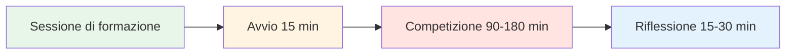

# Sessione di allenamento: Guida pratica alla competizione


## Come 4 giocatori possono allenarsi insieme regolarmente

Questa guida mostra come creare un gruppo di allenamento regolare di 4 giocatori che si sfidano su superfici e ambienti diversi per 2-4 ore. Simula una vera competizione, sviluppando al contempo sicurezza psicologica e capacità di prestazione mentale.

::: tip La filosofia della sessione di allenamento
**La competizione senza riflessione è solo gioco. L&#39;allenamento senza competizione è solo pratica.** Questo format combina entrambi gli aspetti: competere duramente, poi riflettere profondamente.
:::

## Accesso rapido

| Sezione | Scopo | Accesso |
|---------|---------|--------|
| **Trovare il tuo gruppo** | Come reclutare i 4 giocatori giusti | [Visualizza sezione](#trovare-il-tuo-gruppo) |
| **Struttura della sessione** | formati da 2 e 4 ore | [Visualizza sezione](#session-structure) |
| **Protocollo di avvio** | Come iniziare ogni sessione | [Visualizza sezione](#startup-protocol-15-min) |
| **Guida alla riflessione** | Processo di debriefing post-sessione | [Visualizza sezione](#reflection-protocol-15-30-min) |
| **Guide correlate** | Altri formati di formazione | [Viaggio mentale](/it/guides/mental-journey/) • [Workshop](/it/guides/workshop/) • [Campo di addestramento](/it/guides/training-camp/) |



## Perché 4 giocatori?

**Il numero perfetto:**
- **Formato 2v2** - Rispecchia la vera competizione
- **Opzioni di rotazione** - Cambia partner, gioca da singolo
- **Apprendimento tra pari** - Diversi stili di gioco
- **Responsabilità** - Difficile da annullare per 3 persone
- **Intimità** - Abbastanza piccolo per una condivisione profonda

::: info La dinamica di gruppo
Quattro giocatori creano l&#39;equilibrio ideale tra intensità competitiva e sicurezza psicologica. Si gareggia duramente, ma ci si sostiene anche a vicenda nella crescita.
:::

## Trovare il tuo gruppo

### Composizione ideale del gruppo

**Livello di abilità:**
- Livello simile (entro 1-2 livelli)
- Tutti impegnati nel miglioramento
- Mix di puntatori e tiratori
- Diversi stili di gioco

**Mentalità:**
- Aperto alla vulnerabilità
- Disposto a riflettere
- Competitivo ma di supporto
- Orientato alla crescita

**Logistica:**
- Vivono entro 30 minuti l&#39;uno dall&#39;altro
- Può impegnarsi a seguire un programma regolare
- Disponibilità simile

### Reclutamento del tuo gruppo

**Dove trovare i giocatori:**
- I giocatori d&#39;élite del tuo club
- Partecipanti abituali del torneo regionale
- Comunità di bocce online
- Chiedi consiglio al tuo allenatore

**L&#39;invito:**
> &quot;Sto formando un piccolo gruppo di allenamento di 4 giocatori che vogliono competere regolarmente e lavorare sulla loro mentalità. Ci incontreremo settimanalmente per 2-3 ore, giocheremo intensamente e poi rifletteremo su ciò che stiamo imparando. Ti interessa?&quot;

## Struttura della sessione

### Sessione di 2 ore

| Tempo | Attività | Durata |
|------|----------|----------|
| **Avvio** | Check-in e configurazione | 15 minuti |
| **Concorrenza** | partite 2 contro 2 | 90 minuti |
| **Riflessione** | Debriefing e apprendimento | 15 minuti |

### Sessione di 3 ore

| Tempo | Attività | Durata |
|------|----------|----------|
| **Avvio** | Check-in e configurazione | 15 minuti |
| **Round 1 della competizione** | partite 2 contro 2 | 60 minuti |
| **Rottura** | Riposo e chiacchierata informale | 15 minuti |
| **Round 2 della competizione** | Ruota i partner | 60 minuti |
| **Riflessione** | Debriefing approfondito | 30 minuti |

### Sessione di 4 ore

| Tempo | Attività | Durata |
|------|----------|----------|
| **Avvio** | Check-in e configurazione | 20 minuti |
| **Round 1 della competizione** | partite 2 contro 2 | 75 minuti |
| **Rottura** | Riposo e spuntino | 15 minuti |
| **Round 2 della competizione** | Ruota i partner | 75 minuti |
| **Rottura** | Riposo | 10 minuti |
| **Round 3 della competizione** | Singoli o sfida | 45 minuti |
| **Riflessione** | Debriefing approfondito e pianificazione | 30 minuti |


## Protocollo di avvio (15-20 minuti)

### 1. Configurazione fisica (5 min)

**Scegli il terreno:**
- Ruotare superfici diverse ogni settimana
- Varia difficoltà e condizioni
- A volte si sceglie intenzionalmente un terreno scomodo

**Prepara lo spazio:**
- Segnare chiaramente i confini
- Preparare gli strumenti di misura
- Stazione idrica
- Ombra se necessario

### 2. Check-in mentale (10 min)

**Il cerchio del check-in:**

Mettetevi in cerchio (ancora senza bocce) e procedete in questo modo:

**Ogni persona condivide:**
1. **Livello di energia** (1-10): &quot;Oggi sono a 7&quot;
2. **Stato mentale**: &quot;Mi sento concentrato&quot; o &quot;Sono distratto dallo stress lavorativo&quot;
3. **Intenzione**: &quot;Oggi voglio lavorare sulla calma dopo gli errori&quot;

**Perché è importante:**
- Sviluppa la consapevolezza dello stato mentale
- Crea empatia nel gruppo
- Imposta l&#39;attenzione individuale per la sessione
- Normalizza l&#39;essere &quot;off&quot; alcuni giorni

**Suggerimento per il facilitatore:** Fate ruotare chi inizia ogni settimana

### 3. Promemoria sulle regole di base (5 min)

**Ogni sessione, ricorda brevemente:**

::: tip Regole di base della sessione
1. **Competi duramente** - Gioca per vincere, senza trattenerti
2. **Supportare la crescita** - Aiutarsi a vicenda ad imparare
3. **Rispettare i manuali d&#39;uso** - Onorare il modo in cui ogni persona desidera essere trattata
4. **Resta presente** - Niente telefoni durante il gioco
5. **Rifletti onestamente** - Condividi ciò che sta realmente accadendo dentro di te
6. **Riservatezza** - Ciò che viene condiviso qui, rimane qui
:::

**L&#39;equilibrio:**
> &quot;Competiamo come se fosse un torneo, ma ci sosteniamo come se fossimo compagni di squadra. Duri con il gioco, morbidi con le persone.&quot;

## Regole di condotta della concorrenza

### Formato della partita

**Standard 2 contro 2:**
- Gioca fino a 13 punti
- Regole standard della boccia
- Tieni il punteggio onestamente
- Misura quando necessario (non indovinare)

**Opzioni di rotazione:**

**Settimana 1:** A+B contro C+D
**Settimana 2:** A+C contro B+D
**Settimana 3:** A+D contro B+C
**Settimana 4:** Girone all&#39;italiana singolare

### Creazione di un ambiente competitivo

::: warning Fondamentale: rendilo reale
**Questa non è una pratica casuale.** Trattala come un torneo:

✅ **Fai:**
- Mantieni il punteggio ufficiale
- Misurare con precisione
- Chiamare falli di piede
- Prendilo sul serio
- Festeggia i buoni colpi
- Mostra delusione per gli errori

❌ **Non:**
- Dare &quot;seconde possibilità&quot;
- Sii eccessivamente disinvolto
- Lascia correre le cattive chiamate
- Scherzo per tutta la partita
- Trova delle scuse
:::

### La svolta delle prestazioni mentali

**Traccia due punteggi:**

1. **Punteggio tradizionale** - Punti vinti
2. **Punteggio delle prestazioni mentali** - Quanto bene hai gestito il tuo gioco interiore

**Criteri di prestazione mentale (punteggio personale da 1 a 5 dopo ogni partita):**

| Criterio | 1 (Scarso) | 3 (Buono) | 5 (Eccellente) |
|-----------|----------|----------|---------------|
| **Resisti presente** | Mi sono soffermato sugli scatti passati | Per lo più presente | Completamente nel momento |
| **Critico interiore gestito** | Un duro dialogo interiore | Catturato e riformulato | Inner Coach usato |
| **Regolazione emotiva** | Frustrazione visibile | Rimase per lo più calmo | Calma ovunque |
| **Partner supportato** | Ignorato o incolpato | Supporto di base | Manuale utente usato |
| **Messa a fuoco** | Distratto, sfocato | Per lo più concentrato | Laser focalizzato |

**Totale:** /25 per partita

**Perché è importante:**
- Sposta l&#39;attenzione dal risultato al processo
- Sviluppa la consapevolezza del gioco mentale
- Crea responsabilità per il lavoro interiore
- Celebra le prestazioni mentali, non solo la vittoria

### Variare l&#39;ambiente

**Ruota attraverso diverse sfide:**

**Settimana 1: Terreno di casa**
- La tua pista abituale
- Condizioni confortevoli
- Focus: Costruire la fiducia

**Settimana 2: Terreno difficile**
- Superficie irregolare e impegnativa
- Focus: Regolazione emotiva, accettazione

**Settimana 3: Posizione diversa**
- Un&#39;altra pista del club
- Focus: Adattabilità

**Settimana 4: Condizioni di pressione**
- Spettatori (invita altri a guardare)
- Focus: Gestione della pressione esterna

**Settimana 5: Sfida meteorologica**
- Vento, caldo o freddo
- Focus: Forza mentale

**Settimana 6: Pressione del tempo**
- Orologio dei tiri (30 secondi per tiro)
- Focus: Prendere decisioni sotto pressione

```mermaid
graph TD
    A[Variare l&#39;ambiente] --> B[Diverse superfici]
    A --> C[Luoghi diversi]
    A --> D[Condizioni diverse]
    A --> E[Diverse pressioni]

    B --> F[Sviluppare l&#39;adattabilità]
    C --> F
    D --> F
    E --> F

    style A fill:#e8f5e9
    style F fill:#fff4e1


## Reflection Protocol (15-30 minutes)

**Critical:** This is where the learning happens. Don't skip it!

### Short Reflection (15 min)

**After each game, quick debrief:**

**Go around the circle, each person shares:**

1. **Mental Performance Score** (1-5): "I give myself a 4 today"
2. **One thing that went well mentally**: "I stayed calm after my miss in the 3rd end"
3. **One thing to work on**: "I need to catch my inner critic faster"

**Group discussion:**
- "What did you notice about your inner game today?"
- "When did you feel most in the zone?"
- "When did you lose focus?"

### Deep Reflection (30 min)

**After final game, deeper debrief:**

**Structure:**

**1. Individual Journaling (5 min)**

Write privately:
- What happened in my mind during pressure moments?
- When did I use my Inner Coach vs. Inner Critic?
- How did I support my partner?
- What pattern am I noticing about myself?

**2. Pair Sharing (10 min)**

Partner up, share:
- One insight from journaling
- One question you're sitting with
- One commitment for next session

**3. Group Integration (15 min)**

Full circle:
- Each person shares ONE key learning
- Group identifies themes
- Discuss: "What are we learning as a group?"
- Set focus for next session

**Closing:**
- Thank each other for showing up
- Confirm next session date/time
- One-word check-out: "How are you leaving?"


## User Manual Integration

### Creating Your User Manuals

**In your first session together, each person completes:**

| Section | Prompt | Example |
|---------|--------|---------|
| **My Stress Signature** | "When I'm anxious, I..." | "...go completely quiet" |
| **How to Support Me** | "After a miss, I need..." | "...silence, not encouragement" |
| **My Trigger** | "I get defensive when..." | "...someone questions my shot choice" |
| **My Reset Signal** | "When I need a mental reset, I..." | "...touch my boules and take 3 breaths" |

**Share with the group and keep copies.**

### Using User Manuals During Play

**During competition:**
- Partner knows how to support you
- Teammates respect your needs
- No guessing about what helps

**Example:**
- Marc's User Manual says: "After a miss, I need 30 seconds of silence"
- His partner knows: Don't immediately encourage, give space
- Result: Marc feels understood, recovers faster

**This is psychological safety in action.**

## Advanced Variations

### The Mental Challenge Week

**Once a month, add a mental challenge:**

**Week 1: Silent Game**
- No talking during play
- Only non-verbal communication
- Focus: Internal awareness

**Week 2: Positive Self-Talk Only**
- Catch and reframe every negative thought
- Say Inner Coach phrase out loud
- Focus: Cognitive restructuring

**Week 3: Pressure Simulation**
- Play with spectators
- Announce score loudly
- Focus: External pressure management

**Week 4: Gratitude Game**
- After each end, state one thing you're grateful for
- Focus: Positive mindset

### The Vulnerability Round

**Every 4-6 weeks, dedicate a session to deeper sharing:**

**Format:**
- 30 min: Play one game
- 60 min: Deep reflection using [Workshop](./workshop) activities
- 30 min: Play final game applying insights

**Activities to use:**
- Fear in a Hat
- Reframing Inner Critic
- The Iceberg
- User Manual updates

**Why this matters:**
- Prevents the group from becoming just "playing buddies"
- Maintains psychological safety
- Deepens learning
- Builds authentic connection

## Tracking Progress

### Individual Tracking

**Keep a training journal:**

After each session, record:
- Date, location, conditions
- Partners and opponents
- Traditional score
- Mental performance score (1-5)
- Key insights
- Patterns noticed
- Commitments for next time

**Monthly review:**
- What's improving?
- What patterns keep showing up?
- What's my mental performance trend?
- What do I need to focus on?

### Group Tracking

**Shared document (Google Sheet):**

| Date | Location | Teams | Score | Mental Perf | Key Learning |
|------|----------|-------|-------|-------------|--------------|
| Jan 7 | Club A | A+B vs C+D | 13-11 | 4.2 avg | Staying calm in wind |
| Jan 14 | Club B | A+C vs B+D | 13-8 | 3.8 avg | Managing inner critic |

**Benefits:**
- See progress over time
- Notice group patterns
- Celebrate improvements
- Identify focus areas

## Sustaining the Group

### Commitment Agreement

**At the start, agree on:**

**Frequency:**
- Weekly? Bi-weekly? Monthly?
- Same day/time each week?
- How many sessions committed to? (suggest minimum 8-12)

**Cancellation Policy:**
- 24-hour notice required
- Maximum 2 cancellations per person per quarter
- If someone cancels repeatedly, have a conversation

**Rotation:**
- Who chooses location each week?
- Who facilitates reflection?
- How do we keep it fresh?

### Handling Conflicts

**When tension arises:**

::: warning Address It, Don't Avoid It
**The mistake:** Letting resentment build

**The solution:** Use it as a learning moment

**Script:**
> "I notice some tension. Can we pause and talk about what's happening? This is exactly the kind of moment we can learn from."
:::

**Common conflicts:**
- Disagreement on calls
- Perceived unfairness
- Personality clashes
- Competitive intensity

**Resolution process:**
1. Pause the game
2. Each person shares their perspective
3. Group validates both sides
4. Agree on how to move forward
5. Return to play

**This builds psychological safety.**

### Keeping It Fresh

**Avoid stagnation:**

**Every 8-12 weeks, change something:**
- Invite a 5th player for variety
- Play at a tournament together
- Do a mini training camp (full day)
- Bring in a guest coach
- Try a new format (singles, different scoring)
- Do a deep vulnerability session

**The goal:** Keep learning, keep growing, keep it interesting

## Integration with Tournaments

### Pre-Tournament Prep

**2 weeks before a major tournament:**

**Session focus:**
- Play on similar terrain
- Simulate tournament pressure
- Practice competition-day nutrition
- Rehearse pre-shot routines
- Visualize success

**Mental preparation:**
- What's your intention for the tournament?
- What's your Inner Coach phrase?
- What's your reset signal?
- How will you handle pressure?

### Post-Tournament Debrief

**After a tournament:**

**Dedicate a session to reflection:**

**Structure:**
- 30 min: Share tournament experience
- 30 min: What worked? What didn't?
- 30 min: What did you learn about yourself?
- 30 min: Play a game applying learnings

**Questions:**
- When did you feel most in the zone?
- When did you lose it?
- How did you handle pressure?
- What would you do differently?
- What are you proud of?

**This cements learning and builds resilience.**

## Resources & Tools

### From This Site

- [Workshop Guide](./workshop) - Deep facilitation protocols
- [Training Camp Guide](./training-camp) - Weekend intensive format
- [Nutrition](./education/nutrition/) - Competition-day protocols
- [Mental Strength](./education/mental-game/mental-strength/) - Inner game concepts
- [Mindfulness](./education/mental-game/mindfulness/) - Presence techniques
- [Tactics](./education/technique/tactics/) - Strategic thinking

### Recommended Tools

**Journaling:**
- Physical notebook or digital app
- Prompt: "What happened in my mind today?"

**Video Analysis:**
- Phone camera on tripod
- Review technique and body language
- Notice patterns

**Meditation Apps:**
- Headspace, Calm, Insight Timer
- 5-10 minutes before sessions

**Tracking:**
- Google Sheets for group data
- Personal spreadsheet for trends

## Success Stories

### Example: The Stockholm Four

**Group:** 4 elite players, ages 28-45
**Frequency:** Weekly, 3 hours
**Duration:** 18 months

**Results:**
- All 4 improved tournament rankings
- 2 made national team
- Mental performance scores increased from 3.2 to 4.5 average
- Group still meets 3 years later

**Key factors:**
- Consistent commitment
- Deep vulnerability work
- Honest reflection
- Mutual support

### Example: The Barcelona Crew

**Group:** 4 club players wanting to compete regionally
**Frequency:** Bi-weekly, 2 hours
**Duration:** 6 months

**Results:**
- Confidence increased dramatically
- All 4 entered first regional tournament
- 1 placed in top 8
- Group expanded to 8 players

**Key factors:**
- Started small and built trust
- Focused on mental game
- Celebrated small wins
- Kept it fun

## Common Challenges

### "We just end up playing, not reflecting"

**Solution:**
- Set a timer
- Designate a "reflection keeper"
- Make reflection non-negotiable
- Start with just 10 minutes

### "One person dominates"

**Solution:**
- Use structured sharing (everyone gets 2 minutes)
- Rotate who speaks first
- Gently redirect: "Let's hear from others"

### "It's getting stale"

**Solution:**
- Change locations
- Try new formats
- Do a vulnerability session
- Invite a guest
- Take a break and come back fresh

### "Someone's not committed"

**Solution:**
- Have an honest conversation
- Revisit commitment agreement
- Consider finding a replacement
- It's okay if someone leaves

## Getting Started Checklist

::: details Your First Session Checklist

**Before Session 1:**
- [ ] Find your 4 players
- [ ] Agree on frequency and duration
- [ ] Choose first location
- [ ] Share this guide with everyone
- [ ] Create group chat

**Session 1 Agenda:**
- [ ] Introductions and intentions
- [ ] Agree on ground rules
- [ ] Complete User Manuals
- [ ] Play first game
- [ ] Short reflection
- [ ] Schedule next 4 sessions

**Ongoing:**
- [ ] Rotate locations
- [ ] Track progress
- [ ] Deep reflection every 4-6 weeks
- [ ] Adjust format as needed
- [ ] Celebrate improvements
:::

## Final Thoughts

::: tip The Power of Regular Practice
**Consistency beats intensity.** Four players meeting regularly, competing hard, and reflecting deeply will improve faster than sporadic tournament play alone.

**Why?**
- Regular feedback loop
- Psychological safety to experiment
- Accountability and support
- Deliberate practice on mental game
- Community and connection

**The result:** You don't just get better at pétanque. You become a more complete competitor.
:::


