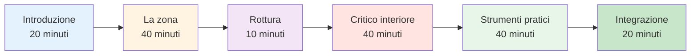

# Guida alla sessione: Introduzione al gioco mentale (2-3 ore)

<AdBanner />

## Panoramica

Questa guida ti aiuterà a condurre una sessione introduttiva di 2-3 ore sull&#39;allenamento mentale per giocatori di pétanque. Perfetta per allenatori, dirigenti di club o giocatori esperti che desiderano introdurre l&#39;allenamento mentale alla propria squadra.

::: tip Due sezioni in questa guida
- **[Per i partecipanti](#for-participants)** - Cosa impareranno i giocatori
- **[Per i facilitatori](#for-facilitators)** - Come condurre la sessione
:::

## Accesso rapido

| Sezione | Scopo | Accesso |
|---------|---------|--------|
| **Per i partecipanti** | Cosa aspettarsi dalla sessione | [Visualizza sezione](#for-participants) |
| **Per i facilitatori** | Piano completo della sessione e tempistica | [Visualizza sezione](#for-facilitators) |
| **Materiali della sessione** | Guide, diapositive e fogli di lavoro | [Visualizza materiali](/it/mental-journey/materials) |
| **Lista di controllo per la preparazione** | Cosa preparare prima della sessione | [Visualizza la lista di controllo](#preparazione-1-settimana-prima) |

---

## Per i partecipanti

### Cosa aspettarsi

Questa sessione introduce il gioco mentale della pétanque attraverso discussioni, esercizi e tecniche pratiche che puoi utilizzare immediatamente.

**Imparerai:**
- Perché l&#39;allenamento mentale è importante per le prestazioni
- La differenza tra &quot;modalità tecnica&quot; e &quot;modalità di flusso&quot;
- Come riconoscere e gestire il tuo critico interiore
- Semplici tecniche per la gestione della pressione
- Una routine di base prima del tiro

**Cosa ti servirà:**
- Mente aperta e disponibilità a condividere
- Quaderno e penna
- Le tue esperienze personali da discutere
- 2-3 ore di tempo concentrato

### Struttura della sessione



### Concetti chiave che esplorerai

#### 1. La zona (stato di flusso)
- Cosa si prova quando tutto funziona
- Perché pensare alla tecnica compromette la prestazione
- Il &quot;passaggio&quot; dalla pianificazione all&#39;esecuzione

#### 2. Il critico interiore
- Come il dialogo interiore negativo influisce sulle prestazioni
- La differenza tra Critico Interiore e Coach Interiore
- Osservazione neutrale vs giudizio severo

#### 3. Risposta alla pressione
- Perché giochi in modo diverso in competizione
- Segni fisici di pressione
- Tecniche di ripristino rapido

#### 4. Strumenti pratici
- Reset a 3 respiri
- Semplice routine pre-tiro
- Protocollo di recupero degli errori

### Cosa portare

**Necessario:**
- Te stesso e le tue esperienze
- Disponibilità a partecipare

**Opzionale:**
- Esempi di sfide mentali che affronti
- Domande su situazioni specifiche
- Quaderno per appunti personali

### Dopo la sessione

Riceverai:
- Riepilogo dei concetti chiave
- Esercizi pratici per la settimana
- Link ai moduli didattici dettagliati
- Modello di obiettivo per lo sviluppo del gioco mentale

<AdInArticle />

---

## Per i facilitatori

### Lista di controllo per la preparazione

**1 settimana prima:**
- [ ] Prenota la stanza per 2-3 ore
- [ ] Invita 6-12 partecipanti
- [ ] Aggiungi ai preferiti le pagine dei materiali (vedi [Materiali](/it/mental-journey/materials))
- [ ] Leggi attentamente questa guida
- [ ] Preparare una lavagna a fogli mobili o una lavagna bianca

**1 giorno prima:**
- [ ] Conferma la presenza
- [ ] Allestimento della sala (posti a sedere in cerchio)
- [ ] Prova qualsiasi tecnologia (diapositive, ecc.)
- [ ] Preparare i materiali

**1 ora prima:**
- [ ] Arrivare presto
- [ ] Disporre i posti a sedere in cerchio
- [ ] Materiali di installazione
- [ ] Concentrati

### Il tuo ruolo di facilitatore

::: warning Importante
**Non** sei un terapeuta o un coach tecnico. Sei un **facilitatore** che:
- Discussione sulle guide
- Crea uno spazio sicuro
- Collega i concetti all&#39;esperienza
- Gestisce le dinamiche di gruppo
:::

**Competenze chiave:**
- Ascolto attivo
- Presenza neutrale
- Gestire diverse personalità
- Sapere quando andare avanti

### Piano dettagliato della sessione

---

#### Parte 1: Introduzione (20 minuti)

**Obiettivi:**
- Creare sicurezza psicologica
- Definisci le aspettative
- Costruisci una connessione di gruppo

**Sceneggiatura:**

&quot;Benvenuti a tutti. Questa sessione riguarda il gioco mentale della pétanque: i pensieri, le emozioni e gli schemi che influenzano la vostra prestazione.

**Regole di base:**
1. Ciò che viene condiviso qui rimane qui
2. Nessun giudizio sulle esperienze degli altri
3. La partecipazione è volontaria
4. Non ci sono risposte sbagliate

**Gioco veloce:** Nome, da quanto tempo giochi, una sfida mentale che affronti.

**Note del facilitatore:**
- Vai prima alla vulnerabilità del modello
- Mantieni le presentazioni brevi (1 minuto ciascuna)
- Nota temi comuni
- Convalida tutte le risposte

---

#### Parte 2: Lo stato di zona/flusso (40 minuti)

**Obiettivi:**
- Comprendere gli stati di flusso
- Riconoscere la modalità tecnica rispetto a quella di flusso
- Impara il concetto di &quot;switch&quot;

**Domanda di apertura:**
&quot;Pensa a una volta in cui hai giocato la tua migliore partita a bocce. Che sensazioni hai provato? Cosa è stato diverso?&quot;

**Spunti di discussione:**
1. &quot;Quanti di voi hanno giocato partite in cui tutto è andato per il verso giusto?&quot;
2. &quot;A cosa pensavi in quei momenti?&quot;
3. &quot;In che cosa è diverso da quando sei in difficoltà?&quot;

**Punti chiave dell&#39;insegnamento:**

Utilizzare la lavagna per disegnare:
```
PLANNING MODE          →    EXECUTION MODE
(Outside circle)            (Inside circle)
- Analyze situation         - Eyes on target
- Choose strategy           - Trust training
- Decide throw type         - Automatic movement
```

**Esercizio: The Switch (10 minuti)**

&quot;Pratichiamo il momento di commutazione:
1. In piedi
2. Immagina di essere fuori dal cerchio: pensa a uno scatto
3. Fai un respiro
4. Fai un passo avanti (nel cerchio immaginario)
5. Mentre fai un passo, lascia andare l&#39;analisi
6. Concentrati solo su un bersaglio immaginario&quot;

**Debriefing:**
- &quot;Cosa hai notato?&quot;
- &quot;È stato facile o difficile smettere di pensare?&quot;
- &quot;Come potrebbe applicarsi questo ai giochi reali?&quot;

---

#### Parte 3: Pausa (10 minuti)

**Azioni del facilitatore:**
- Incoraggiare la discussione informale
- Nota l&#39;energia del gruppo
- Preparati per la prossima sezione

---

#### Parte 4: Il critico interiore (40 minuti)

**Obiettivi:**
- Riconoscere i modelli di dialogo interiore negativo
- Distinguere il critico interiore dal coach interiore
- Praticare l&#39;osservazione neutrale

**Apertura:**
&quot;Abbiamo tutti una voce interiore che commenta le nostre prestazioni. A volte è utile, a volte è dura. Esploriamola.&quot;

**Esercizio: Inventario del critico interiore (15 minuti)**

&quot;Sul tuo foglio scrivi:
1. Cosa dice la tua voce interiore dopo un brutto lancio
2. Cosa dice quando sei sotto pressione
3. Cosa dice sulle tue capacità&quot;

*Dedica 5 minuti alla scrittura*

&quot;Ora, chi è disposto a condividere un esempio?&quot;

**Note del facilitatore:**
- Normalizzare i dialoghi interiori duri
- Non cercare di &quot;aggiustare&quot; nessuno
- Cercare modelli comuni

**Insegnamento: Critico Interiore vs Coach Interiore (15 minuti)**

Disegna due colonne sulla lavagna:

| Critico interiore | Coach interiore |
|--------------|-------------|
| &quot;Come hai potuto non accorgertene?!&quot; | &quot;Quello è andato a sinistra&quot; |
| &quot;Ti strozzi sempre&quot; | &quot;Proviamo di nuovo&quot; |
| &quot;Sei terribile&quot; | &quot;Cosa posso imparare?&quot; |

**Discussione:**
- &quot;Hai notato la differenza?&quot;
- &quot;Quale voce aiuta la performance?&quot;
- &quot;Puoi cambiare la voce?&quot;

**Esercitazione: Riformulazione (10 minuti)**

&quot;Prendi una delle affermazioni del tuo Critico Interiore. Come la direbbe un Coach Interiore?&quot;

Condividi esempi.

---

#### Parte 5: Strumenti pratici (40 minuti)

**Obiettivi:**
- Impara il reset a 3 respiri
- Crea una semplice routine pre-tiro
- Comprendere il recupero degli errori

**Strumento 1: Reset dei 3 respiri (10 minuti)**

&quot;Questo è il pulsante di ripristino di emergenza. Usalo quando senti che la pressione sta aumentando.&quot;

**Dimostrare:**
1. Inspira per 4 conteggi
2. Mantieni la posizione per 2 conteggi
3. Espirare per 6 conteggi
4. Ripeti 3 volte

&quot;Adesso facciamo pratica insieme.&quot;

*Guida il gruppo attraverso 3 cicli*

**Debriefing:**
- &quot;Cosa hai notato nel tuo corpo?&quot;
- &quot;Quando potresti usarlo?&quot;

**Strumento 2: Semplice routine pre-tiro (15 minuti)**

&quot;Una routine ti aiuta a passare dalla pianificazione all&#39;esecuzione in modo coerente.&quot;

**Struttura di base:**
```
Outside Circle (Planning):
- Look at situation
- Decide on throw
- See the result in your mind

Walking to Circle (Transition):
- One deep breath
- Let go of analysis

Inside Circle (Execution):
- Eyes on target only
- Trust your training
- Execute
```

**Esercizio:**
&quot;Crea la tua routine in 3 fasi. Scrivila.&quot;

Condividi esempi.

**Strumento 3: Protocollo di recupero degli errori (15 minuti)**

&quot;I giocatori d&#39;élite non commettono meno errori. Recuperano più velocemente.&quot;

**Protocollo in 3 fasi:**
1. **Osserva** - Esponi il fatto in modo neutrale (&quot;Quello è andato a sinistra&quot;)
2. **Impara** - Estrai informazioni (&quot;Il vento è più forte di quanto pensassi&quot;)
3. **Reset** - Muoviti in avanti (reset con 3 respiri, occhi in avanti)

**Pratica:**
&quot;Pensa a un errore recente. Esegui i 3 passaggi.&quot;

---

#### Parte 6: Integrazione e chiusura (20 minuti)

**Obiettivi:**
- Consolidare l&#39;apprendimento
- Creare piani d&#39;azione
- Fornire risorse

**Domande di riflessione:**
1. &quot;Qual è l&#39;intuizione che stai traendo da questa esperienza?&quot;
2. &quot;Qual è la cosa che proverai questa settimana?&quot;
3. &quot;Quali domande restano?&quot;

**Pianificazione dell&#39;azione (10 minuti)**

&quot;Sul tuo volantino scrivi:
1. Una tecnica che metterai in pratica questa settimana
2. Quando/dove lo praticherai
3. Come monitorerai i tuoi progressi&quot;

**Risorse:**
- Distribuire il foglio riassuntivo
- Condividi il sito web: carreau.app
- Modulo di partenza consigliato: [The Zone](/it/education/the-zone/)

**Cerchio di chiusura:**
&quot;Una parola per descrivere come ti senti in questo momento.&quot;

**Parole finali:**
&quot;L&#39;allenamento mentale è un&#39;abilità come qualsiasi altra: richiede pratica. Inizia in piccolo, sii paziente con te stesso e nota i cambiamenti. Grazie per la tua disponibilità oggi.&quot;

---

### Suggerimenti per il facilitatore

#### Gestire situazioni difficili

**Se qualcuno domina:**
- &quot;Grazie [nome]. Sentiamo cosa ne pensano gli altri.&quot;
- Utilizzare turni strutturati

**Se qualcuno oppone resistenza:**
- Non discutere
- &quot;È una prospettiva valida. Cosa ne pensano gli altri?&quot;
- Allinearsi con le loro preoccupazioni

**Se qualcuno si emoziona:**
- Normalizzalo
- &quot;Questo tocca qualcosa di reale. Grazie per averlo condiviso.&quot;
- Non cercare di risolvere

**Se la discussione si blocca:**
- Utilizzare prompt specifici
- Condividi il tuo esempio
- Passare a un esercizio

#### Gestione dell&#39;energia

**Alta energia:** Usa esercizi e movimento
**Bassa energia:** Fai domande provocatorie
**Sparsi:** Riportare alla struttura
**Tempo:** Usa l&#39;umorismo o la pausa

### Post-sessione

**Seguito:**
- Invia un&#39;e-mail di riepilogo entro 24 ore
- Includi link alle risorse
- Offriti di rispondere alle domande
- Pianifica una sessione di follow-up facoltativa

**Autoriflessione:**
- Cosa ha funzionato bene?
- Cosa cambieresti?
- Cosa ti ha sorpreso?
- Cosa hai imparato?

<AdBanner />

---

## Materiali

- [Guida per i partecipanti](/it/mental-journey/materials#participant-guide)
- [Diapositive per il facilitatore](/it/mental-journey/materials#facilitator-slides)
- [Scheda riassuntiva](/it/mental-journey/materials#summary-sheet)
- [Schede di esercizi](/it/mental-journey/materials#exercise-worksheets)

---

::: tip Pronti a facilitare?
1. Leggi attentamente questa guida
2. Scarica i materiali
3. Esercitati tu stesso negli esercizi
4. Pianifica la tua sessione
5. Fidati del processo
:::

