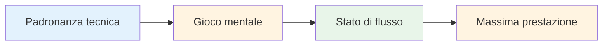

# Notizia
<AdBanner />

## Benvenuti alla Pétanque Academy

::: tip Lancio entusiasmante! 🎉
**Questa è la prima startup!**

Siamo entusiasti di lanciare la Pétanque Academy, una nuova iniziativa volta ad aiutare i giocatori di pétanque d&#39;élite a raggiungere il loro pieno potenziale.
:::

<AdInArticle />

```mermaid
graph TD
    A[Lancio dell&#39;Accademia di Bocce] --> B[Piattaforma educativa]
    A --> C[Programma del workshop]
    A --> D[Costruzione della comunità]

    B --> E[Contenuto del gioco mentale]
    B --> F[Guide nutrizionali]
    B --> G[Metodi di allenamento]

    C --> H[Forum dei giocatori d&#39;élite]
    C --> I[Apprendimento tra pari]

    D --> J[Crescita condivisa]

    style A fill:#fff4e1
    style B fill:#e3f2fd
    style C fill:#e8f5e9
    style D fill:#f3e5f5
```

## Cosa sta arrivando

::: info Rimani sintonizzato per
- 📅 **Prossimi workshop** - Sessioni in piccoli gruppi per giocatori d&#39;élite
- 📚 **Nuovi contenuti didattici** - Mental game, alimentazione, metodi di allenamento
- 🎯 **Eventi della community** - Entra in contatto con giocatori che la pensano come te
- 💡 **Storie e approfondimenti dei giocatori** - Impara dalle esperienze degli altri
:::

## La nostra missione

::: tip Il livello successivo
I giocatori d&#39;élite hanno già padroneggiato la tecnica. La prossima svolta arriva dal gioco mentale: imparare ad accedere a stati di flusso, gestire la pressione e dare sempre il massimo.
:::

## Per iniziare

Mentre aspetti gli annunci dei workshop, esplora la nostra sezione didattica completa:

| Sezione | Cosa imparerai | Inizia qui |
|---------|-------------------|------------|
| **La Zona** | Come entrare negli stati di flusso in modo coerente | [Comprendere il flusso](/it/educazione/la-zona/) |
| **Forza mentale** | Gestire la pressione e creare routine | [Gioco mentale](/it/educazione/forza-mentale/) |
| **Consapevolezza** | Consapevolezza del momento presente per la performance | [Pratica della consapevolezza](/it/educazione/consapevolezza/) |
| **Nutrizione** | Alimenta il tuo cervello per una concentrazione stabile | [Nutrizione di precisione](/it/educazione/nutrizione/) |
| **Obiettivi** | Stabilire e raggiungere obiettivi significativi | [Fissazione degli obiettivi](/it/istruzione/obiettivi/) |

::: info Unisciti al viaggio
Questo è solo l&#39;inizio. Stiamo creando qualcosa di speciale per i giocatori d&#39;élite che vogliono fare il passo successivo. Benvenuti alla Pétanque Academy.
:::

<AdBanner />
