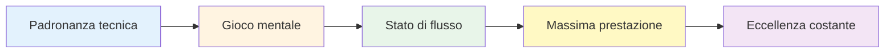

# Notizie e aggiornamenti

<AdBanner />

## Benvenuti alla Pétanque Academy

::: tip La piattaforma è ora attiva! 🎉
**La Pétanque Academy è ora pienamente operativa!**

Abbiamo lanciato una piattaforma completa dedicata ad aiutare i giocatori di pétanque d&#39;élite a raggiungere il loro pieno potenziale attraverso la padronanza del gioco mentale, un allenamento strutturato e strumenti pratici.
:::

<AdInArticle />

```mermaid
graph TD
    A[Pétanque Academy] --> B[Piattaforma educativa]
    A --> C[Strumenti di formazione]
    A --> D[Programmi di workshop]

    B --> E[8 moduli completi]
    B --> F[Padronanza del gioco mentale]
    B --> G[Fondamenti tecnici]

    C --> H[Modelli di obiettivi]
    C --> I[Modelli di diario]
    C --> J[Piani di allenamento]

    D --> K[Forum dei giocatori d&#39;élite]
    D --> L[Campi di addestramento]

    style A fill:#fff4e1
    style B fill:#e3f2fd
    style C fill:#e8f5e9
    style D fill:#f3e5f5
```

## Cosa è disponibile ora

### 📚 Piattaforma educativa completa

Abbiamo lanciato **8 moduli didattici completi** che coprono tutto, dagli stati di flusso alla nutrizione:

| Modulo | Cosa c&#39;è dentro | Caratteristiche principali |
|--------|---------------|--------------|
| **[La Zona](/it/education/the-zone/)** | Padronanza dello stato di flusso | 4 guide dettagliate su come inserire e mantenere il flusso |
| **[Forza mentale](/it/education/mental-strength/)** | Gestione della pressione | Routine pre-tiro, gestione del critico interiore |
| **[Mindfulness](/it/education/mindfulness/)** | Consapevolezza del momento presente | Pratiche quotidiane, tecniche di competizione |
| **[Obiettivi](/it/education/goals/)** | Pianificazione strategica | Obiettivi SMART, gerarchia, sistemi di monitoraggio |
| **[Tattiche](/it/education/tactics/)** | Strategia di gioco | Decisione, probabilità, posizionamento |
| **[Giocatore di squadra](/it/education/giocatore-di-squadra/)** | capacità di collaborazione | Comunicazione, fiducia, dinamiche di squadra |
| **[Formazione](/it/education/training/)** | Metodi di pratica | Esercizi, pratica deliberata, progressione |
| **[Nutrizione](/it/education/nutrition/)** | Carburante ad alte prestazioni | Gestione della glicemia, nutrizione per la competizione |

### 🛠️ Strumenti pratici

**Modelli e programmi pronti all&#39;uso:**

- **[Workshop](/it/workshop)** - Sessioni strutturate di 3 ore per lo sviluppo del gioco mentale
- **[Training Camp](/it/training-camp)** - Programmi intensivi del fine settimana per giocatori d&#39;élite
- **[Sessione di formazione](/it/training-session)** - Framework di pratica da 2-3 ore
- **[Modello di obiettivo](/it/goal-template)** - Sistema completo di definizione e monitoraggio degli obiettivi
- **[Modello di diario](/it/diary-template)** - Diario di pratica e riflessione quotidiana

### 🎯 Guida tecnica

La sezione **[Consigli tecnici](/it/technical/)** include:
- Guida completa a tutti i lanci di bocce
- Strategie di selezione della traiettoria
- Tecniche di controllo dello spin
- Quadri di selezione degli scatti

### 🍽️ Nutrizione per le prestazioni

**[Cibo](/it/cibo)** - Guida completa a:
- Gestione della glicemia per una concentrazione stabile
- Strategie nutrizionali pre-gara
- Ottimizzazione energetica per i tornei

### 📝 Articoli e approfondimenti

**NOVITÀ: 14 articoli approfonditi** che trattano argomenti sui giochi mentali:

| Categoria | Articoli |
|----------|----------|
| **Comprendere il critico interiore** | [Critico Interiore](/it/blog/critico-interiore) - Padroneggia il tuo dialogo interiore |
| **Creazione di routine pre-tiro** | [Routine pre-tiro](/it/blog/pre-shot-routines) - Crea coerenza |
| **Gestione della pressione** | [Gestione della pressione](/it/blog/pressure-management) - Agire sotto stress |
| **Psicologia della prestazione** | [Stati di flusso](/it/blog/flow-state-science) • [Mindfulness](/it/blog/mindfulness-competition) • [Fissazione degli obiettivi](/it/blog/elite-goal-setting) • [Resilienza mentale](/it/blog/mental-resilience) |
| **Dinamiche di squadra** | [Comunicazione](/it/blog/team-communication) • [Chimica di squadra](/it/blog/team-chemistry) • [Leadership](/it/blog/team-leadership) |
| **Formazione e sviluppo** | [Errori nell&#39;allenamento mentale](/it/blog/mental-training-mistakes) • [Struttura dell&#39;allenamento](/it/blog/practice-structure) • [Preparazione alla competizione](/it/blog/competition-prep) |

➡️ **[Sfoglia tutti gli articoli](/it/blog/)**

### 📖 Risorse

**Casi di studio e testimonianze:**

- **[Casi di studio](/it/casi-di-studio)** - Esempi reali di giocatori d&#39;élite che utilizzano l&#39;allenamento del gioco mentale
- **[Testimonianze](/it/testimonianze)** - Feedback dei giocatori che hanno implementato questi metodi

## La nostra missione

::: tip Il livello successivo
I giocatori d&#39;élite hanno già padroneggiato la tecnica. La prossima svolta arriva dal **gioco mentale**: imparare ad accedere a stati di flusso, gestire la pressione e dare costantemente il massimo.

**La Pétanque Academy fornisce la tabella di marcia completa.**
:::

## Statistiche della piattaforma

::: info Cosa abbiamo costruito
- ✅ **8 moduli didattici** con oltre 30 guide dettagliate
- ✅ **5 strumenti pratici** pronti all&#39;uso
- ✅ **10 lingue** - accessibile in tutto il mondo
- ✅ **Oltre 100 pagine** di contenuti di livello élite
- ✅ **Diagrammi a sirena** per l&#39;apprendimento visivo
- ✅ **Copia e incolla i modelli** per un utilizzo immediato
:::

## Come iniziare

### Per i nuovi visitatori

**Iniziamo dalle basi:**

1. **[Ambizione](/it/ambizione)** - Comprendere la filosofia alla base dello sviluppo delle élite
2. **[The Zone](/it/education/the-zone/)** - Scopri gli stati di flusso
3. **[Modello di obiettivo](/it/goal-template)** - Imposta i tuoi primi obiettivi strutturati

### Per giocatori esperti

**Approfondisci argomenti avanzati:**

1. **[Forza mentale](/it/education/mental-strength/)** - Gestire le situazioni di pressione
2. **[Tattiche](/it/education/tactics/)** - Affinare il processo decisionale strategico
3. **[Workshop](/it/workshop)** - Implementare sessioni di gioco mentale strutturate

### Per i team

**Costruire l&#39;eccellenza collettiva:**

1. **[Giocatore di squadra](/it/education/team-player/)** - Migliora le dinamiche di squadra
2. **[Training Camp](/it/training-camp)** - Organizzare intensivi nel fine settimana
3. **[Sessione di formazione](/it/training-session)** - Strutturare le pratiche di squadra

## Cosa rende questo diverso

::: warning Perché la Pétanque Academy si distingue
**La maggior parte degli allenamenti si concentra sulla tecnica. Noi ci concentriamo su ciò di cui i giocatori d&#39;élite hanno realmente bisogno:**

1. **Padronanza del gioco mentale** - Il vero elemento differenziante ad alti livelli
2. **Strumenti pratici** - Non solo teoria, ma modelli pronti all&#39;uso
3. **Programmi strutturati** - Strutture chiare per workshop e campi
4. **Basato su prove** - Basato sulla psicologia dello sport e sulla ricerca sullo stato di flusso
5. **Incentrato sull&#39;élite** - Progettato per i giocatori che hanno già padroneggiato le basi
:::

## Partecipa

**Vuoi contribuire o fornire un feedback?**

Visita la nostra pagina **[Informazioni](/it/about)** per:
- Scopri di più sulla piattaforma
- Condividi il tuo feedback
- Richiedi contenuti specifici
- Connettiti con noi

---

::: tip Inizia il tuo viaggio oggi
Tutto ciò che ti serve per portare il tuo gioco al livello successivo è già qui. Scegli un modulo, scarica un modello e inizia a implementarlo.

**Benvenuti alla Pétanque Academy, dove i giocatori d&#39;élite diventano eccezionali.**
:::

<AdBanner />
