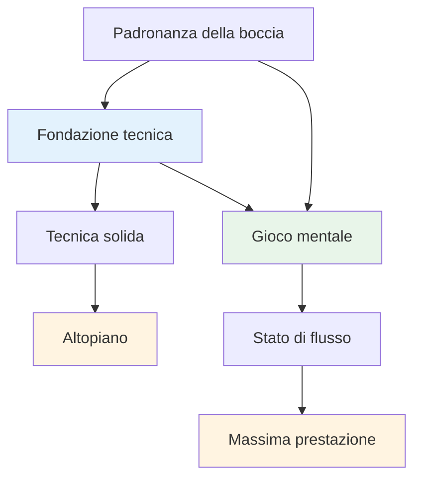
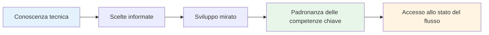

# Consulenza tecnica

## Una nota sulla tecnica

Sebbene il nostro obiettivo principale sia il gioco mentale e lo stato di flusso, riconosciamo che la tecnica è la base su cui si costruisce tutto il resto.

::: info La nostra filosofia
**La tecnica è la base, ma il flusso è il limite.** Per raggiungere un livello d&#39;élite è necessaria una tecnica solida, ma è la padronanza mentale che ti porta oltre.
:::

## L&#39;errore più comune nella formazione tecnica

::: info Questa sezione è per giocatori esperti
Se sei alle prime armi con la pétanque, dovrai naturalmente sviluppare la tecnica di base partendo da zero, e questo è un percorso diverso.

**Questo consiglio è per giocatori che giocano da anni** e hanno già una tecnica consolidata che risulta naturale, rilassata e affidabile. Hai trovato il tuo modo di lanciare. Ora la domanda è: come puoi crescere da qui?
:::

::: warning La trappola comune
Quando i giocatori esperti vogliono migliorare, spesso tornano alle basi: regolano la presa, il movimento del braccio, il punto di rilascio, la posizione del corpo. Ore di esercizi. Infinite modifiche.

**Ma hanno saltato la domanda più importante:** Cosa vuoi esattamente che faccia la boccia?
:::

Prima di mettere a punto la tecnica, devi avere ben chiaro il **risultato** che vuoi ottenere. Non &quot;Voglio colpire di più&quot; o &quot;Voglio essere più costante&quot;: quelli non sono risultati, sono desideri.

Un risultato reale si presenta così:
- &quot;Voglio un pallonetto ad arco alto che si fermi entro 20 cm dal punto in cui atterra&quot;
- &quot;Voglio un tiro ondulato che curvi a sinistra su questo tipo di terreno&quot;
- &quot;Voglio un tiro morbido in avanti che tocchi appena la boccia bersaglio&quot;

**Per prima cosa, esplora la [Tavolozza dei Lanci](/it/technical/throws)** per capire cosa è possibile fare. Poi decidi quale lancio specifico vuoi aggiungere al tuo repertorio. Solo allora dovresti iniziare a lavorare su come il tuo braccio, il tuo polso e il tuo corpo devono muoversi per ottenere quel risultato.

## Il modo giusto per lavorare sulla tecnica

Non stiamo dicendo che non dovresti mai lavorare sul braccio, sul polso, sul rilascio o sulla posizione del corpo. **Il lavoro tecnico sull&#39;esecuzione è assolutamente valido**, ma deve avere lo scopo giusto.

::: info Lo scopo giusto per il lavoro tecnico
**Scopo corretto:** "Voglio aggiungere un nuovo lancio al mio repertorio"

**Scopo sbagliato:** "Voglio fare più tiri a segno" o "Voglio essere più costante"
:::

Ecco il procedimento:

1. **Esplora la [tavolozza di lanci](/it/technical/throws)** — Identifica quale lancio o tecnica vuoi aggiungere al tuo repertorio
2. **Visualizza il risultato** — Cosa dovrebbe fare la boccia? Quale traiettoria, atterraggio, effetto e comportamento ti servono?
3. **Poi lavora sull&#39;esecuzione** — Ora puoi concentrarti sul braccio, sul polso, sulla posizione del corpo e sul rilascio per raggiungere quel risultato specifico

Questo approccio fornisce alla tua formazione tecnica **una direzione chiara e progressi misurabili**. Non ti stai semplicemente &quot;esercitando&quot;, stai deliberatamente ampliando le tue capacità.

::: tip Esempio: aggiunta di un Plombée
**Obiettivo:** Aggiungi un drop shot (plombée) al tuo repertorio di puntamento

**Visualizzazione del risultato:** La boccia dovrebbe formare un arco alto, atterrare dolcemente con un backspin e fermarsi quasi immediatamente

**Focus tecnico:** Punto di rilascio più alto, maggiore azione del polso per backspin, presa più morbida

**Misura del successo:** Riesci a eseguire questo lancio quando vuoi? Questo è l&#39;obiettivo.
:::

## Tiri migliori vs. più tiri: capire la differenza

C&#39;è una distinzione fondamentale che molti giocatori trascurano:

::: tip L&#39;intuizione chiave
**Se vuoi fare tiri MIGLIORI** → Lavora sulla tua tecnica

**Se vuoi fare PIÙ tiri** → Lavora sulla tua forza mentale
:::

### Cosa significa questo?

**Per realizzare tiri migliori** è necessario ampliare il proprio repertorio tecnico:
- Aggiunta di nuove tipologie di lancio (plombée, portée, demi-portée)
- Migliorare la precisione su specifici tipi di tiro
- Sviluppare nuove competenze che attualmente non possiedi
- **Ciò richiede pratica tecnica e allenamento fisico**

**Fare più tiri** significa eseguire ciò che sai già fare:
- Colpire i colpi che puoi già fare in allenamento
- Rendimento costante sotto pressione
- Fidarsi della propria tecnica quando conta
- **Ciò richiede allenamento mentale e accesso allo stato di flusso**

### Il controllo della realtà

Chiediti onestamente:
- Riesci a fare il tiro in allenamento quando sei rilassato? ✅ **Allora hai la tecnica**
- Hai difficoltà a competere? ⚠️ **Allora hai bisogno di un lavoro mentale, non di ulteriore allenamento tecnico**

::: warning Errore comune
Molti giocatori esperti trascorrono anni a perfezionare la tecnica che già possiedono, quando ciò di cui hanno realmente bisogno è sviluppare la forza mentale per eseguirla sotto pressione.

**Non hai bisogno di un movimento migliore delle braccia. Hai bisogno di una mente più tranquilla.**
:::

### La strada da seguire

**Per scatti migliori (nuove funzionalità):**
- Esplora la [Palette di Lanci](/it/technical/throws)
- Scegli un nuovo lancio specifico da sviluppare
- Praticare l&#39;esecuzione tecnica

**Per ulteriori scatti (coerenza sotto pressione):**
- Lavora sulla [forza mentale](/it/educazione/forza-mentale/)
- Impara ad accedere a [The Zone](/it/education/the-zone/)
- Sviluppare [routine pre-tiro](/it/educazione/forza-mentale/routine-pre-tiro)

## La nostra prospettiva

::: tip Non è necessario padroneggiare tutto
**Non è necessario padroneggiare tutte le tecniche**, ma comprendere l&#39;intera gamma di possibilità ti aiuta a:

- ✅ Scopri cosa è possibile
- ✅ Fai scelte consapevoli su cosa sviluppare
- ✅ Apprezzare il gioco a un livello più profondo
- ✅ Scopri cosa possono fare i giocatori d&#39;élite
:::

::: info L&#39;obiettivo
Se hai un focus tecnico e vuoi ampliare il tuo repertorio, questa sezione delinea l&#39;obiettivo finale: la gamma completa di lanci a disposizione di un giocatore di pétanque.

**Ricorda:** L&#39;obiettivo non è padroneggiare tutto. È avere una base tecnica sufficiente per poter entrare nella zona e lasciare che il corpo scelga naturalmente il lancio giusto.
:::

## Argomenti

### [Tavolozza di lanci](/it/tecnico/lanci)
Quali sono i lanci possibili? Una panoramica completa delle possibilità tecniche della pétanque.

::: tip Dopo la tecnica, cosa succederà?
Una volta acquisita una tecnica solida, la vera crescita deriva da:
- **[The Zone](/it/education/the-zone/)** - Accesso agli stati di flusso
- **[Forza mentale](/it/educazione/forza-mentale/)** - Gestire la pressione
- **[Metodi di allenamento](/it/educazione/formazione/)** - Come esercitarsi in modo efficace
:::

