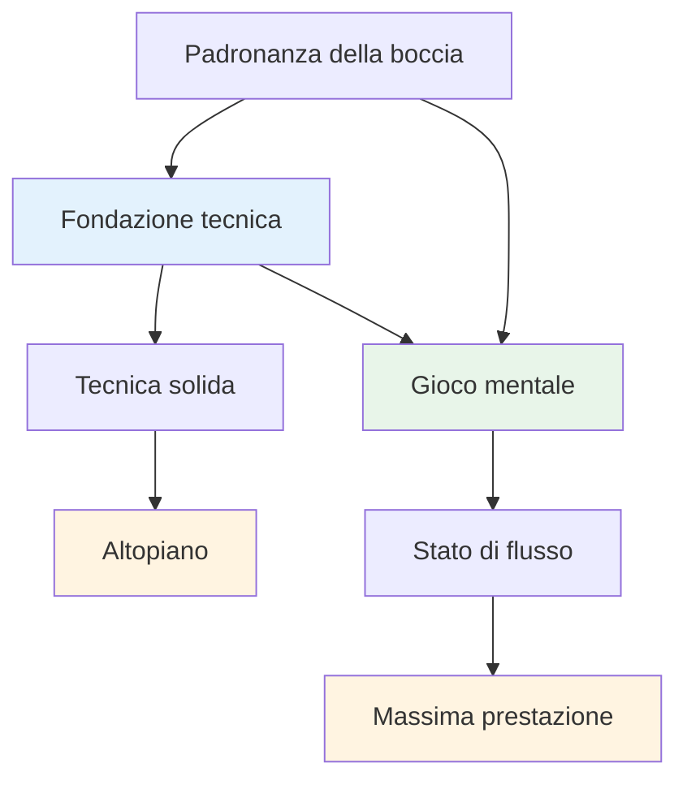
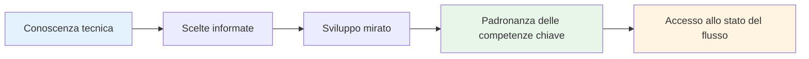

# Consulenza tecnica

## Una nota sulla tecnica

Sebbene il nostro obiettivo principale sia il gioco mentale e lo stato di flusso, riconosciamo che la tecnica è la base su cui si costruisce tutto il resto.

::: info La nostra filosofia
**La tecnica è la base, ma il flusso è il limite.** Per raggiungere un livello d&#39;élite è necessaria una tecnica solida, ma è la padronanza mentale che ti porta oltre.
:::

## La nostra prospettiva

::: tip Non è necessario padroneggiare tutto
**Non è necessario padroneggiare tutte le tecniche**, ma comprendere l&#39;intera gamma di possibilità ti aiuta a:

- ✅ Scopri cosa è possibile
- ✅ Fai scelte consapevoli su cosa sviluppare
- ✅ Apprezzare il gioco a un livello più profondo
- ✅ Scopri cosa possono fare i giocatori d&#39;élite
:::

::: info L&#39;obiettivo
Se hai un focus tecnico e vuoi ampliare il tuo repertorio, questa sezione delinea l&#39;obiettivo finale: la gamma completa di lanci a disposizione di un giocatore di pétanque.

**Ricorda:** L&#39;obiettivo non è padroneggiare tutto. È avere una base tecnica sufficiente per poter entrare nella zona e lasciare che il corpo scelga naturalmente il lancio giusto.
:::

## Argomenti

### [Tavolozza di lanci](/it/tecnico/lanci)
Quali sono i lanci possibili? Una panoramica completa delle possibilità tecniche della pétanque.

::: tip Dopo la tecnica, cosa succederà?
Una volta acquisita una tecnica solida, la vera crescita deriva da:
- **[The Zone](/it/education/the-zone/)** - Accesso agli stati di flusso
- **[Forza mentale](/it/educazione/forza-mentale/)** - Gestire la pressione
- **[Metodi di allenamento](/it/educazione/formazione/)** - Come esercitarsi in modo efficace
:::

