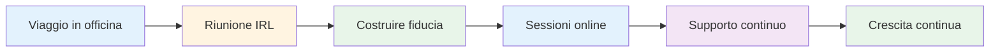
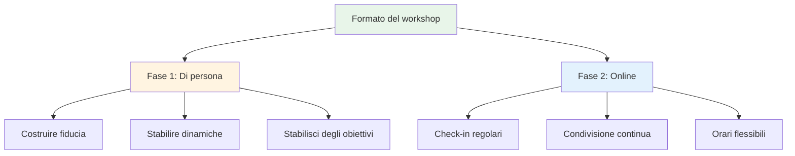
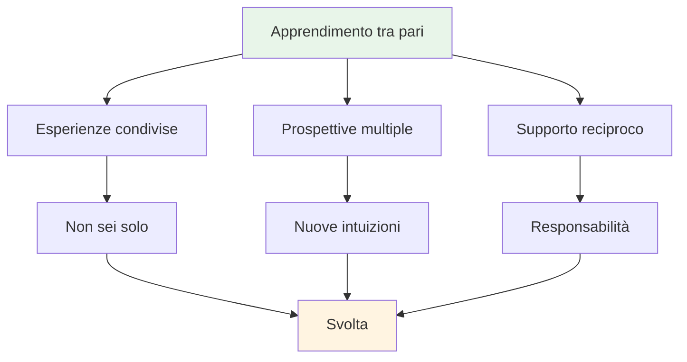

# Laboratorio

## Forum per giocatori d&#39;élite

I nostri workshop sono forum intimi in cui i giocatori d&#39;élite condividono esperienze e aprono i loro pensieri più intimi sul gioco, sulle prestazioni e sulle sfide mentali.

::: tip Cosa rende diversi i nostri workshop
**Piccoli gruppi selezionati di giocatori d&#39;élite in uno spazio sicuro per una discussione onesta.** Questa non è una lezione: è un&#39;esperienza di apprendimento tra pari in cui si condivide, si impara e si cresce insieme.
:::

## Formato

### Piccoli gruppi
::: info Dimensione del gruppo
- **6-8 giocatori** per workshop
- Gruppi attentamente selezionati per dinamiche ottimali
- Spazio sicuro per una discussione onesta
- Tutti contribuiscono, tutti imparano
:::

### Approccio ibrido

| Fase | Formato | Scopo | Benefici |
|-------|--------|---------|----------|
| **Primo incontro** | Di persona (IRL) | Costruire le fondamenta | Fiducia, connessione, dinamiche di gruppo |
| **Sessioni in corso** | In linea | Mantenere lo slancio | Supporto regolare, flessibilità, responsabilità |

::: details Fase 1: Incontro di persona
**Perché prima di persona?**
- Costruisci fiducia e connessione faccia a faccia
- Stabilire dinamiche di gruppo e sicurezza
- Stabilire insieme intenzioni e obiettivi
- Creare le basi per una condivisione onesta

**Che succede:**
- Introduzioni e definizione degli obiettivi
- Esercizi iniziali e discussioni
- Stabilire norme di gruppo
- Costruire un rapporto
:::

::: details Fase 2: Sessioni online
**Perché online per la formazione continua?**
- Check-in regolari senza viaggio
- Condivisione e supporto continui
- Orari flessibili per giocatori impegnati
- Mantenere lo slancio tra gli incontri di persona

**Che succede:**
- Aggiornamenti sui progressi e sfide
- Supporto tra pari e risoluzione dei problemi
- Verifiche di responsabilità
- Apprendimento e crescita continui
:::

## Cosa aspettarsi

### Argomenti che esploriamo

| Zona | Messa a fuoco | Risultati |
|------|-------|----------|
| **Gioco mentale** | Stato di flusso, pressione, messa a fuoco | Prestazioni di picco costanti |
| **Sfide personali** | Paura, blocchi, frustrazioni | Svolte e soluzioni |
| **Apprendimento tra pari** | Esperienze condivise | Nuove prospettive e intuizioni |
| **Strumenti pratici** | Tecniche ed esercizi | Applicazione immediata |
| **Comunità** | Supporto continuo | Crescita a lungo termine |

::: tip Esperienza di laboratorio
- 🧠 Discussioni approfondite sugli aspetti mentali del gioco
- 💬 Condivisione di esperienze e sfide personali
- 🤝 Supporto tra pari e responsabilità
- 🛠️ Esercizi pratici e tecniche
- 👥 Una community di giocatori impegnati nella crescita
:::

## Chi dovrebbe partecipare?

::: info Partecipanti ideali
- **Giocatori d&#39;élite** che vogliono fare il passo successivo
- Giocatori che hanno **padroneggiato la tecnica** ma vogliono di più
- Coloro che sono interessati al **gioco mentale**
- Giocatori aperti a un&#39;**onesta auto-riflessione**
- Impegnato nella **crescita personale**
:::

::: warning Non è una buona soluzione se
- Stai cercando solo coaching tecnico
- Non ti senti a tuo agio a condividere in un gruppo
- Non sei disposto ad essere vulnerabile
- Vuoi soluzioni rapide senza dover fare il lavoro
:::

## Il valore dell&#39;apprendimento tra pari

::: tip Perché i gruppi di pari funzionano
I giocatori d&#39;élite affrontano sfide uniche che altri non comprendono. In un workshop, ti trovi con persone che **capiscono**: la pressione, le aspettative, le battaglie mentali. Questo crea uno spazio sicuro per una vera crescita.
:::

## Pronto a partecipare?

::: info Prossimi passi
I workshop sono annunciati nella nostra sezione [News](/it/news/). Restate sintonizzati per le prossime date e le informazioni sulle iscrizioni.
:::

