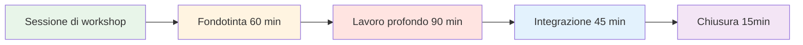
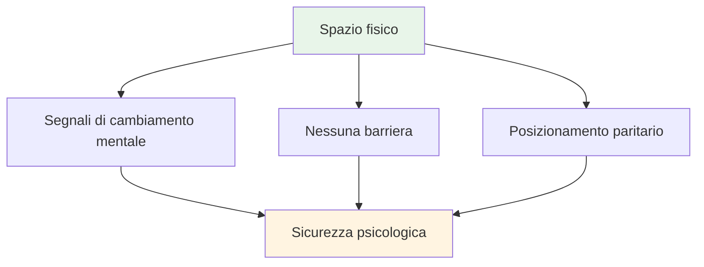
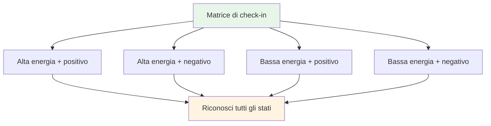
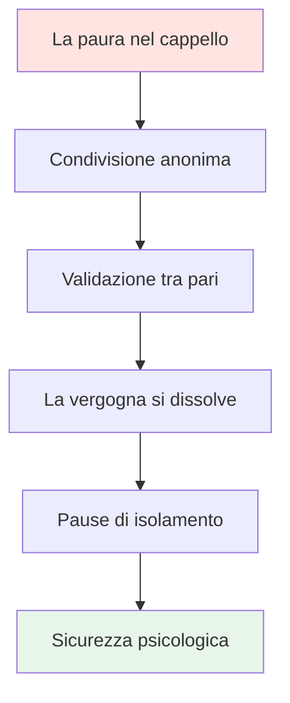

# Workshop: Sessione di gioco mentale avanzato (3-4 ore)

<AdBanner />

## Panoramica

Questo workshop è una sessione teorica avanzata di 3-4 ore per 6-8 giocatori d&#39;élite, incentrata su un profondo lavoro psicologico e sull&#39;apprendimento basato sulla vulnerabilità. Va oltre le abilità mentali di base per esplorare il gioco interiore a un livello più profondo.

::: tip Due sezioni in questa guida
- **[Per i partecipanti](#for-participants)** - Cosa sperimenteranno e impareranno i giocatori
- **[Per i facilitatori](#for-facilitators)** - Come condurre il workshop come coordinatore delle prestazioni mentali
:::

**Differenza rispetto alla sessione per principianti:**
- **Principiante (2-3 ore):** Introduzione ai concetti del gioco mentale → [Vedi Guida al viaggio mentale](/it/mental-journey/session-guide)
- **Avanzato (3-4 ore):** Lavoro psicologico profondo con esercizi di vulnerabilità (questa pagina)

## Accesso rapido

| Sezione | Scopo | Accesso |
|---------|---------|--------|
| **Per i partecipanti** | Cosa aspettarsi e come prepararsi | [Visualizza sezione](#for-participants) |
| **Per i facilitatori** | Guida completa alla sessione ed esercizi | [Visualizza sezione](#for-facilitators) |
| **Materiali della sessione** | Esercizi e schede di lavoro | [Visualizza materiali](#facilitator-materials) |
| **Guide correlate** | Altri formati di formazione | [Viaggio mentale](/it/mental-journey/) • [Campo di addestramento](/it/training-camp) |

---

## Per i partecipanti

### Cosa aspettarsi

Questa non è una tipica sessione di allenamento. Vi impegnerete in discussioni approfondite sugli aspetti mentali ed emotivi della pétanque, di cui raramente si parla apertamente.

**Questo workshop è:**
- ✅ Uno spazio sicuro per esplorare pensieri e paure interiori
- ✅ Apprendimento basato sulla vulnerabilità con i compagni di squadra
- ✅ Collegare gli schemi mentali alle prestazioni
- ✅ Costruire l&#39;intelligenza psicologica del team

**Questo workshop NON è:**
- ❌ Allenamento tecnico o tattico
- ❌ Terapia o consulenza
- ❌ Discorsi di pensiero positivo o motivazionali
- ❌ Giudizio o critica

### Struttura della sessione

**Durata totale:** 3-4 ore
**Dimensione del gruppo:** 6-8 giocatori
**Formato:** Discussione circolare con esercizi strutturati

### Cosa imparerai

#### Fase 1: Fondazione (60 min)
- Regole di base per la sicurezza psicologica
- La &quot;Matrice di Check-In&quot; - riconoscere il tuo stato attuale
- L&#39;&quot;Iceberg della Boccia&quot; - esplorare i pensieri nascosti

#### Fase 2: Lavoro profondo (90 min)
- Creazione del &quot;Manuale utente&quot; per i compagni di squadra
- Collegare gli schemi mentali alle prestazioni
- &quot;La paura nel cappello&quot;: rompere l&#39;isolamento attraverso la vulnerabilità condivisa

#### Fase 3: Integrazione (45 min)
- Trasformare il tuo critico interiore in coach interiore
- Creazione di protocolli di squadra per la competizione
- Suggerimenti pratici per la pista

#### Fase 4: Chiusura (15 min)
- Riflessione e impegno
- Supporto di follow-up

### Regole di base

Prima dell&#39;inizio della sessione, tutti i partecipanti accettano di:

::: tip Il contenitore - Regole di base essenziali
1. **Riservatezza** - Ciò che viene detto qui, resta qui
2. **La regola di Las Vegas** - Le lezioni escono dalla stanza, le storie restano
3. **Nessuna soluzione** - Sii testimone e comprendi, non cercare di risolvere
4. **Diritto di passaggio** - La vulnerabilità non può essere forzata
5. **Rispetta il processo** - Fidati del disagio
:::

### Cosa portare

**Necessario:**
- Mente aperta e disponibilità a condividere
- Le tue esperienze e sfide
- Rispetto per la vulnerabilità degli altri

**Opzionale:**
- Quaderno per riflessioni personali
- Domande su specifiche sfide mentali

### Attività chiave che sperimenterai

#### La matrice di check-in
Collocatevi in una griglia di energia e umore. Accettate il fatto che ognuno di noi ha stati d&#39;animo diversi.

#### L&#39;iceberg della bocce
Esplora cosa succede sotto la superficie: i pensieri e le paure che nessuno vede.

#### Il manuale utente
Crea un manuale operativo per te stesso, in modo che i tuoi compagni di squadra capiscano come supportarti.

#### La paura nel cappello
Condividi in forma anonima le tue paure più profonde e ascolta la loro convalida da parte dei tuoi pari. Rompi l&#39;isolamento.

#### Riformulazione del critico interiore
Trasforma il dialogo interiore duro in un linguaggio di coaching di supporto.

### Dopo il workshop

Partirai con:
- Una comprensione più profonda dei tuoi schemi mentali
- Protocolli di squadra per supportarsi a vicenda
- Frasi riformulate dell&#39;Inner Coach
- Connessione con i compagni di squadra attraverso la vulnerabilità condivisa
- Strumenti pratici per la concorrenza

::: warning Postumi della vulnerabilità
Dopo una condivisione profonda, potresti sentirti esposto o pentito. È normale. Il facilitatore ti contatterà entro 24 ore. Ricorda: ciò che hai condiviso ha aiutato tutti.
:::

<AdInArticle />

---

## Per i facilitatori

### Il tuo ruolo come coordinatore delle prestazioni mentali

In qualità di **Coordinatore delle prestazioni mentali (MPC)**, faciliti discussioni approfondite sul gioco mentale, creando sicurezza psicologica che si traduce in prestazioni in pista.

::: warning Concetto critico
**Non sei un allenatore tecnico o un terapista.** Il tuo ruolo è quello di facilitare l&#39;apprendimento basato sulla vulnerabilità che aiuta i giocatori a comprendere la connessione tra i loro pensieri interiori e le loro prestazioni.
:::

### Le tue responsabilità

::: info Responsabilità chiave
- **Facilita, non fare prediche** - Guidi la discussione, non insegni la tecnica
- **Mantieni lo spazio** - Crea e mantieni la sicurezza psicologica
- **Collegare la teoria alla pratica** - Collegare il contenuto del sito web all&#39;esperienza interiore
- **Monitorare le dinamiche di gruppo** - Notare chi è coinvolto e chi è resistente
- **Mantenere i limiti** - Sapere quando rivolgersi a un aiuto professionale
:::

### Preparazione pre-workshop

### Competenze essenziali

| Competenza | Cosa significa | Come sviluppare |
|------------|---------------|----------------|
| **Intelligenza emotiva** | Rilevare microespressioni di disagio | Praticare l&#39;osservazione attiva |
| **Autorità neutrale** | Ottenere rispetto senza potere tecnico | Stabilire credibilità attraverso la presenza |
| **Contesto sportivo** | Comprendere la meccanica della pressione | Impara la terminologia e la cultura della pétanque |
| **Aikido verbale** | Allinearsi con la resistenza, non combatterla | Praticare una comunicazione non difensiva |

::: details Termini chiave da conoscere nella boccia
- **Carreau** - Tiro perfetto che sposta la boccia dell&#39;avversario
- **Bibber** - Il &quot;yips&quot; - tremore involontario durante il rilascio
- **Dato** - Il &quot;dato&quot; - accettare il terreno così com&#39;è
- **Portée** - Lancio senza rimbalzo
- **Roulette** - Tiro rotolante
- **Cochonnet** - La palla bersaglio (jack)
:::

## Configurazione fisica: il cerchio magico

### Requisiti di posizione

::: warning Configurazione critica
**Scegliere uno spazio neutro LONTANO dalla pista.** Questo segnala un passaggio dal lavoro fisico a quello mentale.

Requisiti:
- ✅ Insonorizzato o privato
- ✅ Temperatura confortevole
- ✅ Nessuna distrazione (telefoni spenti)
- ✅ Luce naturale se possibile
- ✅ Separato dall&#39;area di allenamento
:::

### La configurazione del cerchio

**Posti a sedere:**
- Cerchio perfetto di sedie
- **NIENTE TAVOLI** - I tavoli creano barriere e nascondono il linguaggio del corpo
- Tutte le sedie alla stessa altezza (nessuna posizione elettrica)
- Il coordinatore siede come parte del cerchio (non davanti)

**Artefatti centrali:**
- Posizionare le bocce e il cochonnet al centro
- Ancora il lavoro allo sport
- Promemoria visivo dello scopo condiviso

## Struttura della sessione (3-4 ore)

### Fase 1: Fondazione (60 minuti)

#### 1. Benvenuto e regole di base (15 min)

**Il contratto sociale:**

::: tip Il contenitore - Regole di base essenziali
Prima di iniziare qualsiasi condivisione, il gruppo DEVE accettare di:

1. **Riservatezza** - Ciò che viene detto qui, resta qui
2. **La regola di Las Vegas** - Le lezioni escono dalla stanza, le storie restano
3. **Nessuna soluzione** - Sii testimone e comprendi, non cercare di risolvere
4. **Diritto di passaggio** - La vulnerabilità non può essere forzata
5. **Rispetta il processo** - Fidati del disagio
:::

**Il tuo copione:**
> &quot;Benvenuti. Questo spazio è diverso dalla pista. Qui esploriamo cosa succede *dentro* quando vi trovate a guardare quel tiro. Tutto ciò che viene condiviso qui è confidenziale. Le lezioni che imparerete possono andarsene, ma le storie personali restano. Non siete qui per aiutarvi a vicenda, solo per capire. E potete sempre passare. Siete tutti d&#39;accordo?&quot;

#### 2. Attività: La matrice di check-in (20 min)

**Obiettivo:** Normalizzare l&#39;ammissione di stanchezza o stress

**Materiali:** Lavagna bianca o lavagna a fogli mobili, post-it

**Procedura:**
1. Disegna una matrice 2x2: Alta/Bassa Energia (verticale), Positiva/Negativa (orizzontale)
2. Ogni giocatore scrive il proprio nome su un post-it
3. Inserisci la nota nel quadrante corrente
4. Discussione: &quot;Abbiamo tre persone in &#39;Bassa Energia/Negativa&#39;. Come influisce questo sulla nostra sessione di oggi?&quot;

**Suggerimenti per la facilitazione:**
- Non giudicare nessun quadrante come &quot;cattivo&quot;
- Chiediti: &quot;Di cosa ha bisogno il tuo corpo in questo momento?&quot;
- Nota gli schemi: &quot;Tre di voi sono nello stesso spazio: di cosa si tratta?&quot;

#### 3. Attività: L&#39;iceberg della bocce (25 min)

**Obiettivo:** Visualizzare i pensieri interiori nascosti

**Materiali:** Carta grande, pennarelli

**Procedura:**
1. Disegna un iceberg su carta
2. **Sopra l&#39;acqua:** Scrivi &quot;Tecnica, Il lancio, Il risultato&quot;
3. **Sott&#39;acqua:** Chiedi: &quot;Cosa sta succedendo nella tua mente che nessuno vede?&quot;

**Richiede:**
- &quot;Di cosa hai paura quando ti avvicini per sparare?&quot;
- &quot;Di quale giudizio ti preoccupi?&quot;
- &quot;Cosa ti dice la voce interiore quando sbagli?&quot;

**La domanda di intuizione:**
> &quot;Cosa succede al braccio che usi per lanciare quando la roba &#39;sott&#39;acqua&#39; diventa troppo pesante?&quot;

Ciò collega il carico mentale alla tensione fisica (il bibber/yips).

::: details Risposte comuni &quot;Sott&#39;acqua&quot;
- Paura di deludere la squadra
- Preoccupati di sembrare stupido
- Dubbio sulla capacità
- Confronto con gli altri
- Pressione per dimostrare il proprio valore
- Paura del giudizio dell&#39;allenatore/compagni di squadra
- Sindrome dell&#39;impostore
:::

<AdInArticle />

### Fase 2: Lavoro profondo (90 minuti)

#### 4. Attività: Il manuale utente (30 min)

**Obiettivo:** Rendere operativa l&#39;empatia: aiutare i compagni di squadra a capirsi a vicenda

**Materiali:** Schede di lavoro (una per giocatore)

**Modello del manuale utente:**

| Sezione | Richiesta | Esempio |
|---------|--------|---------|
| **La mia firma di stress** | &quot;Quando sono ansioso, io...&quot; | &quot;...diventare completamente silenziosi&quot; |
| **Come gestirmi** | &quot;Quando sbaglio un tiro decisivo, ho bisogno...&quot; | &quot;...silenzio, non incoraggiamento&quot; |
| **Il mio pensiero interiore** | &quot;La bugia che mi dico è...&quot; | &quot;...che non sono abbastanza bravo&quot; |
| **Il mio grilletto** | &quot;Mi metto sulla difensiva quando...&quot; | &quot;...qualcuno mette in dubbio la mia scelta di tiro&quot; |

**Procedura:**
1. Dai ai giocatori 10 minuti per completare in silenzio
2. Girate in cerchio: ogni persona condivide UNA sezione
3. Altri possono porre domande di chiarimento (non consigli!)
4. Il coordinatore convalida ogni condivisione

**Sceneggiatura di facilitazione:**
> &quot;Questo è il tuo manuale operativo. Quando il tuo compagno di squadra sa che resti in silenzio quando sei ansioso, non se la prenderà. Quando sa che hai bisogno di silenzio dopo un errore, non cercherà di &quot;aggiustarti&quot;. È così che costruiamo l&#39;intelligenza di squadra.&quot;

#### 5. Collegare il contenuto del sito web al pensiero interiore (30 min)

**Obiettivo:** Collegare i contenuti tecnici all&#39;esperienza psicologica

Scegli 2-3 sezioni dal sito web dell&#39;Accademia ed esplora il gioco interiore:

**Esempio 1: Tecnica - Presa e rilascio**

**La questione della fiducia:**
> &quot;Quando sei a 12-12 in un torneo, la tua mano *sente* come la descrizione della tecnica? Sono i muscoli che cambiano o il pensiero &#39;Non mollare&#39; che cambia la tua presa?&quot;

**Il microtremore:**
> &quot;Chi qui avverte il &#39;micro-tremore&#39; dell&#39;ansia? Quale pensiero interiore lo scatena?&quot;

**Esempio 2: Tattica - Puntare vs. Sparare**

**Profilo di rischio:**
> &quot;Quando la guida dice &#39;Tira per vincere&#39;, la tua reazione è eccitazione o paura? Cosa ti dice questo sul tuo rapporto con il rischio?&quot;

**L&#39;impostore:**
> &quot;Ti capita mai di puntare quando *sai* che dovresti sparare, solo per evitare l&#39;imbarazzo di mancare il bersaglio? Quanto costa quella sicurezza?&quot;

**Esempio 3: Nutrizione - Giorno della gara**

**La trappola del comfort food:**
> &quot;Mangi ciò di cui il tuo corpo ha bisogno o ciò che ti chiede l&#39;ansia? Come fai a capire la differenza?&quot;

::: tip Tecnica di facilitazione
Non fare prediche sui contenuti. Poni domande che colleghino le informazioni tecniche alla loro esperienza vissuta. La comprensione viene da LORO, non da te.
:::

#### 6. Attività: La paura nel cappello (30 min)

**Obiettivo:** Rompere il circolo vizioso dell&#39;isolamento: dimostrare che i coetanei condividono profonde insicurezze

**Materiali:** Carta, penna, cappello/borsa

**Procedura:**
1. Tutti scrivono in forma anonima una profonda paura della carriera/squadra
2. Piegare i fogli e mescolarli nel cappello
3. Ogni giocatore pesca una nota (non la propria)
4. Leggilo ad alta voce
5. Convalidalo: &quot;Posso capire perché qualcuno si senta in questo modo perché...&quot;

**Esempi di paure:**
- &quot;Temo di aver raggiunto il picco e di non migliorare mai&quot;
- &quot;Temo che i miei compagni di squadra pensino che io sia sopravvalutato&quot;
- &quot;Ho paura di soffocare nel grande momento&quot;
- &quot;Ho paura di essere sostituito da giocatori più giovani&quot;

**Il potere:**
Quando i giocatori sentono la loro paura segreta letta ad alta voce e convalidata dai loro compagni, la vergogna si dissolve. Si rendono conto: &quot;Non sono solo. È normale&quot;.

**Ruolo del coordinatore:**
- Convalidare OGNI paura come legittima
- Non minimizzare: &quot;Non è vero!&quot; invalida il sentimento
- Chiedi: &quot;Quanti di voi hanno provato qualcosa di simile?&quot;

### Fase 3: Integrazione (45 minuti)

#### 7. Attività: Riformulare il critico interiore (25 min)

**Obiettivo:** Ristrutturazione cognitiva - cambiare il dialogo interno

**Materiali:** Foglio di lavoro

**Procedura:**

**Passaggio 1: Identificare il critico (10 min)**
> &quot;Scrivi la frase ESATTA che il tuo critico interiore pronuncia dopo un errore. Non la versione educata, quella brutale.&quot;

Esempi:
- &quot;Ti strozzi sempre&quot;
- &quot;Tutti ti guardano fallire&quot;
- &quot;Ti stai mettendo in imbarazzo&quot;
- &quot;Non appartieni a questo posto&quot;

**Passaggio 2: Riformula come Coach Interiore (10 min)**
> &quot;Ora riscrivilo come il tuo Coach Interiore: fermo ma di supporto.&quot;

Esempi:
- Critico: &quot;Ti strozzi sempre&quot; → Allenatore: &quot;Reimposta e respira. Prossimo colpo.&quot;
- Critico: &quot;Tutti ti vedono fallire&quot; → Allenatore: &quot;Concentrati sull&#39;obiettivo, non sulla folla&quot;
- Critico: &quot;Ti stai mettendo in imbarazzo&quot; → Allenatore: &quot;Un colpo alla volta. Lo hai già fatto prima.&quot;

**Passaggio 3: Pratica in coppia (5 min)**
> &quot;Condividi la frase del tuo Coach con un partner. Te la ricorderà quando vedrà emergere il Critico.&quot;

#### 8. Collegamento alla pista (20 min)

**Obiettivo:** Creare protocolli attuabili per la competizione

**Domande di discussione:**
1. &quot;Qual è la COSA di oggi che userai nella tua prossima gara?&quot;
2. &quot;Come faranno i tuoi compagni di squadra a sapere che hai bisogno di supporto?&quot;
3. &quot;Qual è il segnale che ti fa capire che &#39;ho bisogno di un reset mentale&#39;?&quot;

**Creare protocolli di squadra:**

| Situazione | Protocollo | Esempio |
|-----------|----------|---------|
| **Dopo un errore** | Consultare il manuale utente | &quot;Marc ha bisogno del silenzio, Lisa ha bisogno di un pugno chiuso&quot; |
| **Sensazione di pressione** | Usa la frase Coach | &quot;Reset e respira&quot; |
| **Tensione di squadra** | Timeout della chiamata | &quot;Prendiamoci 2 minuti&quot; |
| **Critico interiore ad alta voce** | Ripristino fisico | Tocca le bocce, respira profondamente |

### Fase 4: Chiusura (15 minuti)

#### 9. Il check-out (10 min)

**Procedura:**
Girate in cerchio e ogni persona condivide:
1. **Una cosa che stai portando con te:** &quot;Quale intuizione o strumento ti porti dietro?&quot;
2. **Una cosa che ti stai lasciando alle spalle:** &quot;Cosa stai lasciando andare?&quot;

**Ruolo del coordinatore:**
- Ringrazia ogni persona per il suo contributo
- Convalidare il lavoro svolto
- Promemoria sulla riservatezza

#### 10. Protocollo di follow-up (5 min)

::: warning Critico: prevenire i postumi della vulnerabilità
Il lavoro approfondito provoca una &quot;sbornia da vulnerabilità&quot;, ovvero rimpianto o vergogna per la condivisione.

**Il tuo protocollo 24 ore:**
- Invia un messaggio a chiunque abbia condiviso molto entro 24 ore
- Messaggio: &quot;Grazie per il tuo coraggio di ieri. Ciò che hai condiviso è stato d&#39;aiuto a tutti.&quot;
- Check-in: &quot;Come ti senti riguardo alla sessione?&quot;
:::

**Sceneggiatura di chiusura:**
> &quot;Ciò che è successo oggi ha richiesto coraggio. Vi siete presentati, vi siete aperti, avete avuto fiducia nel processo. Lo stesso coraggio è ciò che porterete in pista. Ricordate: le lezioni lasciano questa stanza, ma le storie restano. Grazie.&quot;

<AdInArticle />

## Resistenza alla manipolazione

### L&#39;atleta &quot;troppo cool&quot;

**Scenario:** Un giocatore alza gli occhi al cielo durante un esercizio sulla vulnerabilità

**Strategia:** Aikido verbale (allineamento e rotazione)

**Sceneggiatura:**
> &quot;Vedo quella reazione, [Nome]. Onestamente, la capisco. Parlare di emozioni è una cosa facile. Ma la pista è scomoda. Se non riusciamo a gestire il disagio di questa stanza, non stiamo allenando la nostra tolleranza al disagio del gioco. Puoi fidarti di me per 20 minuti?&quot;

### Il partecipante silenzioso

**Scenario:** Qualcuno non parla da 45 minuti

**Strategia:** Creare un punto di ingresso a basso rischio

**Sceneggiatura:**
> &quot;[Nome], ho notato che stai assimilando tutto. C&#39;è una cosa che ti colpisce finora? Anche solo una parola.&quot;

### Colui che condivide troppo

**Scenario:** Qualcuno domina con storie lunghe

**Strategia:** Reindirizzamento delicato

**Sceneggiatura:**
> &quot;Grazie per questo, [Nome]. Voglio assicurarmi che tutti abbiano spazio. Sentiamo chi non l&#39;ha ancora condiviso.&quot;

### Il riparatore

**Scenario:** Qualcuno cerca di risolvere i problemi degli altri

**Strategia:** Rafforzare le regole di base

**Sceneggiatura:**
> &quot;Apprezzo il tuo desiderio di aiutare, ma ricorda la nostra regola: testimonia e comprendi, non aggiustare. [Parlante originale], di cosa hai bisogno adesso?&quot;

## Lista di controllo dei materiali

::: details Materiali per il workshop
**Configurazione fisica:**
- [ ] Sedie (6-8, senza tavoli)
- [ ] Bocce e cochonnet per il centro
- [ ] Lavagna a fogli mobili o lavagna bianca
- [ ] Marcatori

**Attività:**
- [ ] Post-it (matrice di check-in)
- [ ] Foglio di carta grande (attività Iceberg)
- [ ] Fogli di lavoro del manuale utente
- [ ] Carta e penne (La paura nel cappello)
- [ ] Schede di lavoro per il critico/allenatore interiore

**Logistica:**
- [ ] Acqua per i partecipanti
- [ ] Fazzoletti (lavoro emotivo!)
- [ ] Timer (mantenere la programmazione)
- [ ] Elenco dei contatti dei partecipanti (per il follow-up)
:::

## Coordinatore Self-Care

::: warning Anche tu hai bisogno di supporto
Creare spazio per la vulnerabilità è emotivamente impegnativo.

**Dopo il workshop:**
- Debriefing con un collega o un supervisore
- Diario su ciò che ti è venuto in mente
- Fai una passeggiata o una pausa fisica
- Non portare le loro storie a casa
:::

## Misurazione dell&#39;impatto

### Feedback immediato

Alla fine chiediti:
1. &quot;Su una scala da 1 a 10, quanto ti sei sentito sicuro nel condividere oggi?&quot;
2. &quot;Cosa renderebbe migliore la prossima sessione?&quot;

### Monitoraggio a lungo termine

Controllo dopo 2-4 settimane:
- &quot;Hai utilizzato qualche attrezzo preso dall&#39;officina?&quot;
- &quot;Come è cambiato il tuo rapporto con il tuo critico interiore?&quot;
- &quot;Cosa c&#39;è di diverso nella tua mentalità competitiva?&quot;

## Prossimi passi

::: tip Costruire su questa base
Questo workshop è la Fase 1. Considera:
- **Sessioni di follow-up** (online o di persona)
- **Integrazione in pista** (vedere la guida alla sessione di formazione)
- **Protocolli di squadra** (implementare i manuali utente in gara)
- **Check-in individuali** (per i giocatori che necessitano di maggiore supporto)
:::

<AdBanner />

