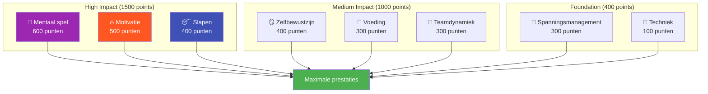

# Ambitie

Onze missie is om topspelers te helpen de volgende stap in hun ontwikkeling te zetten.

::: tip Onze visie
**Transformeer topspelers van technisch begaafd naar mentaal onoverwinnelijk.** We gebruiken een datagestuurde aanpak om de belangrijkste verbeterpunten voor jou te identificeren.
:::

## Het 8-factoren prestatiemodel

Onderzoek en ervaring tonen aan dat topprestaties in pétanque afhangen van **8 onderling verbonden factoren**. De meeste spelers investeren te veel in techniek, terwijl ze de factoren verwaarlozen die een goede speler daadwerkelijk onderscheiden van een topspeler.

### Waarom techniek het minste gewicht in de schaal legt

::: warning De ongemakkelijke waarheid
**De techniek is slechts verantwoordelijk voor 100 van de 2900 totale punten** in ons model.

Dit komt niet doordat techniek er niet toe doet, maar doordat topspelers al een adequate techniek hebben ontwikkeld. De marginale verbetering die je behaalt door je afzet te perfectioneren, is minimaal in vergelijking met het optimaliseren van je slaap, het beheersen van spanning of het versterken van je mentale spel.
:::

## Het ROI-principe

Niet alle verbeteringen zijn gelijkwaardig. We gebruiken **ROI (Return on Investment)**-berekeningen om te bepalen waar uw trainingstijd de grootste impact zal hebben.

| Jouw niveau | Factorweging | Potentiële ROI |
|------------|---------------|---------------|
| Lage vaardigheid in het zwaargewichtgebied | Hoog (bijv. 600) | **Maximum** |
| Uitstekende vaardigheid in het zwaargewichtgedeelte | Hoog (bijv. 600) | Laag (afnemende meeropbrengst) |
| Lage vaardigheid in het gebied met laag gewicht | Laag (bijv. 100) | Gematigd |
| Uitstekende vaardigheid in het lichtgewichtgebied. | Laag (bijv. 100) | **Minimaal** |

**Voorbeeld:** Het verbeteren van je slaap van 30% naar 60% (hoge wegingfactor, laag huidig vaardigheidsniveau) zal waarschijnlijk meer impact hebben dan het verbeteren van je techniek van 75% naar 85% (lage wegingfactor, reeds hoog vaardigheidsniveau).

## De 8 factoren uitgelegd

| Factor | Gewicht | Wat het omvat |
|--------|--------|----------------|
| 🧠 **Mentale uitdaging** | 600 | Denkpatronen, focus, zelfvertrouwen, toegang tot de flow-toestand |
| 🔥 **Motivatie** | 500 | Gedrevenheid, doelgerichtheid, doorzettingsvermogen |
| 😴 **Slaap &amp; Herstel** | 400 | Kwalitatief goede rust, protocollen voorafgaand aan de wedstrijd, energiemanagement |
| 🪞 **Zelfbewustzijn** | 400 | Nauwkeurige zelfperceptie, herkenning van blinde vlekken, gebruik van feedback |
| 🥗 **Voeding** | 300 | Bloedsuikerstabiliteit, hydratatie, brandstofvoorziening voor de wedstrijd |
| 🤝 **Teamdynamiek** | 300 | Communicatie, vertrouwen, duidelijkheid over rollen, teamwerk |
| 💆 **Spanningsmanagement** | 300 | Fysieke ontspanning, ademhalingsoefeningen, optimale alertheid |
| 🎯 **Techniek** | 100 | Fysieke techniek, werprepertoire, consistentie |

## Ontdek jouw pad

We hebben een **gratis beoordelingstool** ontwikkeld die uw huidige niveau op alle 8 factoren analyseert en uw persoonlijke verbeterpunten berekent.

::: info Doe de toets
**[→ Start je spelersontwikkelingsbeoordeling](/en/assessment/)**

Binnen 5 minuten ontvangt u:
- Uw radardiagram over alle 8 factoren
- Aanbevelingen op basis van ROI voor waaraan u kunt werken
- Links naar specifieke educatieve content die aansluit bij uw prioriteiten.
- Mogelijkheid om feedback van teamgenoten te ontvangen.
:::

## Wat wij bieden

| aanbod | Beschrijving | Link |
|----------|-------------|------|
| **Beoordelingsinstrument** | Identificeer de verbeterpunten met het hoogste rendement op uw investering (ROI). | [Doe de toets](/en/assessment/) |
| **Onderwijsmodules** | Uitgebreide inhoud over alle 8 factoren | [Bekijk Onderwijs](/en/education/) |
| **Workshops** | Sessies van 3-4 uur voor groepen van 6-8 spelers. | [Workshophandleiding](/en/guides/workshop/) |
| **Trainingskampen** | Weekendcursussen waarin theorie en praktijk worden gecombineerd | [Kampgids](/en/guides/training-camp/) |

## Onze aanpak

### 1. Eerst beoordelen
Begin met een eerlijke zelfevaluatie. Vraag feedback van collega&#39;s om blinde vlekken te ontdekken.

### 2. Prioriteer op basis van ROI
Richt je op de belangrijke factoren waar je nog ruimte hebt om te groeien, en niet op wat comfortabel aanvoelt.

### 3. Leer de wetenschap
Begrijp *waarom* iets werkt, niet alleen *wat* je moet doen.

### 4. Oefen doelgericht
Pas technieken toe tijdens de training vóór de wedstrijd. Bouw gewoontes op, niet alleen kennis.

### 5. Regelmatig opnieuw beoordelen
Houd je voortgang bij. Je prioriteiten zullen veranderen naarmate je beter wordt.

::: tip Klaar voor de volgende stap?
**[→ Begin met de beoordeling](/en/assessment/)** — Het is gratis en duurt 5 minuten.

Of verken onze [Onderwijs](/en/education/) sectie om dieper in te gaan op een van de 8 factoren.
:::

