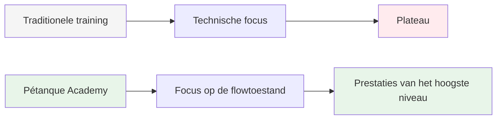
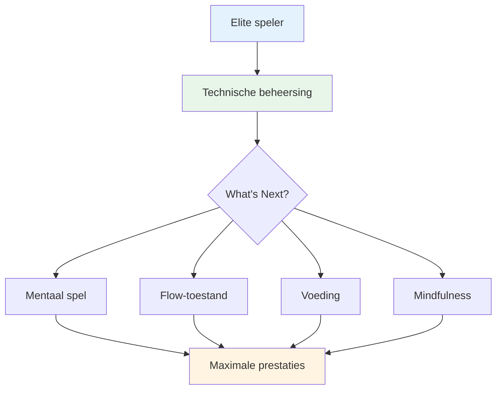

# Ambitie

Onze missie is om topspelers te helpen de volgende stap in hun ontwikkeling te zetten.

::: tip Onze visie
**Transformeer topspelers van technisch begaafd naar mentaal onoverwinnelijk.** Wij helpen je de flow-state te bereiken waarin perfecte boules een natuurlijke uiting van je meesterschap worden.
:::

## Voorbij de techniek

Traditionele training richt zich sterk op technische aspecten: de grip, de houding en de afzet. Hoewel deze basisprincipes belangrijk zijn, beheersen topspelers ze al.

::: info De doorbraak
**Het volgende niveau draait niet om het perfectioneren van de techniek, maar om het bereiken van een flow-toestand.**

We helpen spelers de overstap te maken van een technische trainingsaanpak naar een **flow (in de zone) aanpak**, waarbij perfecte boules een natuurlijke uiting van hun beheersing worden in plaats van een bewuste inspanning.
:::

## De reis

## Wat wij bieden

| aanbod | Beschrijving | Invloed |
|----------|-------------|--------|
| **Workshops** | Kleine groepjes topspelers (6-8) | Diepgaand leren van en ondersteuning door leeftijdsgenoten |
| **Onderwijs** | Mentale aspecten van topprestaties | Praktische technieken die je direct kunt toepassen |
| **Gemeenschap** | Gelijkgestemde spelers verleggen de grenzen. | Verantwoordelijkheid en gezamenlijke groei |
| **Holistische aanpak** | Voeding, mindset en mentale training | Volledige prestatieoptimalisatie |

::: tip Waarom het werkt
Topspelers beschikken al over de technische basis. Wat goede spelers onderscheidt van geweldige spelers, is het vermogen om onder druk hun beste prestatie te leveren. Daar richten wij ons op.
:::

## Onze aanpak

### 1. Flow-state training
Leer om consistent in &quot;de flow&quot; te komen, niet per ongeluk.

### 2. Mentale kracht
Ontwikkel routines, mindfulness en leer omgaan met druk.

### 3. Slimme voeding
Geef je hersenen de juiste brandstof voor een stabiele concentratie en vaste handen.

### 4. Leren van elkaar
Deel ervaringen met andere topspelers in een veilige en ondersteunende omgeving.

::: info Klaar voor de volgende stap?
Verken onze sectie [Onderwijs](/en/education/) of kom meer te weten over onze [Workshops](/en/workshop).
:::

