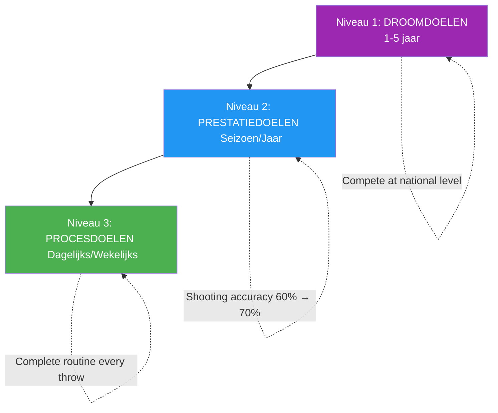

# Doelstellingen formuleren voor topsporters

> &quot;De juiste doelen versnellen de ontwikkeling; de verkeerde doelen leiden tot frustratie en stagnatie.&quot;

Doelstellingen formuleren lijkt eenvoudig: bepaal wat je wilt en werk ernaartoe. Maar doelstellingen formuleren op topniveau is complexer.

::: warning Veelgemaakte fout
**De meeste spelers stellen alleen resultaatdoelen** (&quot;Het kampioenschap winnen&quot;). Je kunt de uitkomst niet controleren, alleen het proces dat ertoe leidt.
:::

---

## Voorbij de basisdoelen

| Resultaat Doel Problemen | Waarom het een probleem is |
|----------------------|-------------------|
| Je kunt de uitkomsten niet volledig beheersen. | Schept hulpeloosheid |
| Creëert druk zonder duidelijke richting. | Angst zonder actie |
| Succes of mislukking is binair. | Geen gedeeltelijke overwinningen |
| Biedt geen leidraad voor de dagelijkse praktijk. | Wat doe je precies? |

Het stellen van topdoelen gaat verder dan dat.

---

## De doelhiërarchie

### Niveau 1: Droomdoelen (1-5 jaar)
Jouw ultieme ambities:
- &quot;Deelnemen aan wedstrijden op nationaal niveau&quot;
- &quot;Word erkend als een topschutter&quot;
- &quot;Win een belangrijk kampioenschap&quot;

::: info Richting, geen actie.
Deze bieden richting en motivatie, maar zijn niet dagelijks in de praktijk te brengen.
:::

### Niveau 2: Prestatiedoelen (Seizoen/Jaar)
Meetbare verbeteringen in je spel:
- &quot;Verhoog de schietnauwkeurigheid van 60% naar 70%&quot;
- &quot;Verminder onnodige fouten met 25%&quot;
- &quot;Ontwikkel een betrouwbare plombée&quot;

Deze zaken heb je zelf in de hand en zijn meetbaar.

### Niveau 3: Procesdoelen (dagelijks/wekelijks)
De acties die tot verbetering leiden:
- &quot;Voltooi elke worp vóór de worp&quot;
- &quot;Oefen dagelijks 10 minuten met visualisatie.&quot;
- &quot;Train je schiettechniek 3 keer per week&quot;

::: tip Volledige controle
**Procesdoelen zijn 100% beheersbaar.** Focus hierop voor maximaal effect.
:::

## Het SMART+ raamwerk

Ga verder dan de basis SMART-doelen:

### Specifiek
Niet &quot;mijn richtvermogen verbeteren&quot;, maar &quot;een consistente demi-portée ontwikkelen waarmee ik vanaf 8 meter binnen 30 cm van het doel kan landen.&quot;

### Meetbaar
Bepaal hoe je de voortgang zult bijhouden:
- Succespercentages
- Consistentiemetrieken
- Videoanalyse-markers

### Haalbaar, maar wel een uitdaging.
Het doel moet groei vereisen, maar wel realistisch zijn. Een schutter met een schotpercentage van 60% die streeft naar 65% is haalbaar; streven naar 90% is pure fantasie.

### Relevant
Doelen moeten aansluiten bij je grotere ambities en daadwerkelijke zwakke punten aanpakken, niet alleen zaken die makkelijk te verbeteren zijn.

### Tijdsgebonden
Stel duidelijke deadlines vast:
- &quot;Tegen het einde van het seizoen&quot;
- &quot;Binnen 3 maanden&quot;
- &quot;Door het nationale kampioenschap&quot;

### + Persoonlijk betekenisvol
Het doel moet voor JOU belangrijk zijn, niet alleen voor je coach of teamgenoten. Innerlijke motivatie zorgt ervoor dat je volhoudt, ook als de vooruitgang traag is.

## Focus op het proces versus focus op het resultaat

### Het probleem met resultaatgerichte doelen

&quot;De wedstrijd winnen&quot; leidt tot problemen:
- Angst voor dingen waar je geen controle over hebt.
- Afleiding van de uitvoering
- Alles-of-niets-denken
- Druk uitoefenen zonder begeleiding

### De kracht van procesdoelen

&quot;Voer mijn voorbereidingsroutine perfect uit&quot; biedt:
- Volledige controle
- Duidelijke focus
- Directe feedback
- Bouwt op natuurlijke wijze toe naar resultaten.

### De balans

Gebruik resultaatdoelen voor motivatie en richting. Gebruik procesdoelen voor dagelijkse focus en uitvoering.

## Doelstellingen formuleren voor verschillende fasen

### Buiten het seizoen
Focus op ontwikkelingsdoelen:
- Technische verbeteringen
- Fysieke conditie
- Het ontwikkelen van mentale vaardigheden
- Je assortiment plaids uitbreiden

### Voorseizoen
Overgang naar integratie:
- Het combineren van vaardigheden onder wedstrijdomstandigheden.
- Testen van verbeteringen in vriendschappelijke competitie
- Verfijningsstrategieën

### Wedstrijdseizoen
Schakel over naar prestaties en processen:
- Het uitvoeren van wat je hebt ontwikkeld
- Doelstellingen voor het proces bij elke wedstrijd
- Minimale technische wijzigingen

### Na de wedstrijd
Reflectie en planning:
- Analyseer wat wel werkte
- Identificeer groeimogelijkheden.
- Stel doelen voor de volgende cyclus

## Veelvoorkomende fouten bij het stellen van doelen

### Te veel doelen
Focus is kracht. 2-3 kerndoelen zijn beter dan 10 verspreide doelen.

### Alleen resultaatgerichte doelen
Zonder procesdoelen heb je geen routekaart.

### Geen flexibiliteit
Doelstellingen moeten zich aanpassen aan nieuwe informatie. Het star vasthouden aan verouderde doelstellingen is verspilling van inspanning.

### Doelstellingen gebaseerd op vergelijking
&quot;Wees beter dan [speler]&quot; legt je succes in de handen van iemand anders.

### Mentale doelen verwaarlozen
Technische en fysieke doelen staan centraal, maar mentale vaardigheden bepalen vaak wie er wint.

## Implementatiestrategieën

### Schrijf ze op.
Het is aanzienlijk waarschijnlijker dat schriftelijk vastgelegde doelen worden bereikt.

### Regelmatig evalueren
Een wekelijkse evaluatie houdt de doelen scherp en maakt bijsturing mogelijk.

### Deel selectief
Deel dit met mensen die je zullen steunen, niet ondermijnen.

### Visualiseer je prestaties
Stel je regelmatig voor dat je je doelen bereikt – het gevoel, het moment.

### Voortgang bijhouden
Wat gemeten wordt, kan beheerd worden. Houd gegevens bij.

## Wanneer doelen niet worden bereikt

Niet behaalde doelen zijn geen mislukkingen, maar data:

1. **Analyseer**: Waarom is het niet gelukt?
2. **Wat leer je hiervan?**
3. **Aanpassen**: Het doel of de aanpak wijzigen
4. **Vervolg**: Volharding wint van perfectie

## Het mentale spel van doelpunten

Doelen beïnvloeden de psychologie:
- **Te makkelijk**: Verveling, zelfgenoegzaamheid
- **Te moeilijk**: Angst, ontmoediging
- **Precies goed**: Betrokkenheid, flow, groei

Vind de ideale balans waarbij doelen uitdagend zijn zonder overweldigend te werken.

---

| *Gerelateerd: [Inleiding tot het stellen van doelen](/en/education/motivation/) | [SMART-doelen](/en/education/motivation/smart-goals) | [Je ontwikkeling plannen](/en/education/motivation/planning)* |

