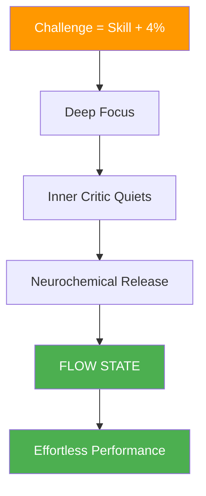
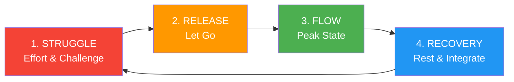

# The Science Behind Flow States

> "Flow state — that magical zone where everything clicks, time slows down, and performance feels effortless."

It's not mystical; it's neurological. Understanding the science behind flow can help you access it more consistently.

::: tip Key Insight
Flow isn't something you can force — but you can create the conditions that make it more likely to emerge.
:::

---

## What Is Flow?

Psychologist Mihaly Csikszentmihalyi defined flow as "a state of complete immersion in an activity." In pétanque, you've experienced it: throws that feel automatic, decisions that come instantly, a sense that you and the game are one.

### Flow Characteristics

| Characteristic | What It Feels Like |
|----------------|-------------------|
| **Complete absorption** | The game is all that exists |
| **Loss of self-consciousness** | No inner critic |
| **Distorted time** | Hours feel like minutes |
| **Intrinsic motivation** | Playing for the joy of it |
| **Sense of control** | Confidence without arrogance |
| **Immediate feedback** | Instant adjustment |

## The Neuroscience of Flow

### Brain Changes During Flow

When you enter flow, your brain undergoes measurable changes:

**Transient Hypofrontality**
The prefrontal cortex — responsible for self-criticism, doubt, and overthinking — becomes less active. This is why flow feels effortless: your inner critic goes quiet.

**Neurochemical Cocktail**
Flow triggers a powerful mix of neurochemicals:
- **Dopamine**: Enhances focus and pattern recognition
- **Norepinephrine**: Increases arousal and attention
- **Endorphins**: Create feelings of well-being
- **Anandamide**: Promotes lateral thinking
- **Serotonin**: Produces the afterglow of flow

**Brainwave Shifts**
Flow correlates with shifts from beta waves (normal waking consciousness) to alpha and theta waves (relaxed alertness and creativity).

## The Flow Triggers

Research has identified conditions that make flow more likely:

### 1. Challenge-Skill Balance

Flow occurs when the challenge slightly exceeds your current skill level — about 4% beyond your comfort zone. Too easy leads to boredom; too hard leads to anxiety.

**In pétanque:**
- Seek opponents slightly better than you
- Set personal challenges within matches
- Vary your practice to maintain engagement

### 2. Clear Goals

You need to know what you're trying to achieve. Vague intentions don't trigger flow.

**In pétanque:**
- Define your intention for each throw
- Have clear match objectives
- Know your role in the team

### 3. Immediate Feedback

Flow requires knowing how you're doing in real-time.

**In pétanque:**
- The result of each throw is immediately visible
- Read the terrain response
- Notice your body's feedback

### 4. Deep Concentration

Flow requires focused attention without distraction.

**In pétanque:**
- Develop your pre-shot routine
- Practice mindfulness
- Eliminate external distractions

### 5. Sense of Control

Feeling that your actions matter and you can influence outcomes.

**In pétanque:**
- Trust your training
- Focus on what you can control
- Accept uncertainty in outcomes

---

## Why You Can't Force Flow

::: warning The Flow Paradox
**Trying to enter flow prevents it.** Flow emerges when you stop trying to achieve it and simply engage fully with the activity.
:::

This is because:
- Trying activates the prefrontal cortex (the opposite of flow)
- Self-monitoring disrupts immersion
- Goal-focus replaces process-focus

## Creating Conditions for Flow

While you can't force flow, you can create conditions that make it more likely:

### Before Competition
- Adequate sleep and nutrition
- Proper warm-up
- Positive mental state
- Clear intentions

### During Competition
- Stay present-focused
- Use your pre-shot routine
- Let go of outcomes
- Trust your body

### Environmental Factors
- Minimize distractions
- Comfortable physical state
- Appropriate challenge level
- Supportive team dynamics

---

## The Flow Cycle

Flow isn't constant — it follows a cycle:

Understanding this cycle helps you:
- Not force flow during the struggle phase
- Recognize when to let go
- Allow proper recovery between flow states

## Flow in Team Pétanque

Flow can be contagious. When one player enters flow, it can spread to teammates through:
- Positive energy and body language
- Reduced pressure on others
- Elevated collective confidence
- Synchronized team rhythm

## Building Flow Capacity

Like any skill, accessing flow improves with practice:

### Daily Practices
- Mindfulness meditation (builds attention control)
- Visualization (primes neural pathways)
- Physical training (builds skill foundation)

### In Training
- Practice at the edge of your ability
- Maintain full engagement even in drills
- Notice when flow occurs and what preceded it

### Long-Term Development
- Gradually increase challenge levels
- Develop robust pre-shot routines
- Build mental resilience for the struggle phase

---

*Related: [The Zone](/nl/education/mental-game/the-zone/) | [Entering the Zone](/nl/education/mental-game/the-zone/entering-the-zone) | [Mindfulness Techniques](/nl/education/mental-game/mindfulness/techniques)*

