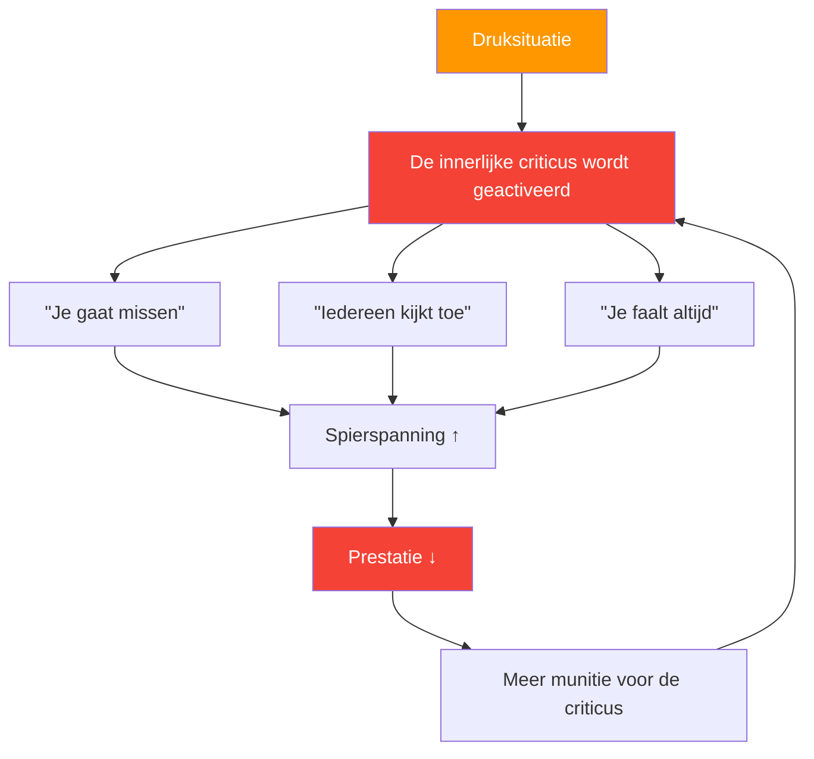

# Het begrijpen van de innerlijke criticus

> &quot;Elke pétanque-speler kent die stem wel: die stem die fluistert &#39;je gaat missen&#39; net voordat je gooit.&quot;

Dit is je innerlijke criticus – en leren omgaan met die criticus is essentieel voor topprestaties.

::: warning De paradox
**Je innerlijke criticus probeert je niet te kwetsen** — het is een misplaatste poging tot bescherming. Maar deze &quot;bescherming&quot; verandert in zelfsabotage.
:::

---

## Wat is de innerlijke criticus?

De innerlijke criticus is die interne stem die oordeelt, bekritiseert en je zelfvertrouwen ondermijnt:

### Wanneer het verschijnt

| Moment | De innerlijke criticus zegt |
|--------|-------------------|
| **Vóór het cruciale schot** | &quot;Iedereen kijkt toe. Verknoei dit niet.&quot; |
| **Na een misser** | &quot;Je bezwijkt altijd onder druk.&quot; |
| **Tijdens een verliesreeks** | &quot;Je bent niet goed genoeg voor dit niveau.&quot; |

## Je eigen patronen herkennen

De eerste stap is bewustwording. Begin op te merken wanneer je innerlijke criticus opduikt:

### Veelvoorkomende triggers
- Situaties onder hoge druk (matchpoint, belangrijke toernooien)
- Na een fout te hebben gemaakt
- Wanneer tegenstanders goed presteren
- Wanneer teamgenoten gefrustreerd lijken
- Lichamelijke vermoeidheid of ongemak

### Algemene berichten
- &quot;Je kunt niet tegen druk.&quot;
- &quot;Jij bent niet zo goed als zij.&quot;
- &quot;Iedereen oordeelt over je&quot;
- &quot;Je faalt altijd wanneer het erop aankomt.&quot;

## De impact op de prestaties

Wanneer je innerlijke criticus de overhand neemt, reageert je lichaam als volgt:

1. **Spierspanning neemt toe** — Je worp wordt stijver.
2. **De ademhaling wordt oppervlakkiger** — Minder zuurstof, minder concentratie
3. **Zicht vernauwt** — Je verliest het besef van het terrein.
4. **Besluitvorming lijdt eronder** — Je twijfelt aan jezelf.

Dit creëert een vicieuze cirkel: de innerlijke criticus leidt tot slechte prestaties, wat de criticus meer munitie geeft.

## Strategieën om de innerlijke criticus te beheersen

### 1. Geef het een naam om het te temmen

Geef je innerlijke criticus een naam – iets ietwat belachelijks. &quot;Oh, daar gaat Negatieve Nul weer.&quot; Dit creëert afstand tussen jou en de stem, waardoor het makkelijker wordt om die te negeren.

### 2. Betwist het bewijsmateriaal

Als een criticus zegt: &quot;Je presteert altijd onder druk&quot;, vraag je dan af: is dat wel echt zo? Kun je je momenten herinneren waarop je juist goed presteerde onder druk? De criticus spreekt vaak absolute termen die zelden de werkelijkheid weerspiegelen.

### 3. Herformuleer de boodschap

Zet kritiek om in coaching:
- &quot;Je gaat het missen&quot; → &quot;Concentreer je op je routine&quot;
- &quot;Iedereen kijkt toe&quot; → &quot;Dit is jouw moment om te schitteren&quot;
- &quot;Je faalt altijd&quot; → &quot;Je hebt al eerder met druk omgegaan&quot;

### 4. Gebruik je routine van vóór de injectie.

Een degelijke voorbereiding op het schieten geeft je geest iets constructiefs om zich op te concentreren, waardoor er minder ruimte overblijft voor zelfkritiek.

### 5. Oefen zelfcompassie

Behandel jezelf zoals je een teamgenoot zou behandelen. Zou je tegen een teamgenoot die het moeilijk heeft zeggen: &quot;Je bent waardeloos&quot;? Natuurlijk niet. Wees net zo vriendelijk voor jezelf.

## Een ondersteunende innerlijke stem ontwikkelen

Het doel is niet om de innerlijke criticus volledig het zwijgen op te leggen – dat is vrijwel onmogelijk. Ontwikkel in plaats daarvan een sterkere, ondersteunende stem:

### De ondersteunende stem zegt:
- &quot;Eén worp tegelijk&quot;
- &quot;Vertrouw op je training&quot;
- &quot;Dit heb je al eerder gedaan.&quot;
- &quot;Blijf in het nu&quot;
- &quot;Adem in en kom tot rust&quot;

### Dagelijkse oefening

Besteed elke dag 5 minuten aan:
1. Denk terug aan een moment waarop je goed presteerde.
2. Onthoud hoe het in je lichaam voelde.
3. Luister naar wat jouw steunende stem zei.
4. Veranker dit gevoel met een fysieke handeling (je boule aanraken, je houding aanpassen).

## In competitie

Wanneer de innerlijke criticus opduikt tijdens een wedstrijd:

1. **Erken het**: &quot;Ik merk dat ik zelfkritisch ben.&quot;
2. **Haal adem**: Haal langzaam en diep adem om tot rust te komen.
3. **Gebruik je anker**: Het fysieke gebaar uit je oefening
4. **Terug naar de routine**: Concentreer je op je voorbereiding op de foto.

## De reis op de lange termijn

Het beheersen van je innerlijke criticus is geen eenmalige oplossing. Het is een voortdurende oefening die met de tijd steeds makkelijker wordt. Topspelers elimineren zelfkritiek niet, ze leren presteren ondanks die zelfkritiek.

De innerlijke criticus zal altijd deel van je blijven uitmaken. Maar met oefening wordt zijn stem stiller en je eigen ondersteunende stem sterker. Dat is het mentale voordeel dat goede spelers van geweldige spelers onderscheidt.

---

| *Gerelateerd: [Omgaan met druk](/en/education/mental-game/mental-strength/handling-pressure) | [Voorbereidingsroutine](/en/education/mental-game/mental-strength/pre-shot-routine) | [Mindfulnesstechnieken](/en/education/mental-game/mindfulness/techniques)* |

