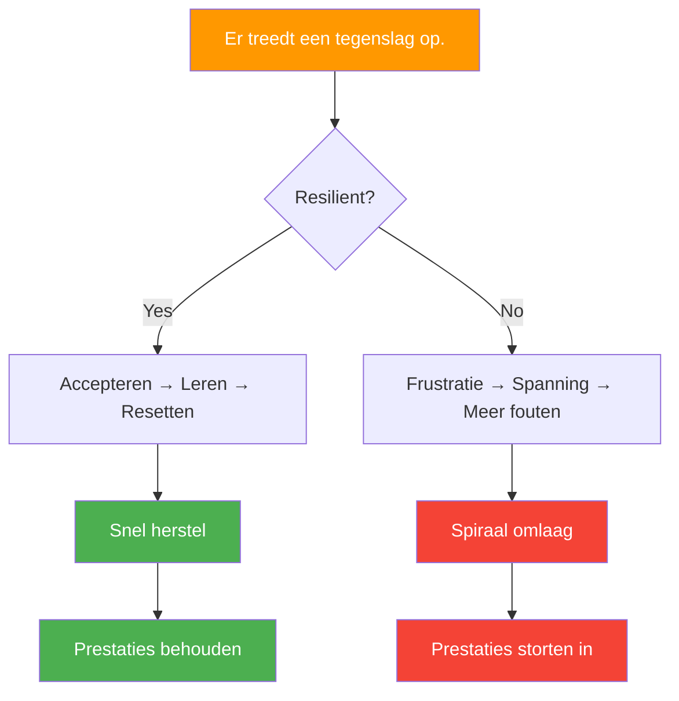

# Mentale veerkracht bij jeu de boules

> &quot;Veerkracht gaat er niet om dat je nooit valt, maar hoe snel je weer opstaat.&quot;

Bij pétanque, waar het momentum snel kan omslaan en een enkele worp alles kan veranderen, is mentale veerkracht vaak doorslaggevend voor de winnaar.

::: tip De waarheid over veerkracht
**Elke topspeler kent wel eens mindere momenten.** Wat hen onderscheidt, is de snelheid waarmee ze herstellen — minuten, geen wedstrijden.
:::

---

## Wat is mentale veerkracht?

Mentale veerkracht is het vermogen om:
- Herstel snel van tegenslagen.
- Houd vol, ondanks de moeilijkheden.
- Aanpassen aan veranderende omstandigheden
- Blijf zelfverzekerd, ook in tegenspoed.
- Leer van mislukkingen zonder erdoor gedefinieerd te worden.

---

## Waarom veerkracht belangrijk is bij pétanque

Petanque stelt de veerkracht voortdurend op de proef:

| Uitdaging | Veerkrachtige reactie | Niet-veerkrachtige reactie |
|-----------|-------------------|------------------------|
| Perfecte positie wordt beschoten | &quot;Volgende worp&quot; | &quot;Oneerlijk!&quot; |
| Een &quot;makkelijke&quot; slag missen | &quot;Opnieuw beginnen, verder gaan&quot; | &quot;Ik verslik me altijd.&quot; |
| Tegenstanders komen terug | &quot;Blijf geconcentreerd&quot; | &quot;We gaan verliezen&quot; |
| Teamgenoot worstelt | &quot;Steun ze&quot; | &quot;Ze verpesten het&quot; |

---

## De veerkrachtige mindset

### Vaste versus groeigerichte mindset

| Vaste denkwijze | Groeimindset |
|---------------|----------------|
| &quot;Ik heb het gemist omdat ik niet goed genoeg ben.&quot; | &quot;Ik heb het gemist - wat kan ik ervan leren?&quot; |
| &quot;Ik kan niet tegen druk.&quot; | &quot;Ik leer omgaan met druk.&quot; |
| &quot;Mislukking betekent dat ik een mislukkeling ben.&quot; | &quot;Mislukking betekent dat ik groei&quot; |

::: info Kerninzicht
**Veerkrachtige spelers zien tegenslagen als informatie, niet als onderdeel van hun identiteit.**
:::

### Bedieningselementen Focus

Veerkrachtige spelers richten zich op wat ze wél kunnen beheersen:
- Hun voorbereiding
- Hun inspanning
- Hun houding
- Hun reactie op de gebeurtenissen

Ze laten los wat ze niet kunnen beheersen:
- Prestaties van de tegenstanders
- Weersomstandigheden
- gelukkige of ongelukkige stuiters
- Meningen van anderen

### Langetermijnperspectief

Eén worp, één wedstrijd, één toernooi – niets daarvan bepaalt je carrière. Veerkrachtige spelers behouden het juiste perspectief:
- &quot;Dit is slechts een moment op een lange reis.&quot;
- &quot;Ik heb al eerder tegenslagen overwonnen.&quot;
- &quot;Hierdoor word ik sterker.&quot;

## Veerkracht opbouwen

### 1. Ontwikkel een sterke basis

Veerkracht is makkelijker te ontwikkelen als je beschikt over:
- **Solide techniek**: Vertrouwen in je vaardigheden
- **Fysieke fitheid**: Energie om inspanning vol te houden
- **Mentale vaardigheden**: Hulpmiddelen om met tegenslagen om te gaan
- **Ondersteunend netwerk**: Mensen die in je geloven

### 2. Oefen met tegenslagen.

Je kunt geen veerkracht opbouwen zonder uitdagingen aan te gaan:
- Trainen onder moeilijke omstandigheden
- Oefen ook als je moe bent
- Neem het op tegen betere spelers.
- Stel jezelf bloot aan situaties onder druk.

### 3. Ontwikkel herstelroutines

Ontwikkel rituelen om weer op te staan na tegenslag:

**Fysieke reset:**
- Diep ademhalen
- Schud de spanning van je af
- Verander je houding.

**Mentale reset:**
- Erken de tegenslag.
- Haal er een willekeurige les uit.
- Richt je aandacht weer op het heden.

### 4. Bouw een veerkrachtbank op

Houd een mentaal overzicht bij van de momenten waarop je tegenslagen hebt overwonnen:
- Reacties die je hebt gemaakt
- Uitdagingen waarmee je te maken hebt gehad
- Groei die je hebt bereikt

Put deze herinneringen in je op als de huidige uitdagingen overweldigend aanvoelen.

## Veerkracht in actie

### Na een gemiste schot

1. **Accepteren**: &quot;Dat is gebeurd&quot;
2. **Adem in**: één keer diep ademhalen
3. **Leerpunten**: Snelle beoordeling (indien nuttig)
4. **Loslaten**: Laat het los
5. **Heroriënteer**: Volgende kans

### Tijdens een verliesreeks

1. **Perspectief**: &quot;Reeksen eindigen&quot;
2. **Proces**: Focus op de uitvoering, niet op de resultaten.
3. **Geduld**: Vertrouw erop dat de prestaties zullen terugkeren.
4. **Volharding**: Blijf opdagen

### Wanneer tegenstanders domineren

1. **Respect**: Erken hun goede spel.
2. **Focus**: Beheers wat je wél kunt beheersen
3. **Wedstrijd**: Laat ze elk punt verdienen.
4. **Leerpunten**: Wat kun je hiervan meenemen?

### Na een zware nederlaag

1. **Gevoel**: Sta teleurstelling toe (kortstondig)
2. **Analyseer**: Wat ging goed? Wat ging niet goed?
3. **Uittreksel**: Lessen voor de volgende keer
4. **Ga verder**: sleep het niet mee naar een ander.

## De moordenaars van de veerkracht

### Perfectionisme
Het verwachten van perfectie leidt gegarandeerd tot teleurstelling. Uitmuntendheid, niet perfectie, is het doel.

### Catastroferen
&quot;Ik heb die slag gemist, de wedstrijd is voorbij, ik ben vreselijk.&quot; Eén gebeurtenis bepaalt niet alles.

### Vergelijking
Door jezelf met anderen te vergelijken, leg je je zelfvertrouwen in hun handen.

### Herkauwen
Het herhalen van mislukkingen verandert ze niet, het verlengt alleen hun impact.

## Teamveerkracht

Veerkracht is besmettelijk – in beide richtingen:

**Het versterken van de veerkracht van het team:**
- Steun teamgenoten die het moeilijk hebben.
- Vier de inspanning, niet alleen de resultaten.
- Geef het goede voorbeeld van veerkrachtige reacties.
- Houd een positieve lichaamstaal aan.

**Bescherming tegen negativiteit:**
- Neem niet deel aan klachtensessies.
- Negatieve gesprekken in een andere richting sturen
- Focus op oplossingen, niet op problemen.

## Ontwikkeling van veerkracht op lange termijn

### Dagelijkse oefeningen
- Een dankbaarheidsdagboek bijhouden (bevordert een positieve kijk op het leven)
- Mindfulnessmeditatie (bevordert emotionele regulatie)
- Lichamelijke oefening (verhoogt de stresstolerantie)

### Wekelijkse reflectie
- Welke uitdagingen ben ik tegengekomen?
- Hoe heb ik gereageerd?
- Wat zou ik anders doen?
- Waar ben ik trots op?

### Seizoensoverzicht
- Grote tegenslagen en hoe ik daarmee omging.
- Groei in veerkrachtcapaciteit
- Gebieden voor verdere ontwikkeling

## De veerkrachtige concurrent

De meest veerkrachtige concurrenten hebben de volgende eigenschappen gemeen:
- Ze verwachten uitdagingen en bereiden zich daarop voor.
- Ze beschouwen tegenslagen als tijdelijk en specifiek.
- Ze blijven zich inzetten, ook als de resultaten uitblijven.
- Ze leren van elke ervaring.
- Ze behouden het perspectief op wat er echt toe doet.

Veerkracht is geen eigenschap die je wel of niet hebt, maar een vaardigheid die je ontwikkelt door oefening en intentie.

---

| *Gerelateerd: [Mentale kracht](/en/education/mental-game/mental-strength/) | [Omgaan met druk](/en/education/mental-game/mental-strength/handling-pressure) | [De Zone](/en/education/mental-game/the-zone/)* |

