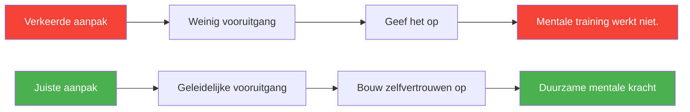

# 5 veelgemaakte fouten bij mentale training

> &quot;Veel spelers investeren tijd in mentale vaardigheden, maar zien weinig verbetering. Dit is waarom.&quot;

Mentale training kan je pétanque-prestaties aanzienlijk verbeteren, maar alleen als je het op de juiste manier doet.

::: danger Algemeen patroon
**De meeste mentale trainingen mislukken niet omdat de technieken niet werken**, maar vanwege de manier waarop ze worden toegepast.
:::

---

## Fout nr. 1: Mentale vaardigheden als optioneel beschouwen

::: warning Het probleem
Veel spelers beschouwen mentale training als iets dat niet gepast is, iets waar ze aan kunnen werken &quot;als er tijd voor is&quot;.
:::

### Waarom het mislukt

Mentale vaardigheden zijn vaardigheden – ze vereisen dezelfde consistente oefening als werptechniek. Incidentele aandacht levert incidentele resultaten op.

### De oplossing

| Actie | Uitvoering |
|--------|---------------|
| Plan het in | Net als fysieke training |
| Begin klein. | Slechts 10 minuten per dag |
| Maak het ononderhandelbaar. | Geen excuses |
| Volg het | Naast fysieke oefening |

**Onthoud:** Op topniveau bepalen mentale vaardigheden vaak wie er wint.

## Fout nr. 2: Alleen trainen als er iets misgaat

### Het probleem

Spelers wenden zich vaak pas tot mentale training na een slechte prestatie of tijdens een dip. Ze zien het als een noodoplossing in plaats van een manier om hun spel te verbeteren.

### Waarom het mislukt

Mentale vaardigheden die in crisissituaties worden opgebouwd, zijn kwetsbaar. Je kunt geen diepgaande competenties ontwikkelen als je het al moeilijk hebt. Het is alsof je probeert te leren zwemmen terwijl je aan het verdrinken bent.

### De oplossing

- Ontwikkel mentale vaardigheden tijdens goede tijden.
- Oefen wanneer je goed presteert.
- Leg een basis voordat je die nodig hebt.
- Blijf consequent oefenen, ongeacht de resultaten.

**Onthoud:** De beste tijd om mentale kracht op te bouwen is wanneer je die niet wanhopig nodig hebt.

## Fout nr. 3: Directe resultaten verwachten

### Het probleem

Spelers proberen visualisatie een week lang uit, zien geen onmiddellijke verbetering en concluderen: &quot;Het werkt niet voor mij.&quot;

### Waarom het mislukt

Mentale vaardigheden ontwikkelen zich langzaam, vaak in eerste instantie onmerkbaar. De neurale verbindingen die mentale kracht ondersteunen, hebben tijd nodig om zich te ontwikkelen. Snelle resultaten verwachten leidt ertoe dat men opgeeft voordat de voordelen zichtbaar worden.

### De oplossing

- Neem je voor om minstens 8-12 weken consistent te oefenen.
- Zoek naar subtiele verbeteringen, niet naar dramatische veranderingen.
- Vertrouw op het proces, zelfs als er geen zichtbare vooruitgang is.
- Houd een dagboek bij om geleidelijke veranderingen te documenteren.

**Onthoud dit:** Je zou ook niet verwachten dat je een nieuwe worp in een week onder de knie hebt. Mentale vaardigheden verdienen hetzelfde geduld.

## Fout nr. 4: Algemene werkwijze zonder personalisatie

### Het probleem

Spelers volgen generieke mentale trainingsprogramma&#39;s zonder deze aan te passen aan hun specifieke behoeften, persoonlijkheid en speelstijl.

### Waarom het mislukt

Mentale training is niet voor iedereen hetzelfde. Wat voor de ene speler werkt, werkt misschien niet voor de andere. Een visualisatietechniek die een visueel ingestelde denker helpt, kan iemand die op gevoel denkt juist frustreren.

### De oplossing

- Identificeer JOUW specifieke mentale uitdagingen
- Experimenteer met verschillende technieken.
- Pas de methoden aan je leerstijl aan.
- Focus op wat je daadwerkelijk helpt.

**Vragen om te stellen:**
- Welke mentale uitdagingen ondervind ik het vaakst?
- Hoe verwerk ik informatie van nature?
- Wat heeft in het verleden voor mij gewerkt?
- Wat voelt voor mij authentiek aan?

## Fout nr. 5: Mentale en fysieke training van elkaar scheiden.

### Het probleem

Spelers doen mentale training in isolatie — meditatie thuis, visualisatie voor het slapengaan — maar integreren dit niet met fysieke training.

### Waarom het mislukt

Mentale vaardigheden moeten gekoppeld worden aan fysieke prestaties. Mindfulness beoefenen op een kussen is anders dan mindfulness beoefenen tijdens het werpen. De overdracht verloopt niet automatisch.

### De oplossing

- Gebruik mentale vaardigheden tijdens elke oefensessie.
- Oefen je voorbereiding op de opname met volledige mentale concentratie.
- Pas drukbeheersingstechnieken toe tijdens de training.
- Creëer oefensituaties die mentale vaardigheden vereisen.

**Integratievoorbeelden:**
- Visualiseer elke worp voordat je hem uitvoert.
- Gebruik ademhalingstechnieken tussen de worpen door.
- Oefen je concentratieoefening tijdens de training.
- Simuleer regelmatig stressvolle situaties.

## Bonusfouten

### Fout nr. 6: Alleen maar theorie, geen praktijk.

Lezen over mentale vaardigheden is niet hetzelfde als ze in de praktijk brengen. Kennis zonder toepassing verandert niets.

### Fout nr. 7: De basisprincipes negeren

Geavanceerde technieken die op een zwakke basis zijn gebouwd, zullen instorten. Beheers eerst de basisprincipes van ademhaling, focus en routine voordat je complexere methoden toepast.

### Fout nr. 8: Alles alleen doen

Mentale training heeft baat bij begeleiding. Overweeg om samen te werken met een sportpsycholoog of een ervaren mentor.

## De juiste aanpak

Effectieve mentale training:

1. **Is consistent** — Regelmatig oefenen, niet af en toe aandacht besteden.
2. **Is proactief** — Gebouwd voordat het nodig is, niet in crisissituaties.
3. **Is geduldig** — Geeft tijd voor ontwikkeling
4. **Is gepersonaliseerd** — Afgestemd op uw behoeften
5. **Is geïntegreerd** — Verbonden met fysieke oefening

## Goed van start gaan

Als je begint met mentale training:

1. **Eerlijk beoordelen** hoe mentaal je er momenteel voor staat
2. **Identificeer** 1-2 specifieke verbeterpunten.
3. **Kies** technieken die bij jouw stijl passen.
4. **Plan** regelmatige oefentijd in
5. **Integreer** met fysieke training
6. **Volg** de voortgang in de loop van de tijd
7. **Pas aan** op basis van wat werkt.

## De beloning

Spelers die deze fouten vermijden en hun geest consequent trainen, melden het volgende:
- Meer consistentie onder druk
- Sneller herstel van fouten
- Meer plezier in de competitie
- Betere focus en concentratie
- Toegenomen zelfvertrouwen

Mentale vaardigheden zijn trainbaar. Train ze op de juiste manier.

---

| *Gerelateerd: [Mentale kracht](/en/education/mental-game/mental-strength/) | [Trainingsmethoden](/en/education/technique/training/) | [Mindfulness](/en/education/mental-game/mindfulness/)* |

