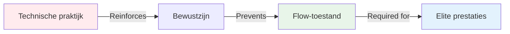

# Waarom topspelers meer behoefte hebben aan mentale training dan aan technische training.

> &quot;Als je al jaren pétanque speelt en een solide techniek hebt, kan meer technische oefening je wellicht belemmeren.&quot;

::: tip De ongemakkelijke waarheid
**Op topniveau is niet je techniek het knelpunt, maar je mindset.**
:::

---

## De paradox van eliteontwikkeling

Dit verrast de meeste spelers:

::: warning Het inversieprincipe
Naarmate je technische vaardigheden toenemen, zou de verhouding tussen technische en mentale training moeten **omkeren**.

- **Beginners:** 90% technisch, 10% mentaal
- **Gemiddeld niveau:** 70% technisch, 30% mentaal
- **Gevorderd:** 50% technisch, 50% mentaal
- **Elite:** 20% technisch, 80% mentaal
:::

Dit is niet intuïtief. De meeste spelers gaan ervan uit dat ze hun techniek meer moeten oefenen om beter te worden. Maar op topniveau leidt deze aanpak juist tot problemen.

## Waarom technische training topprestaties kan schaden

### Het probleem van overdenken

Door veel te oefenen op een bepaalde techniek, versterk je het **bewustzijn** van je bewegingen. Dit is perfect voor beginners die neurale verbindingen aan het opbouwen zijn. Maar voor topspelers creëert het een gevaarlijke gewoonte: nadenken over de techniek tijdens de uitvoering.

**Voorbeeld uit het terrein:**

*Beginner:* Moet denken aan &quot;knieën buigen, soepel loslaten, doorzwaaien&quot; om de oefening correct uit te voeren.

*Topspeler:* Heeft al meer dan 10.000 uur geoefend. De beweging is automatisch. De gedachte aan &quot;knieën buigen&quot; verstoort juist het aangeleerde patroon.

### De flowtoestandbarrière

Flowtoestanden (het &#39;in de zone zijn&#39;) vereisen **tijdelijke hypofrontaliteit** – een tijdelijke vermindering van de activiteit in de prefrontale cortex (het analytische deel van je hersenen).

Hoe meer je bewust op een techniek oefent, hoe moeilijker het wordt om je tijdens een wedstrijd af te sluiten.

## Wat topspelers echt nodig hebben

### 1. De mogelijkheid om van modus te wisselen

Topprestaties vereisen het beheersen van de overgang tussen twee hersenmodi:

**Planningsmodus (buiten de cirkel)**
- Analytisch denken
- Strategiebeoordeling
- Besluitvorming
- Risicobeoordeling

**Uitvoeringsmodus (binnen de cirkel)**
- Automatische beweging
- Doelgerichte focus
- Vertrouwen in training
- Toegang tot de stroomstatus

De meeste topspelers zitten vast in de planningsfase tijdens de uitvoering. Ze moeten de **omschakeling** trainen, niet de techniek.

### 2. Drukbeheersing

Technische training in comfortabele omstandigheden bereidt je niet voor op de psychologische druk van een wedstrijd.

**Wat er onder druk gebeurt:**
- De hartslag neemt toe.
- De ademhaling wordt oppervlakkig.
- Spieren gespannen
- De aandacht vernauwt zich
- De innerlijke criticus wordt geactiveerd

Je kunt tijdens de training een perfecte techniek beheersen en die onder druk volledig kwijtraken. Dit is geen technisch probleem, maar een mentaal probleem.

### 3. Foutcorrectie

Topspelers maken niet minder fouten dan goede spelers. Ze herstellen alleen sneller.

**Goede speler na een slechte worp:**
- Blijft stilstaan bij de fout.
- Analyseert wat er mis is gegaan
- Zorgen over de volgende worp.
- De prestaties verslechteren.

**Topspeler na een slechte worp:**
- Neutrale observatie
- Snel leren
- Directe reset
- Prestaties gehandhaafd

Dit is een aangeleerde vaardigheid, geen persoonlijkheidskenmerk.

## De wetenschap: waarom mentale training werkt

### Neurowetenschap van expertise

Onderzoek naar de prestaties van experts toont aan dat topsporters de volgende eigenschappen bezitten:

1. **Geautomatiseerde motorische patronen** - Bewegingen vinden plaats zonder bewuste controle.
2. **Superieure patroonherkenning** - Situaties sneller doorzien
3. **Betere emotionele regulatie** - Effectief omgaan met druk.
4. **Sneller herstel** - Reset snel na fouten

Let op: alleen punt 1 is technisch. De andere drie zijn mentaal.

### De drempel van 10.000 uur

Als je ongeveer 10.000 uur hebt geïnvesteerd in doelgericht oefenen (zo&#39;n 8-10 jaar serieus spelen), zijn je technische patronen grotendeels vastgelegd. Verdere technische verbetering levert dan steeds minder op.

Maar mentale ontwikkeling? Daar valt nog enorm veel te verbeteren.

## Hoe u uw training kunt herstructureren

### Voor topspelers (8+ jaar ervaring)

**Huidige gebruikelijke verdeling:**
- 80% technische praktijk
- 20% spelen/competitie

**Aanbevolen verdeling:**
- 20% technisch onderhoud
- 40% mentale training
- 40% van de situaties is competitief/onder druk.

### Hoe ziet mentale training eruit?

**Niet dit:**
- &quot;Ontspan je gewoon&quot;
- &quot;Denk er niet aan&quot;
- &quot;Wees zelfverzekerd&quot;

**Maar dit:**
- Gestructureerde mindfulness-oefening (10 minuten per dag)
- Ontwikkeling en oefening van de voorbereiding op de opname
- Druksimulatie in de training
- Protocollen voor het herstellen van fouten
- Identificatie van triggers voor stroomtoestanden
- Innerlijke coach versus innerlijke criticus

Zie onze [Onderwijs](/nl/education/) sectie voor specifieke technieken.

## De ongemakkelijke waarheid

Als je een topspeler bent en nog steeds 80% van je trainingstijd besteedt aan technische oefeningen, train je als een beginner. Je techniek is al goed genoeg. De beperking zit niet in je arm, maar in je mindset.

::: tip De echte vraag
Het gaat niet om &quot;Hoe kan ik mijn aanwijstechniek verbeteren?&quot;

De vraag is: &quot;Hoe kan ik onder druk consistent mijn beste techniek toepassen?&quot;
:::

## Praktische vervolgstappen

### 1. Bepaal uw huidige ratio

Houd je training gedurende één week bij:
- Uren technische praktijk
- Urenlang oefenen met mentale training.
- Uren in competitieve/druksituaties

### 2. Begin klein

Verander de verhouding niet van de ene op de andere dag. Voeg toe:
- 10 minuten mindfulness per dag
- Eén mentale focus per trainingssessie.
- Oefening van de voorbereiding op de opname

### 3. Mentale prestaties meten

Spoor:
- Hersteltijd na fouten
- Consistentie onder druk
- Stroomtoestandfrequentie
- Naleving van de pre-injectieprocedure

### 4. Gebruik de educatieve modules

Begin met:
1. [De Zone](/nl/education/mental-game/the-zone/) - Flow-toestanden begrijpen
2. [Mentale kracht](/nl/education/mental-game/mental-strength/) - Ontwikkel vaardigheden om onder druk te presteren
3. [Mindfulness](/nl/education/mental-game/mindfulness/) - Ontwikkel focus op het huidige moment

## Conclusie

De weg naar topprestaties ligt niet in meer technische oefening, maar in slimmere mentale training. Je techniek is al goed genoeg. De vraag is: kun je die toepassen wanneer het erop aankomt?

De spelers die deze omschakeling maken – die mentale training als hun belangrijkste ontwikkelingsfocus omarmen – zijn degenen die prestatieplateaus doorbreken en consistent uitmuntend presteren.

**De keuze is aan jou:** Blijf trainen als een beginner, of begin te trainen als een topspeler.

---

## Gerelateerde bronnen

- [De Zone: Het begrijpen van de flowtoestand](/nl/education/mental-game/the-zone/)
- [Casestudies: Topspelers in actie](/nl/articles/case-studies)
- [Doelsjabloon](/nl/guides/templates/goal-template) - Plan je mentale spelontwikkeling

**Vragen of opmerkingen?** Stuur een e-mail naar [patrik.wiik@gmail.com](mailto:patrik.wiik@gmail.com)

