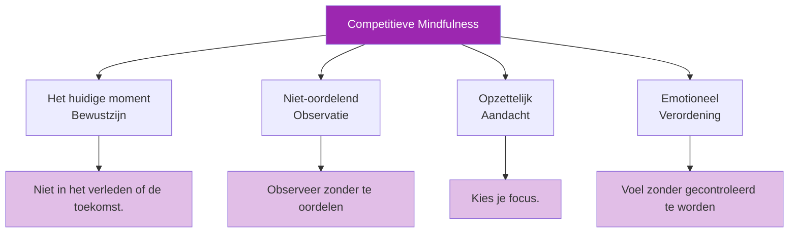

# Aandacht in competitieverband

> &quot;Mindfulness is niet alleen voor meditatiekussens — het is een concurrentievoordeel.&quot;

Het vermogen om tijdens wedstrijden aanwezig, alert en niet-reactief te blijven, onderscheidt topsporters van degenen die onder druk bezwijken.

::: tip Het voordeel van het huidige moment
**Je kunt maar één boule tegelijk gooien.** Mindfulness zorgt ervoor dat je in het enige moment blijft dat ertoe doet: dit moment.
:::

---

## Wat mindfulness betekent in een competitieve omgeving

---

## Het probleem van de dwalende geest

::: danger Het 47%-probleem
**Onderzoek toont aan dat de gemiddelde persoon 47% van de tijd met zijn of haar gedachten afdwaalt.** In een competitieve omgeving zijn deze afdwalende gedachten kostbaar.
:::

| Waarheen de gedachten gaan | Wat je mist |
|-----------------|---------------|
| Laatste gemiste schot | Actuele terreinmeting |
| Piekeren over de score | Optimale worpselectie |
| Wat anderen denken | Gevoel van de boule |
| Feesten plannen | Uitvoering op dit moment |

Elke seconde die je besteedt aan mentale tijdreizen is een seconde die je niet besteedt aan de worp die voor je ligt.

## Mindfulnessvaardigheden voor wedstrijden

### 1. Verankering in het heden

Gebruik zintuiglijke ankers om terug te keren naar het hier en nu:

**Fysieke ankers:**
- Voel het gewicht van de boule.
- Let op waar je voeten zich op de grond bevinden.
- Voel de textuur van de grip.

**Milieu-ankers:**
- Bekijk specifieke details van het terrein.
- Luister naar omgevingsgeluiden
- Voel de temperatuur en de wind.

### 2. Observeren zonder te reageren

Wanneer emoties opkomen (frustratie, angst, opwinding), oefen dan het volgende:

1. **Opmerking**: &quot;Ik voel me gefrustreerd&quot;
2. **Naam**: &quot;Dit is frustratie&quot;
3. **Toestaan**: Laat het er zijn zonder ertegen te vechten.
4. **Terugkeer**: Breng de aandacht terug naar de huidige taak.

De emotie verdwijnt niet, maar ze verliest wel haar macht om je te beheersen.

### 3. Enkelvoudige focus

Train je aandacht om op één ding gefocust te blijven:

**Vóór de worp:**
- Concentreer je uitsluitend op het lezen van het terrein.
- Pas dan, na het visualiseren van het resultaat.
- Dan alleen op basis van je lichaamshouding

**Tijdens de worp:**
- Richt je uitsluitend op het doel.
- Laat het lichaam zijn werk doen zonder inmenging.

### 4. De geest van de beginner

Benader elke worp alsof het je eerste is:
- Geen aannames gebaseerd op prestaties uit het verleden.
- Een frisse blik op het terrein
- Nieuwsgierigheid in plaats van verwachting

## Praktische toepassingen

### Tussen de worpen door

De tijd tussen de worpen is het moment waarop je gedachten het meest afdwalen. Gebruik deze tijd bewust:

- **Let goed op**: Observeer je teamgenoten en tegenstanders met volle aandacht.
- **Blijf in je lichaam aanwezig**: let op je ademhaling, houding en fysieke gesteldheid.
- **Bereid je mentaal voor**: Visualiseer mogelijke scenario&#39;s
- **Rust je aandacht**: Gun je concentratie korte pauzes.

### Tijdens stressvolle momenten

Wanneer de inzet het hoogst is:

1. **Doe het rustiger aan**: Haal even diep adem.
2. **Aard jezelf**: Voel je voeten, de boule
3. **Gerichte focus**: Deze worp alleen
4. **Vertrouwen**: Laat de gehechtheid aan het resultaat los.

### Na fouten

Fouten leiden tot piekeren. Doorbrek de cyclus:

1. **Erkenning**: &quot;Dat ging niet zoals gepland&quot;
2. **Fragment**: &quot;Wat kan ik leren?&quot;
3. **Reactie**: &quot;Het is klaar, we gaan verder&quot;
4. **Heroriënteren**: &quot;Wat is de volgende stap?&quot;

## De mindful voorbereiding op de foto

Integreer mindfulness in je dagelijkse routine:

1. **Aankomst**: Stap met volledige aanwezigheid de cirkel binnen.
2. **Ademhaling**: Eén bewuste ademhaling om tot rust te komen.
3. **Kijk**: Observeer het terrein aandachtig.
4. **Visualiseer**: Zie het resultaat duidelijk voor je.
5. **Voel**: Merk de boule op, je lichaam
6. **Loslaten**: Laat los en vertrouw

## Gemeenschappelijke uitdagingen

### &quot;Ik kan niet stoppen met denken&quot;

Je hoeft je gedachten niet te stoppen, maar volg ze gewoon niet. Merk de gedachte op, laat hem voorbijgaan en keer terug naar je anker.

### &quot;Mindfulness maakt me te ontspannen.&quot;

Competitieve mindfulness draait niet om kalm zijn, maar om aanwezig zijn in het moment. Je kunt tegelijkertijd alert, energiek en mindful zijn.

### &quot;Ik vergeet om bewust te zijn.&quot;

Gebruik triggers:
- Het oppakken van de boule = aanwijzing voor mindfulness
- In de cirkel stappen = herinnering aan aanwezigheid
- Je standpunt innemen = aandachtsanker

## De vaardigheid ontwikkelen

### Dagelijkse oefening

5-10 minuten formele mindfulness-oefening versterkt de neurale verbindingen:
- Ademhalingsmeditatie
- Lichaamsscan oefening
- Oefeningen voor aandachtige observatie

### Trainingsintegratie

Oefen mindfulness tijdens elke trainingssessie:
- Volledige concentratie bij elke worp.
- Let op wanneer de aandacht afdwaalt.
- Oefen om je weer te concentreren.

### Wedstrijdvoorbereiding

Voor de wedstrijden:
- Korte mindfulness-oefening
- Stel je intentie vast om je op het heden te concentreren.
- Herinner jezelf aan je ankers.

## Het concurrentievoordeel

Bewuste concurrenten hebben voordelen:
- **Sneller herstel** van fouten
- **Betere besluitvorming** onder druk
- **Consistentere** prestaties
- **Meer plezier** in de competitie
- **Minder burn-out** en angst

De speler die zich bij elke worp volledig concentreert, terwijl anderen in gedachten verzonken zijn, heeft een aanzienlijk voordeel.

---

| *Gerelateerd: [Inleiding tot mindfulness](/en/education/mental-game/mindfulness/) | [Mindfulnesstechnieken](/en/education/mental-game/mindfulness/techniques) | [Dagelijkse oefening](/en/education/mental-game/mindfulness/daily-practice)* |

