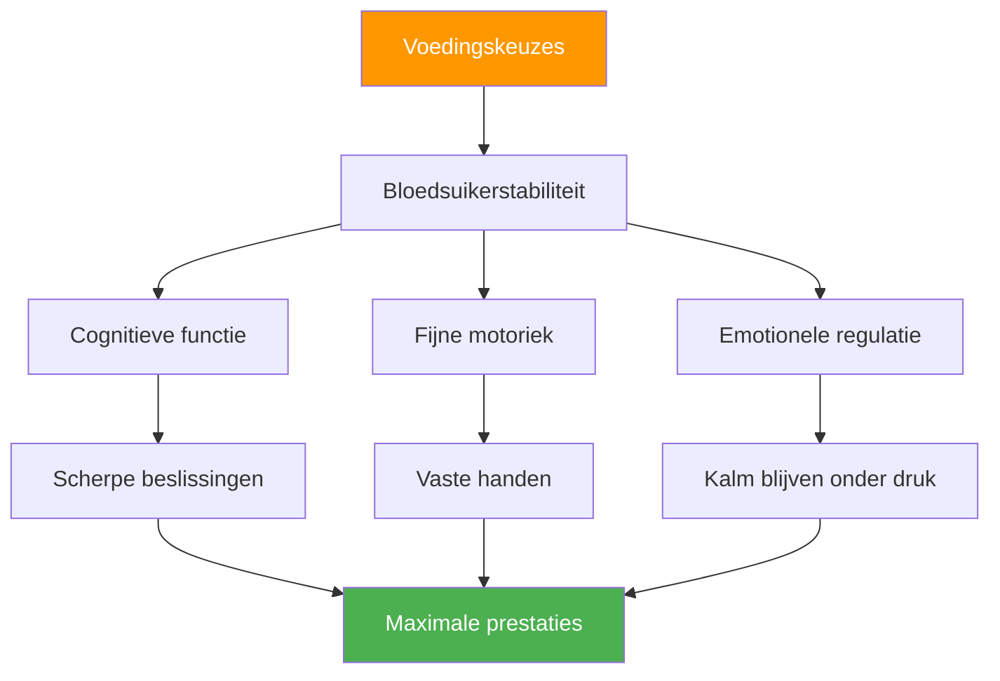

# Voeding voor de competitie: brandstof voor optimale prestaties

> &quot;Je hersenen zijn je belangrijkste instrument bij pétanque. Geef ze stabiele brandstof, geen energie die je in een achtbaan kunt stoppen.&quot;

Pétanque-wedstrijden kunnen 6 tot 10 uur duren. Wat je eet en drinkt heeft direct invloed op je cognitieve functies, fijne motoriek en je vermogen om je concentratie gedurende meerdere wedstrijden vast te houden.

::: tip De Gouden Regel
**Stabiele bloedsuiker = vaste handen.** Elke voedingskeuze moet zorgen voor een constante energiebalans, niet voor pieken en dalen.
:::

---

## Waarom voeding belangrijk is voor pétanque

In tegenstelling tot intensieve sporten, vereist pétanque het volgende:

Verkeerde voedingskeuzes leiden tot prestatieproblemen die spelers toeschrijven aan &quot;mentale zwakte&quot; of &quot;pech&quot;.

---

## Het verband tussen bloedsuiker en de bloedsuikerspiegel

Je hersenen functioneren op glucose. Schommelingen in de bloedsuikerspiegel hebben directe gevolgen voor:

| Bloedsuikerspiegel | Mentaal effect | Fysiek effect |
|-------------------|---------------|-----------------|
| **Stabiel** | Helder denken, goede beslissingen | Vaste handen, consistent |
| **Piek (te hoog)** | Aanvankelijke energie, dan een crash. | Nerveus, overactief |
| **Ongeldige crash (te laag)** | Slechte concentratie, prikkelbaarheid | Trillen, zwakke greep |
| **Achtbaan** | Onvoorspelbare stemming/concentratie | Inconsistente prestaties |

**Doel:** De bloedsuikerspiegel stabiel houden gedurende de wedstrijd.

## Voeding op de wedstrijddag

### Voor de wedstrijd (3-4 uur van tevoren)

**Eet een stevige maaltijd:**
- Complexe koolhydraten (havermout, volkorenbrood, rijst)
- Eiwitten (eieren, yoghurt, mager vlees)
- Gezonde vetten (avocado, noten, olijfolie)
- Vermijd: eenvoudige suikers, zware/vette voedingsmiddelen

**Voorbeelden van maaltijden:**
- Havermout met noten en banaan
- Eieren op volkorentoast met avocado
- Rijst met kip en groenten

### Voor de wedstrijd (1-2 uur van tevoren)

**Lichte, vertrouwde snack:**
- Banaan
- Een klein handje noten
- Een halve sandwich
- Vermijd: Alles wat nieuw of experimenteel is.

### Tijdens de wedstrijd

**Tussen de wedstrijden door:**
- Kleine, frequente snacks om de 60-90 minuten.
- Noten, zaden, gedroogd fruit
- Volkoren crackers
- Vers fruit (banaan, appel)

**Tijdens wedstrijden:**
- Water sijpelt tussen de uiteinden door.
- Snelle koolhydraten indien nodig (gedroogd fruit)
- Vermijd eten tijdens actief spelen.

### Herstel (na de wedstrijd)

**Binnen 30-60 minuten:**
- Eiwitten voor spierherstel
- Koolhydraten ter aanvulling
- Vocht om te rehydrateren

## Hydratatieprotocol

### De basisprincipes
- Begin de dag goed gehydrateerd (controleer de kleur van je ochtendurine).
- Drink gestaag door, wacht niet tot je dorst hebt.
- Streef naar 150-250 ml per uur tijdens de wedstrijd.
- Aanpassen aan warmte en luchtvochtigheid.

### Waarschuwingssignalen van uitdroging
- Dorst (je bent al uitgedroogd)
- Donkere urine
- Hoofdpijn
- Verlaagde concentratie
- Vermoeidheid

### De valkuil van overhydratatie
Te veel water, vooral zonder elektrolyten:
- Frequent toiletbezoek (verstoort het ritme)
- Verdunde elektrolyten (kunnen trillingen veroorzaken)
- Ongemak en afleiding

**Balans:** Constante inname, elektrolyten toevoegen bij warm weer.

## Voedingsmiddelen die je beter kunt vermijden

### Op de wedstrijddag
- **Zware maaltijden** — Leidt bloed naar de spijsvertering.
- **Hoog suikergehalte** — Veroorzaakt energiedips
- **Alcohol (de avond ervoor)** — Verstoort de slaap en droogt uit.
- **Overmatige cafeïne** — Kan nervositeit veroorzaken
- **Nieuwe voedingsmiddelen** — Risico op spijsverteringsproblemen
- **Vette/gefrituurde gerechten** — Trage spijsvertering, lusteloosheid

### Voedingsmiddelen die problemen veroorzaken
- **Koolzuurhoudende dranken** — Opgeblazen gevoel, ongemak
- **Voedingsmiddelen met veel vezels** — kunnen klachten veroorzaken.
- **Zuivel (voor sommigen)** — Gevoeligheid van de spijsvertering
- **Kunstmatige zoetstoffen** — kunnen maagproblemen veroorzaken.

## Cafeïnestrategie

Cafeïne kan de concentratie en reactiesnelheid verbeteren, maar vereist wel zorgvuldige beheersing:

### Effectief gebruik
- Ken je tolerantie.
- Constante timing (niet aanpassen voor wedstrijden)
- Matige dosis (100-200 mg)
- Vroeg genoeg om interferentie door avondwedstrijden te voorkomen.
- Combineer met voedsel om nervositeit te verminderen.

### Ineffectief gebruik
- Meer dan normaal (veroorzaakt angst en trillen)
- Laat op de dag (verstoort de slaap)
- Op een lege maag (nerveus, energiedip)
- Het gebruik van cafeïne om slaapgebrek te compenseren.

## Het samenstellen van je wedstrijdvoedingsplan

### Stap 1: Oefentest
Test je wedstrijdvoedingsplan uit tijdens de training:
- Dezelfde timing
- Hetzelfde voedsel
- Dezelfde hydratatie
- Let op hoe je je voelt en presteert.

### Stap 2: Logistiek voorbereiden
- Zorg dat u weet welk eten er op de locatie verkrijgbaar is.
- Neem je eigen beproefde snacks mee.
- Zorg voor back-upopties.
- Neem meer mee dan je denkt nodig te hebben.

### Stap 3: Maak een planning
Noteer de timing van je maaltijden:
- Maaltijd vóór de wedstrijd (tijd, eten)
- Snack voor de wedstrijd (tijd, eten)
- Tijdens de wedstrijd (schema, voeding)
- Herinneringsintervallen voor hydratatie

### Stap 4: Volgen en aanpassen
Na afloop van de wedstrijden, let op:
- Wat je gegeten hebt en wanneer.
- Hoe voelde je je fysiek?
- Prestatiekwaliteit
- Eventuele problemen (honger, energiedip, maagklachten)

## Aandachtspunten met betrekking tot hitte en luchtvochtigheid

Bij warm weer gelden andere eisen:

- **Verhoog de vochtinname** — Mogelijk 50-100% meer nodig.
- **Voeg elektrolyten toe** — Door transpiratie gaan mineralen verloren.
- **Lichtere maaltijden** — Zwaar voedsel is moeilijker te verwerken.
- **Schaduwpauzes** — Onderschat de hittestress niet.
- **Vooraf afkoelen** — Kom koel en gehydrateerd aan op de locatie.

## Veelgemaakte fouten

::: warning Vermijd deze
- **Het ontbijt overslaan** — Vermindert de glycogeenvoorraad in de ochtend.
- **Energiedranken** — Te veel cafeïne en suiker
- **Wachten tot je honger hebt** — Heeft nu al invloed op de prestaties
- **Alcoholgebruik de avond ervoor** — Uitdroging en slecht slapen
- **Nieuwe voedingsmiddelen uitproberen** — Risico op spijsverteringsproblemen
:::

## Actiestappen

1. **Plan je wedstrijdvoeding van tevoren**
2. **Test je plan** in de praktijk
3. **Bereid je snacks voor** de avond ervoor
4. **Houd je aan je schema**, ongeacht de wedstrijddruk.
5. **Evalueer en verbeter** na elke wedstrijd.

---

## Gerelateerde inhoud

- [Voedingsmodule](/nl/education/nutrition/) — Complete voedingseducatie
- [Voeding voor wedstrijden](/nl/education/nutrition/competition) — Gedetailleerde protocollen
- [Slaap voor betere prestaties](/nl/articles/sleep-performance) — Hersteloptimalisatie

