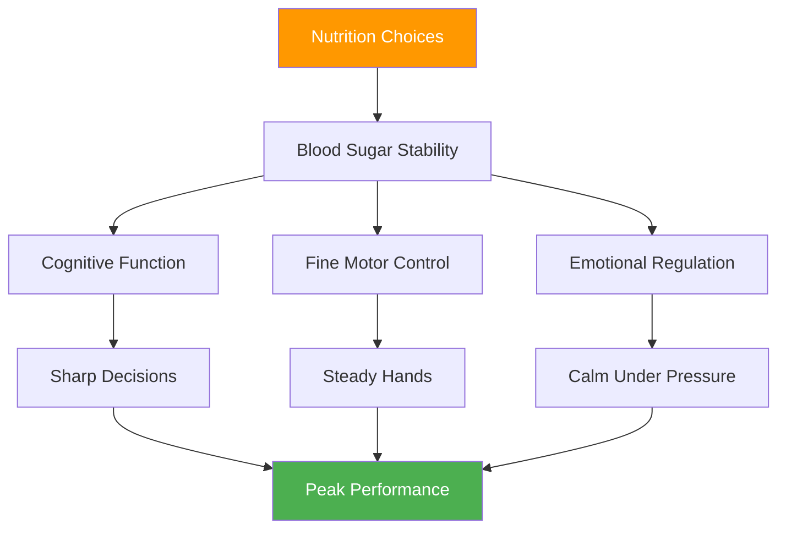

# Nutrition for Competition: Fueling Precision Performance

> "Your brain is your most important tool in pétanque. Feed it stable fuel, not roller coaster energy."

Pétanque competitions can last 6-10 hours. What you consume directly affects your cognitive function, fine motor control, and ability to maintain focus across multiple matches.

::: tip The Golden Rule
**Stable blood sugar = steady hands.** Every nutrition choice should support consistent energy, not spikes and crashes.
:::

---

## Why Nutrition Matters for Pétanque

Unlike high-intensity sports, pétanque demands:

The wrong nutrition choices create performance problems that players attribute to "mental weakness" or "bad luck."

---

## The Blood Sugar Connection

Your brain runs on glucose. Blood sugar fluctuations directly affect:

| Blood Sugar State | Mental Effect | Physical Effect |
|-------------------|---------------|-----------------|
| **Stable** | Clear thinking, good decisions | Steady hands, consistent |
| **Spike (too high)** | Initial energy, then crash | Jittery, over-active |
| **Crash (too low)** | Poor concentration, irritability | Trembling, weak grip |
| **Roller-coaster** | Unpredictable mood/focus | Inconsistent performance |

**Goal:** Maintain stable blood sugar throughout competition.

## Competition Day Nutrition

### Pre-Competition (3-4 hours before)

**Eat a substantial meal:**
- Complex carbohydrates (oatmeal, whole grain bread, rice)
- Protein (eggs, yogurt, lean meat)
- Healthy fats (avocado, nuts, olive oil)
- Avoid: Simple sugars, heavy/greasy foods

**Example meals:**
- Oatmeal with nuts and banana
- Eggs on whole grain toast with avocado
- Rice with chicken and vegetables

### Pre-Match (1-2 hours before)

**Light, familiar snack:**
- Banana
- Small handful of nuts
- Half a sandwich
- Avoid: Anything new or experimental

### During Competition

**Between matches:**
- Small, frequent snacks every 60-90 minutes
- Nuts, seeds, dried fruit
- Whole grain crackers
- Fresh fruit (banana, apple)

**During matches:**
- Water sips between ends
- Quick carbs if needed (dried fruit)
- Avoid eating during active play

### Recovery (After Competition)

**Within 30-60 minutes:**
- Protein for muscle recovery
- Carbohydrates to replenish
- Fluids to rehydrate

## Hydration Protocol

### The Basics
- Start hydrated (check morning urine color)
- Drink steadily throughout, don't wait until thirsty
- Target 150-250ml per hour of competition
- Adjust for heat and humidity

### Warning Signs of Dehydration
- Thirst (you're already dehydrated)
- Dark urine
- Headache
- Decreased concentration
- Fatigue

### The Over-Hydration Trap
Too much water, especially without electrolytes:
- Frequent bathroom breaks (disrupts rhythm)
- Diluted electrolytes (can cause trembling)
- Discomfort and distraction

**Balance:** Steady intake, include electrolytes in hot conditions.

## Foods to Avoid

### On Competition Day
- **Heavy meals** — Divert blood to digestion
- **High sugar** — Cause energy crashes
- **Alcohol (night before)** — Disrupts sleep, dehydrates
- **Excessive caffeine** — Can cause jitters
- **New foods** — Risk of digestive issues
- **Greasy/fried foods** — Slow digestion, lethargy

### Foods That Cause Problems
- **Carbonated drinks** — Bloating, discomfort
- **High-fiber foods** — Can cause distress
- **Dairy (for some)** — Digestive sensitivity
- **Artificial sweeteners** — Can cause stomach issues

## Caffeine Strategy

Caffeine can enhance focus and reaction time, but requires careful management:

### Effective Use
- Know your tolerance
- Consistent timing (don't change for competition)
- Moderate dose (100-200mg)
- Early enough to avoid evening matches interference
- Combine with food to reduce jitters

### Ineffective Use
- More than usual (causes anxiety, trembling)
- Late in day (disrupts sleep)
- On empty stomach (jitters, crash)
- Relying on caffeine to compensate for poor sleep

## Building Your Competition Nutrition Plan

### Step 1: Test in Practice
Try your competition nutrition plan in training:
- Same timing
- Same foods
- Same hydration
- Note how you feel and perform

### Step 2: Prepare Logistics
- Know what food is available at venue
- Bring your own proven snacks
- Have backup options
- Pack more than you think you need

### Step 3: Create a Schedule
Write out your nutrition timing:
- Pre-competition meal (time, food)
- Pre-match snack (time, food)
- During competition (schedule, foods)
- Hydration reminder intervals

### Step 4: Track and Adjust
After competitions, note:
- What you ate and when
- How you felt physically
- Performance quality
- Any issues (hunger, crash, stomach)

## Heat and Humidity Considerations

Hot weather changes requirements:

- **Increase fluids** — May need 50-100% more
- **Add electrolytes** — Sweating loses minerals
- **Lighter meals** — Heavy food harder to process
- **Shade breaks** — Don't underestimate heat stress
- **Pre-cooling** — Arrive to venue cool and hydrated

## Common Mistakes

::: warning Avoid These
- **Skipping breakfast** — Depletes morning glycogen
- **Energy drinks** — Too much caffeine and sugar
- **Waiting until hungry** — Already affecting performance
- **Alcohol night before** — Dehydration and poor sleep
- **Trying new foods** — Risk of digestive issues
:::

## Action Steps

1. **Plan your competition nutrition** in advance
2. **Test your plan** in practice conditions
3. **Prepare your snacks** the night before
4. **Follow your schedule** regardless of match pressure
5. **Review and refine** after each competition

---

## Related Content

- [Nutrition Module](/nl/education/nutrition/) — Complete nutrition education
- [Competition Nutrition](/nl/education/nutrition/competition) — Detailed protocols
- [Sleep for Performance](/nl/articles/sleep-performance) — Recovery optimization

