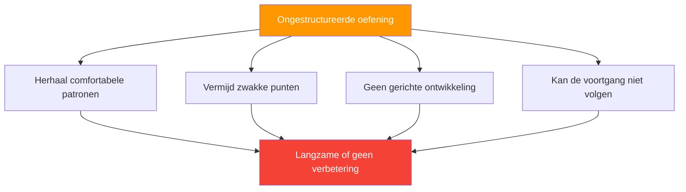

# Het structureren van uw praktijk

> &quot;Twee spelers kunnen evenveel uren op het terrein doorbrengen en toch een totaal verschillende vooruitgang boeken.&quot;

Het verschil zit hem vaak in de manier waarop de praktijk is gestructureerd.

::: tip De mythe van 10.000 uur
**Het gaat niet om het aantal uren, maar om hoe je ze gebruikt.** Doelgerichte oefening is altijd beter dan gedachteloos herhalen.
:::

---

## Het probleem met ongestructureerde praktijk

De meeste recreatieve oefeningen zien er als volgt uit:
- Kom langs en gooi een paar ballen.
- Speel een paar ontspannende spelletjes.
- Chat met vrienden
- Ga naar huis

Dit is leuk, maar niet efficiënt voor verbetering.

---

## Principes van effectieve praktijk

| Beginsel | Vraag om te stellen |
|-----------|----------------|
| **Doelgericht** | Waar werk ik vandaag aan? |
| **Opzettelijk** | Is dit een uitdaging voor me? |
| **Veel feedback** | Hoe weet ik of ik vooruitgang boek? |
| **Gericht** | Ben ik volledig aanwezig? |

### 1. Doelgerichte oefening

Elke sessie moet een duidelijk doel hebben:
- Waar werk ik vandaag aan?
- Hoe ziet succes eruit?
- Hoe weet ik of ik vooruitgang heb geboekt?

### 2. Opzettelijke moeilijkheid

::: info De grens van bekwaamheid
**Oefening moet je uitdagen.** Als het comfortabel aanvoelt, groei je niet.
:::

- Werk op de grens van je kunnen.
- Neem elementen op die moeilijk zijn.
- Vermijd herhalingen die volledig binnen je comfortzone vallen.

### 3. Onmiddellijke feedback

Je moet weten hoe je ervoor staat:
- Resultaten van oefeningen bijhouden
- Gebruik waar mogelijk video.
- Vraag input van trainingspartners

### 4. Gerichte aandacht

Kwaliteit boven kwantiteit:
- Volledige concentratie tijdens de training
- Kortere, gerichte sessies zijn beter dan lange, afgeleide sessies.
- Mentale betrokkenheid is essentieel.

## Sessiestructuur

### Opwarming (10-15 minuten)

**Fysiek:**
- Lichte beweging
- Voorbereiding van armen en schouders
- Geleidelijke toename van de intensiteit

**Mentaal:**
- Overgang van het dagelijks leven
- Stel een intentie vast voor de sessie.
- Begin je aandacht te richten

### Technische werkzaamheden (20-30 minuten)

Focus op specifieke vaardigheden:
- Oefening van de geïsoleerde techniek
- Oefeningen gericht op zwakke punten
- Herhaling met aandacht

**Voorbeelden van aandachtsgebieden:**
- Richtnauwkeurigheid op specifieke afstanden
- Fotograferen vanuit verschillende hoeken
- Specifieke worptypes (plombée, portée, etc.)

### Toegepaste oefening (20-30 minuten)

Pas vaardigheden toe in realistische contexten:
- Gesimuleerde spelsituaties
- Drukoefeningen
- Besluitvormingspraktijk

### Afkoelen (10 minuten)

**Fysiek:**
- Lichtstralend
- Rekken

**Mentaal:**
- Neem nog eens door wat je hebt geleerd.
- Noteer de gebieden voor toekomstig werk.
- Overgang vanuit de oefenmodus

## Soorten oefensessies

### Vaardigheidsontwikkelingssessie

Focus: Het ontwikkelen of verfijnen van specifieke technieken

- 70% technische oefeningen
- 20% toegepaste praktijk
- 10% warming-up/cooling-down

### Competitiesimulatie

Focus: Voorbereiding op de wedstrijdomstandigheden

- 20% warming-up met een doel
- 60% wedstrijdachtig spel met druk
- 20% nabespreking en aanpassing

### Onderhoudssessie

Focus: Vaardigheden scherp houden

- Evenwichtige werkzaamheden op alle gebieden
- Geen intense focus op één specifiek ding.
- Aangenaam maar doelgericht.

### Herstelsessie

Focus: Lichte training na de wedstrijd

- Lage intensiteit
- Plezierig gooien
- Mentale reset

## Het ontwerpen van boormachines

Effectieve oefeningen hebben:

### Duidelijke doelstellingen
Wat oefen je precies?

### Meetbare resultaten
Hoe meet je succes?

### Een passende uitdaging
Uitdagend genoeg om je grenzen te verleggen, maar niet zo uitdagend dat je het niet kunt halen.

### Relevantie
Gekoppeld aan daadwerkelijke spelsituaties

### Progressie
Manieren om de moeilijkheidsgraad te verhogen naarmate je beter wordt.

## Voorbeelden van oefeningen

### Richtnauwkeurigheid

**Instelling:** Doelwit op 8 meter afstand
**Doel:** Binnen 30 cm van het doelwit landen.
**Track:** Succespercentage over 20 worpen
**Voortgang:** Doelgrootte verkleinen, afstand vergroten

### Schietconsistentie

**Opstelling:** Stationaire doelbol
**Doel:** Het doelwit raken
**Track:** Hits per 10 pogingen
**Voortgang:** Varieer de hoeken, voeg beweging toe

### Druksimulatie

**Opzet:** Je moet 3 op een rij maken om te &quot;winnen&quot;.
**Doel:** Voltooi de reeks
**Track:** Aantal pogingen nodig
**Voortgang:** Vereiste volgorde verhogen

## Wekelijkse planning

### Voorbeeld van een evenwichtige week

**Maandag:** Vaardigheidsontwikkeling (focus op aanwijzen)
**Woensdag:** Wedstrijdsimulatie
**Vrijdag:** Vaardigheidsontwikkeling (focus op schieten)
**Weekend:** Wedstrijden

### Periodisering

Varieer de intensiteit gedurende het seizoen:

**Buiten het seizoen:** Intensieve vaardigheidsontwikkeling
**Voorseizoen:** Integratie en simulatie
**Wedstrijdseizoen:** Onderhoud en slijpen
**Na het seizoen:** Herstel en reflectie

## Veelgemaakte fouten

### Te veel gamen

Spelletjes spelen is leuk, maar het pakt zwakke punten niet efficiënt aan.

### Geen tracking

Zonder meting kun je niet weten of je vooruitgang boekt.

### Zwakke punten vermijden

We oefenen van nature datgene waar we goed in zijn. Dwing jezelf om aan je zwakke punten te werken.

### Inconsistent schema

Sporadische oefening leidt tot sporadische resultaten.

### Geen mentale oefening

Fysieke herhaling zonder mentale betrokkenheid beperkt de vooruitgang.

## Het is belangrijk om de oefening vol te houden.

### Voor de training
- Stel duidelijke doelen vast.
- Bereid je mentaal voor
- Bekijk de aantekeningen van de vorige sessie.

### Tijdens de training
- Blijf geconcentreerd
- Volg de resultaten
- Pas naar behoefte aan.

### Na de training
- Noteer wat je hebt geleerd.
- Bepaal de volgende stappen
- Vier de vooruitgang

## De mythe van 10.000 uur

Het gaat niet alleen om het aantal uren, maar ook om de kwaliteit. 1000 uur doelgericht oefenen is beter dan 10.000 uur gedachteloos herhalen.

Structureer je oefeningen doelgericht, en elk uur telt meer.

---

| *Gerelateerd: [Trainingsmethoden](/en/education/technique/training/) | [Trainingsoefeningen](/en/education/technique/training/drills) | [Doelstellingen formuleren](/en/education/motivation/)* |

