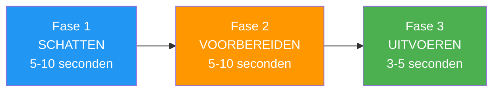

# Het opbouwen van routines vóór de opname

> &quot;Het verschil tussen een goede en een geweldige worp zit hem vaak al in het moment dat de boule je hand verlaat.&quot;

Een goed doordachte warming-up is je anker in de storm van de competitie – een betrouwbare reeks oefeningen die je lichaam en geest voorbereidt op optimale prestaties.

::: tip Uw concurrentievoordeel
**Een consistente routine leidt tot consistente resultaten.** Het is het enige dat je volledig in de hand hebt, ongeacht de druk of omstandigheden.
:::

---

## Waarom routines vóór de opname belangrijk zijn

Topsporters in alle sporten gebruiken routines voorafgaand aan een worp. Bij pétanque, waar elke worp op zichzelf staat en de spanning tussen de worpen kan oplopen, dienen deze routines meerdere doelen:

| Doel | Hoe het helpt |
|---------|--------------|
| **Samenhang** | Dezelfde voorbereiding → consistentere uitvoering |
| **Focus** | Een constructieve taak in plaats van piekeren. |
| **Overgang** | Schakel over van denken naar doen. |
| **Drukbeheersing** | Bekende handelingen kalmeren het zenuwstelsel. |
| **Reset** | Wis de vorige foto uit mijn geheugen. |

---

## Anatomie van een effectieve routine

### Fase 1: Beoordeling (5-10 seconden)
- Lees het terrein
- Visualiseer het beoogde resultaat.
- Kies je werptype
- Houd vast aan de beslissing.

### Fase 2: Voorbereiding (5-10 seconden)
- Neem je positie in.
- Vind je grip
- Kom tot rust tijdens het ademhalen.
- Voel het gewicht van de boule.

### Fase 3: Uitvoering (3-5 seconden)
- Laatste focus op het doel
- Vertrouw op je lichaam.
- Loslaten zonder na te denken
- Ga er natuurlijk mee door

## Het opbouwen van je persoonlijke routine

### Stap 1: Observeer je huidige patronen

Voordat je een nieuwe routine creëert, kijk eerst eens naar wat je al doet:
- Wat doe je voordat je een succesvolle worp maakt?
- Wat verandert er als je onder druk staat?
- Wat voelt voor jou natuurlijk aan?

### Stap 2: Ontwerp je volgorde

Stel een routine samen die het volgende omvat:

**Fysieke elementen:**
- Hoe je de cirkel benadert
- Hoe je de boule oppakt en vasthoudt.
- Uw houding en positionering
- Een specifiek ademhalingspatroon

**Mentale elementen:**
- Een visualisatie van het resultaat
- Een kernwoord of -zin
- Een beslissend moment (het moment waarop je besluit: &quot;dit is de worp&quot;).

### Stap 3: Houd het simpel

Je routine zou er als volgt uit moeten zien:
- **Kort genoeg** om onder druk vol te houden (15-25 seconden in totaal)
- **Simpel genoeg** om te onthouden als je gestrest bent.
- **Flexibel genoeg** om zich aan verschillende situaties aan te passen.

## Voorbeelden van routines

### De routine van de aanwijzer
1. Ga achter de cirkel staan en beoordeel het terrein.
2. Stel je het traject en de landingsplek van de boule voor.
3. Stap in de cirkel, vind je houding.
4. Drie langzame ademhalingen terwijl je de boule voelt.
5. Ogen op het doel, loslaten

### De routine van de schutter
1. Bepaal de doelboule en kies de hoek.
2. Visualiseer de impact en het resultaat.
3. Betreed de kring met een doel.
4. Haal diep adem en voel het gewicht.
5. Richt je blik op het doel en voer de actie uit.

## Veelgemaakte fouten die je moet vermijden

### Te lang
Als je routine langer dan 30 seconden duurt, denk je te veel na. Lange routines geven angst meer tijd om zich op te bouwen.

### Te stijf
Als elke onderbreking je routine verstoort, is die te kwetsbaar. Zorg voor flexibiliteit: als iets je concentratie verstoort, zorg dan voor een manier om de draad weer op te pakken.

### Touwtjespringen onder druk
De routine is het belangrijkst wanneer de druk het hoogst is. Als je die routine loslaat wanneer je gestrest bent, verlies je de beschermende werking ervan.

### Focus op mechanica
Je routine moet eindigen met de focus op het resultaat, niet op de techniek. &quot;Raak het doel&quot; in plaats van &quot;houd je elleboog recht&quot;.

## Je routine oefenen

### In opleiding
- Gebruik je volledige routine bij elke worp, zelfs bij de meest informele.
- Neem de tijd om consistentie te garanderen.
- Oefen met afleidingen om veerkracht op te bouwen.

### Automatisering bouwen
Het doel is dat je routine automatisch wordt – iets wat je doet zonder erbij na te denken. Dit vereist herhaling:
- Meer dan 100 worpen met dezelfde routine.
- Consistent gebruik in verschillende situaties.
- Geleidelijke blootstelling aan druk met behoud van de routine.

## Aanpassen aan de concurrentie

Tijdens wedstrijden kan het nodig zijn je routine enigszins aan te passen:

- **Tijdsdruk**: Zorg dat je een verkorte versie klaar hebt.
- **Weersomstandigheden**: Pas de fysieke elementen indien nodig aan.
- **Momenten met hoge druk**: Vertraag iets, maar versnel niet.

## De resetprocedure

Net zo belangrijk is wat je doet na een worp:

1. **Accepteer het resultaat** — goed of slecht, het is gebeurd.
2. **Fysieke reset** — neem afstand en schud de spanning van je af.
3. **Mentale reset** — maak de worp uit je gedachten.
4. **Bereid je voor op de toekomst** — richt je aandacht op wat komen gaat.

---

| *Gerelateerd: [Handleiding voor de voorbereiding op een schot](/en/education/mental-game/mental-strength/pre-shot-routine) | [Omgaan met druk](/en/education/mental-game/mental-strength/handling-pressure) | [Mindfulnesstechnieken](/en/education/mental-game/mindfulness/techniques)* |

