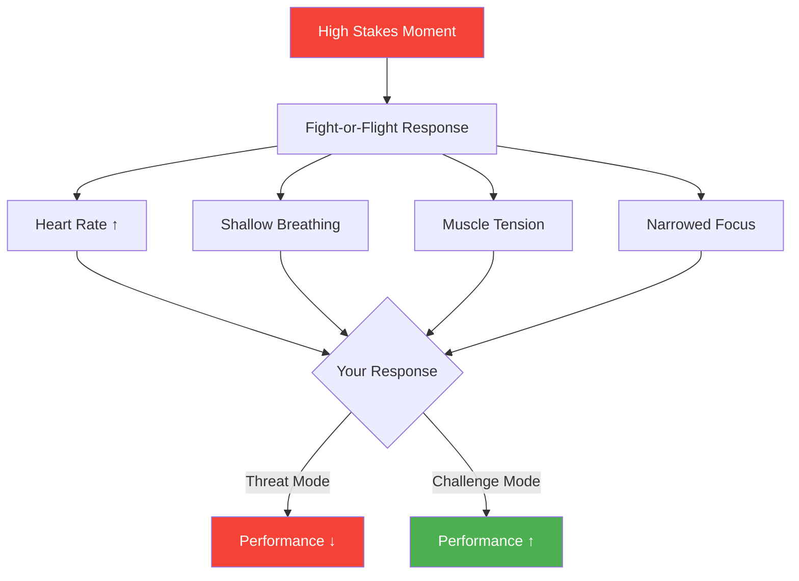

# Pressure Management in Pétanque

> "Elite players don't eliminate pressure; they learn to perform with it, sometimes even because of it."

Pressure is inevitable in competitive pétanque. The question isn't whether you'll feel it — you will. The question is how you'll respond.

::: tip The Pressure Truth
**Pressure isn't the problem — your response to it is.** Learn to use pressure as fuel, not as a brake.
:::

---

## Understanding Pressure

Pressure is your body's response to perceived high stakes. When you face a crucial shot, your nervous system activates:

This is the fight-or-flight response — useful for escaping predators, less useful for throwing a boule with precision.

---

## The Pressure Paradox

::: warning The Trap
The harder you try to eliminate pressure, the stronger it becomes. Telling yourself "don't be nervous" only amplifies the nervousness.
:::

The solution isn't to fight pressure but to change your relationship with it.

## Reframing Pressure

### From Threat to Challenge

Your brain interprets pressure situations in one of two ways:
- **Threat**: "This could go wrong, I might fail"
- **Challenge**: "This is an opportunity to show what I can do"

Both interpretations produce arousal, but challenge states lead to better performance. The physical sensations are similar — it's the meaning you assign that differs.

### Practical Reframes

| Pressure Thought | Reframe |
|-----------------|---------|
| "I can't miss this" | "I get to take this shot" |
| "Everyone is watching" | "I'm ready for this moment" |
| "This is too important" | "This is what I train for" |
| "I'm so nervous" | "I'm excited and ready" |

## Physical Techniques

### Breathing Control

The fastest way to calm your nervous system:

**Box Breathing:**
1. Inhale for 4 counts
2. Hold for 4 counts
3. Exhale for 4 counts
4. Hold for 4 counts
5. Repeat 2-3 times

**Extended Exhale:**
- Inhale for 4 counts
- Exhale for 8 counts
- The longer exhale activates the parasympathetic nervous system

### Progressive Relaxation

Between throws:
1. Clench your fists tight for 3 seconds
2. Release and feel the relaxation
3. Roll your shoulders up, hold, release
4. Shake out your hands

### Grounding

When pressure feels overwhelming:
- Feel your feet on the ground
- Notice the weight of the boule in your hand
- Look at specific details in your environment
- Name 5 things you can see

## Mental Techniques

### Narrow Your Focus

Pressure often comes from thinking too far ahead. Bring your attention to:
- This throw only
- This moment only
- The process, not the outcome

### Use Cue Words

Single words that anchor your focus:
- "Smooth"
- "Trust"
- "Now"
- "Breathe"

### Visualization

Before high-pressure shots:
1. Close your eyes briefly
2. See the boule traveling to its target
3. Feel the successful throw in your body
4. Open your eyes and execute

## Building Pressure Tolerance

### Pressure Training

You can't learn to handle pressure without experiencing it. Create pressure in practice:

- **Consequence drills**: Miss and you do push-ups
- **Competition simulation**: Practice with something at stake
- **Audience practice**: Invite people to watch your training
- **Fatigue training**: Practice when tired

### Exposure Ladder

Gradually increase pressure exposure:
1. Practice alone with no stakes
2. Practice with a training partner watching
3. Practice with small consequences
4. Friendly matches
5. Club competitions
6. Regional tournaments
7. National events

## In-Match Strategies

### Before the Match
- Arrive early, familiarize yourself with the terrain
- Complete your warm-up routine
- Use positive self-talk
- Visualize successful performance

### During Pressure Moments
1. Recognize the pressure ("I'm feeling the pressure")
2. Accept it ("This is normal, it means I care")
3. Breathe (2-3 controlled breaths)
4. Refocus (return to your pre-shot routine)
5. Execute (trust your training)

### After Mistakes
- Take a physical step back
- One deep breath
- Let go of the result
- Focus on the next opportunity

## The Pressure Advantage

With practice, pressure becomes fuel rather than friction. Elite performers often describe their best performances as happening under the highest pressure — not despite it, but because of it.

The arousal that pressure creates can enhance:
- Focus and concentration
- Physical readiness
- Memory and recall
- Reaction time

The key is channeling this energy productively rather than letting it overwhelm you.

---

*Related: [Handling Pressure](/nl/education/mental-game/mental-strength/handling-pressure) | [Pre-Shot Routine](/nl/education/mental-game/mental-strength/pre-shot-routine) | [The Zone](/nl/education/mental-game/the-zone/)*

