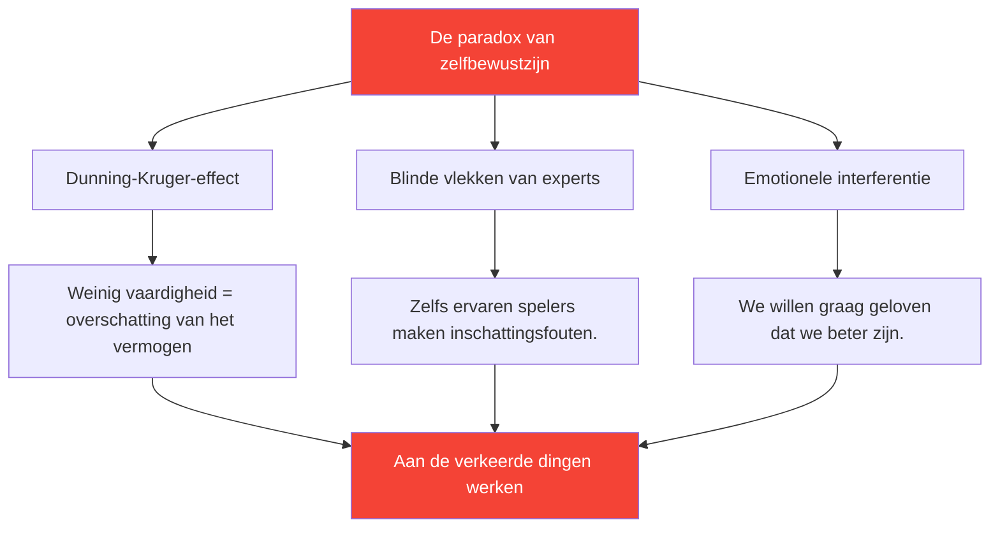

# Zelfbewustzijn ontwikkelen: de basis voor verbetering

> &quot;Je kunt iets niet verbeteren als je het niet nauwkeurig waarneemt.&quot;

Zelfbewustzijn – het kennen van je werkelijke sterke en zwakke punten – is de basis van effectieve ontwikkeling.

::: danger De ongemakkelijke waarheid
**De meeste spelers werken aan de verkeerde dingen** omdat ze zichzelf niet helder zien.
:::

---

## De paradox van zelfbewustzijn

---

## Waarom pétanque-spelers het moeilijk hebben

Bij pétanque is zelfevaluatie bijzonder lastig:

| Uitdaging | Waarom het moeilijk is |
|-----------|--------------|
| **Resultaatvariantie** | Goede beslissingen kunnen tot slechte gevolgen leiden (en omgekeerd). |
| **Vergelijkingsbias** | We herinneren ons de beste prestaties, maar praten de slechtste weg. |
| **Bescherming van de identiteit** | Het toegeven van zwakte voelt bedreigend. |

::: warning Geheugen is geen data.
**We construeren verhalen die ons zelfbeeld beschermen.** Objectieve monitoring is essentieel.
:::

---

## De componenten van zelfbewustzijn

Echt zelfbewustzijn vereist inzicht in meerdere domeinen:

| Domein | Kernvragen |
|--------|---------------|
| **Technische gegevens** | Welke worpen zijn daadwerkelijk betrouwbaar? Welke zijn inconsistent? |
| **Mentaal** | Hoe ga ik om met druk? Wat triggert mijn innerlijke criticus? |
| **Fysiek** | Wanneer heb ik de meeste energie? Welke invloed heeft vermoeidheid op mij? |
| **Tactisch** | Val ik te veel aan? Of juist te weinig? Hoe interpreteer ik situaties? |
| **Emotioneel** | Wat frustreert me? Wanneer speel ik gespannen? |
| **Interpersoonlijke** | Hoe ervaren mijn teamgenoten mijn communicatie? |

## Externe feedback: de spiegel die je nodig hebt

Je kunt je eigen blinde vlekken niet zien. Je hebt externe perspectieven nodig.

### Gestructureerde feedbackmethoden

**Videoanalyse**
- Neem wedstrijden op en train mee
- Kijk met aandacht voor specifieke aandachtspunten.
- Merk patronen op die je op dat moment over het hoofd ziet.

**Peerbeoordeling**
- Vraag betrouwbare teamgenoten om eerlijke feedback.
- Gebruik de [Beoordelingstool](/nl/assessment/) voor collegiale validatie.
- Vergelijk je eigen beoordeling met hun beoordeling.

**Observatie door de coach**
- Een frisse blik ziet wat een vertrouwde blik over het hoofd ziet.
- Vraag om specifieke feedback, niet om algemene indrukken.
- Volg de feedbackthema&#39;s in de loop van de tijd.

### De feedbackkloof

Als uw zelfbeoordeling aanzienlijk afwijkt van de feedback van buitenaf, let dan goed op:

| Spleettype | Betekenis | Actie |
|----------|---------|--------|
| Je scoort hoger. | Mogelijke blinde vlek | Onderzoek uitvoeren met video/data |
| Je scoort lager. | Mogelijk vertrouwensprobleem | Focus op bewijs van competentie |
| Aanhoudende kloof | Systematische waarnemingsfout | Herijk je mentale model. |

## Gewoonten ontwikkelen die zelfbewustzijn bevorderen

### Dagelijkse reflectie (5 minuten)

Stel jezelf na elke sessie de volgende vraag:

1. **Wat ging er goed?** (Wees specifiek)
2. **Wat ging er mis?** (Wees eerlijk)
3. **Wat zou ik anders doen?** (Wees constructief)
4. **Wat verraste me?** (Wees nieuwsgierig!)

### Wekelijkse evaluatie (15 minuten)

Zoek naar patronen:

- Welke situaties vormen voor mij steeds weer een uitdaging?
- Op welke gebieden ben ik aan het verbeteren?
- Welke feedback heb ik ontvangen?
- Wat probeer ik te vermijden om te bekijken?

### Maandelijkse beoordeling

Gebruik de [Spelersbeoordeling](/nl/assessment/) tool:

- Beoordeel jezelf op alle 8 factoren.
- Verzoek om peervalidatie
- Vergelijk met de vorige maand
- Identificeer de grootste hiaten

## Het data-voordeel

Subjectieve waarneming is onbetrouwbaar. Data bieden objectiviteit:

### Wat te volgen

**Prestatiegegevens**
- Succespercentages per worptype
- Prestaties onder druk versus prestaties zonder druk
- Eerste set versus latere sets
- Met verschillende partners

**Gegevens verwerken**
- Slaapkwaliteit vóór wedstrijden
- Naleving van de routine voorafgaand aan de wedstrijd
- Mentale toestand tijdens cruciale momenten
- Hersteltijd na fouten

### Hoe gebruik je data?

1. **Patronen herkennen** — Wat hangt samen met goede/slechte prestaties?
2. **Daag je aannames uit** — Komen de gegevens overeen met je overtuigingen?
3. **Training voor begeleiders** — Focus op daadwerkelijke zwakheden, niet op vermeende zwakheden.
4. **Volg de voortgang** — Verbeteringen zijn vaak onzichtbaar zonder meting.

## Veelvoorkomende belemmeringen voor zelfbewustzijn

::: warning Let op deze dingen.
- **Defensieve houding** bij het ontvangen van feedback
- **Slechte prestaties goedpraten**
- **Op zoek naar bevestiging** in plaats van de waarheid
- **Het meten van zwakke plekken vermijden**
- **Externe factoren consequent de schuld geven**
:::

## De connectie met de groeimindset

Zelfbewustzijn vereist acceptatie van het volgende:

- De huidige vaardigheid is niet vaststaand.
- Zwakte is informatie, niet identiteit.
- Feedback is een geschenk, geen aanval.
- Verbetering vereist een eerlijke beoordeling.

## Actiestappen

1. **Vandaag:** Vul de [zelfevaluatie](/nl/assessment/) in.
2. **Deze week:** Vraag feedback aan 2 vertrouwde teamgenoten.
3. **Doorlopend:** Ontwikkel een dagelijkse reflectiegewoonte
4. **Maandelijks:** Volg de voortgang met herhaalde evaluaties.

---

## Gerelateerde inhoud

- [Zelfbewustzijnsmodule](/nl/education/self-awareness/) — Volledige educatie
- [Spelersbeoordeling](/nl/assessment/) — Evalueer je 8 factoren
- [De innerlijke criticus](/nl/articles/inner-critic) — Zelfoordeel beheersen

