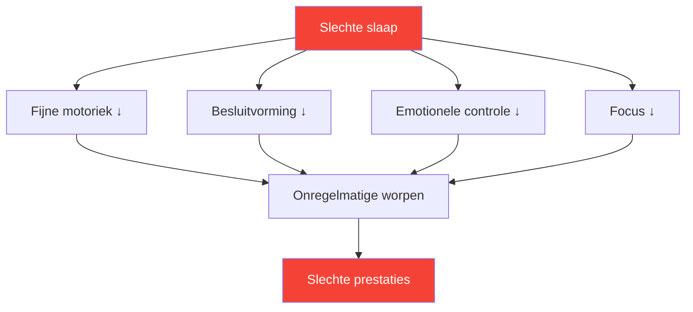

# Slaap: de meest onderschatte prestatiefactor

> &quot;De speler die het beste geslapen heeft, wint vaak.&quot;

De meeste spelers concentreren zich op techniek en mentale training. Weinigen optimaliseren hun slaap. Dit is een vergissing – slaap is wellicht de meest rendabele verbetering die de meeste topsporters kunnen realiseren.

::: tip Verbetering met hoog rendement
**Slaapoptimalisatie vereist geen talent en levert enorme resultaten op.** Het is het dichtstbijzijnde legale middel om je prestaties te verbeteren.
:::

---

## Het onderzoek

Slaaponderzoek onthult opvallende effecten op prestaties in precisiesporten:

### reactietijd
- **24 uur zonder slaap** = reactietijd equivalent aan 0,1% bloedalcoholgehalte
- **6 uur per nacht gedurende 2 weken** = gelijk aan 48 uur wakker blijven
- Topatleten trainen gemiddeld **8,5+ uur**, vergeleken met 7 uur voor de gemiddelde bevolking.

### Besluitvorming
- Slaapgebrek tast eerst de prefrontale cortex aan.
- Tactische beslissingen verslechteren nog voordat er duidelijke tekenen van vermoeidheid optreden.
- Je merkt je beperking niet op (ook metacognitie laat je in de steek).

### Motorbesturing
- Fijne motorische vaardigheden (grijpen, loslaten) vereisen geconsolideerd geheugen.
- Geheugenconsolidatie vindt plaats tijdens diepe slaap.
- Vaardigheden leren zonder voldoende slaap = verspilde oefening

## De precieze verbinding

Pétanque vereist precies datgene wat slaapgebrek tenietdoet:

| Vereiste vaardigheid | Effect van slaapgebrek |
|----------------|--------------------------|
| Fijne motoriek | De gripdruk wordt inconsistent. |
| Visuele verwerking | Afstandsinschatting verstoord |
| Besluitvorming | Tactische fouten nemen toe |
| Emotionele regulatie | Frustratie na fouten neemt toe |
| Aanhoudende aandacht | De concentratie verslapt tijdens langere wedstrijden. |

## Tekenen dat je te weinig slaapt

Je hebt je aangepast aan chronisch slaapgebrek als:

- Je hebt een wekker nodig om wakker te worden.
- Je bent slaperig in de vroege middag.
- Je valt binnen 5 minuten in slaap zodra je gaat liggen.
- Je haalt de achterstand in in het weekend.
- Koffie is essentieel, geen optie.

**Realiteitscheck:** Als je cafeïne nodig hebt om normaal te functioneren, heb je een slaaptekort.

## Het wedstrijdweekprotocol

### 7 dagen van tevoren
- Begin met 30 minuten langer per nacht te slapen.
- Stel een vast wektijdstip in (elke dag op hetzelfde tijdstip).

### 3 dagen van tevoren
- Geen alcohol (verstoort de slaapstructuur).
- Geen zware maaltijden meer na 19.00 uur.
- Beperk de schermtijd na zonsondergang.

### De avond ervoor
- Ga op een normaal tijdstip naar bed (ga niet vroeg naar bed, anders lig je alleen maar wakker).
- Een vertrouwde omgeving, indien mogelijk.
- Ontspanningsroutine

### Wedstrijdochtend
- Sta op de normale tijd op.
- Directe blootstelling aan licht
- Normale ontbijtroutine

## Het optimaliseren van de slaapkwaliteit

Het gaat niet alleen om de duur, maar vooral om de kwaliteit.

### Slaapomgeving
- **Temperatuur:** 18-20°C (65-68°F) is optimaal.
- **Duisternis:** Volledige duisternis of een slaapmasker
- **Geluid:** Constant (witte ruis) of stil
- **Beddengoed:** Comfortabel, niet te warm

### Routine vóór het slapengaan
- Minimaal 60 minuten voor het slapengaan geen schermgebruik.
- Gedempte verlichting &#39;s avonds
- Regelmatige ontspanningsactiviteiten
- Een koele douche kan het inslapen bevorderen.

### Timing
- Een consistent wektijdstip (belangrijker dan een vast bedtijdstip)
- Vermijd uitslapen langer dan 30 minuten in het weekend.
- Dutjes: vóór 15.00 uur, korter dan 20 minuten

## De dutjesstrategie

Strategisch dutten op wedstrijddagen:

### Het powernapje (10-20 min)
- Vermindert vermoeidheid zonder sufheid te veroorzaken.
- Het meest geschikt voor de periode tussen de ochtend- en middagsessies.
- Zet een wekker – verslaap je niet

### De volledige cyclus (90 min)
- Volledige slaapcyclus
- Alleen als je nog 2 uur of langer hebt voor de wedstrijd.
- Risico op sufheid bij onderbreking.

### Doe nooit een dutje als:
- Je hebt inslaapstoornissen.
- De wedstrijd vindt binnen 90 minuten plaats.
- Het is na 3 uur &#39;s middags en je moet die nacht slapen.

## Reisoverwegingen

Voor uitwedstrijden:

### Voor de reis
- Neem je vertrouwde slaapspullen mee (kussen, slaapmasker).
- Zoek een hotelkamer (vraag om een rustige kamer)
- Pas je schema aan als je tijdzones overschrijdt.

### Op de bestemming
- Houd indien mogelijk vast aan het slaapritme van thuis.
- Blootstelling aan licht beïnvloedt het circadiane ritme.
- Vermijd zware maaltijden vlak voor het slapengaan.

### Tijdzoneovergang
- 1 dag per uur om volledig te acclimatiseren
- Ochtendlichtblootstelling versnelt oostwaartse aanpassing
- Aanpassing van de belichtingstijd bij avondlicht aan de westwaartse richting

## Je slaap bijhouden

Wat gemeten wordt, kan beheerd worden:

### Eenvoudige tracking
- Opstaan en naar bed gaan
- Subjectieve kwaliteit (1-10)
- Prestatiecorrelatie-aantekeningen

### Geavanceerde tracking
- Slaaptracker of wearable
- HRV (hartslagvariabiliteit) trends
- Slaapfasegegevens

### Waarop moet je letten?
- Correlatie tussen slaap en prestaties
- Patronen (weekend inhalen, slapeloosheid in de aanloop naar de wedstrijd)
- Trends door de tijd heen

## Veelgemaakte fouten

::: warning Vermijd deze
- **Alcohol als slaapmiddel** — Bevordert het inslapen, maar tast de slaapkwaliteit aan.
- **Inhalen in het weekend** — Slaaptekort kan niet worden ingehaald.
- **Schermen in bed** — Traint de hersenen dat bed ≠ slapen
- **Inconsistent schema** — Het circadiane ritme heeft consistentie nodig.
- **Slaap negeren voor training** — Kwaliteit opofferen voor kwantiteit.
:::

## Actiestappen

1. **Deze week:** Houd bij hoeveel je daadwerkelijk slaapt (duur + kwaliteit)
2. **Volgende week:** Stel een consistent wektijdstip in.
3. **Komende weken:** Optimaliseer omgeving en routine
4. **Voor de wedstrijd:** Voer het wedstrijdweekprotocol uit.

---

## Gerelateerde inhoud

- [Slaap- en herstelmodule](/en/education/sleep/) — Complete slaapeducatie
- [Slaapgewoonten](/en/education/sleep/habits) — Duurzame routines opbouwen
- [Wedstrijdslaap](/en/education/sleep/competition) — Evenementspecifieke protocollen

