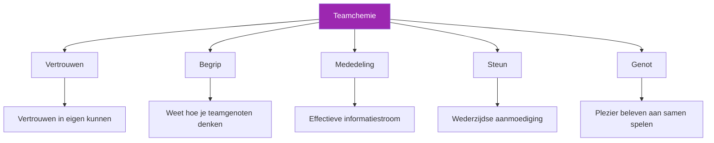

# Het opbouwen van teamgeest

> &quot;Je hebt het vast wel eens gezien: teams waar het geheel meer is dan de som der delen.&quot;

Spelers die op elkaar inspelen, elkaar steunen en samen beter presteren dan alleen. Dat is teamgeest – en dat is geen toeval.

::: tip Chemie wordt opgebouwd, niet gevonden.
**Geweldige teams worden niet samengesteld, ze worden ontwikkeld.** Een goede samenwerking vereist doelbewuste inspanning over een langere periode.
:::

---

## Wat is teamchemie?

---

## Waarom scheikunde belangrijk is

| Met scheikunde ✅ | Zonder scheikunde ❌ |
|-------------------|----------------------|
| Neem betere collectieve beslissingen. | Geef elkaar de schuld van mislukkingen. |
| Sneller herstellen van tegenslagen | Slecht communiceren onder stress |
| Presteer consistent onder druk. | Onderpresteren in verhouding tot hun talent |
| Geniet meer van de competitie. | Ervaar conflicten en frustraties. |
| Blijf langer samen | Team valt uiteen |

## De bouwstenen

### 1. Gemeenschappelijke doelen

Chemie begint met afstemming:
- Wat proberen we te bereiken?
- Hoe ziet succes eruit?
- Wat zijn we bereid op te offeren?

Teams met tegenstrijdige doelen (de een wil plezier, de ander wil koste wat kost winnen) hebben moeite om een goede teamgeest op te bouwen.

### 2. Rolduidelijkheid

Elke speler moet het volgende weten:
- Wat wordt er van hen verwacht?
- Hoe zij bijdragen aan het succes van het team
- Wanneer moet je de leiding nemen en wanneer moet je volgen?

Onduidelijke rollen leiden tot wrijving en wrok.

### 3. Wederzijds respect

Respect betekent:
- De bijdrage van elke teamgenoot waarderen.
- Het accepteren van verschillende stijlen en benaderingen.
- Elkaar met respect behandelen, vooral onder druk.

### 4. Psychologische veiligheid

Spelers moeten zich veilig voelen om:
- Maak fouten zonder al te streng te oordelen.
- Geef uw mening en uit uw zorgen.
- Wees jezelf, zonder pretenties.

## Bouwchemie: praktische stappen

### Tijd samen doorbrengen

Chemie vereist investeringen:
- Regelmatig samen oefenen
- Breng samen tijd door buiten het terrein.
- Deel ervaringen die verder gaan dan petanque

### Gestructureerde teambuilding

Doelgerichte activiteiten helpen:
- sessies voor het vaststellen van teamdoelen
- Nabesprekingen na de wedstrijd (constructief)
- Discussies over speelstijlen en voorkeuren

### Conflictresolutie

Pak problemen aan voordat ze escaleren:
- Creëer ruimte voor eerlijke gesprekken.
- Focus op gedrag, niet op persoonlijkheden.
- Zoek naar oplossingen, niet naar beschuldigingen.

### Vier het samen

Gedeelde vreugde schept banden:
- Erken goede prestaties
- Vier de successen van het team.
- Vier samen belangrijke mijlpalen.

## Chemiemoordenaars

### Schuldcultuur

Als fouten leiden tot kritiek in plaats van steun, brokkelt het vertrouwen snel af.

### Ongelijke inzet

Als sommige spelers meer investeren dan anderen, ontstaat er wrok.

### Slechte communicatie

Misverstanden en aannames creëren afstand.

### Ego-conflicten

Wanneer individuele erkenning belangrijker is dan teamsucces, lijdt de teamgeest daaronder.

### Onopgelost conflict

Problemen die niet worden aangepakt, verdwijnen niet vanzelf, ze worden alleen maar groter.

## Chemie in competitieverband

### Voor de wedstrijden

- Kom samen aan, warm samen op.
- Korte teambespreking over de aanpak
- Positieve energie en wederzijdse aanmoediging

### Tijdens wedstrijden

- Zichtbare steun voor elkaar
- Uitsluitend constructieve communicatie.
- Gezamenlijke viering van goede toneelstukken
- Collectieve reactie op tegenslagen

### Na de wedstrijden

- Winnen of verliezen, blijf samen.
- Korte nabespreking (wat werkte goed, wat kan er verbeterd worden)
- Onderhoud positieve relaties, ongeacht het resultaat.

## Verschillende persoonlijkheden

Sterke teams bestaan vaak uit mensen met verschillende persoonlijkheidstypen:

- **De standvastige**: Kalm onder druk, consistent
- **De Energizer**: Brengt enthousiasme en motivatie
- **De Strateeg**: Denkt vooruit, ziet patronen
- **De Competitor**: Werft de winnaarsmentaliteit aan.

In de chemie gaat het er niet om dat iedereen hetzelfde is, maar juist om hoe verschillen samenwerken.

## Wanneer de chemie ontbreekt

### Tekenen van slechte chemie

- Zichtbare frustratie jegens teamgenoten
- De schuld geven na fouten
- Gebrek aan communicatie
- Spelen als individuen, niet als een team.
- Wedstrijden eerder vrezen dan ervan genieten.

### Chemie heropbouwen

1. **Erken het probleem**: Benoem het openlijk.
2. **Oorzaken vaststellen**: Waardoor ontstaat de wrijving?
3. **Zet je in voor verandering**: Alle partijen moeten investeren
4. **Neem actie**: Specifieke stappen om te verbeteren
5. **Heb geduld**: Het duurt even voordat de chemische samenstelling van je lichaam weer hersteld is.

### Wanneer moet je verder?

Soms is een chemische kwestie niet te verhelpen:
- Fundamentele waardeverschillen
- Herhaaldelijk verbroken vertrouwen
- Onwil om te veranderen

Het is prima om te erkennen wanneer een team niet goed functioneert.

## De rol van de kapitein

Als u de teamleider bent:
- Geef zelf het goede voorbeeld door het gewenste gedrag te vertonen.
- Pak problemen vroegtijdig en direct aan.
- Creëer mogelijkheden voor verbinding.
- Bescherm de teamcultuur
- Breng individuele behoeften in evenwicht met de behoeften van het team.

## Langetermijnchemie

Chemie is niet statisch — het vereist onderhoud:

### Regelmatige controles

- Hoe functioneren we als team?
- Wat werkt wel? Wat werkt niet?
- Zijn er nog zaken die we moeten aanpakken?

### Continue investering

- Blijf tijd samen doorbrengen.
- Blijf open communiceren.
- Blijf elkaar steunen.

### Aanpassing

- Naarmate spelers groeien en veranderen, moet het team dat ook doen.
- Wees bereid om rollen en dynamieken te laten evolueren.
- Blijf nieuwsgierig naar elkaar.

---

| *Gerelateerd: [Teamdynamiek](/nl/education/team-dynamics/) | [Communicatie](/nl/education/team-dynamics/communication) | [Leiderschap in pétanque](/nl/articles/team-leadership)* |

