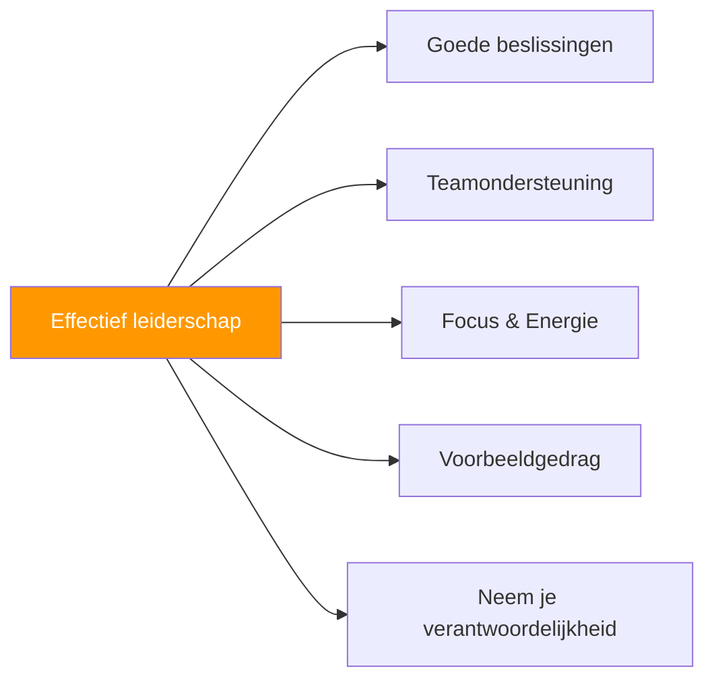

# Leiderschap in pétanque

> &quot;Leiderschap gaat niet alleen over aanvoerder zijn, maar ook over het beste in je team naar boven halen.&quot;

Iedere speler kan op een andere manier leidinggeven. Het gaat om invloed, steun en het tonen van uitmuntendheid.

::: tip Iedereen kan leidinggeven
**Je hebt geen titel nodig om een leider te zijn.** Leiderschap is gedrag, geen positie.
:::

---

## Wat houdt pétanque-leiderschap in?

---

## Soorten leiderschap

| Type | Focus | Hoe het eruitziet |
|------|-------|--------------|
| **Functie** | Autoriteit | De kapitein neemt de uiteindelijke beslissingen en bepaalt de cultuur. |
| **Prestatie** | Uitmuntendheid | Constante vaardigheid, goed bestand tegen druk. |
| **Emotioneel** | Energie | Positief blijven en anderen steunen. |
| **Tactisch** | Strategie | Het spel analyseren en inzichten delen |

### Positioneel leiderschap

De aangewezen aanvoerder of teamleider:
- Neemt de uiteindelijke strategische beslissingen.
- Vertegenwoordigt het team officieel
- Beheert de teamdynamiek.
- Bepaalt de toon en de cultuur.

### Prestatieleiderschap

Leiderschap door uitmuntendheid:
- Blik op vaardigheid en consistentie
- Laten zien hoe je met druk omgaat
- Het stellen van normen door middel van daden
- Inspireren door middel van optredens

### Emotioneel leiderschap

::: info Vaak ondergewaardeerd
**Emotioneel leiderschap is cruciaal** — de speler die positief blijft bij een achterstand van 2-10 kan de hele wedstrijd omdraaien.
:::

Het managen van teamenergie en -moraal:
- Positief blijven onder druk
- Het ondersteunen van teamgenoten die het moeilijk hebben.
- Het vieren van successen
- Het behouden van perspectief

### Tactisch leiderschap

Bijdragen aan strategisch denken:
- Het spel goed lezen
- Het bieden van waardevolle inzichten
- Patronen zien die anderen over het hoofd zien.
- Vooruitdenken

## De effectieve leider

### In de praktijk

- Komt voorbereid en geconcentreerd aan.
- Werkt hard en moedigt anderen aan.
- Geeft constructieve feedback
- Creëert een positieve trainingsomgeving.

### Voor de wedstrijd

- Zorgt ervoor dat het team voorbereid is.
- Stelt duidelijke verwachtingen vast
- Beheerst de zenuwen voor de wedstrijd.
- Zorgt voor focus en zelfvertrouwen.

### Tijdens de wedstrijd

- Neemt duidelijke en tijdige beslissingen.
- Biedt zichtbare steun aan teamgenoten.
- Blijft kalm onder druk
- Past de strategie aan waar nodig.

### Na de wedstrijd

- Handles wint met elegantie.
- Gaat op een evenwichtige manier om met verliezen.
- Leidt constructieve nabesprekingen.
- Onderhoudt teamrelaties

## Leiderschapsuitdagingen

### Moeilijke beslissingen nemen

Soms moet je:
- Kies tussen opties zonder duidelijk antwoord.
- Het oneens zijn met teamgenoten
- Neem de verantwoordelijkheid voor de resultaten.
- Handel daadkrachtig, ondanks de onzekerheid.

**Benadering:**
- Verzamel snel input.
- Neem de beslissing
- Ga er volledig voor.
- Leer van de resultaten

### Conflicthantering

Teamwrijving is onvermijdelijk:
- Verschillende meningen over de strategie.
- Frustratie na fouten
- Persoonlijkheidsconflicten
- Ongelijke inzet

**Benadering:**
- Pak problemen vroegtijdig aan.
- Luister naar alle perspectieven.
- Focus op oplossingen
- Behoud respect.

### Het ondersteunen van spelers die het moeilijk hebben

Wanneer een teamgenoot ondermaats presteert:
- Oefen geen extra druk uit.
- Bied concrete, positieve ondersteuning.
- Pas de strategie indien nodig aan.
- Blijf vertrouwen in hen houden.

### Je eigen problemen aanpakken

Ook leiders hebben het moeilijk:
- Erken het (tegenover jezelf)
- Laat het uw leiderschap niet beïnvloeden.
- Vertrouw op je teamgenoten
- Model veerkracht

## Leiderschapsstijlen

### De Commandant

- Direct en beslissend
- Duidelijke verwachtingen
- Neemt het voortouw in crisissituaties
- Risico: Kan overweldigend zijn.

### De coach

- Ontwikkelt anderen
- Stelt vragen
- Bouwt capaciteit op
- Risico: Kan traag reageren in crisissituaties

### De medewerker

- Vraagt om invoer
- Bouwt consensus op
- Waardeert alle stemmen
- Risico: Kan besluiteloos zijn.

### De supporter

- Richt zich op relaties
- Zorgt voor veiligheid
- Stimuleert en bevestigt
- Risico: Kan harde waarheden vermijden

**De beste leiders passen hun stijl aan de situatie aan.**

## Het ontwikkelen van leiderschapsvaardigheden

### Zelfbewustzijn

Ken je:
- Natuurlijke leiderschapsstijl
- Sterke en zwakke punten
- Invloed op anderen
- Aanleidingen en reacties

### Emotionele intelligentie

Ontwikkel de volgende vaardigheden:
- Herken emoties (die van jezelf en die van anderen).
- Beheer uw reacties
- Leef je in in je teamgenoten.
- Navigeer door sociale dynamieken

### Communicatievaardigheden

Oefening:
- Duidelijke en bondige berichten
- Actief luisteren
- Het geven van constructieve feedback
- Moeilijke gesprekken

### Besluitvorming

Verbeteren door:
- Analyse van beslissingen uit het verleden
- Feedback vragen
- Leren van fouten
- Oefenen onder druk

## Leiderschap zonder titel

Je hoeft geen aanvoerder te zijn om leiding te geven:

### Geef het goede voorbeeld.
- Kom voorbereid opdagen.
- Doe je uiterste best
- Ga goed om met tegenslagen.
- Ondersteun je teamgenoten

### Leiderschap door ondersteuning
- Moedig anderen aan
- Bied hulp aan
- Vier de successen van je teamgenoten
- Wees betrouwbaar

### Leiderschap tonen door middel van bijdrage
- Deel je observaties
- Breng ideeën op een respectvolle manier naar voren.
- Neem het initiatief
- Vul de gaten op

## De leiderschapsmentaliteit

### Verantwoordelijkheid boven schuld

Leiders nemen hun verantwoordelijkheid:
- &quot;We hebben het niet goed uitgevoerd&quot;, niet &quot;Ze hebben gemist&quot;.
- &quot;Ik had beter moeten communiceren&quot;, niet &quot;Ze hebben niet geluisterd&quot;.

### Het team boven jezelf

Leiders stellen teamsucces voorop:
- Vier de successen van het team.
- Deel het krediet royaal uit.
- Neem de schuld persoonlijk op.
- Stel de behoeften van het team voorop.

### Groei boven comfort

Leiders omarmen uitdagingen:
- Zoek moeilijke situaties op.
- Leer van je fouten.
- Streven naar verbetering
- Model voor continue groei

## Wanneer leiderschap faalt

Zelfs goede leiders maken soms fouten:
- Verkeerde beslissingen komen voor.
- Teams verliezen ondanks goed leiderschap.
- Relaties staan onder druk.

**Herstel:**
1. Erken wat er is gebeurd
2. Neem de gepaste verantwoordelijkheid.
3. Leer de lessen
4. Ga vooruit met nederigheid.

---

| *Gerelateerd: [Teamdynamiek](/nl/education/team-dynamics/) | [Communicatie](/nl/education/team-dynamics/communication) | [Teamchemie opbouwen](/nl/articles/team-chemistry)* |

